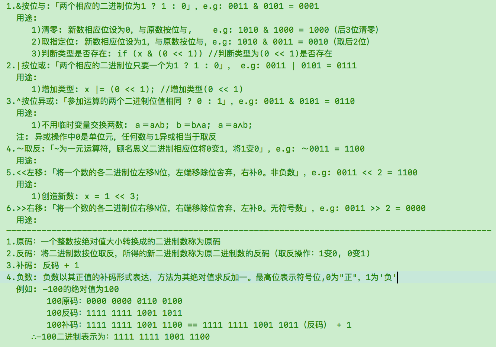

<!-- vscode-markdown-toc -->
* 1. [基本类型在不同机器上的占位大小](#)
* 2. [大端小端](#-1)
	* 2.1. [定义](#-1)
	* 2.2. [判断](#-1)
	* 2.3. [优劣](#-1)
* 3. [位运算](#-1)
	* 3.1. [位运算](#-1)
	* 3.2. [位域结构](#-1)

<!-- vscode-markdown-toc-config
	numbering=true
	autoSave=true
	/vscode-markdown-toc-config -->
<!-- /vscode-markdown-toc -->

# C语言知识散记
##  1. <a name=''></a>基本类型在不同机器上的占位大小
<table>
  <tr>
    <th width=20%, bgcolor=black>机器</th>
    <th width=10%, bgcolor=black>char</th>
    <th width=10%, bgcolor=black>char*</th>
    <th width=10%, bgcolor=black>short</th>
    <th width=10%, bgcolor=black>int</th>
    <th width=10%, bgcolor=black>long</th>
    <th width=10%, bgcolor=black>long long</th>
    <th width=10%, bgcolor=black>float</th>
    <th width=10%, bgcolor=black>double</th>
  </tr>
  <tr>
    <td bgcolor=black> 16bit/B </td>
    <td bgcolor=gray align='center'> 1 </td>
    <td bgcolor=gray align='center'> 2 </td>
    <td bgcolor=gray align='center'> 2 </td>
    <td bgcolor=gray align='center'> 2 </td>
    <td bgcolor=gray align='center'> 4 </td>
    <td bgcolor=gray align='center'> 8 </td>
    <td bgcolor=gray align='center'>  </td>
    <td bgcolor=gray align='center'>  </td>
  </tr>
  <tr>
    <td bgcolor=black> 32bit/B </td>
    <td bgcolor=gray align='center'> 1 </td>
    <td bgcolor=gray align='center'> 4 </td>
    <td bgcolor=gray align='center'> 2 </td>
    <td bgcolor=gray align='center'> 4 </td>
    <td bgcolor=gray align='center'> 4 </td>
    <td bgcolor=gray align='center'> 8 </td>
    <td bgcolor=gray align='center'> 4 </td>
    <td bgcolor=gray align='center'> 8 </td>
  </tr>
<tr>
    <td bgcolor=black> 64bit/B </td>
    <td bgcolor=gray align='center'> 1 </td>
    <td bgcolor=gray align='center'> 8 </td>
    <td bgcolor=gray align='center'> 2 </td>
    <td bgcolor=gray align='center'> 4 </td>
    <td bgcolor=gray align='center'> 8 </td>
    <td bgcolor=gray align='center'> 8 </td>
    <td bgcolor=gray align='center'> 4 </td>
    <td bgcolor=gray align='center'> 8 </td>
  </tr>
</table>

##  2. <a name='-1'></a>大端小端 
###  2.1. <a name='-1'></a>定义   
字节序不是由操作系统决定的，而是由<font color=red>CPU</font>架构决定的，比如x86的是little endian，而PPC (PowerPC) 是big endian.
* 大端(Big-endian): 高尾端  
    高位存于低地址。如: PPC(PowerPC)、IBM、Sun, 网络字节序；
* 小端(Little-endian)：低尾端    
    低位存于低地址。如: x86、DEC
    
    举例: 有一int数0x12345678，则MSB=0x12，LSB=0x78. 如下图:

    CPU存储地址 | 0x4000 | 0x4001 | 0x40020 | x4003
    :-: | :-: | :-: | :-: | :-:
    大端存储内容 | 0x12 | 0x34 | 0x56 | 0x78 |
    小端存储内容 | 0x78 | 0x56 | 0x34 | 0x12 |
    
    [注]:char s[]=“1234”，1为低位

###  2.2. <a name='-1'></a>判断
* 方法1
    ```
    bool check_big()
    {//返回:1=大端，0=小端
        int i=0x12345678;
        char *c=(char *)&i; 
        return (*c==0x12);
    }
    ```
* 方法2
    ```
    bool check_big()
    {//返回:1=大端，0=小端
        union  { long a; char b; }u;
        u.a = 1;
        return (u.b == 1) ? 0 : 1;
    }
    ``` 
* 方法3
    ```
    bool check_big()
    {//返回:1=大端，0=小端
        int i = 48;
        int* p = &i;
        char c = 0;
        c = *((char*)p);

        return (c == '0') ? 0 : 1;
    }
    ```


###  2.3. <a name='-1'></a>优劣
* 大端  
    符号位的判定固定为第一个字节，容易判断正负
* 小端  
    长度为1，2，4字节的数，排列方式都是一样的，数据类型转换非常方便

##  3. <a name='-1'></a>位运算
###  3.1. <a name='-1'></a>位运算   


###  3.2. <a name='-1'></a>位域结构 
* 格式  
    `struct 位域结构名 { 类型说明符 位域名：位域长度; };`
* 示例  
    例1:  
    ```
    struct bs
    {
        int a:8;
        int b:2;
        int c:6;
    }data;
    ```
    例2: 一个位域必须存储在同一个字节中，不能跨两个字节   
    ```
    struct bs
    {
        unsigned a:4；
        unsigned :0；
        unsigned b:4；
        unsigned c:4；
    }；
    在这个位域定义中，a占第一字节的4位，后4位填0表示不使用，b从第二字节开始，占用4位，c占用4位。
    ```
    例3: 位域可以无位域名，它只用来作填充或调整位置。无名的位域是不能使用的   
    ```
    struct k
    {
        int a:1；
        int :2；
        int b:3；
        int c:2；
    };
    ``` 
