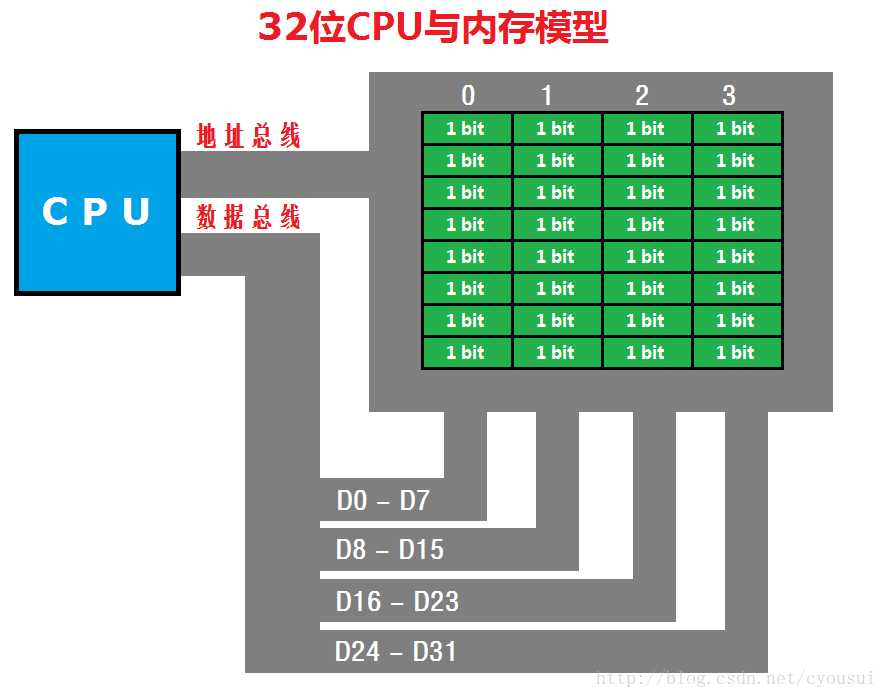

<!-- vscode-markdown-toc -->
* 1. [为何要内存对齐](#)
	* 1.1. [内存对齐原则](#-1)
	* 1.2. [内存对齐演示](#-1)
	* 1.3. [内存补齐原因](#-1)
* 2. [内存对齐方式](#-1)
	* 2.1. [默认结构体对齐](#-1)
	* 2.2. [自定义结构体对齐](#-1)
		* 2.2.1. [pragma pack](#pragmapack)
		* 2.2.2. [__attribute__((packed))](#attribute__packed)
	* 2.3. [自定义对齐与填充](#-1)

<!-- vscode-markdown-toc-config
	numbering=true
	autoSave=true
	/vscode-markdown-toc-config -->
<!-- /vscode-markdown-toc -->
#  1. <a name=''></a> 内存对齐
##  1. <a name=''></a>为何要内存对齐 
  
此图是以32位CPU作为代表，32位CPU是以双字（DWORD）为单位进行数据传输的，也因此会造成什么问题呢？     
如果我们的数据只有8位或16位数据的时候，如果CPU就按照我们数据的位数来进行数据传输，这样会使得CPU硬件变的更复杂，所以32位CPU传输数据无论是8位或16位都是以双字进行数据传输。而8位或16位一样可以传输，但是，事情并非像我们想象的那么简单，比如，一个int类型4字节的数据如果放在上图内存地址1开始的位置，那么这个数据占用的内存地址为1～4，那么这个数据就被分为了2个部分，一个部分在地址0～3中，另外一部分在地址4～7中，又由于32位CPU以双字进行传输，所以，CPU会分2次进行读取，一次先读取地址0～3中内容，再一次读取地址4～7中数据，最后CPU提取并组合出正确的int类型数据，舍弃掉无关数据。那么反过来，如果我们把这个int类型4字节的数据放在上图从地址0开始的位置会怎样呢？读到这里，也许你明白了，CPU只要进行一次读取就可以得到这个int类型数据了。没错，就是这样，这次CPU只用了一个周期就得到了数据，由此可见，对内存数据的摆放是多么重要啊，摆放正确位置可以减少CPU的使用资源。
###  1.1. <a name='-1'></a>内存对齐原则
* 1.第一个成员的首地址为0
* 2.每个成员的首地址是自身大小的整数倍    
    * 补充：以4字节对齐为例，如果自身大小大于4字节，都以4字节整数倍为基准对齐。
* 3.最后以结构总体对齐
    * 补充：以4字节对齐为例，取结构体中最大成员类型倍数，如果超过4字节，都以4字节整数倍为基准对齐。（其中这一条还有个名字叫：“补齐”，补齐的目的就是多个结构变量挨着摆放的时候也满足对齐的要求。）
###  1.2. <a name='-1'></a>内存对齐演示
* 内存对齐效果 
```
#pragma pack(4)
typedef struct MemAlign
{
	char a[18];	// 18 bytes
	double b;	// 08 bytes	
	char c;		// 01 bytes
	int d;		// 04 bytes
	short e;	// 02 bytes	
}MemAlign;
#pragma pack(pop)
```
如图: <font color=green>绿色</font>为填充块，<font color=red>红色</font>为补齐块。  

* 内存对齐测试
```
#include <stdio.h>
#include <memory.h>
 
// 由于windows默认是8字节对齐，我们
// 通过预编译来通知编译器我们以4字节对齐
#pragma pack(4)
 
// 用于测试的结构体
typedef struct MemAlign
{
	char a[18];	// 18 bytes
	double b;	// 08 bytes	
	char c;		// 01 bytes
	int d;		// 04 bytes
	short e;	// 02 bytes
}MemAlign;

#pragma pack(pop)
 
int main()
{
	// 定义一个结构体变量
	MemAlign m;
	// 定义个以指向结构体指针
	MemAlign *p = &m;
	// 依次对各个成员进行填充，这样我们可以
	// 动态观察内存变化情况
	memset(&m.a, 0x11, sizeof(m.a));//char	[18] + 2
	memset(&m.b, 0x22, sizeof(m.b));//double[08]
	memset(&m.c, 0x33, sizeof(m.c));//char	[01] + 3
	memset(&m.d, 0x44, sizeof(m.d));//int	[04]
	memset(&m.e, 0x55, sizeof(m.e));//short	[02] + 2
    // 断点1,如图: 内存对齐调试图1

	// 由于有补齐原因，所以我们需要对整个
	// 结构体进行填充，补齐对齐剩下的字节
	// 以便我们可以观察到变化
	memset( &m, 0x66, sizeof(m) );
    // 断点2,如图: 内存对齐调试图2

	// 输出结构体大小
	printf( "sizeof(MemAlign) = %d", sizeof(m) );
}
```   
内存对齐调试图1: 各种颜色带下划线的代表各个成员变量，蓝色方框的代表为内存对齐时候填补的多余字节    
    
内存对齐调试图2: 由于上图看不到补齐效果，接下来看下图，篮框包围的字节就是与上图的交集以外的部分就是补齐所填充的字节。   


###  1.3. <a name='-1'></a>内存补齐原因
补齐其实就是为了让这个结构体定义的数组变量时候，数组内部，也同样满足内存对齐的要求  

##  2. <a name='-1'></a>内存对齐方式
###  2.1. <a name='-1'></a>默认结构体对齐
*[注]: <font color=red>windows默认8字节对齐*</font> 

例1:
```
    #include <stdio.h>
    union { char x[5]; int i; } a;
    int main()
    {
        a.x[0] = 10;
        a.x[1] = 1;
        printf("%d, %d\n", a.i, sizeof(a));
        return 0;
    }
    //答案：266,8
    //1). 1*256 + 10 = 266
    //2). 基本类型int=4对齐 => 8
```
例2:
```
    #include <iostream>
    using namespace std;
    struct TypeA { char c; int i; short i2; };
    struct TypeB { char c[3]; TypeA a; double d; };
    int main()
    {
        TypeA a;
        TypeB b;
        cout << sizeof(a) << ", "<< sizeof(b) << endl;
        return 0;
    }
    //答案：12, 24
    //1). 最大基本类型int=4对齐 => 12
    //2). 最大基本类型double=8对齐 => 24
```
###  2.2. <a name='-1'></a>自定义结构体对齐
####  2.2.1. <a name='pragmapack'></a>pragma pack
```
// 2字节对齐, 以下sizeof(student)=6
#pragma pack(2) //(或 pragma(push,4))
struct student {
     int age,
     char c;
};
#pragma pack(pop) //注意这个和push是成对用的
```
####  2.2.2. <a name='attribute__packed'></a>__attribute__((packed))
* 不希望编译器对结构体做对齐处理，而希望按照它原有的大小分配空间，则用到__attribute__((packed))
```
    typedef struct Student_t
    {
        int age;
        char c;
    }__attribute__((packed)) Student; 

    typedef struct Node_t
    {
        int a;
        char c;
    }__attribute__((aligned(4))) Node;
```
```
    #define PACK  __attribute__  ((packed))
    typedef int cache_line_int __attribute__((aligned(LEVEL1_DCACHE_LINESIZE)));
    struct data
    {
        cache_line_int a;
        cache_line_int b;
    };
```
###  2.3. <a name='-1'></a>自定义对齐与填充
如: andriod binder parcel的设计
```
// 以4字节对齐
#define PAD_SIZE(s) (((s) + 3) & ~3) 

// 分配空间
void* Parcel::writeInplace(size_t len)
{
    // "当以4字节大小对齐时，容纳len大小的数据需要多少空间？"
    // 注意: len *= sizeof(char16_t);
    // 所以:
    // len = 3; padded = 4
    // len = 4; padded = 4
    // len = 5; padded = 8
    const size_t padded = PAD_SIZE(len);

    if (mDataPos + padded < mDataPos) {
        return NULL;//空间溢出
    }

    if (mDataPos + padded < mDataCapicity) {//未超出容量
        uint8_t * const data = mData + mDataPos;
        if (padded != len){
#if BYTE_ORDER == BIT_ENDIAN //大端
            static const uint32_t mask[4] = {
                0x00000000,0xffffff00,0xffff0000,0xff000000
            };    
#elif BYTE_ORDER == LITTER_ENDIAN //小端
            static const uint32_t mask[4] = {
                0x00000000,0x00ffffff,0x0000ffff,0x000000ff
            };
#end
            // 填充尾部
            *reinterpret_cast<uint32_t*>(data + padded - 4) &= mask[padded - len];
        }
        finishWrite(padded);//更新mDataPos
        retrun data;
    }

    // 超出parcel的存储能力，需要扩大容量
    //todo: ***
}

// 写入数据
status_t Parcel::writeString16(const char16_t *str, size_t len)
{
    if (str == NULL) return writeInt32(-1);

    // 先写入数据长度
    status_t err = writeInt32(len);
    if (err == NO_ERROR) {
        len *= sizeof(char16_t);//占用空间=长度*单位大小
        uint8_t *data = (uint8_t *)writeInplace(len + sizeof(char16_t)); 
        if (data) {
            memcpy(data, str, len);
            *reinterpret_cast<char16_t *>(data + len) = 0;
            return NO_ERROR;
        }

        err = mError;
    }

    return err;
}
```

> 参考:     
> [谈谈关于内存对齐与补齐](https://blog.csdn.net/cyousui/article/details/17655051)   
> 《深入理解Android系统》 张云亮著