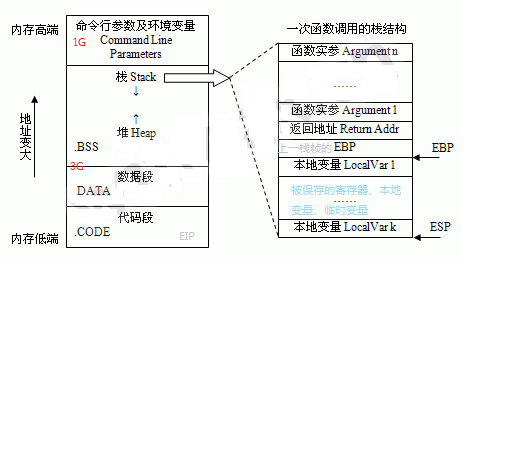
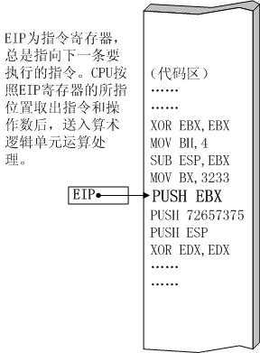
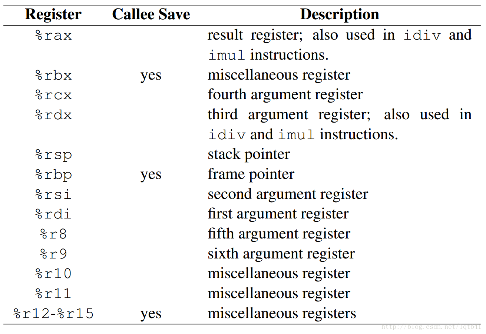
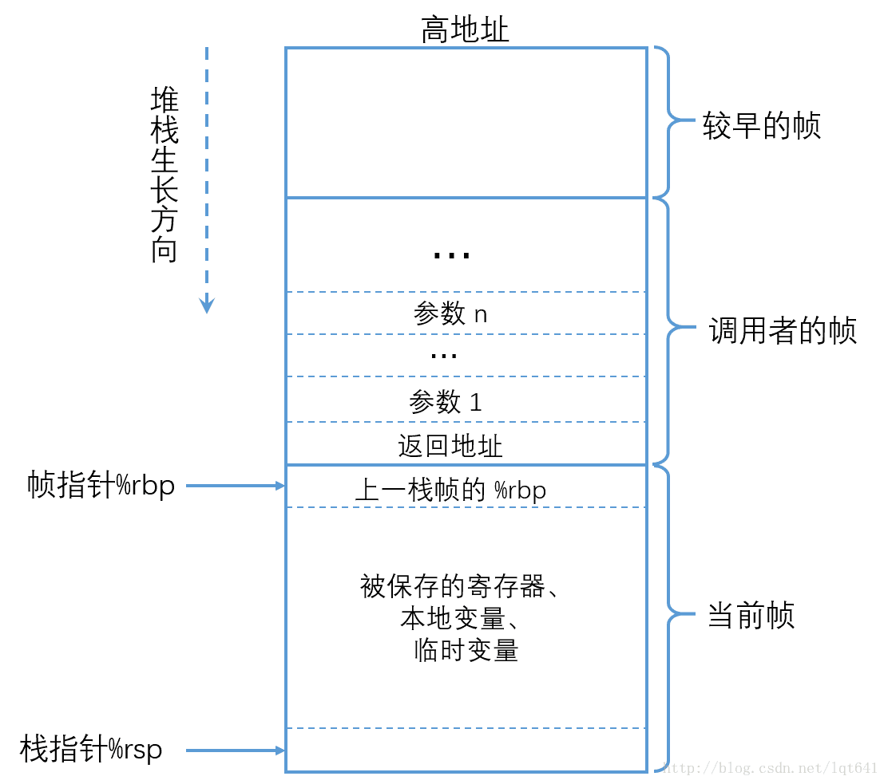
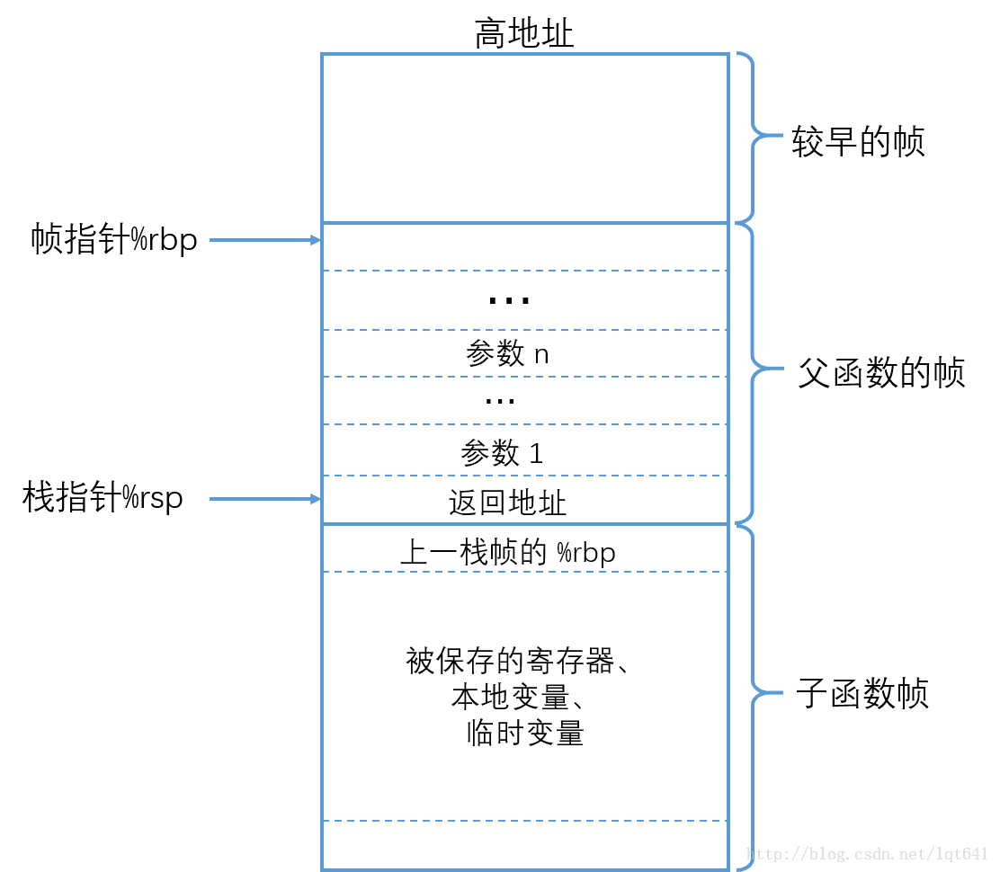
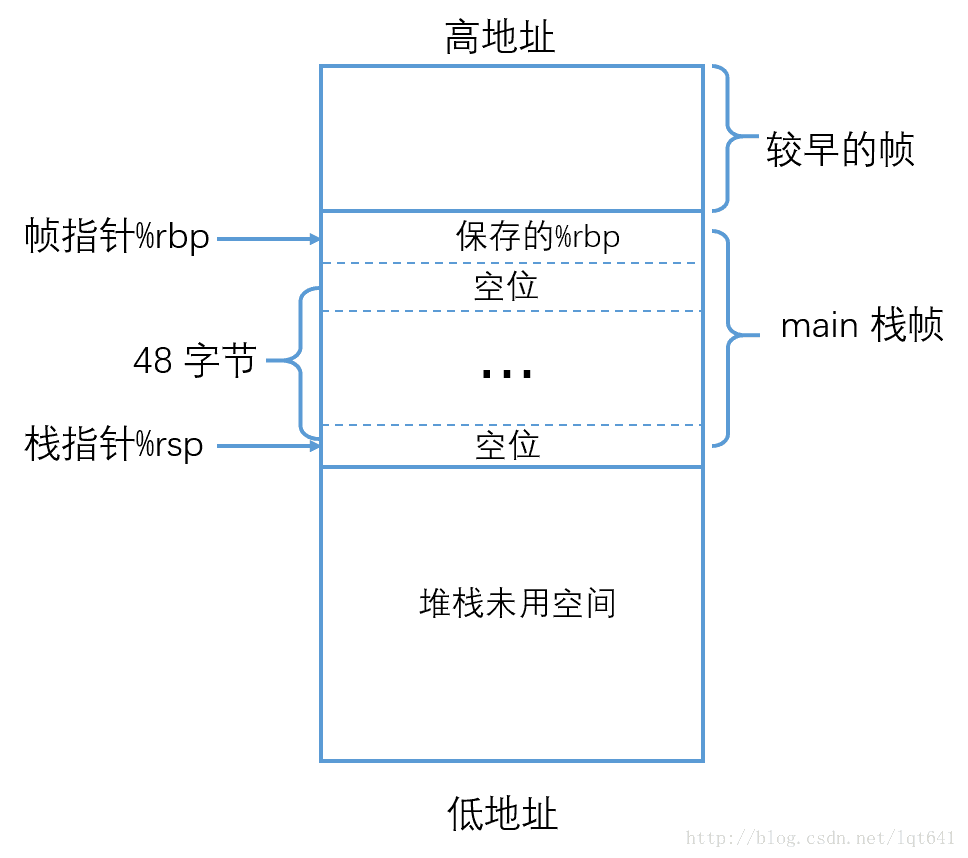
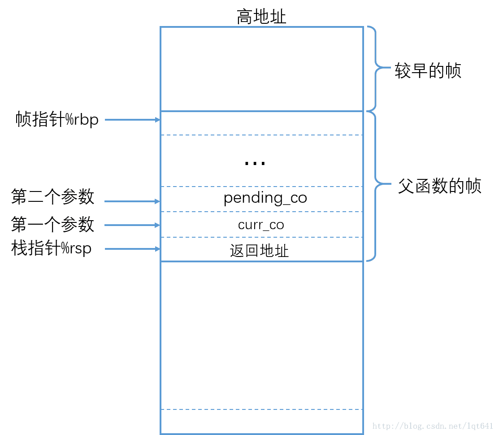
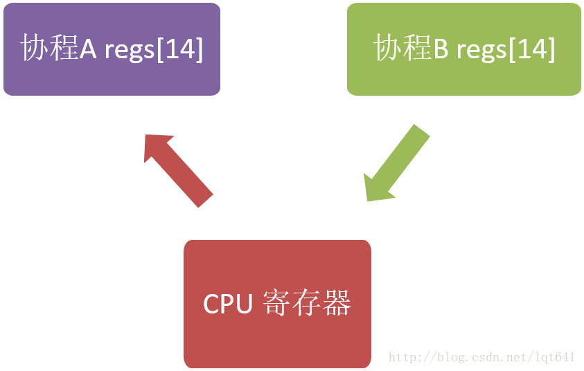

<!-- vscode-markdown-toc -->
* 1. [内存与寄存器](#)
	* 1.1. [ 内存](#-1)
	* 1.2. [寄存器](#-1)
* 2. [函数调用](#-1)
	* 2.1. [几个问题](#-1)
	* 2.2. [通用寄存器使用惯例](#-1)
	* 2.3. [函数的调用](#-1)
	* 2.4. [函数的返回](#-1)
	* 2.5. [函数调用示例(c与汇编)](#c)
* 3. [libco协程库上下文切换原理详解](#libco)
	* 3.1. [函数调用与协程切换的区别](#-1)
	* 3.2. [源码剖析](#-1)
	* 3.3. [结语](#-1)

<!-- vscode-markdown-toc-config
	numbering=true
	autoSave=true
	/vscode-markdown-toc-config -->
<!-- /vscode-markdown-toc -->

# 函数调用及帧栈原理
##  1. <a name=''></a>内存与寄存器  
    
###  1.1. <a name='-1'></a> 内存
* 代码段    
    保存程序文本，指令指针EIP就是指向代码段`[可读可执行不可写]`
* 数据段    
    保存初始化的全局变量和静态变量`[可读可写不可执行]`
* BSS段（bss segment）  
    通常是指用来存放程序中未初始化的全局变量的一块内存区域。
* 堆(Heap)  
    动态分配内存，向地址增大的方向增长`[可读可写可执行]`
* 栈(Stack)
    存放局部变量，函数参数，当前状态，函数调用信息等，向地址减小的方向增长`[可读可写可执行]`
###  1.2. <a name='-1'></a>寄存器
* ESP：栈指针寄存器(extended stack pointer)     
    其内存放着一个指针，该指针永远指向系统栈最上面一个栈帧的栈顶。
* EBP：基址指针寄存器(extended base pointer)    
    其内存放着一个指针，该指针永远指向系统栈最上面一个栈帧的底部
* 函数栈帧  
    ESP和EBP之间的内存空间为当前栈帧，EBP标识了当前栈帧的底部，ESP标识了当前栈帧的顶部。
* EIP：指令寄存器(extended instruction pointer)
    其内存放着一个指针，该指针永远指向下一条待执行的指令地址    
    

##  2. <a name='-1'></a>函数调用

>参考:
>
> [x86-64 下函数调用及栈帧原理](https://blog.csdn.net/lqt641/article/details/73002566)

###  2.1. <a name='-1'></a>几个问题
函数调用十分常见，那么：
* 函数调用这一操作的底层原理是怎样的？
* 编译器帮我们做了哪些操作？
* CPU中各寄存器及内存堆栈在函数调用时是如何被使用的？
* 栈帧的创建和恢复是如何完成的？

###  2.2. <a name='-1'></a>通用寄存器使用惯例
函数调用时，在硬件层面我们需要关注的通常是cpu的通用寄存器。在所有cpu体系架构中，每个寄存器通常都是有建议的使用方法的，而编译器也通常依照CPU架构的建议来使用这些寄存器，因而我们可以认为这些建议是强制性的。     
对于 x86-64 架构，共有16个64位通用寄存器，各寄存器及用途如下图所示：

从上图中得出结论：
* 每个寄存器的用途并不是单一的。
* %rax 通常用于存储函数调用的返回结果，同时也用于乘法和除法指令中。在imul 指令中，两个64位的乘法最多会产生128位的结果，需要 %rax 与 %rdx 共同存储乘法结果，在div 指令中被除数是128 位的，同样需要%rax 与 %rdx 共同存储被除数。
* %rsp 是堆栈指针寄存器，通常会指向`栈顶位置`，堆栈的 pop 和push 操作就是通过改变 %rsp 的值即移动堆栈指针的位置来实现的。
* %rbp 是栈帧指针，用于标识`当前栈帧的起始位置`
* %rdi, %rsi, %rdx, %rcx,%r8, %r9 六个寄存器用于存储函数调用时的6个参数（如果有6个或6个以上参数的话）。
* 被标识为 “miscellaneous registers” 的寄存器，属于通用性更为广泛的寄存器，编译器或汇编程序可以根据需要存储任何数据。

这里还要区分一下 “Caller Save” 和 ”Callee Save” 寄存器，即寄存器的值是由”调用者保存“ 还是由 ”被调用者保存“。当产生函数调用时，子函数内通常也会使用到通用寄存器，那么这些寄存器中之前保存的调用者(父函数）的值就会被覆盖。为了避免数据覆盖而导致从子函数返回时寄存器中的数据不可恢复，CPU 体系结构中就规定了通用寄存器的保存方式。

如果一个寄存器被标识为”Caller Save”， 那么在进行子函数调用前，就需要由调用者提前保存好这些寄存器的值，保存方法通常是把寄存器的值压入堆栈中，调用者保存完成后，在被调用者（子函数）中就可以随意覆盖这些寄存器的值了。如果一个寄存被标识为“Callee Save”，那么在函数调用时，调用者就不必保存这些寄存器的值而直接进行子函数调用，进入子函数后，子函数在覆盖这些寄存器之前，需要先保存这些寄存器的值，即这些寄存器的值是由被调用者来保存和恢复的。
###  2.3. <a name='-1'></a>函数的调用
子函数调用时，调用者与被调用者的栈帧结构如下图所示：


在子函数调用时，执行的操作有：
* 父函数将调用参数从后向前压栈 -> 
* 将返回地址压栈保存 -> 
* 跳转到子函数起始地址执行 ->  
* 子函数将父函数栈帧起始地址（%rbp）压栈 -> 
* 将%rbp的值设置为当前%rsp的值，即将%rbp指向子函数栈帧的起始地址。

上述过程中，保存返回地址和跳转到子函数处执行由call一条指令完成，在call 指令执行完成时，已经进入了子程序中，因而将上一栈帧%rbp 压栈的操作，需要由子程序来完成。函数调用时在汇编层面的指令序列如下：
```
...        # 参数压栈
call FUNC  # 将返回地址压栈，并跳转到子函数FUNC处执行
...        # 函数调用的返回位置

FUNC:             # 子函数入口
pushq %rbp        # 保存旧的帧指针，相当于创建新的栈帧
movq  %rsp, %rbp  # 让%rbp指向新栈帧的起始位置
subq  $N, %rsp    # 在新栈帧中预留一些空位，供子程序使用，用(%rsp+K)或(%rbp-K)的形式引用空位
```

保存返回地址和保存上一栈帧的%rbp 都是为了函数返回时，恢复父函数的栈帧结构。在使用高级语言进行函数调用时，由编译器自动完成上述整个流程。对于”Caller Save” 和 “Callee Save” 寄存器的保存和恢复，也都是由编译器自动完成的。

需要注意的是，父函数中进行参数压栈时，顺序是`从后向前`进行的。但是，这一行为并不是固定的，是依赖于编译器的具体实现的，在gcc中，使用的是`从后向前`的压栈方式，这种方式便于支持类似于 printf(“%d, %d”, i, j) 这样的使用变长参数的函数调用。

###  2.4. <a name='-1'></a>函数的返回
函数返回时，我们只需要得到函数的返回值（保存在%rax中），之后就需要将栈的结构恢复到函数调用之前的状态，并跳转到父函数的返回地址处继续执行。由于函数调用时已经保存了返回地址和父函数栈帧的起始地址，要恢复到子函数调用之前的父栈帧，我们只需要执行以下两条指令：
```
movq %rbp, %rsp  # 使%rsp和%rbp指向同一位置，即子栈帧的起始处
popq %rbp        # 将栈中保存的父栈帧的%rbp的值赋值给%rbp，并且%rsp上移一个位置指向父栈帧的结尾处
```
为了便于栈帧恢复，x86-64架构中提供了leave指令来实现上述两条命令的功能。执行leave后，前面图中函数调用的栈帧结构如下：

可以看出，调用 leave 后，%rsp 指向的正好是返回地址，x86-64 提供的 ret 指令，其作用就是从当前 %rsp 指向的位置（即栈顶）弹出数据，并跳转到此数据代表的地址处，在leave 执行后，%rsp 指向的正好是返回地址，因而 ret 的作用就是把 %rsp 上移一个位置，并跳转到返回地址执行。可以看出，leave 指令用于恢复父函数的栈帧，ret 用于跳转到返回地址处，leave 和ret 配合共同完成了子函数的返回。当执行完成 ret 后，%rsp 指向的是父栈帧的结尾处，父栈帧尾部存储的调用参数由编译器自动释放。

###  2.5. <a name='c'></a>函数调用示例(c与汇编)
为了更深入的了解函数调用原理，使用一个C程序示例,并通过汇编来观察函数的调用和返回。程序如下：
```
int add(int a, int b, int c, int d, int e, int f, int g, int h) { // 8 个参数相加
  int sum = a + b + c + d + e + f + g + h;
  return sum;
}

int main(void) {
  int i = 10;
  int j = 20;
  int k = i + j;
  int sum = add(11, 22,33, 44, 55, 66, 77, 88);
  int m = k; // 为了观察 %rax Caller Save 寄存器的恢复

  return 0;
}
```
在main 函数中，首先进行了一个k=i+j的加法，这是为了观察Caller Save效果。因为加法会用到%rax，而下面add函数的返回值也会使用%rax。由于%rax是Caller Save寄存器，在调用add子函数之前，程序应该先保存%rax的值。

add函数使用了8个参数，这是为了观察当函数参数多于6个时程序的行为，前6个参数会保存到寄存器中，多于6个的参数会保存到堆栈中。但是，由于在子程序中可能会取参数的地址，而保存在寄存器中的前6个参数是没有内存地址的，因而我们可以猜测，保存在寄存器中的前6个参数，在子程序中也会被压入到堆栈中，这样才能取到这6个参数的内存地址。上面程序生成的和子函数调用相关的汇编程序如下：
```
add:
.LFB2:
    pushq   %rbp
.LCFI0:
    movq    %rsp, %rbp
.LCFI1:
    movl    %edi, -20(%rbp)
    movl    %esi, -24(%rbp)
    movl    %edx, -28(%rbp)
    movl    %ecx, -32(%rbp)
    movl    %r8d, -36(%rbp)
    movl    %r9d, -40(%rbp)
    movl    -24(%rbp), %eax
    addl    -20(%rbp), %eax
    addl    -28(%rbp), %eax
    addl    -32(%rbp), %eax
    addl    -36(%rbp), %eax
    addl    -40(%rbp), %eax
    addl    16(%rbp), %eax
    addl    24(%rbp), %eax
    movl    %eax, -4(%rbp)
    movl    -4(%rbp), %eax
    leave
    ret

main:
.LFB3:
    pushq   %rbp
.LCFI2:
    movq    %rsp, %rbp
.LCFI3:
    subq    $48, %rsp
.LCFI4:
    movl    $10, -20(%rbp)
    movl    $20, -16(%rbp)
    movl    -16(%rbp), %eax
    addl    -20(%rbp), %eax
    movl    %eax, -12(%rbp)
    movl    $88, 8(%rsp)
    movl    $77, (%rsp)
    movl    $66, %r9d
    movl    $55, %r8d
    movl    $44, %ecx
    movl    $33, %edx
    movl    $22, %esi
    movl    $11, %edi
    call    add
    movl    %eax, -8(%rbp)
    movl    -12(%rbp), %eax
    movl    %eax, -4(%rbp)
    movl    $0, %eax
    leave
    ret
```
在汇编程序中，如果使用的是64位通用寄存器的低32位，则寄存器以 ”e“ 开头，比如 %eax，%ebx 等，对于 %r8-%r15，其低32 位是在64位寄存后加 “d” 来表示，比如 %r8d, %r15d。如果操作数是32 位的，则指令以 ”l“ 结尾，例如 movl $11, %esi，指令和寄存器都是32位的格式。如果操作数是64 位的，则指令以 q 结尾，例如 “movq %rsp, %rbp”。由于示例程序中的操作数全部在32位的表示范围内，因而上面的加法和移动指令全部是用的32位指令和操作数，只有在创建栈帧时为了地址对齐才使用的是64位指令及操作数。

首先看 main 函数的前三条汇编语句：
```
.LFB3:
    pushq   %rbp
.LCFI2:
    movq    %rsp, %rbp
.LCFI3:
    subq    $48, %rsp
```
这三条语句保存了父函数的栈帧（注意main函数也有父函数），之后创建了main 函数的栈帧并且在栈帧中分配了48Byte 的空位，这三条语句执行完成后，main 函数的栈帧如下图所示：

之后，main 函数中就进行了 k=i+j 的加法和 add 参数的处理：
```
    movl    $10, -20(%rbp)
    movl    $20, -16(%rbp)
    movl    -16(%rbp), %eax
    addl    -20(%rbp), %eax
    movl    %eax, -12(%rbp)  # 调用子函数前保存 %eax 的值到栈中，caller save
    movl    $88, 8(%rsp)
    movl    $77, (%rsp)
    movl    $66, %r9d
    movl    $55, %r8d
    movl    $44, %ecx
    movl    $33, %edx
    movl    $22, %esi
    movl    $11, %edi
    call    add
```
在进行k=i+j加法时，使用main栈空间的方式较为特别。并不是按照我们通常认为的每使用一个栈空间就会进行一次push操作，而是使用之前预先分配的48个空位，并且用-N(%rbp)即从%rbp指向的位置向下计数的方式来使用空位的，本质上这和每次进行push操作是一样的，最后计算i+j得到的结果k保存在了%eax中。之后就需要准备调用add函数了。

我们知道，add函数的返回值会保存在%eax中，即%eax一定会被子函数add覆盖，而现在%eax中保存的是k的值。在C程序中可以看到，在调用完成add后，我们又使用了k的值，因而在调用add中覆盖%eax之前，需要保存%eax值，在add使用完%eax后，需要恢复%eax值（即k的值），由于%eax是Caller Save的，应该由父函数main来保存%eax的值，因而上面汇编中有一句4e“movl %eax, -12(%rbp)” 就是在调用 add 函数之前来保存 %eax 的值的。

对于8个参数，可以看出，最后两个参数是从后向前压入了栈中，前6个参数全部保存到了对应的参数寄存器中，与本文开始描述的一致。

进入add之后的操作如下：
```
add:
.LFB2:
    pushq   %rbp             # 保存父栈帧指针
.LCFI0:
    movq    %rsp, %rbp       # 创建新栈帧
.LCFI1:
    movl    %edi, -20(%rbp)  # 在寄存器中的参数压栈
    movl    %esi, -24(%rbp)
    movl    %edx, -28(%rbp)
    movl    %ecx, -32(%rbp)
    movl    %r8d, -36(%rbp)
    movl    %r9d, -40(%rbp)
    movl    -24(%rbp), %eax
    addl    -20(%rbp), %eax
    addl    -28(%rbp), %eax
    addl    -32(%rbp), %eax
    addl    -36(%rbp), %eax
    addl    -40(%rbp), %eax
    addl    16(%rbp), %eax
    addl    24(%rbp), %eax
    movl    %eax, -4(%rbp)
    movl    -4(%rbp), %eax
    leave
    ret！
```
add 中最前面两条指令实现了新栈帧的创建。之后把在寄存器中的函数调用参数压入了栈中。在本文前面提到过，由于子程序中可能会用到参数的内存地址，这些参数放在寄存器中是无法取地址的，这里把参数压栈，正好印证了我们之前的猜想。

在参数压栈时，我们看到并未使用 push 之类的指令，也没有调整 %esp 指针的值，而是使用了 -N(%rbp) 这样的指令来使用新的栈空间。这种使用”基地址+偏移量“ 来使用栈的方式和直接使用 %esp 指向栈顶的方式其实是一样的。

这里有两个和编译器具体实现相关的问题：一是上面程序中，-8(%rbp) 和 -12(%rbp) 地址并未被使用到，这两个地址之前的地址 -4(%rbp) 和之后的 -16(%rsp) 都被使用到了，这可能是由于编译器具体的实现方式来决定的。另外一个就是如下两条指令:
```
    movl    %eax, -4(%rbp)
    movl    -4(%rbp), %eax
```
先是把%eax的值赋值给的 -4(%rbp)，之后又逆向赋值了一次，猜测可能是编译器为了通用性才如此操作的。以上两个问题需要后续进一步研究。

当add函数返回后，返回结果会存储在%eax中，%rbp和%rsp会调整为指向main的栈帧，之后会执行main函数中的如下指令：
```
movl    %eax, -8(%rbp)   # 保存add函数返回值到栈中，对应C语句: int sum = add(...)
movl    -12(%rbp), %eax  # 恢复call save寄存器%eax的值，与调用add前保存%eax相对应 
movl    %eax, -4(%rbp)   # 对应C语句m=k，%eax中的值就是k。
movl    $0, %eax         # main函数返回值
leave                    # main函数返回
ret
```
可以看出，当add函数返回时，把返回值保存到了%eax中，使用完返回值后，会恢复caller save寄存器 %eax的值，这时main栈帧与调用add之前完全一样。

需要注意的是，在调用add之前，main中执行了一条subq $48,%rsp指令，这一指令在main栈帧中设置了大小为48的空位供调用add时保存调用参数使用，但当add返回恢复到main栈帧时，这大小为48的空位并未释放，即并未执行类似于addq \$48, %rsp这样的指令，原因就在于调用add之后，main中并未调用其他函数，而是执行了两条赋值语句后就直接从main返回了。 main 结尾处的leave、ret 两条指令会直接覆盖%rsp的值从而回到main的父栈帧中。如果先调整main栈帧的%rsp值，之后leave再覆盖%rsp的值，相当于调整是多余的。因而省略main中add返回之后的%rsp的调整，而使用leave直接覆盖%rsp更为合理。
##  3. <a name='libco'></a>libco协程库上下文切换原理详解
了解X86-64架构下函数调用时栈帧的切换原理的底层细节，对于理解程序的运行情况是十分有益的。并且在当前许多程序中，为了实现程序的高效运行，都使用了汇编语言，在了解了函数栈帧切换原理后，对于理解这些汇编也是非常有帮助的。更是为libco、ntyco等协程库中用汇编语言实现的协程上下文的切换奠定基础。下面看看libco协程库在单个线程中实现的多个协程的创建和切换。 

按照我们通常的编程思路，单个线程中的程序执行流程通常是顺序的，调用函数同样也是 “调用——返回”，每次都是从函数的入口处开始执行。而libco 中的协程却实现了函数执行到一半时，切出此协程，之后可以回到函数切出的位置继续执行，即函数的执行可以被“拦腰斩断”，这种在函数任意位置 “切出——恢复” 的功能是如何实现的呢？ 本文就从libco代码层面对协程的切换进行剖析。
###  3.1. <a name='-1'></a>函数调用与协程切换的区别
下面的程序是我们常规调用函数的方法：
```
void A() {
   cout << 1 << " ";
   cout << 2 << " ";
   cout << 3 << " ";
}

void B() {
   cout << “x” << " ";
   cout << “y” << " ";
   cout << “z” << " ";
}

int main(void) {
  A();
  B();
}
```
在单线程中，上述函数的输出为：
```
1 2 3 x y z
```
如果我们用libco库将上面程序改造一下:
```
void A() {
   cout << 1 << " ";
   cout << 2 << " ";
   co_yield_ct();  // 切出到主协程
   cout << 3 << " ";
}

void B() {
   cout << “x” << " ";
   co_yield_ct();  // 切出到主协程
   cout << “y” << " ";
   cout << “z” << " ";
}

int main(void) {
  ...  // 主协程
  co_resume(A);  // 启动协程 A
  co_resume(B);  // 启动协程 B
  co_resume(A);  // 从协程 A 切出处继续执行
  co_resume(B);  // 从协程 B 切出处继续执行
}
```
同样在单线程中，改造后的程序输出如下：
```
1 2 x 3 y z
```
可以看出，切出操作是由co_yield_ct()函数实现的，而协程的启动和恢复是由co_resume实现的。函数A()和B()并不是一个执行完才执行另一个，而是产生了 “交叉执行“ 的效果，那么，在单个线程中，这种”交叉执行“，是如何实现的呢？
###  3.2. <a name='-1'></a>源码剖析
"Talk is cheap, show me code."

下面我们就深入 libco 的代码来看一下，协程的切换是如何实现的。通过分析代码看到，无论是 co_yield_ct() 还是 co_resume，在协程切出和恢复时，都调用了同一个函数co_swap，在这个函数中调用了 coctx_swap 来实现协程的切换，这一函数的原型是：
```
void coctx_swap( coctx_t *,coctx_t* ) asm("coctx_swap");
```
两个参数都是 coctx_t *指针类型，其中第一个参数表示要切出的协程，第二个参数表示切出后要进入的协程。

在前面段落“x86-64下函数调用及栈帧原理” 中已经指出，调用子函数时，父函数会把两个调用参数放入了寄存器中，并且把返回地址压入了栈中。即在进入 coctx_swap 时，第一个参数值已经放到了 %rdi 寄存器中，第二个参数值已经放到了 %rsi 寄存器中，并且栈指针 %rsp 指向的位置即栈顶中存储的是父函数的返回地址。进入 coctx_swap 后，堆栈的状态如下： 

由于coctx_swap 是在 co_swap() 函数中调用的，下面所提及的协程的返回地址就是 co_swap() 中调用 coctx_swap() 之后下一条指令的地址:
```
void co_swap(stCoRoutine_t* curr, stCoRoutine_t* pending_co) {
     ....
    // 从本协程切出
    coctx_swap(&(curr->ctx),&(pending_co->ctx) );

    // 此处是返回地址，即协程恢复时开始执行的位置
    stCoRoutineEnv_t* curr_env = co_get_curr_thread_env();
    ....
    }
```
coctx_swap 函数是用汇编实现的，我们这里只关注 x86-64 相关的部分，其代码如下：
```
coctx_swap:
   leaq 8(%rsp),%rax
   leaq 112(%rdi),%rsp
   pushq %rax
   pushq %rbx
   pushq %rcx
   pushq %rdx

   pushq -8(%rax) //ret func addr

   pushq %rsi
   pushq %rdi
   pushq %rbp
   pushq %r8
   pushq %r9
   pushq %r12
   pushq %r13
   pushq %r14
   pushq %r15

   movq %rsi, %rsp
   popq %r15
   popq %r14
   popq %r13
   popq %r12
   popq %r9
   popq %r8
   popq %rbp
   popq %rdi
   popq %rsi
   popq %rax //ret func addr
   popq %rdx
   popq %rcx
   popq %rbx
   popq %rsp
   pushq %rax

   xorl %eax, %eax
   ret
```
可以看出，coctx_swap 中并未像常规被调用函数一样创立新的栈帧。先看前两条语句：
```
   leaq 8(%rsp),%rax
   leaq 112(%rdi),%rsp
```
leaq 用于把其第一个参数的值赋值给第二个寄存器参数。第一条语句用来把 8(%rsp) 的本身的值存入到 %rax 中，注意这里使用的并不是 8(%rsp) 指向的值，而是把 8(%rsp) 表示的地址赋值给了 %rax。这一地址是父函数栈帧中除返回地址外栈帧顶的位置。

在第二条语句 leaq 112(%rdi), %rsp 中，%rdi 存放的是coctx_swap 第一个参数的值，这一参数是指向 coctx_t 类型的指针，表示当前要切出的协程，这一类型的定义如下：
```
struct coctx_t {
    void *regs[ 14 ]; 
    size_t ss_size;
    char *ss_sp;
};
```
因而 112(%rdi) 表示的就是第一个协程的 coctx_t 中 regs[14] 数组的下一个64位地址。而接下来的语句：
```
   pushq %rax   
   pushq %rbx
   pushq %rcx
   pushq %rdx
   pushq -8(%rax) //ret func addr
   pushq %rsi
   pushq %rdi
   pushq %rbp
   pushq %r8
   pushq %r9
   pushq %r12
   pushq %r13
   pushq %r14
   pushq %r15
```
第一条语句 pushq %rax 用于把 %rax 的值放入到 regs[13] 中，resg[13] 用来存储第一个协程的 %rsp 的值。这时 %rax 中的值是第一个协程 coctx_swap 父函数栈帧除返回地址外栈帧顶的地址。由于 regs[] 中有单独的元素存储返回地址，栈中再保存返回地址是无意义的，因而把父栈帧中除返回地址外的栈帧顶作为要保存的 %rsp 值是合理的。当协程恢复时，把保存的 regs[13] 的值赋值给 %rsp 即可恢复本协程 coctx_swap 父函数堆栈指针的位置。第一条语句之后的语句就是用pushq 把各CPU 寄存器的值依次从 regs 尾部向前压入。即通过调整%rsp 把 regs[14] 当作堆栈，然后利用 pushq 把寄存器的值和返回地址存储到 regs[14] 整个数组中。regs[14] 数组中各元素与其要存储的寄存器对应关系如下：
```
//-------------
// 64 bit
//low | regs[0]: r15 |
//    | regs[1]: r14 |
//    | regs[2]: r13 |
//    | regs[3]: r12 |
//    | regs[4]: r9  |
//    | regs[5]: r8  | 
//    | regs[6]: rbp |
//    | regs[7]: rdi |
//    | regs[8]: rsi |
//    | regs[9]: ret |  //ret func addr, 对应 rax
//    | regs[10]: rdx |
//    | regs[11]: rcx | 
//    | regs[12]: rbx |
//hig | regs[13]: rsp |
```
接下来的汇编语句：
```
   movq %rsi, %rsp
   popq %r15
   popq %r14
   popq %r13
   popq %r12
   popq %r9
   popq %r8
   popq %rbp
   popq %rdi
   popq %rsi
   popq %rax //ret func addr
   popq %rdx
   popq %rcx
   popq %rbx
   popq %rsp
```
这里用的方法还是通过改变%rsp 的值，把某块内存当作栈来使用。第一句 movq %rsi, %rsp 就是让%rsp 指向 coctx_swap 第二个参数，这一参数表示要进入的协程。而第二个参数也是coctx_t 类型的指针，即执行完 movq 语句后，%rsp 指向了第二个参数 coctx_t 中 regs[0]，而之后的pop 语句就是用 regs[0-13] 中的值填充cpu 的寄存器，这里需要注意的是popq 会使得 %rsp 的值增加而不是减少，这一点保证了会从 regs[0] 到regs[13] 依次弹出到 cpu 寄存器中。在执行完最后一句 popq %rsp 后，%rsp 已经指向了新协程要恢复的栈指针（即新协程之前调用 coctx_swap 时父函数的栈帧顶指针），由于每个协程都有一个自己的栈空间，可以认为这一语句使得%rsp 指向了要进入协程的栈空间。
```
   pushq %rax
   xorl %eax, %eax
   ret
```
pushq %rax 用来把 %rax 的值压入到新协程的栈中，这时 %rax 是要进入的目标协程的返回地址，即要恢复的执行点。然后用 xorl 把 %rax 低32位清0以实现地址对齐。最后ret 语句用来弹出栈的内容，并跳转到弹出的内容表示的地址处，而弹出的内容正好是上面 pushq %rax 时压入的 %rax 的值，即之前保存的此协程的返回地址。即最后这三条语句实现了转移到新协程返回地址处执行，从而完成了两个协程的切换。可以看出，这里通过调整%rsp 的值来恢复新协程的栈，并利用了 ret 语句来实现修改指令寄存器 %rip 的目的，通过修改 %rip 来实现程序运行逻辑跳转。注意%rip 的值不能直接修改，只能通过 call 或 ret 之类的指令来间接修改。

整体上看来，协程的切换其实就是cpu 寄存器内容特别是%rip 和 %rsp 的写入和恢复，因为cpu 的寄存器决定了程序从哪里执行（%rip) 和使用哪个地址作为堆栈 （%rsp）。寄存器的写入和恢复如下图所示：

执行完上图的流程，就将之前 cpu 寄存器的值保存到了协程A 的 regs[14] 中，而将协程B regs[14] 的内容写入到了寄存器中，从而使执行逻辑跳转到了 B 协程 regs[14] 中保存的返回地址处开始执行，即实现了协程的切换（从A 协程切换到了B协程执行）。
###  3.3. <a name='-1'></a>结语
为实现单线程中协程的切换，libco 使用汇编直接读写了 cpu 的寄存器。由于通常我们在高级语言层面很少接触上下文切换的情形，因而会觉得在单线程中切换上下文的方法会十分复杂，但当我们对代码抽丝剥茧后，发现其实现机理也是很容易理解的。从libco 上下文切换中可以看出，用汇编与 cpu 硬件寄存器配合竟然可以设计出如此神奇的功能，不得不惊叹于 cpu 硬件设计的精妙。

libco 库的说明中提及这种上下文切换的方法取自 glibc，看来基础库中隐藏了不少 “屠龙之技”。

看来，想要提高编程技能，无他，Read the f**king source code !


> 参考：    
> [x86-64下函数调用及栈帧原理](https://blog.csdn.net/lqt641/article/details/73002566)   
> [libco协程库上下文切换原理详解](https://blog.csdn.net/lqt641/article/details/73287231)