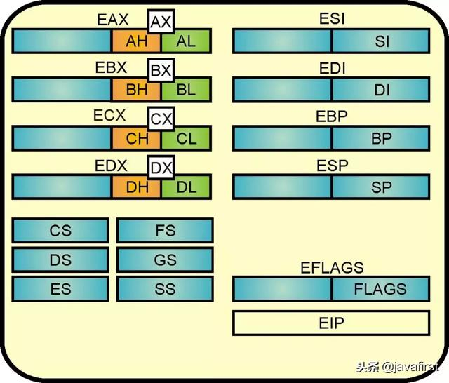
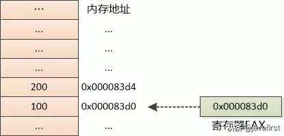
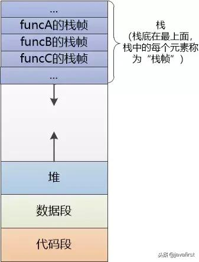
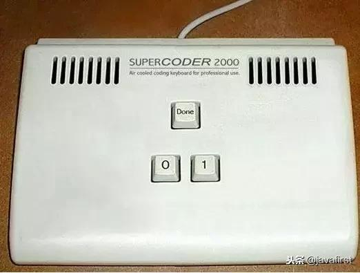

[TOC]

# 从C语言的视角看汇编

##  1. 汇编指令
在C语言看来，汇编的指令简单到了令人发指，只有这么几类指令：

###  1.1. 数据传输类
就是把数据从一个位置复制到另外一个位置，比如：从内存到寄存器，或者从寄存器到内存， 或者从寄存器到寄存器。

###  1.2. 算术和逻辑运算类
无非就是加减乘除，AND, OR, 左移，右移

###  1.3. 控制类
比较两个值，跳转到某一个位置。

<font color=red>就是这么简单的`指令`，配合`寄存器`和`内存`， 就能完成C语言、C++、Go、Java等所谓高级语言的所有功能</font>

##  2. 寄存器
C语言脑海中只有`内存`和`指针`，根本就没有什么`寄存器`的概念. 实际上，寄存器是属于CPU阿甘的，容量有限，但是速度超级快的存储部件。如图: 

##  3. 如何表示C中数组？ (内存地址)
数组如何编译成汇编？如:  
```c
int num[10]；
num[0] = 100;
num[1] = 200;
```

<font color=red>对汇编来说，只认`寄存器`和`内存`. 所谓`数组`，就是内存的一段连续的空间，汇编只知道开始地址即可</font>.
  

汇编只需知道初始地址，顺着地址就能找到所有东西。“`0x000083d0`相当于C语言的指针，但在汇编眼里都是`地址`，`忘掉指针`！”

##  4. 如何处理C中的条件分支？ (if/goto)
C语言的条件分支if else，在汇编中该怎么处理？如:  
```c
if (x < y ) {
   return y - x;
} else {
   return x -y ;
}
```

<font color=red>对汇编语言来说，用`比较(cmpl)`和`跳转(jge)`指令即可, 就像使用if和goto</font>。  

假设：
%eax 寄存器保存的是y的值, 
%edx 寄存器保存的是x的值。

```assembly
 cmpl %eax, %edx ; 比较x和y
 jge .L1         ; 若x >= y，跳转到.L1处去执行
 subl %edx,%eax  ; 计算y-x，结果存到eax寄存器中
 jmp .done       ; 跳转到.done标签处

.L1:
 subl %eax, %edx ; 计算 x-y
 movl %edx, %eax ; 把结果存到eax寄存器中

.done:           ; 计算结束，结果保存在eax寄存器中
```

##  5. 如何处理C中的循环,如while/for？ (if/goto)
<font color=red>循环对汇编语言来说，依然采用类似if和goto的方式解决</font>。如图:  


##  6. 如何实现C中的函数调用？
函数调用如何处理? 如：  
```c
int funcA(int a) {
    ......
    funcB(10);
    ......
}

int funcB(int b) {
    ......
    funcC();
    ......
}
```

这种funcA调用funcB, funcB又调用funcC，函数嵌套调用，简单的汇编指令能处理？ <font color=red>其实只需`内存`配合一下即可</font>。
  

如上图，<font color=red>每个栈帧都表示一个函数的调用，汇编根据栈帧中的返回地址，进行跳转</font>.栈帧内容如下:
   

**【注意】: 栈帧中有输入参数、返回值，可是没有函数代码啊？代码去哪儿了**？  
* 这是运行时在内存中对函数的表达，代码肯定在代码段
* 代码段的指令不断被CPU阿甘执行，遇到函数调用，就建立新的栈帧，函数调用结束，栈帧就会销毁，废弃。然后返回上一个栈帧。
* C语言容易理解代码的静态结构，但忽略了运行时的表示。

##  7. 编程语言的巅峰
汇编语言指令的简单，是对机器简单；而简单指令的复杂组合，却给人类的使用和阅读带来困难。所以，才发展出诸如C、C++、Go、Java等所谓的高级语言，让开发变得高效。而真正接触机器的，其实不是汇编语言,而是机器语言! 请看机器语言程序员专属键盘：  
 


> 参考: 
> [编程语言的巅峰](https://www.toutiao.com/a6630398018296234509/?tt_from=weixin&utm_campaign=client_share&wxshare_count=1&timestamp=1546231945&app=news_article&utm_source=weixin&iid=52335320468&utm_medium=toutiao_ios&group_id=6630398018296234509) 
> 《深入理解计算机系统》
> 《CPU阿甘》