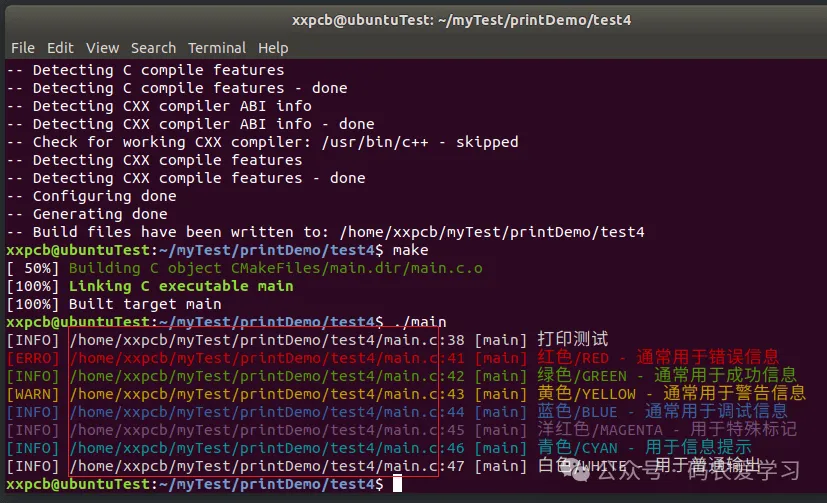

[TOC]


# printf用法总结

##  1. “%S格式符”用法举例
使用printf()函数打印字符串的任意部分，请看下例：
```c
#include <stdio.h>  
#include <stdlib.h>  
#include <string.h>  
  
int main()  
{  
    char * source_str = "THIS IS THE SOURCE STRING" ;  
  
    /* Use printf() to print the first 11 characters of source_str. */  
    printf("First 11 characters: ' %11.11s'\n" , source_str);  
  
    /* Use printf() to print only the last 13 characters of source _str. */  
    printf("Last 13 characters:'%13.13s'\n", source_str+(strlen(source_str)-13));  
}
```
输出结果为：    
First 11 characters: 'THIS IS THE'    
Last 13 characters：'SOURCE STRING'  

在上例中，第一次调用printf()函数时，通过指定参数"%11.11s"，迫使printf()函数只打印11个字符的长度，因为源字符串的长度大于11个字符，所以在打印时源字符串将被截掉一部分，只有头11个字符被打印出来。第二次调用printf()函数时，它将源字符串的最后13个字符打印出来，其实现过程为：  
(1). 用strlen()函数计算出source_str字符串的长度，即strlen(source_str)。  
(2). 将source_str的长度减去13(13是将要打印的字符数)，得出source_str中剩余字符数。  
(3). 将strlen(source_str)-13和source_str的地址相加，得出指向source_str中倒数第13个字符的地址的指针；即source_str+(strlen(source_str)-13)。这个指针就是printf()函数的第二个参数。  
(4). 通过指定参数“％13．13s”，迫使printf()函数只打印13个字符的长度，其结果实际上就是打印源字符串的最后13个字符。


##  2. “%S格式符”用法说明

(1). ％ms：输出的字符串占m列，如果字符串本身长度大于m，则突破m的限制，将字符串全部输出；若串长度小于m，则在左边补空格。  
(2). ％－ms：如果字符串长度小于m，则在m列范围内，字符串向左靠，右补空格。  
(3). ％m.ns：输出占m列，但只取字符串中左端n个字符。这n个字符输出在m列范围的右侧，左补空格。  
(4). ％－m.ns：其中的m、n的含义同上，n个字符输出在m列范围的左侧，右补空格。如果n>m，则m自动取n值，即保证n个字符正常输出。


## 3.打印颜色

printf打印可以显示不同的颜色，其实和系统里的终端控制有关，终端能识别一些特殊的字符序列，printf 函数通过添加这些序列，就能告诉终端要显示什么颜色。

比如 “\033 [31m” 这个序列，就表示后面的文字用红色显示，“\033 [0m” 是恢复默认颜色。

最直接的写法如下：

```c
// gcc main.c -o main

#include <stdio.h>

// 主测试函数
int main() {

    // 基本打印测试
    printf("打印测试\n");
    
    // 颜色打印测试
    printf("\033[31m红色/RED - 通常用于错误信息\033[0m\n");
    printf("\033[32m绿色/GREEN - 通常用于成功信息\033[0m\n");
    printf("\033[33m黄色/YELLOW - 通常用于警告信息\033[0m\n");
    printf("\033[34m蓝色/BLUE - 通常用于调试信息\033[0m\n");
    printf("\033[35m洋红色/MAGENTA - 用于特殊标记\033[0m\n");
    printf("\033[36m青色/CYAN - 用于信息提示\033[0m\n");
    printf("\033[37m白色/WHITE - 用于普通输出\033[0m\n");
    
    return0;
}
```

运行效果如下：


### 1） 打印颜色基础封装

可以给不同颜色的打印增加封装，这样就不用在调用打印的地方每次都增加这些颜色控制符了。

```c
// gcc main.c -o main

#include <stdio.h>

/* 彩色打印宏 */
#define PRINT(fmt, ...)         printf("\033[37m" fmt "\033[0m", ##__VA_ARGS__)
#define PRINT_RED(fmt, ...)     printf("\033[31m" fmt "\033[0m", ##__VA_ARGS__)
#define PRINT_GREEN(fmt, ...)   printf("\033[32m" fmt "\033[0m", ##__VA_ARGS__)
#define PRINT_YELLOW(fmt, ...)  printf("\033[33m" fmt "\033[0m", ##__VA_ARGS__)
#define PRINT_BLUE(fmt, ...)    printf("\033[34m" fmt "\033[0m", ##__VA_ARGS__)
#define PRINT_MAGENTA(fmt, ...) printf("\033[35m" fmt "\033[0m", ##__VA_ARGS__)
#define PRINT_CYAN(fmt, ...)    printf("\033[36m" fmt "\033[0m", ##__VA_ARGS__)
#define PRINT_WHITE(fmt, ...)   printf("\033[37m" fmt "\033[0m", ##__VA_ARGS__)

// 主测试函数
int main() {

    // 基本打印测试
    PRINT("打印测试:%d\n", 1);
    
    // 颜色打印测试
    PRINT_RED("红色/RED - 通常用于错误信息\n");
    PRINT_GREEN("绿色/GREEN - 通常用于成功信息\n");
    PRINT_YELLOW("黄色/YELLOW - 通常用于警告信息\n");
    PRINT_BLUE("蓝色/BLUE - 通常用于调试信息\n");
    PRINT_MAGENTA("洋红色/MAGENTA - 用于特殊标记\n");
    PRINT_CYAN("青色/CYAN - 用于信息提示\n");
    PRINT_WHITE("白色/WHITE - 用于普通输出\n");
    
    return0;
}
```


更进一步，可以把颜色控制符通过宏定义来先定义出来，方便理解代码含义。

```c
/* 颜色定义 */
#define COLOR_RESET   "\033[0m"
#define COLOR_RED     "\033[31m"
#define COLOR_GREEN   "\033[32m"
#define COLOR_YELLOW  "\033[33m"
#define COLOR_BLUE    "\033[34m"
#define COLOR_MAGENTA "\033[35m"
#define COLOR_CYAN    "\033[36m"
#define COLOR_WHITE   "\033[37m"

/* 彩色打印宏 */
#define PRINT(fmt, ...)         printf(COLOR_WHITE fmt COLOR_RESET "\n", ##__VA_ARGS__)
#define PRINT_RED(fmt, ...)     printf(COLOR_RED fmt COLOR_RESET "\n", ##__VA_ARGS__)
#define PRINT_GREEN(fmt, ...)   printf(COLOR_GREEN fmt COLOR_RESET "\n", ##__VA_ARGS__)
#define PRINT_YELLOW(fmt, ...)  printf(COLOR_YELLOW fmt COLOR_RESET "\n", ##__VA_ARGS__)
#define PRINT_BLUE(fmt, ...)    printf(COLOR_BLUE fmt COLOR_RESET "\n", ##__VA_ARGS__)
#define PRINT_MAGENTA(fmt, ...) printf(COLOR_MAGENTA fmt COLOR_RESET "\n", ##__VA_ARGS__)
#define PRINT_CYAN(fmt, ...)    printf(COLOR_CYAN fmt COLOR_RESET "\n", ##__VA_ARGS__)
#define PRINT_WHITE(fmt, ...)   printf(COLOR_WHITE fmt COLOR_RESET "\n", ##__VA_ARGS__)
```

这里需要了解可变参数的使用：

- `...`：表示可变参数部分，可以是0个至多个
- `##__VA_ARGS__`：C 预处理器定义的特殊标识符，代表宏调用时传递的可变参数列表（即省略号 `...` 对应的参数）

例如，宏定义 `#define PRINT(fmt, ...) printf(fmt, __VA_ARGS__)`，当调用 `PRINT("%d", 10)` 时，`__VA_ARGS__` 会被替换为 `10`。

> 当可变参数列表为空时，直接使用 `__VA_ARGS__` 会导致多余的逗号（如 `fprintf(stderr, fmt, __VA_ARGS__)` 变为 `fprintf(stderr, fmt, )`，编译错误）。
>
> 因此，`##` 的作用是用来消除多余逗号，作用是：
>
> - 当 `__VA_ARGS__` 非空时，`##` 无实际效果（仅作为分隔符）
> - 当 `__VA_ARGS__` 为空时，`##` 会删除其前面的逗号，避免语法错误

### 2） 宏定义封装

如果需要再增加一些额外信息，比如增加打印等级level，红色对应ERROR，黄色对应WARNING，其它是INFO

可以进一步封装：

```c
// gcc main.c -o main

#include <stdio.h>
#include <stdarg.h>
#include <string.h>

/* 颜色定义 */
#define COLOR_RESET   "\033[0m"
#define COLOR_RED     "\033[31m"
#define COLOR_GREEN   "\033[32m"
#define COLOR_YELLOW  "\033[33m"
#define COLOR_BLUE    "\033[34m"
#define COLOR_MAGENTA "\033[35m"
#define COLOR_CYAN    "\033[36m"
#define COLOR_WHITE   "\033[37m"

/* 自定义颜色打印宏 - 基础实现 */
#define PRINT_COLOR(color, level, fmt, ...) \
    do { \
        printf("%s[%s] " fmt COLOR_RESET "\n", \
                color, level, ##__VA_ARGS__); \
    } while(0)

/* 彩色打印宏 - 复用基础宏 */
#define PRINT(fmt, ...) PRINT_COLOR(COLOR_WHITE, "INFO", fmt, ##__VA_ARGS__)
#define PRINT_RED(fmt, ...) PRINT_COLOR(COLOR_RED, "ERRO", fmt, ##__VA_ARGS__)
#define PRINT_GREEN(fmt, ...) PRINT_COLOR(COLOR_GREEN, "INFO", fmt, ##__VA_ARGS__)
#define PRINT_YELLOW(fmt, ...) PRINT_COLOR(COLOR_YELLOW, "WARN", fmt, ##__VA_ARGS__)
#define PRINT_BLUE(fmt, ...) PRINT_COLOR(COLOR_BLUE, "INFO", fmt, ##__VA_ARGS__)
#define PRINT_MAGENTA(fmt, ...) PRINT_COLOR(COLOR_MAGENTA, "INFO", fmt, ##__VA_ARGS__)
#define PRINT_CYAN(fmt, ...) PRINT_COLOR(COLOR_CYAN, "INFO", fmt, ##__VA_ARGS__)
#define PRINT_WHITE(fmt, ...) PRINT_COLOR(COLOR_WHITE, "INFO", fmt, ##__VA_ARGS__)

// 主测试函数
int main() {

    // 基本打印测试
    PRINT("打印测试");
    
    // 颜色打印测试
    PRINT_RED("红色/RED - 通常用于错误信息");
    PRINT_GREEN("绿色/GREEN - 通常用于成功信息");
    PRINT_YELLOW("黄色/YELLOW - 通常用于警告信息");
    PRINT_BLUE("蓝色/BLUE - 通常用于调试信息");
    PRINT_MAGENTA("洋红色/MAGENTA - 用于特殊标记");
    PRINT_CYAN("青色/CYAN - 用于信息提示");
    PRINT_WHITE("白色/WHITE - 用于普通输出");
    
    return0;
}
```


## 4. 打印文件名、行号和函数名

打印文件名、行号和函数名，需要用到`__FILE__`、`__LINE__` 和 `__func__` 这些特殊标识符。

- `__FILE__`：当前正在编译的源文件的路径名（由编译器决定，可能是绝对路径或相对路径），例如：若源文件为 /home/user/project/main.c，则 `__FILE__` 的值为 "main.c" 或 "/home/user/project/main.c"（取决于编译器）。
- `__LINE__`：当前代码行在源文件中的行号
- `__func__`：当前所在函数的名称

### 1) 打印文件名(带路径)

先来测试打印带路径的文件名，可以通过cmake的方式来编译程序，这样`__FILE__`对应的完整的路径和文件名。

测试代码对应的CMakeLists.txt如下：

```makefile
# CMake 最低版本号要求
cmake_minimum_required (VERSION 2.8)

# 项目信息
project (main)

# 指定生成目标
add_executable(main main.c)
```

测试代码：

```c
// gcc main.c -o main

#include <stdio.h>
#include <stdarg.h>
#include <string.h>

/* 颜色定义 */
#define COLOR_RESET   "\033[0m"
#define COLOR_RED     "\033[31m"
#define COLOR_GREEN   "\033[32m"
#define COLOR_YELLOW  "\033[33m"
#define COLOR_BLUE    "\033[34m"
#define COLOR_MAGENTA "\033[35m"
#define COLOR_CYAN    "\033[36m"
#define COLOR_WHITE   "\033[37m"

/* 自定义颜色打印宏 - 基础实现 */
#define PRINT_COLOR(color, level, fmt, ...) \
    do { \
        printf("%s[%s] %s:%d [%s] " fmt COLOR_RESET "\n", \
                color, level, __FILE__, __LINE__, __func__, ##__VA_ARGS__); \
    } while(0)

/* 彩色打印宏 - 复用基础宏 */
#define PRINT(fmt, ...) PRINT_COLOR(COLOR_WHITE, "INFO", fmt, ##__VA_ARGS__)
#define PRINT_RED(fmt, ...) PRINT_COLOR(COLOR_RED, "ERRO", fmt, ##__VA_ARGS__)
#define PRINT_GREEN(fmt, ...) PRINT_COLOR(COLOR_GREEN, "INFO", fmt, ##__VA_ARGS__)
#define PRINT_YELLOW(fmt, ...) PRINT_COLOR(COLOR_YELLOW, "WARN", fmt, ##__VA_ARGS__)
#define PRINT_BLUE(fmt, ...) PRINT_COLOR(COLOR_BLUE, "INFO", fmt, ##__VA_ARGS__)
#define PRINT_MAGENTA(fmt, ...) PRINT_COLOR(COLOR_MAGENTA, "INFO", fmt, ##__VA_ARGS__)
#define PRINT_CYAN(fmt, ...) PRINT_COLOR(COLOR_CYAN, "INFO", fmt, ##__VA_ARGS__)
#define PRINT_WHITE(fmt, ...) PRINT_COLOR(COLOR_WHITE, "INFO", fmt, ##__VA_ARGS__)

// 主测试函数
int main() {

    // 基本打印测试
    PRINT("打印测试");
    
    // 颜色打印测试
    PRINT_RED("红色/RED - 通常用于错误信息");
    PRINT_GREEN("绿色/GREEN - 通常用于成功信息");
    PRINT_YELLOW("黄色/YELLOW - 通常用于警告信息");
    PRINT_BLUE("蓝色/BLUE - 通常用于调试信息");
    PRINT_MAGENTA("洋红色/MAGENTA - 用于特殊标记");
    PRINT_CYAN("青色/CYAN - 用于信息提示");
    PRINT_WHITE("白色/WHITE - 用于普通输出");
    
    return0;
}   
```



### 2) 打印文件名(不带路径)

如果想要仅打印文件名，不带路径，可以对文件名进行提取，原理就是查找路径中最后一个 `/` 的位置：

- 若存在：返回该位置的指针，`strrchr(__FILE__, '/') + 1` 即为文件名的起始地址
- 若不存在（如直接使用文件名）：返回 `__FILE__` 本身

```
/* 获取文件名（不含路径） */
#define __SHORT_FILE__ (strrchr(__FILE__, '/') ? strrchr(__FILE__, '/') + 1 : __FILE__)

/* 自定义颜色打印宏 - 基础实现 */
#define PRINT_COLOR(color, level, fmt, ...) \
    do { \
        printf("%s[%s] %s:%d [%s] " fmt COLOR_RESET "\n", \
                color, level, __SHORT_FILE__, __LINE__, __func__, ##__VA_ARGS__); \
    } while(0)
    
```


## 5. 打印时间

### 1)  打印时间(年月日时分秒）

这里使用一个自定义的`__CURRENT_TIME__`的宏定义来获取时间：

```c
/* 获取当前时间字符串 */
#define __CURRENT_TIME__ \
    ({ \
        time_t __t = time(NULL); \
        struct tm *__tm = localtime(&__t); \
        static char __buf[26]; \
        strftime(__buf, sizeof(__buf), "%Y-%m-%d %H:%M:%S", __tm); \
        __buf; \
    })
```

时间处理流程为：

- **获取时间戳**：`time(NULL)` 返回当前时间的秒数（自 1970 年 1 月 1 日以来）。
- **转换为本地时间**：`localtime(&__t)` 将时间戳转换为本地时间（考虑时区）。
- **格式化字符串**：`strftime` 按照 `%Y-%m-%d %H:%M:%S` 格式生成可读时间字符串。

```c
// gcc main.c -o main

#include <stdio.h>
#include <stdarg.h>
#include <time.h>
#include <string.h>

/* 颜色定义 */
#define COLOR_RESET   "\033[0m"
#define COLOR_RED     "\033[31m"
#define COLOR_GREEN   "\033[32m"
#define COLOR_YELLOW  "\033[33m"
#define COLOR_BLUE    "\033[34m"
#define COLOR_MAGENTA "\033[35m"
#define COLOR_CYAN    "\033[36m"
#define COLOR_WHITE   "\033[37m"

/* 获取当前时间字符串 */
#define __CURRENT_TIME__ \
    ({ \
        time_t __t = time(NULL); \
        struct tm *__tm = localtime(&__t); \
        static char __buf[26]; \
        strftime(__buf, sizeof(__buf), "%Y-%m-%d %H:%M:%S", __tm); \
        __buf; \
    })
   
/* 获取文件名（不含路径） */
#define __SHORT_FILE__ (strrchr(__FILE__, '/') ? strrchr(__FILE__, '/') + 1 : __FILE__)

/* 自定义颜色打印宏 - 基础实现 */
#define PRINT_COLOR(color, level, fmt, ...) \
    do { \
        printf("%s%s[%s] %s:%d [%s] " fmt COLOR_RESET "\n", \
                color, __CURRENT_TIME__, level, __SHORT_FILE__, __LINE__, __func__, ##__VA_ARGS__); \
    } while(0)

/* 彩色打印宏 - 复用基础宏 */
#define PRINT(fmt, ...) PRINT_COLOR(COLOR_WHITE, "INFO", fmt, ##__VA_ARGS__)
#define PRINT_RED(fmt, ...) PRINT_COLOR(COLOR_RED, "ERRO", fmt, ##__VA_ARGS__)
#define PRINT_GREEN(fmt, ...) PRINT_COLOR(COLOR_GREEN, "INFO", fmt, ##__VA_ARGS__)
#define PRINT_YELLOW(fmt, ...) PRINT_COLOR(COLOR_YELLOW, "WARN", fmt, ##__VA_ARGS__)
#define PRINT_BLUE(fmt, ...) PRINT_COLOR(COLOR_BLUE, "INFO", fmt, ##__VA_ARGS__)
#define PRINT_MAGENTA(fmt, ...) PRINT_COLOR(COLOR_MAGENTA, "INFO", fmt, ##__VA_ARGS__)
#define PRINT_CYAN(fmt, ...) PRINT_COLOR(COLOR_CYAN, "INFO", fmt, ##__VA_ARGS__)
#define PRINT_WHITE(fmt, ...) PRINT_COLOR(COLOR_WHITE, "INFO", fmt, ##__VA_ARGS__)

// 主测试函数
int main() {

    // 基本打印测试
    PRINT("打印测试");
    
    // 颜色打印测试
    PRINT_RED("红色/RED - 通常用于错误信息");
    PRINT_GREEN("绿色/GREEN - 通常用于成功信息");
    PRINT_YELLOW("黄色/YELLOW - 通常用于警告信息");
    PRINT_BLUE("蓝色/BLUE - 通常用于调试信息");
    PRINT_MAGENTA("洋红色/MAGENTA - 用于特殊标记");
    PRINT_CYAN("青色/CYAN - 用于信息提示");
    PRINT_WHITE("白色/WHITE - 用于普通输出");
    
    return0;
}
    
```


### 2) 打印时间(带毫秒)

如果需要更精确的时间，比如精确到毫秒，可以使用使用 `gettimeofday` 获取微秒级时间（`tv_usec` 字段），并通过 `/1000` 转换为毫秒

```c
#include <sys/time.h>

/* 获取当前时间字符串（带毫秒） */
#define __CURRENT_TIME__ \
    ({ \
        struct timeval __tv; \
        gettimeofday(&__tv, NULL); \
        struct tm *__tm = localtime(&__tv.tv_sec); \
        static char __buf[32]; \
        snprintf(__buf, sizeof(__buf), "%02d-%02d-%02d %02d:%02d:%02d.%03d", \
                 __tm->tm_year % 100, __tm->tm_mon + 1, __tm->tm_mday, \
                 __tm->tm_hour, __tm->tm_min, __tm->tm_sec, \
                 (int)(__tv.tv_usec / 1000)); \
        __buf; \
    })
    
```


> 巨人的肩膀：
> [如何给printf打印增加颜色、时间戳、文件名、行号、函数名](https://mp.weixin.qq.com/s/AqepvTOk8Mg52OKunLr5vg)


