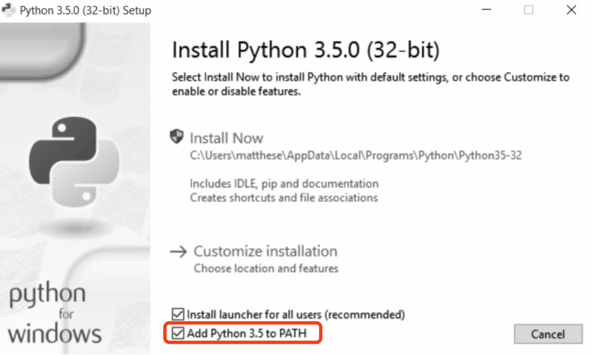

[TOC]

# python：从安装到“hello world”

## 1.mac下的python安装

### 1.1.升级新版本

​	Mac系统自带python，但是一般都是python的低版本，如下在终端输入命令可查看当前的python版本号：

```shell
$python -V
Python 2.7.10
```

​	低版本Python 2.7到2020年就会停止维护了，因此，很有必要将其升级。又因为mac有些软件依赖于自带python，所以不建议删除之前的老版本，而是让老版本和新版本共存。以下为升级步骤：

* 1.[官网下载](https://www.python.org/downloads/mac-osx/)最新版本(或指定版本)，本文下载的是：python-3.8.1-macosx10.9.pkg

* 2.点击下载好的pkg文件进行安装

* 3.安装完成后，默认安装路径为：/Library/Frameworks/Python.framework/Versions/3.8

* 4.配置环境变量：修改profile文件

​	   1). 在终端输入命令：

```shell
$open ~/.bash_profile
```

​		打开~/.bash_profile后，添加：alias python="/Library/Frameworks/Python.framework/Versions/3.8/bin

如下：

```shell
# Setting PATH for Python 3.8
# The original version is saved in .bash_profile.pysave
PATH="/Library/Frameworks/Python.framework/Versions/3.8/bin:${PATH}"
export PATH

alias python="/Library/Frameworks/Python.framework/Versions/3.8/bin/python3.8"
```

​	2). 添加完成后command+s保存，再到终端输入命令：source ~/.bash_profile，则最终生效。此时查看版本号则为最新版本，如下：

```shell
$ source ~/.bash_profile
$ python -V
Python 3.8.1
```

### 1.2.兼容旧版本

​	以上第一步就完成了pyhon新版本的升级，同时也兼容了旧版本。如果想恢复到旧版本，只需更新~/.bash_profile，注释掉alias python那行即可，如下：

```shell
$open ~/.bash_profile

# Setting PATH for Python 3.8
# The original version is saved in .bash_profile.pysave
PATH="/Library/Frameworks/Python.framework/Versions/3.8/bin:${PATH}"
export PATH

# alias python="/Library/Frameworks/Python.framework/Versions/3.8/bin/python3.8"

$ source ~/.bash_profile
$ python -V
Python 2.7.10
```

注：<font color=red>这里实际测试和预期不一样，即使已经注释了，Python 2.7.10也没有出现，而且../Versions/目录下也没有原来2.7.10的相关版本，似乎安装新版本的时候自动将其覆盖了。但是，在上一步的source ~/.bash_profile操作之前，是有python2.7.10的。--有待进一步确认</font>

### 1.3.删除旧版本

### 1.4.代码测试

* 1.代码

  ```python
  #helloworld.py
  
  def main():
  	print "hello world"
  
  if __name__ == '__main__':
  	main()
  ```

* 2.运行

   ```shell
  $ python helloworld.py
  hello world
  ```

## 2.windows下的python安装

### 2.1.安装

* 1.[官网下载](https://www.python.org/downloads/mac-osx/)最新windows版本安装包

* 2.点击安装包，一路默认安装，注意选中: "add python 3.5 to PATH"，如图:

  

  ​	【**注意**】：如果没有勾选上“add python 3.5 to PATH”，命令窗口将无法找到python.exe（除非你在安装目录C:/user/administrator/AppData/Local/Programs/Python/Python34/python.exe下打开命令窗口）, 那么此时就需要手动修改环境变量。

  ​	我的电脑/../系统设置/高级/环境变量：

  ```shell
  
  ```

* 3.安装成功，在任意目录下打开命令窗口，输入以下命令验证：

  ```shell
  $ python --version
  Python 3.5.0
  ```

### 2.2.测试

* 1.代码

  ```python
  #helloworld.py
  
  def main():
  	print "hello world"
  
  if __name__ == '__main__':
  	main()
  ```

* 2.运行

  ```shell
  $ python helloworld.py
  hello world
  ```


## 3.常用的IDE

### 3.1.pychain

