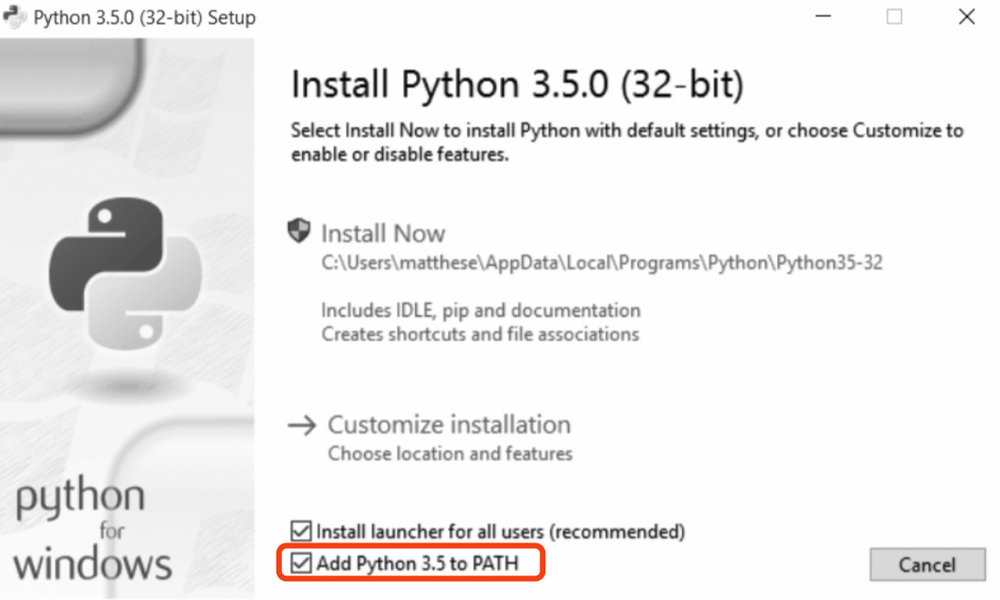

[TOC]

# python的环境搭建

## 1.mac下的python安装

### 1.1.升级新版本

​	Mac系统自带python，但是一般都是python的低版本，如下在终端输入命令可查看当前的python版本号：

```shell
$python -V
Python 2.7.10
```

​	低版本Python 2.7到2020年就会停止维护了，因此，很有必要将其升级。又因为mac有些软件依赖于自带python，所以不建议删除之前的老版本，而是让老版本和新版本共存。以下为升级步骤：

* 1.[官网下载](https://www.python.org/downloads/mac-osx/)最新版本(或指定版本)，本文下载的是：python-3.8.1-macosx10.9.pkg

* 2.点击下载好的pkg文件进行安装

* 3.安装完成后，默认安装路径为：/Library/Frameworks/Python.framework/Versions/3.8

* 4.配置环境变量：修改profile文件

​	   1). 在终端输入命令：

```shell
$open ~/.bash_profile
```

​		打开~/.bash_profile后，添加：alias python="/Library/Frameworks/Python.framework/Versions/3.8/bin

如下：

```shell
# Setting PATH for Python 3.8
# The original version is saved in .bash_profile.pysave
PATH="/Library/Frameworks/Python.framework/Versions/3.8/bin:${PATH}"
export PATH

alias python="/Library/Frameworks/Python.framework/Versions/3.8/bin/python3.8"
```

​	2). 添加完成后command+s保存，再到终端输入命令：source ~/.bash_profile，则最终生效。此时查看版本号则为最新版本，如下：

```shell
$ source ~/.bash_profile
$ python -V
Python 3.8.1
```

### 1.2.兼容旧版本

​		以上完成了pyhon新版本的升级，同时旧版本也依然存在。

* 1.恢复旧版本

  ​	如果想恢复到旧版本，只需更新~/.bash_profile，注释掉alias python那行即可，如下：

  ```shell
  $open ~/.bash_profile
  
  # Setting PATH for Python 3.8
  # The original version is saved in .bash_profile.pysave
  PATH="/Library/Frameworks/Python.framework/Versions/3.8/bin:${PATH}"
  export PATH
  
  # alias python="/Library/Frameworks/Python.framework/Versions/3.8/bin/python3.8"
  
  $ source ~/.bash_profile
  $ python -V
  Python 2.7.10
  ```

  【**注**】：<font color=red>这里虽然已经注释了“alias python = ...”，Python 2.7.10却没有恢复，此时需要重启电脑后生效。但同时发现../Versions/目录下没有了原来2.7.10的相关版本的文件夹，而在上一步的source ~/.bash_profile操作之前，是有python2.7.10的，貌似默认被新版本覆盖了。--有待进一步确认</font>

  

* 2.新老版本共存

  ​	通过上一步的方法恢复到了旧版本，使用python查看版本号验证：

  ```shell
  $ python --version
  Python 2.7.10
  ```

  ​	此时如果想要使用新版本，也可以不用配置~/.bash_profile，直接采用python3命令，如：

  ```shell
  $ python3 --version
  Python 3.8.1
  ```

  

### 1.3.彻底删除旧版本

​		前面已经提到：不建议彻底删除python2.7，以免mac有些软件依赖于自带的python而引起错误。

>参考：[mac 下删除python2.7](https://www.cnblogs.com/baiyygynui/p/11658313.html)

### 1.4.代码测试

* 1.代码

  ```python
  #helloworld.py
  
  def main():
  	print "hello world"
  
  if __name__ == '__main__':
  	main()
  ```

* 2.运行

   ```shell
  $ python helloworld.py
  hello world
  ```

* 3.窗口调试

  ​	也可以在命令窗口进行调试，打开终端:

  ```shell
  $ python3
  Python 3.8.1 (v3.8.1:1b293b6006, Dec 18 2019, 14:08:53) 
  [Clang 6.0 (clang-600.0.57)] on darwin
  Type "help", "copyright", "credits" or "license" for more information.
  >>> print("hello world")
  hello world
  >>> exit()   #退出
  ```

  

## 2.linux下的python安装

### 2.1.验证

​	绝大多数的Linux计算机中，都默认安装了Python。验证如下：

```shell
$ python --version
Python 2.7.6 

$ python3 --version
Python 3.5.0
```

### 2.2.安装

​	若没有安装，可以使用deadsnakes包安装最新版本，如下：

```shell
$ sudo add-apt-repository ppa:fkrull/deadsnakes
$ sudo apt-get update
$ sudo apt-get install python3.5
```

### 2.3.测试

* 1.代码

  ```python
  #helloworld.py
  
  def main():
  	print "hello world"
  
  if __name__ == '__main__':
  	main()
  ```

* 2.运行

  ```shell
  $ python3 helloworld.py
  hello world
  ```


## 3.windows下的python安装

### 3.1.安装

* 1.[官网下载](https://www.python.org/downloads)最新windows版本安装包

* 2.点击安装包，一路默认安装，注意选中: "add python 3.5 to PATH"，如图:

  

  ​	【**注意**】：<font color=red>如果没有勾选上“add python 3.5 to PATH”，命令窗口则将无法找到python.exe（除非你在安装目录C:\User\Administrator\AppData\Local\Programs\Python\Python35\下打开命令窗口），那么此时就需要手动修改环境变量</font>。在“我的电脑-属性-高级系统设置-高级-环境变量”中，编辑path：

  ```shell
  C:\Users\Administrator\AppData\Local\Programs\Python\Python35\;
  C:\Users\Administrator\AppData\Local\Programs\Python\Python35\Scripts\
  ```

* 3.安装成功，在任意目录下打开命令窗口，输入以下命令验证：

  ```shell
  $ python --version
  Python 3.5.0
  ```

### 3.2.测试

* 1.代码

  ```python
  #helloworld.py
  
  def main():
  	print "hello world"
  
  if __name__ == '__main__':
  	main()
  ```

* 2.运行

  ```shell
  $ python helloworld.py
  hello world
  ```


## 4.python的模块安装

​	python作为一门胶水语言，其强大之一就是支持大量的第三方库。根据需要，可使用“pip install ModuleName”命令安装第三方库模块。

### 4.1. pip工具的安装

| 操作系统 | 安装                                                         | 安装路径                                                    |
| :------: | ------------------------------------------------------------ | ----------------------------------------------------------- |
| windows  | 随 Python3.x 自动安装                                        | C:\Python34\Scripts\pip.exe                                 |
| mac/OS X | 随 Python3.x 自动安装                                        | /Library/ Frameworks/Python.framework/Versions/3.4/bin/pip3 |
|  linux   | 需手动安装：                     <br />1.Ubuntu或Debian:            <br />   $ get install python3-pip <br />2.Fedora:(需管理员密码)    <br />   $ install python3 -pip | /usr/bin/pip3                                               |

​	安装成功的验证：

```shell
$ pip3 -V
pip 19.2.3 from /Library/Frameworks/Python.framework/Versions/3.8/lib/python3.8/site-packages/pip (python 3.8)
```


### 4.2. pip工具的使用

| 操作系统  | 使用                           | 升级                              | 验证（没有消息就是好消息）           |
| :-------: | ------------------------------ | --------------------------------- | ------------------------------------ |
|  windows  | $ pip install ModuleName       | $ pip install –U ModuleName       | $ python<br />>>> import ModuleName  |
| mac/linux | $ sudo pip3 install ModuleName | $ sudo pip3 install –U ModuleName | $ python3<br />>>> import ModuleName |


### 4.3. 模块安装的示例

​	在mac下为例（windows下使用$ pip install ModuleName）:

```shell
$ sudo pip3 install send2trash
$ sudo pip3 install requests
$ sudo pip3 install beautifulsoup4
$ sudo pip3 install selenium
$ sudo pip3 install openpyxl
$ sudo pip3 install PyPDF2
$ sudo pip3 install python-docx    #安装 python-docx，而不是 docx
$ sudo pip3 install imapclient
$ sudo pip3 install pyzmail
$ sudo pip3 install twilio
$ sudo pip3 install pillow
$ sudo pip3 install pyobjc-core    #仅在 OS X 上
$ sudo pip3 install pyobjc    		 #仅在 OS X 上
$ sudo pip3 install python3-xlib   #仅在 Linux 上
$ sudo pip3 install pyautogui
```


## 5.常用的IDE

### 5.1. VS Code（Virsual Studio Code）

​	强大的代码编辑器，编辑速度快，安装插件可调试python

### 5.2. pychain

​	专注于python, 启动速度慢

