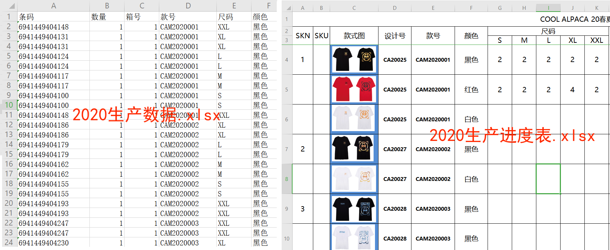

[TOC]

# 操作excel的一个示例

​	问题：现有两个文件“2020生产数据.xlsx”和“2020生产进度表.xlsx”，要求将“2020生产数据.xlsx”中的款号、颜色、各个尺码及其对应的数量总和，写入到“2020生产进度表.xlsx”对应的表格中。如下图：




## 1.准备工作

​	安装openpyxl模块:

```shell
$ pip install openpyxl
```

​	核心代码：

```python
import openpyxl

#data_only=True时，只取excel的值，否则取公式（默认为False）
wb = openpyxl.load_workbook(filename, data_only = True)#打开文件
ws = wb['Sheet1']#打开对应的sheet

for i in range(4, ws.max_row + 1, 1):
  	#1.取值
    cell_id = ws.cell(row=i, column=5).value
    cell_color = ws.cell(row=i, column=6).value
    
    #2.修改
    ws["G" + str(i)] = s
    #以下写法会导致.xlsx的格式被修改，如：原来粘贴的图片将不再显示
    ws.cell(i, 7, s)
```


## 2.代码演示

```python
#!/usr/bin/env python
# coding=utf-8
# file: auto_office.py

import openpyxl
# import xlrd
# from xlutils.copy import copy
# from win32com.client import Dispatch

# def just_open(filename):
#     xlApp = Dispatch("Excel.Application")
#     xlApp.Visible = False
#     xlBook = xlApp.Workbooks.Open(filename)
#     xlBook.Save()
#     xlBook.Close()

class XSize():
    def __init__(self, size, num):
        self.xitems = {}
        self.xitems[size] = num

    def add(self, size, num):
        if (self.xitems.get(size, "never") == "never"): #未找着
            self.xitems[size] = num
        else:
            self.xitems[size] += num

    def getnum(self, size):
        return 0 if (self.xitems.get(size, "never") == "never") else self.xitems[size]

class XColor():
    def __init__(self, color, xsize):
        self.colors = {}
        self.colors[color] = xsize

    def add(self, color, size, num):
        if (self.colors.get(color, "never") != "never"): #找到了
            self.colors[color].add(size, num)
        else:
            self.colors[color] = XSize(size, num)

def print_items(dicts):
    print("款式", "颜色", "S", "M", "L", "XL", "XXL")
    for cid, xcolor in dicts.items():
        for color, xsize in xcolor.colors.items():
            print(cid, color, xsize.getnum('S'), xsize.getnum('M'), xsize.getnum('L'), xsize.getnum('XL'), xsize.getnum('XXL'))

def get_item(dicts, cell_id, cell_color):
    # print("款式", "颜色", "S", "M", "L", "XL", "XXL")
    if dicts.get(cell_id, 'never') == 'never':
        return (False, '', '', '', '', '')

    if dicts[cell_id].colors.get(cell_color, 'never') == 'never':
        return (False, '', '', '', '', '')

    xsize = dicts[cell_id].colors[cell_color]
    s = xsize.getnum('S')
    m = xsize.getnum('M')
    l = xsize.getnum('L')
    xl = xsize.getnum('XL')
    xxl = xsize.getnum('XXL')
    return (True, s, m, l, xl, xxl)

def write(filename, dicts):
    wb = openpyxl.load_workbook(filename, data_only = True)
    ws = wb['20春夏下单表']

    for i in range(4, ws.max_row + 1, 1):
        cell_id = ws.cell(row=i, column=5).value
        cell_color = ws.cell(row=i, column=6).value

        if (cell_id is None):
            continue

        (r, s, m, l, xl, xxl) = get_item(dicts, cell_id, cell_color)
        if r:
            ws["G" + str(i)] = s
            ws["H" + str(i)] = m
            ws["I" + str(i)] = l
            ws["J" + str(i)] = xl
            ws["K" + str(i)] = xxl
            #以下写法会导致.xlsx的格式被修改，如：原来粘贴的图片将不再显示
            # ws.cell(i, 7, s)
            # ws.cell(i, 8, m)
            # ws.cell(i, 9, l)
            # ws.cell(i, 10, xl)
            # ws.cell(i, 11, xxl)
            # print(i, ">>>", cell_id, cell_color, s, m, l, xl, xxl)
        else:
            print("%03d"%(i), "[error] Not found:", cell_id, cell_color, s, m, l, xl, xxl)

    wb.save("fix_" + filename)

def read(filename):
    wb = openpyxl.load_workbook(filename, data_only = True)
    ws = wb['Sheet1']

    #{cid:{color:{size:num}}}
    dicts = {}

    for i in range(2, ws.max_row + 1, 1):
        num   = ws.cell(row=i, column=2).value
        cid   = ws.cell(row=i, column=4).value
        size  = ws.cell(row=i, column=5).value
        color = ws.cell(row=i, column=6).value
        # print(i, cid, size, color, num)

        if (cid is None):
            continue

        if (dicts.get(cid, 'never') == 'never'):
            xsize = XSize(size, num)
            xcolor = XColor(color, xsize)
            dicts[cid] = xcolor
        else:
            dicts[cid].add(color, size, num)

    return dicts

def main():
    print("======= auto office.zhangy =======")
    dicts = read('2020生产数据.xlsx')
    print_items(dicts)

    print("\n------ 写入文件 ------")
    write('2020生产进度表.xlsx', dicts)

    print("======= success =======")

if __name__ == "__main__":
    main()
```


## 3.运行结果

```shell
======= auto office.zhangy =======
款式 颜色 S M L XL XXL
CAM2020001 黑色 2 2 2 2 2
CAM20104011 黑色 0 2 2 2 0
CAM20104011 牛油果绿 0 2 2 0 1
CAM20104011 白色 0 2 2 0 0
CAM20111006 黑色 0 0 0 0 2
CAM20111004 黑蓝色 2 2 2 2 0
CAM20111004 黑黄色 2 2 2 2 0
CAM20111002 黑色 0 2 2 0 2
CAM20111002 藏青色 0 2 2 0 2
CAM2021001 蓝色 0 0 1 0 0
CAM2021001 绿色 0 0 1 0 0
CAM2021001 黄色 0 1 0 0 0
CAM2021001 粉色 0 1 0 0 0

------ 写入文件 ------
05 [error] Not found: CAM2020001 红色
06 [error] Not found: CAM2020001 白色
08 [error] Not found: CAM2020002 白色
======= success =======
```

