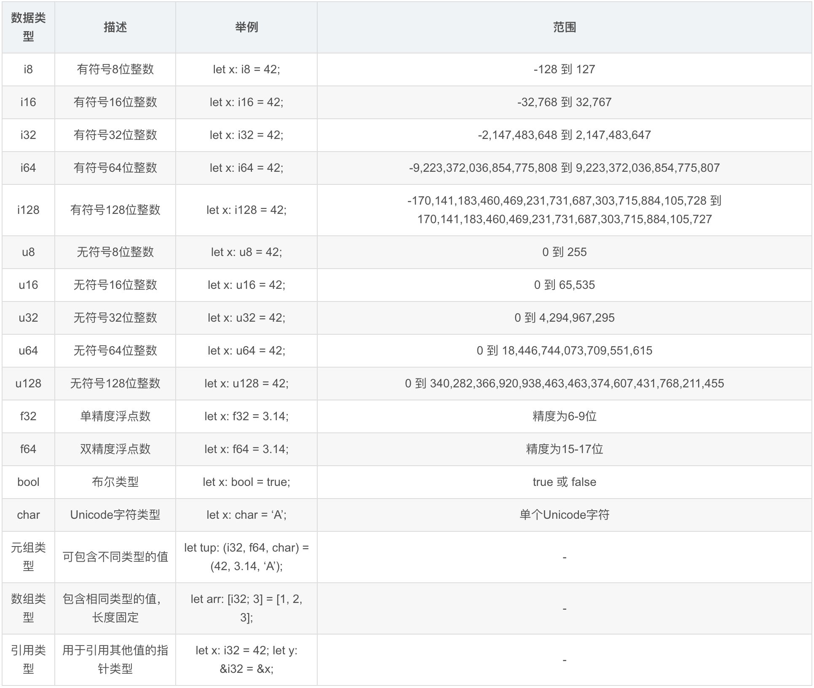

[TOC]

# rust的入门语法


* **Rust 学习资料**
  1、[Rust](https://rust.p2hp.com/)
  2、[Rust 程序设计](https://www.rust-lang.org/zh-CN/)


## 一、rust项目结构

```shell
lab-rust					-- 工程根目录
|- Cargo.toml			-- Rust 的清单文件。其中包含了项目的元数据和依赖库
|- src						-- 源码
	 |- main.rs
|- target					-- cargo run后生成的可执行文件和编译文件
```


## 二、**Cargo：Rust 的构建工具和包管理器**

在终端中执行以下命令：

```shell
- cargo new [name]：创建一个新的Rust项目
- cargo build：构建项目
- cargo run：运行项目
- cargo test：运行测试
- cargo doc：生成文档
- cargo update：更新依赖项
- cargo clean：清除构建输出
- cargo publish：将软件包发布到crates.io上
- cargo add [name]：新增依赖项（相当于在Cargo.toml中手动添加: [name]=[x.x.x]), 如cargo add ansi_term
- cargo install [package]: 安装指定软件包
- cargo uninstall [package]: 卸载指定软件包
```


## 三、rust语法

### 1、变量的用法

```
```




​			
​			
​			


> 巨人的肩膀：
>
> [Rust 全面指南：从基础到高级，一网打尽 Rust 的编程知识](https://blog.csdn.net/qq_36678837/article/details/131371856)