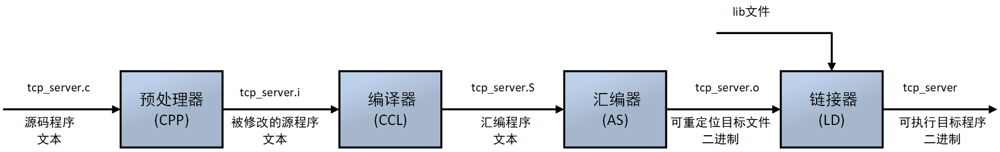

<!-- vscode-markdown-toc -->
* 1. [编译原理](#)
	* 1.1. [编译命令](#-1)
	* 1.2. [预处理](#-1)
	* 1.3. [编译](#-1)
	* 1.4. [汇编](#-1)
	* 1.5. [链接](#-1)
* 2. [makefile简单介绍](#makefile)
* 3. [makefile基础规则](#makefile-1)
* 4. [makefile工作原理](#makefile-1)
* 5. [makefile示例演练](#makefile-1)
	* 5.1. [原始规则](#-1)
	* 5.2. [使用变量](#-1)
	* 5.3. [自动推导](#-1)
		* 5.3.1. [进一步简化推导](#-1)
	* 5.4. [使用函数](#-1)
	* 5.5. [文件搜索](#-1)
	* 5.6. [顶级工程](#-1)
	* 5.7. [Debug & Release](#DebugRelease)
		* 5.7.1. [.symbol](#symbol)
* 6. [cmake](#cmake)

<!-- vscode-markdown-toc-config
	numbering=true
	autoSave=true
	/vscode-markdown-toc-config -->
<!-- /vscode-markdown-toc -->

# makefile

##  1. 编译原理

###  1.1. 编译命令

###  1.2. 预处理

###  1.3. 编译

###  1.4. 汇编

###  1.5. 链接

##  2. makefile简单介绍
  Makefile用来指定规则，make是一个解释makefile中指令的命令工具。一般来说，大多数的IDE都有这个命令，比如：Delphi的make，Visual C++的nmake，Linux下GNU的make。当编译工程时，只要输入make就会去编译，那么这个make命令执行的时候一定需要一个Makefile文件，通过这个Makefile告诉make命令需要怎么样的去编译和链接程序。
  make的工作规则是：
* 1.如果这个工程没有编译过，那么我们的所有C文件都要编译并被链接。
* 2.如果这个工程的某几个C文件被修改，那么我们只编译被修改的C文件，并链接目标程序。
* 3.如果这个工程的头文件被改变了，那么我们需要编译引用了这几个头文件的C文件，并链接目标程序。
  只要Makefile写得够好，所有的这一切，我们只用一个make命令就可以完成，make命令会自动智能地根据当前的文件修改的情况来确定哪些文件需要重编译，从而自己编译所需要的文件和链接目标程序。

##  3. makefile基础规则

##  4. makefile工作原理

##  5. makefile示例演练

###  5.1. 原始规则

###  5.2. 使用变量

###  5.3. 自动推导

####  5.3.1. 进一步简化推导

###  5.4. 使用函数

#### 变量$@，$^，$<
* $@: 目标文件
* $^: 所有的依赖文件
* $<: 第一个依赖文件

###  5.5. 文件搜索
> [Makefile VPATH和vpath](https://blog.csdn.net/mcgrady_tracy/article/details/27240139)

###  5.6. 顶级工程

###  5.7. Debug & Release

####  5.7.1. .symbol

##  6. cmake

> 参考:     
> 《动脑学院.lee老师》     
> [Makefile VPATH和vpath](https://blog.csdn.net/mcgrady_tracy/article/details/27240139)