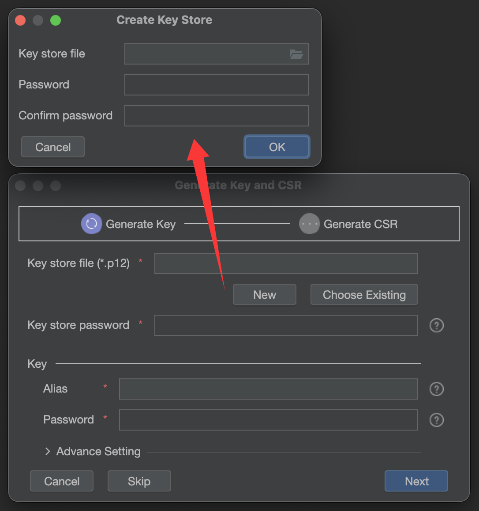
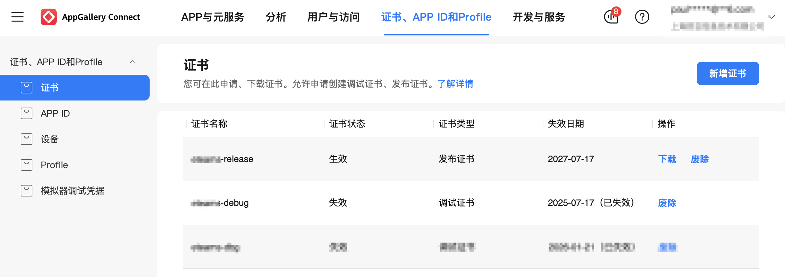
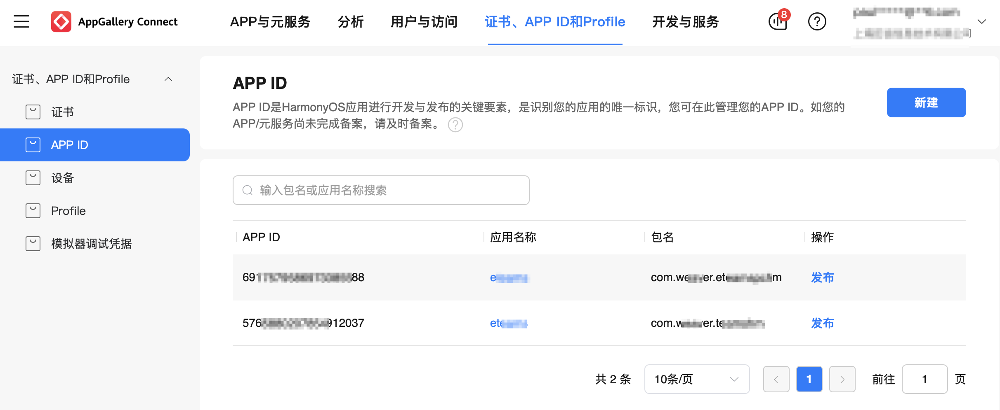
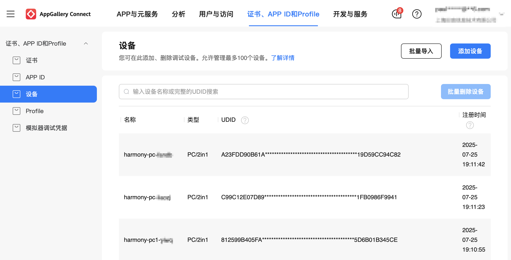
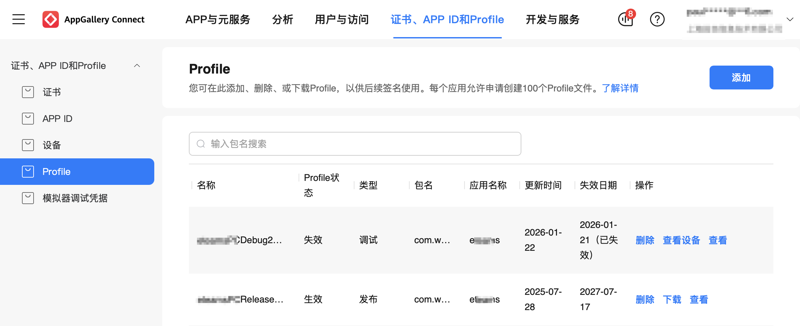
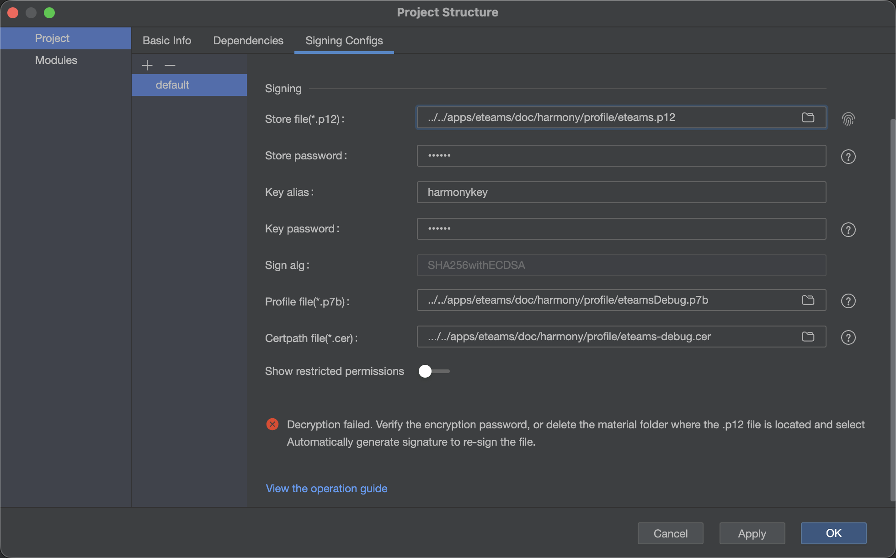
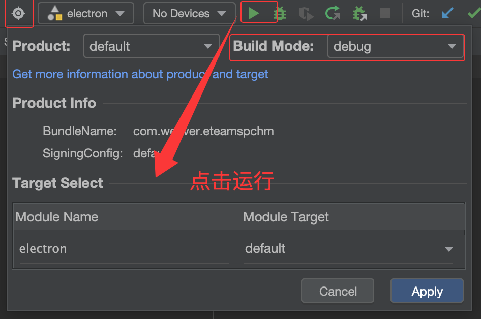
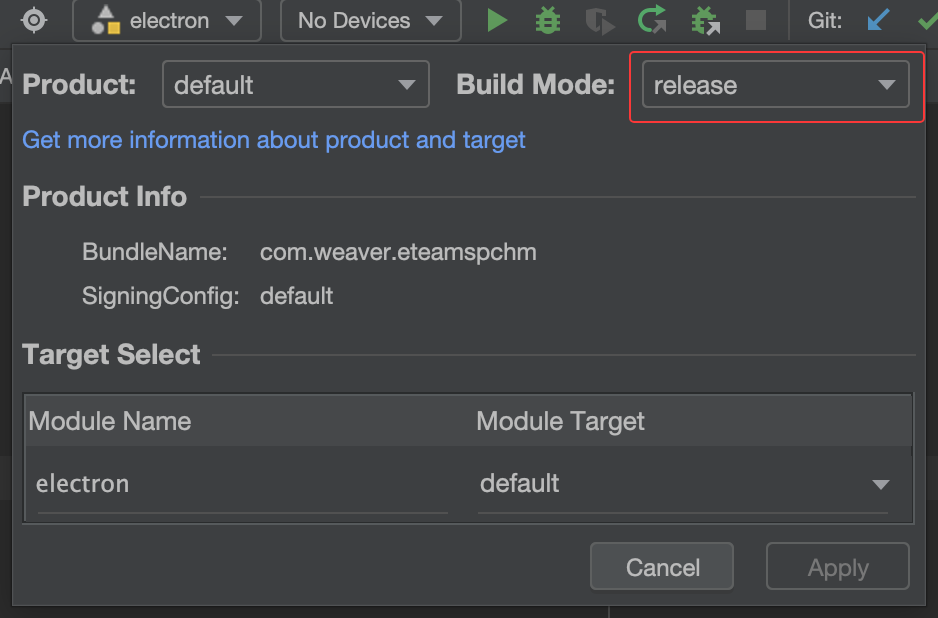

[TOC]

# electron 鸿蒙化开发

# 一、参考文档

> [Electron鸿蒙化指导文档](https://gitcode.com/openharmony-sig/electron/tree/master)
> [HarmonyOS Electron调用ets指导文档](https://gitcode.com/openharmony-sig/electron/tree/master/src/electron/docs/ohos)
> [Electron开发HarmonyOS应用问题集](https://developer.huawei.com/consumer/cn/forum/topic/0204203363319759021)
> [鸿蒙开发者联盟](https://developer.huawei.com/consumer/cn/develop/)
>
> [AppGallery Connect 选择“证书、APP ID和Profile”](https://developer.huawei.com/consumer/cn/service/josp/agc/index.html#/)
> [chromium_electron_dev_日构建](https://devcloud.cn-north-4.huaweicloud.com/cloudartifact/project/b19f5ea8ffd4492ea8c06ca2ebf3f858/private)
> [chromium_electron_release 日构建](https://devcloud.cn-north-4.huaweicloud.com/codehub/project/b19f5ea8ffd4492ea8c06ca2ebf3f858/codehub/2821214/home?ref=main)
>
> [纯血鸿蒙APP邀请测试操作参考指南](https://www.e-cology.com.cn/sp/doc/docDetail/1172852571152203778__targetId=1172852571152203778&fromWeappMsgGroupId=1773631416704000033&_isEm=1&_emGid=1773631416704000033&authModule=im&weappAuthStr=eyJtc2dpZCI6IjE3NzQ3ODU3MjcxMDgwODQwMDciLCJmbGFnIjoxLCJncm91cF9pZCI6IjE3NzM2MzE0MTY3MDQwMDAwMzMifQ==)
> [纯血鸿蒙定制APP发布方式](https://www.e-cology.com.cn/sp/doc/docDetail/1113124994905595994__targetId=1113124994905595994&fromWeappMsgGroupId=1773631416704000033&_isEm=1&_emGid=1773631416704000033&authModule=im&weappAuthStr=eyJtc2dpZCI6IjE3NzQ3ODU3MTMxMDgwODM5OTkiLCJmbGFnIjoxLCJncm91cF9pZCI6IjE3NzM2MzE0MTY3MDQwMDAwMzMifQ==)
>
> [向华为提ir问题工单](https://issuereporter.developer.huawei.com/my-created)

# 二、搭建项目

简单地来说，要发布一个鸿蒙版的electron客户端，基本步骤为：

```bash
1、下载 ohos_hap 鸿蒙框架
2、将 electron js 代码拷贝到ohos_hap/web_engine/src/main/resources/resfile/resources/app/下
3、通过 DevEco-studio 加载 ohos_hap 项目
4、通过 DevEco-studio 配置好签名证书
5、通过 DevEco-studio 运行程序进行调试
6、通过 DevEco-studio 生成release的 ohos_hap-default-signed.app 包
7、将 ohos_hap-default-signed.app 包上架到鸿蒙应用商店
```


## 1、鸿蒙化electron

详见文档：[Electron鸿蒙化指导文档](https://gitcode.com/openharmony-sig/electron/tree/master)

所谓鸿蒙化，就是将electron源代码编译成鸿蒙操作系统下可以运行的libelectron.so库文件。同理，如果客户端还依赖其他第三方库，如sqlite、libffmpeg、libpty等，也都要做鸿蒙化处理，分别编译成sqlite.node、libffmpeg.so、libpty.so，由此可被js调用。

另外，华为也提供了已经编译好的electron框架，称之为“日构建”，用户不需要自己对electron源码进行鸿蒙化了。


## 2、更新日构建

### 1. 下载日构建

[chromium_electron_dev_日构建](https://devcloud.cn-north-4.huaweicloud.com/cloudartifact/project/b19f5ea8ffd4492ea8c06ca2ebf3f858/private)
[chromium_electron_release 日构建](https://devcloud.cn-north-4.huaweicloud.com/codehub/project/b19f5ea8ffd4492ea8c06ca2ebf3f858/codehub/2821214/home?ref=main)


### 2. 日构建目录

下载下来的日构建目录，其主要文件结构如下：

```bash
libelectron-20241204.2
├── lib.unstripped # 日构建已经完成鸿蒙化的库，需要手动拷贝到 ohos_hap/electron/libs/arm64-v8a/ 下
│   ├── libadapter.so
│   └── libelectron.so
└── ohos_hap
    ├── .hvigor # 内有缓存，DevEco-Studio 运行前可删除，否则可能残余上一次打包的 bundleName
    ├── .idea # 内有缓存，DevEco-Studio 运行前可删
    ├── AppScope
    ├── build-profile.json5
    ├── build
    │   └── outputs
    │   		└── default
    │   				└── ohos_hap-default-signed.app  # 用于上架鸿蒙商店的app包
    ├── electron
    │   ├── build
    │   │		└──electron-default-signed.hap # 用于运行到鸿蒙真机上调试的包
    │   ├── build-profile.json5
    │   ├── hvigorfile.ts
    │   ├── libs
    │   │   └── arm64-v8a # 鸿蒙化的库，保存在此
		│   │   		├── libadapter.so
		│   │   		└── libelectron.so
    │   ├── oh-package.json5
    │   ├── oh_modules
    │   └── src
    ├── hvigor
    ├── hvigorfile.ts
    ├── oh-package.json5
    ├── oh_modules
    └── web_engine
        ├── BuildProfile.ets
        ├── Index.ets
        ├── build
        ├── build-profile.json5
        ├── childProcess.ets
        ├── consumer-rules.txt
        ├── hvigorfile.ts
        ├── obfuscation-rules.txt
        ├── oh-package-lock.json5
        ├── oh-package.json5
        ├── oh_modules
        └── src
            ├── main
            │   ├── cpp
            │   ├── ets
            │   ├── module.json5
            │   └── resources
            │       └── resfile
            │       			└── resources
            │          				└── app # 放置js文件的目录
            └── test
```


### 3. 个性化完善

* 1）替换鸿蒙化依赖库：
将日构建libelectron\lib.unstripped\目录下鸿蒙化后的文件，如libadapter.so、libelectron.so，手动拷贝到ohos_hap/electron/libs/arm64-v8a/下

* 2）加载 electron js 代码：

   将写好的js文件，放置在ohos_hap/web_engine/src/main/resources/resfile/resources/app/下

* 3）修改包名和版本号：

  ohos_hap/AppScope/app.json5

* 4）修改应用名称：
  ​	ohos_hap/AppScope/resources/base/element/string.json
  ​	ohos_hap/electron/src/main/resources/base/element/string.json
  ​	ohos_hap/electron/src/main/resources/en_US/element/string.json
  ​	ohos_hap//electron/src/main/resources/zh_CN/element/string.json

* 5）修改 logo：
  	ohos_hap/web_engine/src/main/resources/resfile/resources/app/media/logo_256.png
  	ohos_hap/AppScope/resources/base/media/app_icon.png
  	ohos_hap/AppScope/resources/base/media/product_logo_32.png
  	ohos_hap/AppScope/resources/base/media/startIcon.png

* 6）配置权限：

  ohos_hap/electron/oh_modules/web_engine/src/main/module.json5

  权限内容请看下节：3.生成证书 - 5 .p7b证书（Profile）


如此，便建立了一个完整的鸿蒙 electron 客户端项目。


## 3. 生成证书

所需证书包含如下：

```bash
.
├── eteams.csr         # DevEco-Studio - build - Generate Key & CSR本地生成
├── eteams.p12         # DevEco-Studio - build - Generate Key & CSR本地生成
├── eteams-debug.cer   # 调试证书
├── eteams-release.cer # 发布证书
├── eteamsDebug.p7b		 # 调试profile
└── eteamsRelease.p7b  # 发布profile
```


### 1 .p12 和 .csr 证书

​	打开 [DevEco-Studio](https://developer.huawei.com/consumer/cn/deveco-studio/)  - build - Generate Key & CSR，如图：



配置后，将在本地产生xxx.p12和xxx.csr两个文件。同时牢记当前设置的 Key Alias 和 Password，后面 DevEco-Studio 中配置的时候需要用到。


### 2 .cer证书（证书）

打开链接 [AppGallery Connect 选择“证书、APP ID和Profile” ](https://developer.huawei.com/consumer/cn/service/josp/agc/index.html#/)  , 如图：



点击新增证书，填入证书名称，选择上一步在本地生成的 xxx.p12 和 xxx.csr 两个文件，根据需要选择证书类型。证书类型分调试证书和发布证书，顾名思义，调试证书用于生成hap包，运行于鸿蒙真机；发布证书用于生成app包，上架鸿蒙应用商店。


### 3  创建应用（APP ID）

打开链接 [AppGallery Connect 选择“证书、APP ID和Profile” ](https://developer.huawei.com/consumer/cn/service/josp/agc/index.html#/)  , 如图：



新建应用，设置应用名称和包名，其中包名的命名规则为 com.xxx.xxx。记住包名，后续将要app.json配置中填写。

此外，若app上架，也可由此进入，点击对应app的“发布”按钮，进入发布审核页面。


### 4 .添加设备（设备）

打开链接 [AppGallery Connect 选择“证书、APP ID和Profile” ](https://developer.huawei.com/consumer/cn/service/josp/agc/index.html#/)  , 如图：



添加设备的目的是为了在指定的鸿蒙设备中运行app，故这里的UDID是鸿蒙设备（如鸿蒙笔记本）中的唯一标识码，可用命令“hdc shell bm get -u”获取。


### 5 .p7b证书（Profile）

打开链接 [AppGallery Connect 选择“证书、APP ID和Profile” ](https://developer.huawei.com/consumer/cn/service/josp/agc/index.html#/)  , 如图：



点击添加，将有下面几个选项：

* 1、选择应用名称：对应前面第3步“创建应用（APP ID）”的应用名称

* 2、设置profile名称

* 3、选择调试、发布类型：其中调试类型需要选择设备，对应前面第4步“添加设备（设备）”

* 4、选择受限ACL权限

  PC部分权限如下：

  ```bash
  ohos.permission.READ_WRITE_DOWNLOAD_DIRECTORY
  ohos.permission.READ_WRITE_DOCUMENTS_DIRECTORY
  ohos.permission.FILE_ACCESS_PERSIST
  ohos.permission.INTERCEPT_INPUT_EVENT
  ohos.permission.INPUT_MONITORING
  ohos.permission.READ_PASTEBOARD
  ohos.permission.READ_WRITE_DESKTOP_DIRECTORY
  ohos.permission.ACCESS_DDK_HID
  ohos.permission.ACCESS_DDK_USB
  ohos.permission.WRITE_IMAGEVIDEO
  ohos.permission.WRITE_CONTACTS
  ohos.permission.WRITE_AUDIO
  // <!-- ohos.permission.SYSTEM_FLOAT_WINDOW -->
  ohos.permission.READ_IMAGEVIDEO
  ohos.permission.READ_CONTACTS
  ohos.permission.READ_AUDIO
  ohos.permission.kernel.ALLOW_WRITABLE_CODE_MEMORY
  ohos.permission.kernel.DISABLE_CODE_MEMORY_PROTECTION
  
  # 以下权限为weapp Release版本所需申请：
  ohos.permission.FILE_ACCESS_PERSIST
  ohos.permission.READ_PASTEBOARD
  ohos.permission.READ_WRITE_DOWNLOAD_DIRECTORY
  ohos.permission.READ_WRITE_DOCUMENTS_DIRECTORY
  ohos.permission.READ_WRITE_DESKTOP_DIRECTORY
  
  # 申请理由
  应用名称：xxx    APPID：xxx
  申请权限：ohos.permission.READ_PASTEBOARD
  申请原因：pc设备应用，需要读取剪贴板权限
  申请权限：ohos.permission.FILE_ACCESS_PERSIST
  申请原因：pc设备应用，需要打开本地文件，故请允许应用支持持久化访问文件Uri权限
  申请权限：ohos.permission.READ_WRITE_DOWNLOAD_DIRECTORY
  申请原因：pc设备应用，需要下载文件、查看文件、打开下载目录，故请允许应用访问公共目录下Download目录及子目录权限
  申请权限：ohos.permission.READ_WRITE_DOCUMENTS_DIRECTORY
  申请原因：pc设备应用，需要访问文档文件夹，故请允许应用访问公共目录下的Documents目录及子目录权限
  申请权限：ohos.permission.READ_WRITE_DESKTOP_DIRECTORY
  申请原因：pc设备应用，需要访问桌面文件夹，故请允许应用访问公共目录下Desktop目录及子目录权限
  ```
  
  

## 4、调试运行

### 1. 导入ohos_hap

打开 [DevEco-Studio](https://developer.huawei.com/consumer/cn/deveco-studio/),将日构建目录ohos_hap拖入其中


### 2. 配置证书

打开  [DevEco-Studio](https://developer.huawei.com/consumer/cn/deveco-studio/)  - file - Project Structrue，如图：



依次填写p12证书，key（生成p12证书时的Key Alias）、签名密码（生成p12证书时的Password）、profile调试版（.p7b）、cer调试证书。


### 3. 开始运行



如图选择 debug 模式，选择连接设备，点击运行，此时可在鸿蒙设备中运行app；

同时在ohos_hap/electron/build/default/outputs/default/ 目录下，可看到生成了两个文件：electron-default-signed.hap 和 electron-default-unsigned.hap；

也可以将通过 hdc 命令 , 将 electron-default-signed.hap 手动安装到任意一个鸿蒙设备上，当然，前提是 [AppGallery Connect 选择“证书、APP ID和Profile” ](https://developer.huawei.com/consumer/cn/service/josp/agc/index.html#/) 已经添加了这个设备的UDID。hdc 命令如：

```bash
hdc install electron-default-signed.hap 
```


### 4. 经验技巧

* 清理缓存

  1、点击 DevEco-Studio 运行时，一定会执行build（亦可手动点击： DevEco-Studio - Build - Build Hap(s) & APP(s) - Build Hap(s)  ）；

  2、执行 build 之前，可预先清理缓存，操作 DevEco-Studio - Build - Clear Project；

  3、切换 app 重新点击运行，可能还残留上一个 app 的包信息，此时手动删除两个文件夹：

  weapp-em-desktop/harmony/ohos_hap/.hvigor，

  weapp-em-desktop/harmony/ohos_hap/.idea

  

* 卸载app

  证书更换后，在 DevEco-Studio 运行app可能冲突，此时优先将鸿蒙设备中的app卸载，再重新运行


## 5、打包发布

* 1、切换 release 模式

  如上图，发布时得选择 release模式；



* 2、配置发布证书

  打开  [DevEco-Studio](https://developer.huawei.com/consumer/cn/deveco-studio/)  - file - Project Structrue，配置发布证书，如图：


* 3、编译打包

  打开  [DevEco-Studio](https://developer.huawei.com/consumer/cn/deveco-studio/)  -  Build - Build Hap(s) & APP(s) - Build APP(s)；

  操作结束后，在 ohos_hap/build/outputs/default/ 目录下，将会生成两个文件：ohos_hap-default-signed.app 和 ohos_hap-default-unsigned.app；

  此时即可将 ohos_hap-default-signed.app 发布上架


## 6、APP上架

打开链接 [AppGallery Connect 选择“证书、APP ID和Profile” ](https://developer.huawei.com/consumer/cn/service/josp/agc/index.html#/)  , 如图：


选择对应的应用，点击“发布”，将 ohos_hap/build/outputs/default/ohos_hap-default-signed.app 上传，提交审核，即可上架。


## 7、公测验证

[鸿蒙HarmonyOS实战：通过华为应用市场上架测试版App实现HBuilder X打包的UniApp项目的app转hap教程（邀请码）方式教程详解](https://blog.csdn.net/weixin_66071584/article/details/143334337)

[提ir单](https://issuereporter.developer.huawei.com/my-created)

* 邀请测试
* 应用商店下载

# 三、electron调用ets

详见 [HarmonyOS Electron调用ets指导文档](https://gitcode.com/openharmony-sig/electron/tree/master/src/electron/docs/ohos)

## 1、依赖文件

```bash
.
├── aki # 见 https://gitee.com/openharmony-sig/aki.git
├── adapter
│   ├── CMakeLists.txt # target_link_libraries{ libaki_jsbind.so、libelectron.so }
│   ├── demo.cc # RegisterAdaptertestModule(){ getNativeContext(){ aki::JSBind::BindSymbols() } }
│   ├── getpath.cc # GetDir() { aki::JSBind::GetJSFunction("GetDir")->Invoke<std::string>() }
│   └── getpath.h # PathAdapter { GetDir(std::string& getDirFuncName) };
├── addon
│   ├── CMakeLists.txt # target_link_libraries( libadaptertest.so )
│   ├── hello.cc # PathAdapter::GetDir("GetDir");
│   ├── hello.js
│   └── package.json
└── libshim.a
```

在 Ubuntu 22.04 （磁盘200G+，内存32G+，x86_64）上，将上述文件编译成3个鸿蒙化的库： libaki_jsbind.so、libadaptertest.so、electron_addon.node。


## 2、项目集成

ohos_hap 引入libaki_jsbind.so、libadaptertest.so、electron_addon.node；

并新建 library 静态库，集成 libadaptertest.so；

之后在 electron js 中通过 require electron_addon.node 调用 ets 中的鸿蒙原生方法。

其涉及修改的目录结构如下：

```bash
ohos_hap
├── AppScope
├── hvigorfile.ts
├── oh-package.json5
├── electron
│   └── libs
│       └── arm64-v8a
│       		├── electron-addon.node # 供js调用: PathAdapter::GetDir("GetDir");
│       		├── libadaptertest.so		# 通过 getNativeContext 注册GetDir()
│       		└── libaki_jsbind.so		# aki 库
├── library
│   ├── Index.ets # 导出: xx/MainPage，xx/NativeTest - JsBindingTest
│   ├── libs
│   │   └── SangforSDK.har # 可引入第三方 har 包
│   ├── oh-package.json5  # 配置 'libadaptertest.so': 'file:xx/libadaptertest'
│   └── src
│       └── main
│       		├── cpp
│       		│   └── types
│       		│       └── libadaptertest
│       		│           ├── index.d.ts # 导出 export const getNativeContext: () => NativeContext;
│       		│           └── oh-package.json5 # 配置 libadaptertest.so
│       		├── ets
│       		│   ├── interface
│       		│   │   └── interface.ts # 声明 JSBind 和 NativeContext 接口
│       		│   └── utils
│       		│       └── NativeTest.ets # 4、绑定并实现JsBindingTest.currentContext.JSBind.bindFunction("getDir")
│       		├── module.json5
│       		└── resources
└── web_engine
    ├── oh-package.json5 # 3、引用共享包 "library": "file:../library"
    └── src
        └── main
            ├── cpp
            ├── ets
            │   └── application
            │   		└── WebAbilityStage.ets # 2、绑定：JsBindingMethod.bind(); JsBindingTest.bind();
            ├── module.json5
            └── resources
                └── resfile
                			└── resources
                   				└── app # 1、js文件：require('electron-addon.node').getDir()
```

## 3、核心原理

```bash
1、在 "electron js" 源码中引入 "electron-addon.node", 并调用 getDir() 方法
2、"electron-addon.node" 加载 "libadaptertest.so"，并调用 getDir() 方法
3、"libadaptertest.so" 通过 "libaki_jsbind.so" 与 鸿蒙"library" 绑定，从而调到 "library" 里的 getDir() 方法
4、"library" 中实现 getDir() 方法
5、getDir() 操作鸿蒙原生方法


以鸿蒙原生方法getDir()执行的流程为例，简化如下：
electron js -> electron-addon.node -> libadaptertest.so -> libaki_jsbind.so -> library -> ets
```


# 四、问题处理


## 1、sqlite3异常

 	替换成鸿蒙化的sqlite3

## 2、不支持“旧窗口-关闭-新窗口”

* 问题现象：如下代码报错

  ```tsx
  const mainWindow = new BrowserWindow；
  mainWindow.on('ready-to-show', () => {
  	mainWindow.close();
    const subWindow = new BrowserWindow;
  });
  ```

* 解决方案

  ```shell
  1、注释 processMode 及 startupVisibility 配置
  2、又因已支持托盘功能，以上注释取消
  ```

## 3、module: '@electron/remote' in paths

* 问题现象

  略

* 问题原因

  非root权限的鸿蒙系统，不支持创建子进程，即proc.spawn(...)失败，导致remote模块无法使用。

* 解决方案

  ```shell
  1.替换支持proc.spawn的机器或系统
  2.node_modules增加@electron
  ```


## 4、防止webpack修改electron

```js
// 方法一:
__non_webpack_require__('electron')

// 方法二(推荐)：修改配置 webpack.config.base.js
module.exports = {
  externals: [{
    'electron': 'commonjs electron',
  }],
};
```


# 五、实用技巧

## 1、hdc命令
工具链目录：Applications/DevEco-Studio.app/Contents/sdk/default/openharmony/toolchains

  ```bash
# SN：
$./hdc list targets

# UUID：
$./hdc shell bm get -u

# 安装：
$./hdc install weapp-em-desktop/harmony/ohos_hap/product/pc/build/default/outputs/default/pc_entry-default-signed.hap
  ```
