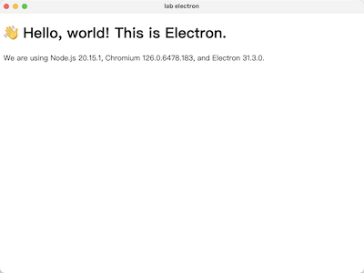

[TOC]

# electron 快速入门指南


**electron 学习资料**
1、[官网](https://www.electronjs.org/)
2、[Electron社区](https://www.electronjs.org/zh/docs/latest/)
3、[electron中文教程](https://www.bookstack.cn/read/electron-zh/guide.md)


## 一、electron 简介


## 二、electron 环境搭建

### 1、项目示例

* 目录结构

  ```shell
  .lab-electron
  ├── .forge
  │   └── config.js
  ├── doc
  │   └── readme.md
  ├── package.json
  ├── src
  │   ├── index.html
  │   ├── main.js
  │   └── reload.js
  └── yarn.lock
  ```

* 运行示例




### 2、搭建命令

```shell
#1、检查并安装node.js, 参考：《../web开发环境完全搭建指南》
$ node -v
$ npm -v

#2、使用脚手架,创建应用程序
$ mkdir lab-electron && cd lab-electron
$ npm init 或 $ yarn init

-- 执行命令后，将生成package.json文件如下：
{
  "name": "lab-electron",
  "version": "1.0.0",
  "description": "electron 实验室",
  "main": "main.js",
  "author": "Jevstein",
  "license": "MIT"
}

#3、安装electron包，增加到应用的开发依赖中
$ npm install --save-dev electron 或 
$ yarn add --dev electron

-- 查看electron版本
$ electron -v

#4、预执行Electron, 在package.json文件增加如下：
{
  "scripts": {
    "start": "electron ."
  }
}

#5、创建main.js、index.html等文件
-- 见下文文件
-- 附加：
-- 1、添加预加载：preload.js
-- 2、vscode 调试: .vscode/launch.json

#6、启动
$ npm start 
或 $ yarn start 
或 $ electron .

#7、打包发布： https://www.electronforge.io/
-- 1.Add a description to your package.json file, otherwise rpmbuild will fail. Blank description are not valid.
	To build an RPM package for Linux, you will need to install its required system dependencies：https://www.electronforge.io/config/makers/rpm

-- 2.安装electron-forge
$ npm install --save-dev @electron-forge/cli 或
$ yarn add --dev @electron-forge/cli

-- 3.打包
$ npx electron-forge package 或
$ yarn package

```


### 3、预加载

​	通过预加载脚本从渲染器访问Node.js。仔细观察index.html文本中，您会发现主体文本中丢失了版本编号。 现在，将使用 JavaScript 动态插入它们，最后要做的是输出Electron的版本号和它的依赖项到你的web页面上。

​	在主进程通过Node的全局 `process` 对象访问这个信息是微不足道的。 然而，你不能直接在主进程中编辑DOM，因为它无法访问渲染器 `文档` 上下文。 它们存在于完全不同的进程（您需要更深入地了解Electron进程，请参阅 [进程模型](https://www.electronjs.org/zh/docs/latest/tutorial/process-model) 文档）！

​	这是将 **预加载** 脚本连接到渲染器时派上用场的地方。 预加载脚本在渲染器进程加载之前加载，并有权访问两个 渲染器全局 (例如 `window` 和 `document`) 和 Node.js 环境。

* 1、创建`preload.js` 的新脚本

  ```javascript
  // 所有的 Node.js API接口 都可以在 preload 进程中被调用.
  // 它拥有与Chrome扩展一样的沙盒。
  window.addEventListener('DOMContentLoaded', () => {
    const replaceText = (selector, text) => {
      const element = document.getElementById(selector)
      if (element) element.innerText = text
    }
  
    for (const dependency of ['chrome', 'node', 'electron']) {
      replaceText(`${dependency}-version`, process.versions[dependency])
    }
  })
  ```
  
  
  
* 2、在现有的 `BrowserWindow` 构造器中，将路径中的预加载脚本传入 `webPreferences.preload` 选项

  ```javascript
  const { app, BrowserWindow } = require('electron')
  // 在你文件顶部导入 Node.js 的 path 模块
  const path = require('node:path')
  
  // 修改已有的 createWindow() 方法
  const createWindow = () => {
    const win = new BrowserWindow({
      width: 800,
      height: 600,
      webPreferences: {
        preload: path.join(__dirname, 'preload.js')
      }
    })
  
    win.loadFile('index.html')
  }
  // ...
  ```

  

* 3、由于渲染器运行在正常的 Web 环境中，因此需在 `index.html` 文件关闭 `</body>` 标签之前添加一个 `<script>` 标签，来包括您想要的任意脚本：

  ```html
  <script src="./renderer.js"></script>
  ```

  

### 4、项目文件

#### 1） index.html

```html
<!DOCTYPE html>
<html>
  <head>
    <meta charset="UTF-8" />
    <meta http-equiv="Content-Security-Policy" content="script-src 'self' 'unsafe-inline';" />
    <meta http-equiv="Content-Security-Policy" content="default-src 'self'; script-src 'self'" />
    <meta http-equiv="X-Content-Security-Policy" content="default-src 'self'; script-src 'self'" />
    <title>lab electron</title>
  </head>
  <body>
    <h1>👋 Hello, world! This is Electron.</h1>
    We are using Node.js <span id="node-version"></span>,
    Chromium <span id="chrome-version"></span>,
    and Electron <span id="electron-version"></span>.
  </body>
  <script src="./renderer.js"></script>
</html>
```


####  2） main.js

```javascript
/**
 * @created : 2024/07/25
 * @author  : Jevstein
 * @version : 1.0
 * @desc    : electron 入口文件，两个核心模块：
 *            1、app - 用于控制应用程序的事件生命周期
 *            2、BrowserWindow - 用于创建和管理应用程序窗口
 * @history :
 *  - 2024/07/25 Jevstein 创建
 */

// electron 模块可以用来控制应用的生命周期和创建原生浏览窗口
const { app, BrowserWindow } = require('electron/main')

/**
 * 创建浏览器窗口: 
 * 将index.html或url，加载进一个新的BrowserWindow实例
 * @param 
 * @returns
 */
const createWindow = () => {
  // 导入 Node.js 的 path 模块
  const path = require('node:path')

  const win = new BrowserWindow({
    width: 1800,
    height: 1600,
    webPreferences: {
      preload: path.join(__dirname, 'preload.js')
    }
  })

  // 加载文件
  win.loadFile('./src/index.html')

  // 打开浏览器页面开发调试工具
  win.webContents.openDevTools()
}

/**
 * 在 Electron 中，只有在 app 模块的 ready 事件被激发后才能创建浏览器窗口。 可以通过使用 app.whenReady() API来监听此事件
 */
app.whenReady().then(() => {
  createWindow()

  // 在 macOS 系统内, 如果没有已开启的应用窗口
  // 点击托盘图标时通常会重新创建一个新窗口
  app.on('activate', () => {
    if (BrowserWindow.getAllWindows().length === 0) {// 没有已打开的窗口
      createWindow()
    }
  })
})

/**
 * 当所有窗口都被关闭时，退出应用程序
 */
app.on('window-all-closed', () => {
  // 在 macOS X 上，通常用户在明确地按下 Cmd + Q 之前，应用会保持活动状态
  if (process.platform !== 'darwin') {
    app.quit()
  }
})
```


#### 	3） preload.js

```javascript
// 所有的 Node.js API接口 都可以在 preload 进程中被调用.
// 它拥有与Chrome扩展一样的沙盒。
window.addEventListener('DOMContentLoaded', () => {
  const replaceText = (selector, text) => {
    const element = document.getElementById(selector)
    if (element) element.innerText = text
  }

  for (const dependency of ['chrome', 'node', 'electron']) {
    replaceText(`${dependency}-version`, process.versions[dependency])
  }
})
```


#### 	4）.forge/config.js

```javascript
module.exports = {
  packagerConfig: {
    // 配置打包选项，例如应用程序名称、版本等
  },
  makers: [
    {
      name: '@electron-forge/maker-deb', // 为Linux生成.deb包
      config: {}
    },
    {
      name: '@electron-forge/maker-rpm', // 为Linux生成.rpm包
      config: {}
    },
    {
      name: '@electron-forge/maker-dmg', // 为macOS生成.dmg包
      config: {}
    },
    {
      name: '@electron-forge/maker-zip', // 为所有平台生成.zip包
      config: {}
    },
    {
      name: '@electron-forge/maker-exe', // 为Windows生成.exe安装程序
      config: {}
    }
  ]
};
```


#### 5）.vscode/launch.json

```json
{
  "version": "0.2.0",
  "compounds": [
    {
      "name": "Main + renderer",
      "configurations": ["Main", "Renderer"],
      "stopAll": true
    }
  ],
  "configurations": [
    {
      "name": "Renderer",
      "port": 9222,
      "request": "attach",
      "type": "chrome",
      "webRoot": "${workspaceFolder}"
    },
    {
      "name": "Main",
      "type": "node",
      "request": "launch",
      "cwd": "${workspaceFolder}",
      "runtimeExecutable": "${workspaceFolder}/node_modules/.bin/electron",
      "windows": {
        "runtimeExecutable": "${workspaceFolder}/node_modules/.bin/electron.cmd"
      },
      "args": [".", "--remote-debugging-port=9222"],
      "outputCapture": "std",
      "console": "integratedTerminal"
    }
  ]
}
```


### 5、代码调试

#### 1. 浏览器页面开发调试

```javascript
const win = new BrowserWindow(...)
win.webContents.openDevTools()
```


#### 2. Electron 调试

```shell
$ electron --inspect=9229 your/app：	Electron将监听指定port上的V8调试协议消息，外部调试器需要连接到此端口上。 port 默认为 9229
$ electron --inspect-brk=[port]：	和--inspector 一样，但是会在JavaScript 脚本的第一行暂停运行
```


#### 3.vscode 调试

详见：[virsual studio code](https://code.visualstudio.com/docs/editor/debugging)

##### 1）调试web前端项目

```shell
# 1.可利用electron-quick-start项目做尝试
$ git clone git@github.com:electron/electron-quick-start.git
$ code electron-quick-start

# 2.添加文件: .vscode/launch.json
{
  "version": "0.2.0",
  "configurations": [
    {
      "name": "Debug Main Process",
      "type": "node",
      "request": "launch",
      "cwd": "${workspaceFolder}",
      "runtimeExecutable": "${workspaceFolder}/node_modules/.bin/electron",
      "windows": {
        "runtimeExecutable": "${workspaceFolder}/node_modules/.bin/electron.cmd"
      },
      "args" : ["."]
    }
  ]
}

# 3.断点调试
	在 main.js 中设置一些断点，参考调试视图(https://code.visualstudio.com/docs/editor/debugging) ，开始调试. 便能点击断点。
	这是一个预先配置好了的项目，可下载并直接在 VSCode 中调试：https://github.com/octref/vscode-electron-debug/tree/master/electron-quick-start
```


##### 2）调试 electron 

​	如果您想从源代码构建 Electron 并修改 native Electron 代码库，本节将帮助您测试您的修改。对于那些不确定在哪里获得代码或如何构建它， [Electron 的构建工具](https://github.com/electron/build-tools) 自动化并解释此过程的大部分。 如果你想手动设置环境，你可以使用这些 [构建指令](https://www.electronjs.org/zh/docs/latest/development/build-instructions-gn)。

​	**重新配置.vscode/launch.json**

```shell
{
  "version": "0.2.0",
  "configurations": [
    {
      "name": "(Windows) Launch",
      "type": "cppvsdbg",
      "request": "launch",
      "program": "${workspaceFolder}\\out\\your-executable-location\\electron.exe",
      "args": ["your-electron-project-path"],
      "stopAtEntry": false,
      "cwd": "${workspaceFolder}",
      "environment": [
          {"name": "ELECTRON_ENABLE_LOGGING", "value": "true"},
          {"name": "ELECTRON_ENABLE_STACK_DUMPING", "value": "true"},
          {"name": "ELECTRON_RUN_AS_NODE", "value": ""},
      ],
      "externalConsole": false,
      "sourceFileMap": {
          "o:\\": "${workspaceFolder}",
      },
    },
  ]
}
```

​	**配置说明**

- `cppvsdbg` 需要启用 [内置的 C/C++ 扩展](https://marketplace.visualstudio.com/items?itemName=ms-vscode.cpptools)。

- `${workspaceFolder}` 是 Chromium 的 `源` 的完整路径。

- your-executable-location

  将是以下几项之一：

  - `Testing`：如果您使用的是默认的 [Electron 构建工具](https://github.com/electron/build-tools) 设置，或默认的 [从源端构建](https://www.electronjs.org/zh/docs/latest/development/build-instructions-gn#building) 的设置。
  - `Release`：如果你构建了一个发布版本，而不是测试版本。
  - `your-directory-name`：如果你在构建过程中修改， 这将是你指定的。

- `args` 数组字符串 `"your electron-project-path"` 应为您正在用于测试的 Electron 项目或 `main.js` 的绝对路径。 在本示例中，它应该是您的 `electron-quick-start` 的路径。


### 6、打包发布

[如何打包 electron 程序：electron-forge 的使用教程](https://blog.csdn.net/KimBing/article/details/119080158)

[Electron Forge](https://www.electronforge.io/)

[electron-builder 打包配置](https://blog.csdn.net/liyu_ya/article/details/135282663)


## 三、electron 开发应用

### 1、ipc交互

[大概是全网最详细的Electron ipc 讲解(一)——主进程与渲染进程的两情相悦](https://blog.csdn.net/qq_39448719/article/details/123081213)

[Electron的ipcMain.handle与ipcMain.on](https://juejin.cn/post/7415806520443600923)


### 2、多tab的标签页浏览窗口

[「桌面端」Electron 你不知道的 BrowserView](https://juejin.cn/post/7260030417461346361)


### 3、sqlite操作

[Electron中的数据库操作如何实现](https://www.yisu.com/jc/840049.html)


>巨人的肩膀：
>[深入理解Electron（一）Electron架构介绍](https://zhuanlan.zhihu.com/p/604169213)
>[深入理解Electron系列](https://www.zhihu.com/column/c_1606275988706549760)
>[Electron简介及快速入门](https://zhuanlan.zhihu.com/p/661319459)
>[第九讲使用VSCODE调试Electron程序](https://blog.csdn.net/fwj380891124/article/details/119796450)
