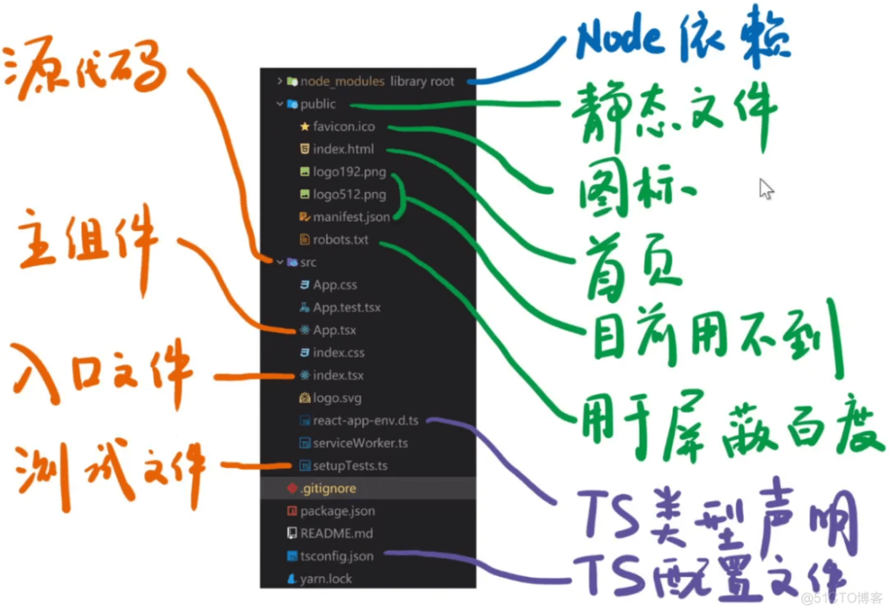

[TOC]

# react入门指南

[react学习](https://react.docschina.org/learn)

[react的tsx有组织架构类似的组件吗 ts写react](https://blog.51cto.com/u_14402/8884718)


## 创建项目

```shell
// 1. 全局安装 create-react-app
yarn global add create-react-app

// 2. 创建支持 TS 语法的 React 应用
create-react-app my-app --template typescript
```

**目录结构**




> 参考：
>
> [tsconfig.json 指南](https://www.cnblogs.com/pingan8787/p/13069339.html)
>
> $ npx tsc -p src

