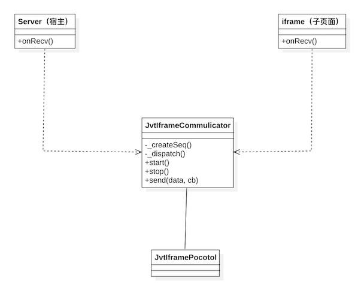

[TOC]

# web入门指南


## 一、基础介绍

```html
<!DOCTYPE html>
<html>
	<!-- 1、头部定义 -->
  <head>
    <!-- meta元素提供的信息是用户不可见的，它不显示在页面中，一般用来定义页面信息的名称、关键字、作者等。
      而在一个html头页面中可以有多个meta元素。meta元素的属性有两种：name和tttp-equiv -->
    <meta http-equiv="Content-Type" content="text/html; charset=utf-8">
    <meta http-equiv="X-UA-Compatible" content="IE=edge,chrome=1">
    <meta name="viewport" content="width=device-width,initial-scale=1,user-scalable=no">
    <meta name="apple-mobile-web-app-capable" content="yes">
    <meta name="apple-touch-fullscreen" content="yes">
    <meta name="format-detection" content="telephone=no,address=no">
    <meta name="apple-mobile-web-app-status-bar-style" content="white">
    <title>web研究院</title>
    <!-- <link href="css/style" rel="stylesheet" type="text/css" /> -->
    <!-- 2、引入css外部样式表 -->
    <style type="text/css">
      html,
      body {
        width: 100%;
        height: calc(100% - 1px);
        margin: 0;
        display: flex;
        justify-content: start;
        overflow: hidden;
      }
    </style>
  </head>
	<!-- 3、body定义 -->
  <body>
    <div class="weblab-dir">
      入门指南
    </div>
    
		<!-- 4、JavaScript -->
    <script>
      function main() {
        alert('hello world!')
      }

      this.main();
    </script>
  </body>
</html>
```


## 二、环境搭建

详见 [web开发环境完全搭建指南](./web开发环境完全搭建指南.md)


## 三、常见框架

react、vue、jQuery、taro等


## 四、基础知识

### 1、浏览器原理

[现代浏览器内部工作原理（附详细流程图）](http://www.51testing.com/html/16/n-4457716.html)
[深入理解浏览器工作原理 - 小火柴的蓝色理想 - 博客园 (cnblogs.com)](https://www.cnblogs.com/xiaohuochai/p/9174471.html)
[⑤浏览器的工作原理（上） - 简书 (jianshu.com)](https://www.jianshu.com/p/4de8a9f4cf5a?utm_campaign=maleskine&utm_content=note&utm_medium=seo_notes&utm_source=recommendation)


### 2、调试技巧

[前端chrome浏览器调试总结](https://www.cnblogs.com/soyxiaobi/p/9598761.html)
[sourcemap-全网最优雅的 React 源码调试方式](https://zhuanlan.zhihu.com/p/548297074)


### 3、日志打印

```js
console.groupCollapsed(this.prefix, (new Date()).toLocaleString(), ...args);
console.trace(); // hidden in collapsed group
console.groupEnd();
```

自定义输出样式 - console.log() 和 console.error() 支持在输出的内容前添加样式，例如文本颜色、背景颜色和字体加粗等。
console.log("%cThis is a styled message!", "color: red; background-color: yellow; font-weight: bold;");
这些是console对象的高级用法，可以让我们更方便地调试和输出信息。


[javascript日志打印6个方法](https://baijiahao.baidu.com/s?id=1680120408559571060&wfr=spider&for=pc)


### 4、iframe


#### 1、iframe用法


#### 2、iframe交互

​	通过postmessage、onmessage等方式实现页面间的交互

##### 1）核心操作

###### ① 宿主页面

```html
<!DOCTYPE html>
<html>
<head>
  <meta http-equiv="Content-Type" content="text/html; charset=utf-8">
  <meta http-equiv="X-UA-Compatible" content="IE=edge,chrome=1">
  <meta name="viewport" content="width=device-width,initial-scale=1,user-scalable=no">
  <meta name="apple-mobile-web-app-capable" content="yes">
  <meta name="apple-touch-fullscreen" content="yes">
  <meta name="format-detection" content="telephone=no,address=no">
  <meta name="apple-mobile-web-app-status-bar-style" content="white">
  <title>iframe宿主-demo</title>
</head>
<body>
  <div class='weblab-iframe'>
    <iframe id='id-weblab-iframe' name="top" frameborder="0" scrolling="yes"></iframe>
  </div>
  <script>
    const target = document.querySelector('.id-weblab-iframe') // iframe对象
    // 监听消息：只接受指定域名下的消息
    window.addEventListener('message', (event) => {
      console.log('【宿主】收到数据: ', event.data)
      switch (event.data.type) {
        case 'IFRAME_TYPE_SIMPLE': { 
          	const data = {
             	...event.data,
             	data: 'great!'
          	}
      			console.log('【宿主】发送数据: ', data)
          	// 回传：发送回复消息
          	target?.contentWindow?.postMessage(data, '*')
        } break;
        default:
        break;
      }
   }, false)
  </script>
</body>

</html>
```

###### ② iframe子页面

```html
<!DOCTYPE html>
<html>
<head>
  <meta http-equiv="Content-Type" content="text/html; charset=utf-8">
  <meta http-equiv="X-UA-Compatible" content="IE=edge,chrome=1">
  <meta name="viewport" content="width=device-width,initial-scale=1,user-scalable=no">
  <meta name="apple-mobile-web-app-capable" content="yes">
  <meta name="apple-touch-fullscreen" content="yes">
  <meta name="format-detection" content="telephone=no,address=no">
  <meta name="apple-mobile-web-app-status-bar-style" content="white">
  <title>iframe子页面-client</title>
</head>
<body>
  <div class='weblab-iframe'>
    <button onclick="handleClickTest(event)">发送-接收消息</button>
  </div>
  <script>
    // 发送消息
    function handleClickTest(event) {
        const data = {
        	type: 'IFRAME_TYPE_SIMPLE',
        	data: 'hello, I am an iframe!'
      	}
      	console.log('【iframe】主动发送数据: ', data)
      	window.parent.postMessage(data, '*');
    }
    
    // 监听消息：只接受指定域名下的消息
    window.addEventListener('message', (event) => {
      console.log('【iframe】收到数据: ', event.data)
   }, false)
  </script>
</body>

</html>
```


##### 2）工程实践

​	任何系统或第三方的方法，都不建议在业务层直接调用，而良好的行为是将其封装一层，目的是更加工程化、模块化。可以在这一层中很好地处理方法异常、以及版本升级带来的api影响（命名不一致、处理方法发送变化）。有了这一层，就可以在不用修改业务的前提下，兼容或适配好系统的变化。

   JvtIframeCommunicator便是为封装iframe交互而生！

###### 1、面向协议

​	封装一个JvtIframeCommunicator类，里面实现postmessage、onmessage等的基本操作，对外则暴露send、onRecv等核心业务交互接口。宿主和iframe页面约定好协议，通过JvtIframeCommunicator对象完成交互。

```shell
#1.首先，宿主和iframe页面约定好协议，如发送ping数据：
const data = {
	req: 'xxx', // 流水号
	type: 10000,
	data: 'ping'
}

#2.iframe页面，点击按钮，通过JvtIframeCommunicator.send发送ping数据：
	this.communicator.send(data, (res) => alert(res.data)) 或
  const res = await this.communicator.exec(data）
  alert(res.data)
  
#3.宿主页面，通过JvtIframeCommunicator.onRecv监听到数据，判断下data.type为10000，确定是ping数据。于是回应一个pong数据：
  this.communicator.send({
    ...data
    data: 'pong'
  })
```

如图：



###### 2、面向接口

​	核心依旧是JvtIframeCommunicator类，但将协议换成了api方法，使得业务层在调用对方数据时，像本地调用api过程一样简单。如何将api和协议对应起来呢？这里巧妙地将函数名转成type，函数名即消息类型，这样就避免了定义一系列看似无效的协议类型。而将函数名转成type的关键方法在于：

```javascript
(new Error)*?.stack?.match?.(/at\s+(.*)\s+\(/)?.[1]?.split('.')?.pop();
```
 	如此，增加了JvtIframeApi类，里面定义了宿主和iframe交互的所有api接口。同时，从该类派生出JvtIframeCaller、JvtIframeReceiver类，分别被调用方和接收方实现，完成发送和响应的业务功能。

```shell
-- 比如有JvtIframeApi类，实现ping方法
JvtIframeApi {
 	ping() {...}
}

#1.iframe页面，从JvtIframeApi中派生出JvtIframeCaller类，在该类的ping()方法中，调用JvtIframeCommunicator.send操作，完成点击按钮发送ping数据的功能

#2.宿主页面，从JvtIframeApi中派生出JvtIframeReceiver类，在该类的ping()方法中，调用JvtIframeCommunicator.send操作，完成发送pong数据的功能

#3.JvtIframeReceiver对象绑定到JvtIframeCommunicator对象中，这样，JvtIframeCommunicator才能将监听到的数据传递给JvtIframeReceiver

#4.如果要实现双向通信，每一方都要定义JvtIframeCommunicator对象，并同时与JvtIframeCaller和JvtIframeReceiver对象做好绑定。
```

如图：


###### 3、示例文件

* **① communicator.js**

  ```javascript
  /**
   * @created : 2024/08/04
   * @author  : Jevstein
   * @desc    : iframe-communicator - 用于iframe之间通信的消息交互器
   */
  
  class JvtIframeCommunicator {
    _name = '';         // iframe名称
    _target = null;     // 目标iframe
    _receiver = null;   // 接收方对象-JvtIframeReceiver
    _onRecv = null;     // 接收消息回调函数
  
    _seq = 0;           // 用于生成序列号
    _map = new Map();   // 用于存储回调函数
  
    constructor(props) {
      const {
        name = 'iframe-server',
        target = document.getElementById('id-weblab-iframe').contentWindow,
        onRecv = null,
        receiver = null,
      } = props;
  
      this._name = name;
      this._target = target;
      this._receiver = receiver;
      this._onRecv = onRecv;
  
      this.start();
    }
  
    /**
     * 生成序列号
     * @returns {string} : 序列号
     */
    _createSeq = () => {
      if (this._seq >= 9007199254740992) {
        this._seq = 0;
      }
      return `${this._name}_${++this._seq}_${new Date().getTime()}`;
    }
  
    /**
     * 消息分发器
     * @param {*} event 
     */
    _dispatch = (event) => {
      console.log(`[${this._name}] recv:`, event.data);
  
      if (event.data.seq && this._map.has(event.data.seq)) {
        const cb = this._map.get(event.data.seq);
        cb && cb(event.data);
        this._map.delete(event.data.seq);
        return;
      }
  
      this._onRecv && this._onRecv(event.data);
  
      if (this._receiver) {
        const func = this._receiver[event.data.type];
        if (func) {
          func(event.data);
        } else{
          this._receiver.onRecv?.(event.data);
        }
      }
    }
  
    /**
     * 发送消息
     * @param {*} data : 消息数据, 必须满足./protocol.js中的IframeData格式
     * @param {*} cb :回调函数, 接收消息的响应数据
     */
    send = (data, cb = null) => {
      if (!data.seq) {
        data.seq = this._createSeq();
      }
  
      console.log(`[${this._name}] send:`, data);
      this._target?.postMessage(data, '*');
  
      if (cb) {
        this._map.set(data.seq, cb);
      }
    }
  
    /**
     * 发送消息并等待响应
     * @param {*} data 
     * @returns 
     */
    exec = async (data, timeout = 5000) => {
      return new Promise((resolve, reject) => {
        const timer = setTimeout(() => {
          clearTimeout(timer);
  
          if (data.seq && this._map.has(data.seq)) {
            this._map.delete(data.seq);
          }
  
          const err = `timeout(${data?.type}): The other party did not respond to the request！`
          reject(err);
        }, timeout);
  
        this.send(data, (res) => {
          clearTimeout(timer);
          resolve(res);
        });
      });
    }
  
    /**
     * 开始监听消息: 只接受指定域名下的消息
     */
    start = () => {
      window.addEventListener('message', this._dispatch);
    }
  
    /**
     * 停止监听消息
     */
    stop = () => {
      window.removeEventListener('message', this._dispatch);
    }
  }
  ```

  

* **②protocol.js**

  ```js
  
  /**
   * @created : 2024/08/04
   * @author  : Jevstein
   * @version : 1.0.0
   * @desc    : iframe-protocol - 消息协议
   *  其中，iframe交互的数据格式，定义如下：
   *  {
   *    seq: '0',                // 序列号（流水号）：默认不传，由JvtIframeCommunicator内部生成
   *    type: IFRAME_TYPE_PING,  // 消息类型
   *    data: xxx,               // 消息内容
   *  }
   */
  
  // 消息类型
  const IFRAME_TYPE_PING                  = 10000; // iframe 回传
  
  // ------------------------------- API 调用方式 -------------------------------     
  
  // 接口方法
  class JvtIframeApi {
    _communicator = null; // JvtIframeCommunicator
  
    constructor(props) {
      this.bind(props);
    }
  
    bind = (props) => {
      if (!props) {
        return;
      }
  
      const { communicator } = props;
      this._communicator = communicator;
    }
  
    onRecv = (data) => {
      console.error('JvtIframeApi.onRecv:', data);
    }
  
    _send = (data, cb) => {
      if (!this._communicator) {
        console.error('JvtIframeApi._send: communicator is not defined');
        return;
      }
  
      return this._communicator.send(data, cb);
    }
  
    _exec = async (data, timeout) => {
      if (!this._communicator) {
        console.error('JvtIframeApi._exec: communicator is not defined');
        return;
      }
  
      return await this._communicator.exec(data, timeout);
    }
  
    _getType = (error) => {
      return error?.stack?.match?.(/at\s+(.*)\s+\(/)?.[1]?.split('.')?.pop();
    }
  
    // ------------------------------- API ------------------------------- 
  
    /**
     * ping 方法
     * @param {*} data {
     *    no: '123',
     * }
     * @returns {*} {
     *    name: 'xxx',
     *    age: 18,
     * }
     */
    ping = (data) => {
      return {};
    }     
  }
  
  // 接口方法 - 调用方
  class JvtIframeCaller extends JvtIframeApi {
    constructor(props) {
      super(props);
    }
  
    ping = async (data) => {
      const type = this._getType(new Error());
      return await this._exec({type, data});
    }
  }
  
  // 接口方法 - 接收方
  class JvtIframeReceiver extends JvtIframeApi {
    constructor(props) {
      super(props);
    }
  
    ping = (data) => {
      this._send({
        ...data,
        data: "pong"
      });
    }
  }
  ```

  

* ③ 宿主页面

  ```html
  <!DOCTYPE html>
  <html>
  <head>
    <!-- meta元素提供的信息是用户不可见的，它不显示在页面中，一般用来定义页面信息的名称、关键字、作者等。
      而在一个html头页面中可以有多个meta元素。meta元素的属性有两种：name和tttp-equiv -->
    <meta http-equiv="Content-Type" content="text/html; charset=utf-8">
    <meta http-equiv="X-UA-Compatible" content="IE=edge,chrome=1">
    <meta name="viewport" content="width=device-width,initial-scale=1,user-scalable=no">
    <meta name="apple-mobile-web-app-capable" content="yes">
    <meta name="apple-touch-fullscreen" content="yes">
    <meta name="format-detection" content="telephone=no,address=no">
    <meta name="apple-mobile-web-app-status-bar-style" content="white">
    <title>web研究院</title>
  </head>
  <body>
    <div class="weblab-page" style="height: 100%">
      <div class='weblab-iframe'>
        <iframe id='id-weblab-iframe' name="top" frameborder="0" scrolling="yes"></iframe>
      </div>
    </div>
    <script src="./base/iframe/communicator.js"></script>
    <script src="./base/iframe/protocol.js"></script>
    <script>
  
      function createIframeCommunicator(electrionCommunicator) {
        const iframeCaller = new JvtIframeCaller();
        const iframeReceiver = new JvtIframeReceiver();
        const communicator = new JvtIframeCommunicator({
          name: 'iframe-server',
          target: document.getElementById('id-weblab-iframe').contentWindow,
          receiver: iframeReceiver,
          onRecv: (data) => {
            // console.log('[main] recv:', message);
  
            if (data.type === IFRAME_TYPE_PING) {
              return communicator.send({
                ...data,
                data: 'pong from host!'
              });
            }
          }
        });
        
        iframeCaller.bind({communicator});
        iframeReceiver.bind({communicator});
        return {
          iframeCaller,
          communicator
        };
      }
  
      function main() {
        const electronDemo = new ElectronApiDemo();
        const data = this.createIframeCommunicator(electronDemo);
        electronDemo.bind(data);
      }
  
      this.main();
  
    </script>
  </body>
  
  </html>
  ```

  

* ④ iframe子页面

  ```html
  <!DOCTYPE html>
  <html>
  <head>
    <meta charset="UTF-8" />
    <title>基础指南</title>
  </head>
  <body text="blue">
    <div class="body">
      <div class="box iframe-test">
        <div class="box-title"><b>iframe交互</b></div>
        <div class="box-subtitle">
          <p>
            iframe嵌入页面，通过postmessage、onmessage等方式实现页面间的交互
            </br> 可打开控制台，查看详细交互过程...
        </p>
        </div>
        <div class="area">
          <button onclick="handleClickIframeSend(event)">send (异步)</button>
          <button onclick="handleClickIframeExec(event)">exec (同步)</button>
          <button onclick="handleClickIframePing(event)">api (ping)</button>
        </div>
      </div>
    </div>
    <script src="../../../base/iframe/communicator.js"></script>
    <script src="../../../base/iframe/protocol.js"></script>
    <script>
      _iframeCommunicator = null;
      _iframeCaller = null;
      _iframeReceiver = null;
  
      function handleClickIframeSend(event) {
        this._iframeCommunicator?.send({
          type: IFRAME_TYPE_PING,
          data: 'ping from iframe(send)!'
        }, (data) => {
          // console.log('[child] get response:', data);
          alert(`response - ${data.data}`);
        });
      }
  
      async function handleClickIframeExec(event) {
        const data = await this._iframeCommunicator?.exec({
          type: IFRAME_TYPE_PING,
          data: 'ping from iframe(exec)!'
        });
        alert(`exec - ${data.data}`);
      }
  
      async function handleClickIframePing(event) {
        try {
          const data = await this._iframeCaller?.ping('ping from iframe(api)!');
          alert(`ping - ${data.data}`);
        } catch (error) {
          console.error(error);
        }
      }
  
      main();
    </script>
  </body>
  
  </html>
  ```

  

### 5、websocket

[WebSocket](https://zhuanlan.zhihu.com/p/408291927)
[Web 开发技术.Web API 接口参考](https://developer.mozilla.org/zh-CN/docs/Web/API/WebSocket/close_event)


### 6、Mobx

[ MobX 要点](https://cn.mobx.js.org/intro/overview.html)


## 五、持续进阶

### 1、性能优化

[内存泄漏与性能优化](https://weapp.eteams.cn/ecode/playground/doc/share/view/974728641567170568#常见的mobx性能优化点)


## 六、项目实践


详见 lab-html、lab-electron


>巨人的肩膀：
>[Web前端之JavaScript入门](https://blog.csdn.net/ANingL/article/details/104527605)

