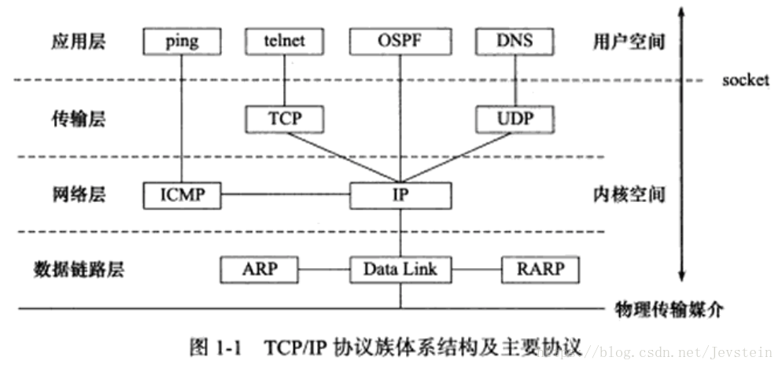
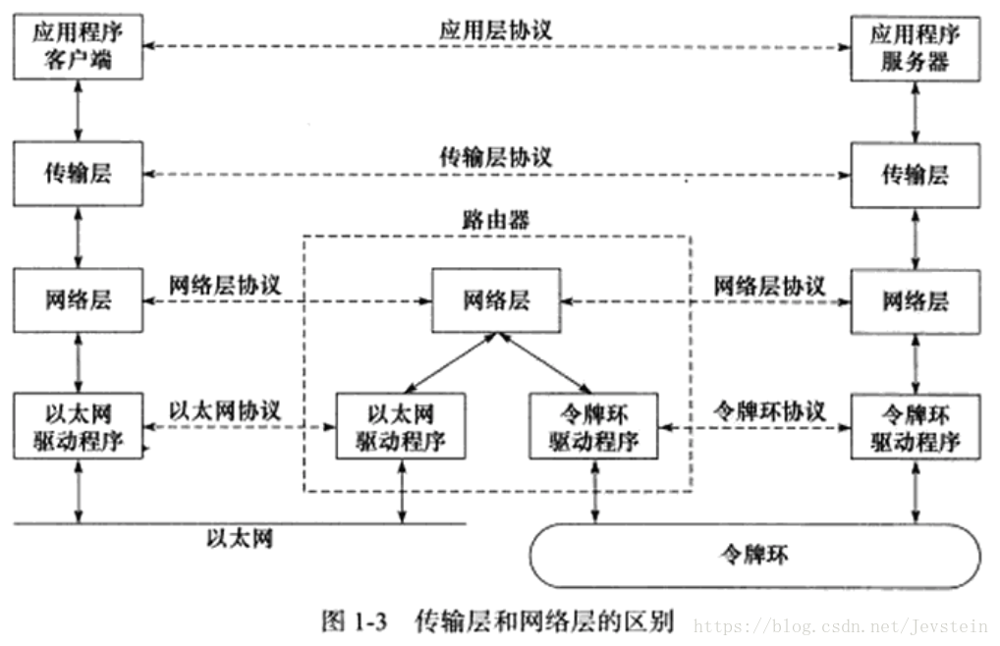
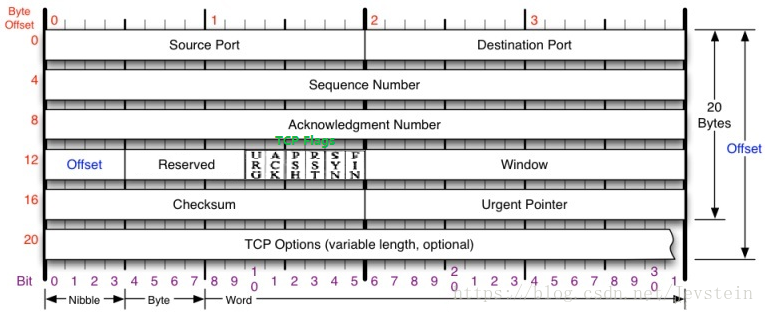
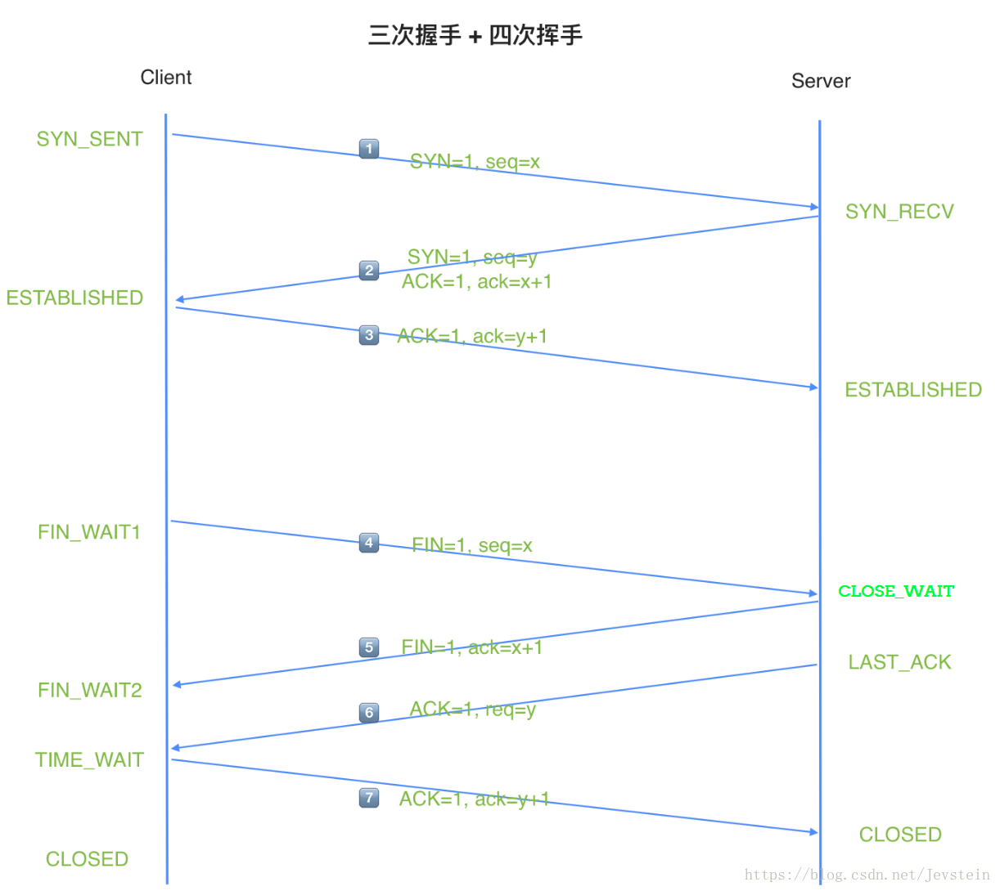
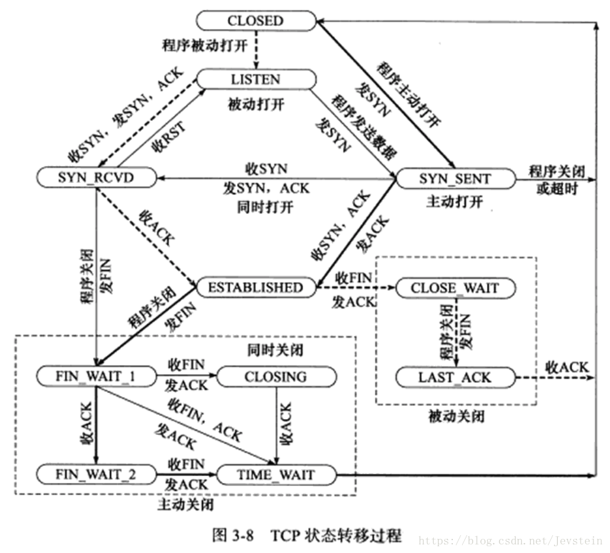

<!-- vscode-markdown-toc -->
* 1. [TCP定义](#TCP)
* 2. [TCP协议头分析](#TCP-1)
* 3. [**3.TCP的连接与关闭**](#3.TCP)
	* 3.1. [三次握手](#)
	* 3.2. [四次挥手](#-1)
	* 3.3. [状态转移](#-1)
* 4. [4.思考几个经典问题](#-1)
	* 4.1. [为什么采用“三次握手“](#-1)
	* 4.2. [为什么采用“四次挥手“](#-1)
	* 4.3. [TIME_WAIT状态的产生、危害、如何避免](#TIME_WAIT)

<!-- vscode-markdown-toc-config
	numbering=true
	autoSave=true
	/vscode-markdown-toc-config -->
<!-- /vscode-markdown-toc -->
##  1. <a name='TCP'></a>TCP定义    
　TCP是Tranfer Control Protocol的简称，TCP协议是一种面向连接的、可靠的、基于字节流的运输层通信协议。通过TCP协议传输，得到的是一个顺序的无差错的数据流。发送方和接收方的成对的两个socket之间必须建立连接，以便在TCP协议的基础上进行通信，当一个socket（通常都是server socket）等待建立连接时，另一个socket可以要求进行连接，一旦这两个socket连接起来，它们就可以进行双向数据传输，双方都可以进行发送或接收操作。 
　　TCP/IP协议族体系结构是个四层协议系统，自底向上分别为数据链路层、网络层、传输层和应用层，如图：
　　
　　
　　TCP协议处于传输层，为两台主机上的应用程序提供端到端（end to end）通信。与网络层使用逐跳通信方式不同，传输层指关心起始端和目的端，而不在乎数据包的中转过程。
##  2. <a name='TCP-1'></a>TCP协议头分析
　　要深层次的剖析TCP，就得了解并熟记TCP协议的数据格式和每个字段的含义。请看结构体定义：    
```
/*TCP头定义，共20个字节*/
typedef struct _TCP_HEADER
{
 short m_sSourPort;// 源端口号16bit
 short m_sDestPort;// 目的端口号16bit
 unsigned int m_uiSequNum;// 序列号32bit
 unsigned int m_uiAcknowledgeNum;// 确认号32bit
 short m_sHeaderLenAndFlag;// 前4位：TCP头长度；中6位：保留；后6位：标志位
 short m_sWindowSize;// 窗口大小16bit
 short m_sCheckSum;// 检验和16bit
 short m_surgentPointer;// 紧急数据偏移量16bit
}__attribute__((packed))TCP_HEADER, *PTCP_HEADER;
```
　　更直观的描述，如下图：
　　

 * 1. **16位端口号（Source Port和Destination Port)**  
　　表示源端口号和目的端口号；告知主机该报文段来自哪里（源端口）以及传给哪个上层协议或应用程序（目的端口）；源端口号和目的端口号配合上IP首部中的源IP地址和目的IP地址就能唯一的确定一个TCP连接。     
 　　进行TCP通信时，服务端使用知名服务或指定端口号（如80端口），而客户端通常使用系统自动选择的临时端口号。
 * 2. **32位序号（Sequence Number）**   
 　　用来标识从发送端向接收端发送的数据字节流，它表示在这个报文段中的的第一个数据字节在数据流中的序号。  
 　　主要`用来解决网络报乱序`的问题
 * 3. **32位确认号（Acknowledgment Number）**   
  　　用作对另一方发送来的TCP报文段的响应，其值是收到的TCP报文段的序号值加1。注意：只有当标志位中的ACK标志（下面介绍）为1时该确认序列号的字段才有效。   
  　　主要`用来解决不丢包`的问题
 * 4. **4位头部长度（Offset／header length）**  
   　　标识该TCP头部有多少个32bit字（4字节）。需要这个值是因为任选字段（options）的长度是可变的，而4位最大能表示15，所以TCP头部最长是60字节。若没有任选字段，长度即为20字节；
 * 5. **6位标志位（TCP Flags）**  
    　　TCP首部中有6个标志比特，它们中的多个可同时被设置为1，主要是`用于操控TCP的状态机`的，依次为URG，ACK，PSH，RST，SYN，FIN。每个标志位的意思如下：  
    - **URG标志**   
   　　表示紧急指针（Urgent Pointer）是否有效。
    - **ACK标志**   
   　　表示确认号是否有效。该位有两个取值：0和1，为1的时候表示应答域有效，反之无效。    
   　　我们称携带ACK标志的TCP报文段位**确认报文段**。
    - **PSH标志**   
   　　提示接收端应用程序应该立即从TCP接收缓冲区中取走数据，为接收后续数据腾出空间。若应用程序不将接收到的数据取走，他们会一直停留在TCP接收缓冲区中。
    - **RST标志**   
   　　表示要求对方重新建立连接。   
   　　用来复位那些产生错误的连接，也被用来拒绝错误和非法的数据包；我们称携带RST标志的TCP报文段位**复位报文段**。
    - **SYN标志**   
    　　表示请求一个连接。  
    　　SYN标志位和ACK标志位搭配使用，当连接请求的时候，SYN=1，ACK=0；连接被响应的时候，SYN=1，ACK=1；这个标志的数据包经常被`用来进行端口扫描`。扫描者发送一个只有SYN的数据包，如果对方主机响应了一个数据包回来 ，就表明这台主机存在这个端口；但是由于这种扫描方式只是进行TCP三次握手的第一次握手，因此这种扫描的成功表示被扫描的机器不很安全，一台安全的主机将会强制要求一个连接严格的进行TCP的三次握手；  
    　　我们称携带SYN标志的TCP报文段位**同步报文段**。
    - **FIN标志**   
    　　表示通知对方本端要关闭连接来。  
    　　若发送端已经达到数据末尾，也就是说双方的数据传送完成，没有数据可以传送了，发送FIN标志位的TCP数据包后，连接将被断开。这个标志的数据包也经常被`用于进行端口扫描`。    
    　　我们称携带FIN标志的TCP报文段位**结束报文段**
 * 6. **16位窗口大小（Window Size）**   
    　TCP流量控制的一个手段。这里的窗口，指的是接收通告窗口（Receiver Windows，RWND）。它告诉对方本端的TCP接收缓冲区还能容纳多少字节的数据，这样对方就可以控制发送数据的速度。
 * 7. **16位校验和（Checksum）**    
    　由发送端填充，接收端对TCP报文段执行CRC算法以检验TCP报文段在传输过程中是否损坏。这个校验不仅包括TCP头部，也包括数据部分。这也是`TCP可靠传输的一个重要保障`。
 * 8. **16位紧急指针（Urgent Pointer）**    
     　这是一个正的偏移量。它与序号字段相加表示最后一个紧急指针数据的下一个字节的序号。因此，确切地说，这个字段是紧急指针相对于当前序号的偏移，不妨称之为紧急偏移。TCP的紧急指针是发送端向接收端发送紧急数据的方法。
##  3. <a name='3.TCP'></a>**3.TCP的连接与关闭** 
　　TCP的连接与关闭过程，就是大名鼎鼎的“三次握手“与“四次挥手“的过程。Linux系统下，可用tcpdump抓包监控整个过程。先看过程图，如下所示：
　　
###  3.1. <a name=''></a>三次握手
　　TCP是面向连接的，无论哪一方向另一方发送数据之前，都必须先在双方之间建立一条连接。在TCP/IP协议中，TCP协议提供可靠的连接服务，连接是通过三次握手进行初始化的。    
 * 1.**第一次握手**  
 　　1⃣️：Client将标志位SYN置为1，随机产生一个值seq=x，并将该数据包发送给Server... Client进入SYN_SENT状态，等待Server确认。 
 * 2.**第二次握手**   
 　　2⃣️Server收到数据包后由标志位SYN=1知道Client请求建立连接，Server将标志位SYN和ACK都置为1，ack (number )=x+1，随机产生一个值seq=y，并将该数据包发送给Client以确认连接请求... Server进入SYN_RCVD状态。 
  * 3.**第三次握手**      
 　　4⃣️Client收到确认后，检查ACK是否为Client发送的seq+1，即x+1；如果正确则将标志位ACK置为1，ack=y+1，并将该数据包发送给Server... Server检查ack是否为Server发送的seq+1，即y+1，如果正确则连接建立成功，Client和Server进入ESTABLISHED状态，完成三次握手。    
 　　我在Linux开启一个服务端ServerA（ubuntu），监听8101端口，手机APP作为客户端ClientB（180.167.180.146）。Linux上打开tcpdump，输入：sudo tcpdump -iany tcp port 8101, 监控ClientA连接ServerA的过程，如下： 
 　　
 　　其实，“三次握手“的作用主要有如下几个:  
    * 1).建立连接  
    * 2).确认对方的当前的初始化序列号(linux用哈希算法)，确保当前连接安全
    * 3).互相决定MSL（最大生存时间）的大小
###  3.2. <a name='-1'></a>四次挥手
  * 1.**第一次挥手**     
 　　5⃣️客户端设置seq=x，向服务端发送一个FIN报文段；此时，主机1进入FIN_WAIT_1状态；这表示客户端没有数据要发送给服务端了； 
  * 2.**第二次挥手**    
　　6⃣️服务端收到了客户端发送的FIN=1，向客户端回复ACK=1，ack=收到的seq+1=x+1，然后客户端进入FIN_WAIT_2状态；服务端告诉客户端，在等待自己去关闭连接； 
  * 3.**第三次挥手**    
　　7⃣️服务端向客户端发送FIN=1，设置seq=y，请求关闭连接，同时服务端进入LAST_ACK状态； 
  * 4.**第四次挥手**    
　　8⃣️客户端收到服务端发送的FIN，向服务端发送ACK=1，ack=收到的seq+1=y+1，然后主机1进入TIME_WAIT状态；服务端收到客户端的ACK报文段以后，就关闭连接；此时，客户端等待2MSL后依然没有收到回复，则证明Server端已正常关闭，客户端也关闭连接。 
　　Linux上监控到挥手过程，如下：
　　
###  3.3. <a name='-1'></a>状态转移
　　TCP任意一端在任意时刻都处于某种状态，可用netstat查看。从建立到关闭的整个过程中，TCP通信两端状态的变化如下图所示：
　　
　　图中粗虚线表示服务器端连接的状态转移；粗实线表示客户端连接的状态转移。CLOSED是一个假想的起始点，并不是一个实际的状态。对这几个状态的详细解释如下：  
* **LISTENING**： 侦听来自远方的TCP端口的连接请求.   
　　最主要的是看本机开了哪些端口，这些端口都是哪个程序开的，关闭不必要的端口是保证安全的一个非常重要的方面，服务端口都对应一个服务（应用程序），停止该服务就关闭了该端口；  
* **SYN-SENT**：客户端SYN_SENT状态  
　　正常情况下SYN_SENT状态非常短暂，连接成功了ESTABLISHED.有很多SYN_SENT出现，一般几种情况，一是你要访问的网站不存在或线路不好，二是用扫描软件扫描一个网段的机器，也会出出现很多SYN_SENT，三可能中了病毒了，例如中了"冲击波"，病毒发作时会扫描其它机器，这样会有很多SYN_SENT出现。 
* **SYN-RECEIVED**：服务器端状态SYN_RCVD    
　　当标志位ACK和SYN置1发送给客户端，此时服务器端处于SYN_RCVD状态，如果连接成功了就变为ESTABLISHED，正常情况下SYN_RCVD状态非常短暂，很多SYN_RCVD状态，机器有可能被SYN Flood的DoS(拒绝服务攻击)攻击了   
* **ESTABLISHED：代表一个打开的连接。**   
　　netstat -nat |grep 端口或者使用lsof  -i:端口可以检测到。
* **FIN-WAIT-1**：等待远程TCP连接中断请求，或先前的连接中断请求的确认   
* **FIN-WAIT-2**：从远程TCP等待连接中断请求
　　半关闭的状态了，这是在关闭连接时，客户端和服务器两次握手之后的状态
* **CLOSE-WAIT**：等待从本地用户发来的连接中断请求
* **CLOSING**：等待远程TCP对连接中断的确认
* **LAST-ACK**：等待原来的发向远程TCP的连接中断请求的确认
* **TIME-WAIT**：等待足够的时间（2MSL）以确保远程TCP接收到连接中断请求的确认    
　　发送了最后一个ACK数据报以后，要进入TIME_WAIT状态，这个状态是防止最后一次挥手的数据报没有传送到对方那里而准备的（注意这不是四次挥手，这是第四次挥手的保险状态）。这个状态在很大程度上保证了双方都可以正常结束，服务器给出了一个平静时间的概念，这是说在2MSL时间内，虽然可以重新启动服务器，但是这个服务器还是要平静的等待2MSL时间的过去才能进行下一次连接。
* **CLOSED**：没有任何连接状态
##  4. <a name='-1'></a>4.思考几个经典问题
###  4.1. <a name='-1'></a>为什么采用“三次握手“
　　“三次握手“的主要目的是：`为了防止已失效的连接请求报文段突然又传送到了服务端，因而产生错误`。    
　　例如：client发出的第一个连接请求报文段并没有丢失，而是在某个网络结点长时间的滞留了，以致延误到连接释放以后的某个时间才到达server。本来这是一个早已失效的报文段。但server收到此失效的连接请求报文段后，就误认为是client再次发出的一个新的连接请求。于是就向client发出确认报文段，同意建立连接。假设不采用“三次握手”，那么只要server发出确认，新的连接就建立了。由于现在client并没有发出建立连接的请求，因此不会理睬server的确认，也不会向server发送ack包。
###  4.2. <a name='-1'></a>为什么采用“四次挥手“
　　“四次挥手“的主要目的是：`为了确保数据能够完成传输`。    
　　因为TCP连接是全双工的(即数据可在两个方向上同时传递)，关闭连接时，当收到对方的FIN报文通知时，它仅仅表示对方没有数据发送给你了；但未必你所有的数据都全部发送给对方了，所以你可以未必会马上会关闭SOCKET,也即你可能还需要发送一些数据给对方之后，再发送FIN报文给对方来表示你同意现在可以关闭连接了，所以它这里的ACK报文和FIN报文多数情况下都是分开发送的。
###  4.3. <a name='TIME_WAIT'></a>TIME_WAIT状态的产生、危害、如何避免    
　　TCP协议在关闭连接的四次挥手中，为了应对最后一个 ACK 丢失的情况，Client（即主动关闭连接的一方）需要维持 time_wait 状态并停留 2 个MSL的时间
* **原因**:     
　　　1.保证A发送的最后一个ACK报文段能达到B (注: ack不会重发，只有B等超时后重发FIN)     
　　　2.防止失效的报文段出现在连接中
* **危害**：    
　　　Linux分配给一个用户的文件句柄是有限的，如果系统中存在大量的 time_wait 状态，一旦达到句柄数上限，新的请求就无法被处理了，而且大量 time_wait 连接占用资源影响性能
* **避免**：    
    * 1.在/etc/sysctl.conf文件中开启 net.ipv4.tcp_tw_reuse重用和net.ipv4.tcp_tw_recycle快速回收[未亲自实践]
    * 2.int on=1; ::setsockopt(sock, SOL_SOCKET, SO_REUSEADDR, (char *)&on, sizeof(int));//若此端口正在使用的话，bind会把端口“抢”过来
     　


>参考： 
>
>《Linux高性能服务器编程》 游双著   
> [网络编程之深入理解网络编程](https://blog.csdn.net/chenliguan/article/details/79146124)