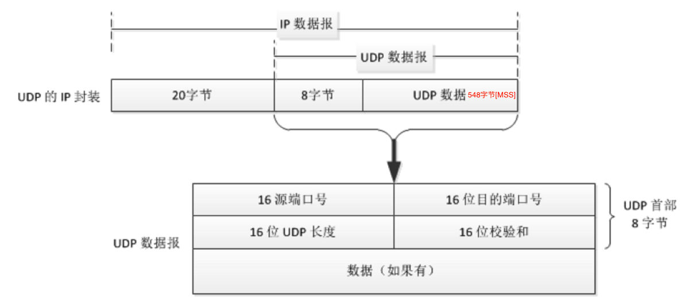
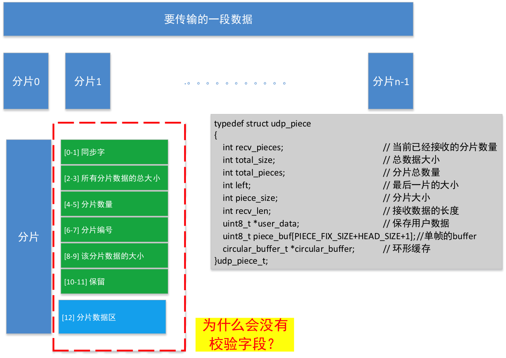
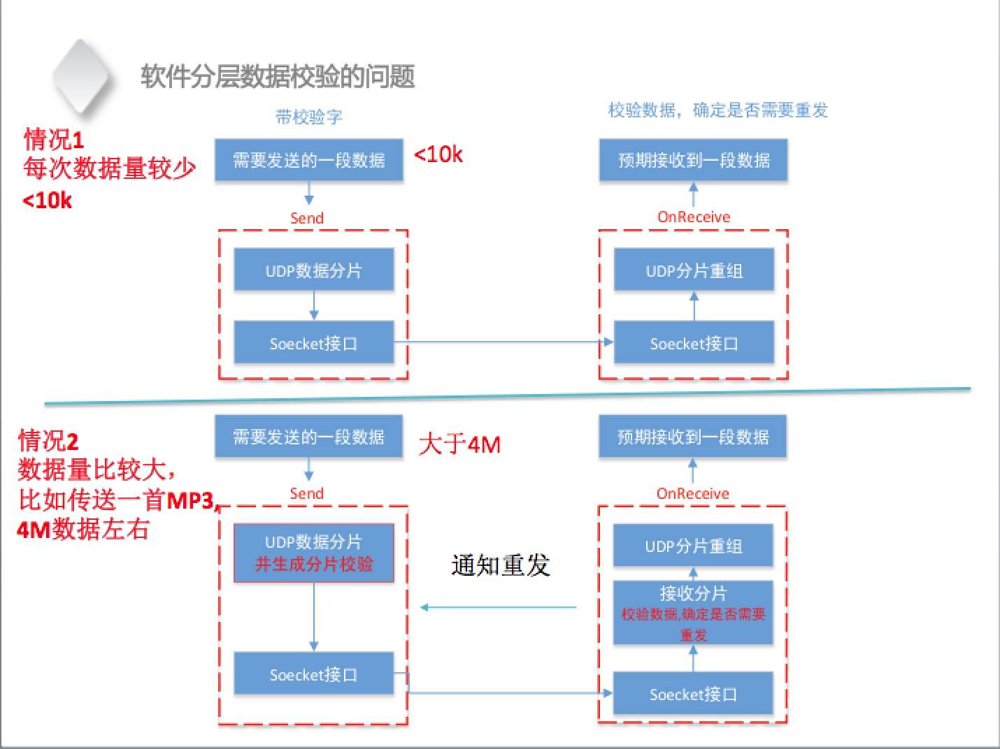

<!-- vscode-markdown-toc -->
* 1. [1.UDP传输应用层注意问题](#UDP)
* 2. [2.UDP分片原理](#UDP-1)
* 3. [3.UDP与MTU](#UDPMTU)
* 4. [4.UDP分片设计](#UDP-1)
* 5. [5.UDP分层数据校验](#UDP-1)
* 6. [6.UDP分片实现](#UDP-1)

<!-- vscode-markdown-toc-config
	numbering=true
	autoSave=true
	/vscode-markdown-toc-config -->
<!-- /vscode-markdown-toc -->
# UDP分片

##  1. 1.UDP传输应用层注意问题
* 1）数据包确认机制
* 2）数据包重发机制
* 3）尽量不发送大于路径MTU的数据包

* 4）处理数据包重排

##  2. 2.UDP分片原理
* 1）对应用层的数据进行分片，以满足`MTU`传输的要求
* 2）在发送端给分片编号，在接收端重组分片，解决乱序数据包重组的问题
##  3. 3.UDP与MTU
`MTU（Maximum Transmission Unit）`，即最大传输单元，是指通信协议的某一层上面所能通过的最大数据包大小（以字节为单位）。

单个UDP传输的最大内容`1472`字节，但由于不同的网络中转设备设置的MTU值并不相同。Internet上的`标准MTU值为576字节`，建议在进行Internet的UDP编程时.最好将UDP的数据长度控制在`[MSS]548字节(576-8-20)`以内。

##  4. 4.UDP分片设计

* 1）分片最大长度的确定
* 2）分片帧头的设计
    - 同步字
    - 所有分片数据的总大小
    - 分片数量
    - 分片编号
    - 当前分片数据的大小
* 3）重组异常的处理

##  5. 5.UDP分层数据校验

##  6. 6.UDP分片实现
详情见：https://github.com/Jevstein/dnpractice/tree/master/course/udp/udp-piece

来自：动脑学院.Darren老师
