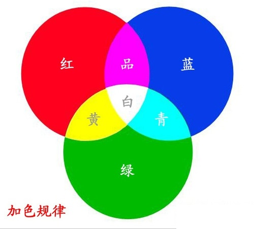

[TOC]

# windows控制台自定义日志颜色

## 1.函数说明

​	使用函数”SetConsoleTextAttribute“来实现不同类型的日志，采用不同的颜色来打印日志内容。该函数调用之后, printf打印日志有效。

```c++
BOOL SetConsoleTextAttribute( HANDLE hConsoleOutput/*handle to console screen buffer*/ 
      					   , WORD wAttributes /*text and background colors*/);
```

​	参数说明：

```shell
# HANDLE hConsoleOutput   -- 输出窗口句柄
# WORD wAttributes        -- 属性设置  可通过逻辑或运算符(|)连接各个属性分量
```


## 2.颜色控制

```shell
FOREGROUND_BLUE               #文字蓝色
FOREGROUND_GREEN              #文字绿色
FOREGROUND_RED                #文字红色
FOREGROUND_INTENSITY          #加亮文字颜色（提高亮度）
BACKGROUND_BLUE               #背景蓝色
BACKGROUND_GREEN              #背景绿色
BACKGROUND_RED                #背景红色
BACKGROUND_INTENSITY          #加亮背景颜色（提高亮度）
COMMON_LVB_GRID_HORIZONTAL    #为打印文字添加上划线
COMMON_LVB_UNDERSCORE         #为打印文字添加下划线
```

通过组合这些属性可以产生不同的颜色（加法三原色原理）

如：FOREGROUND_INTENSITY | FOREGROUND_GREEN | FOREGROUND_BLUE    青色加亮

* 1）加法三原色



* 2）前景色(**FOREGROUND**)和背景色(**BACKGROUND**)

     前景色：画笔的颜色，这儿指文字的颜色。

     背景色：画布的颜色，这儿指控制台背景的颜色。


## 3.源码示例

```c++
#pragma once
#include <windows.h>

typedef enum errorLev
{
    TRACE_LEV = 0,
    INFO_LEV,
    WARNNING_LEV,
    ERROR_LEV,
    FAULT_LEV
}errorLev;

 const char* err_headers[] = 
{
    "TRACE: ",
    "INFO: ",
    "WARNNING: ",
    "ERROR: ",
    "FAULT: "
};

void println(const char* msg, errorLev err_lev=ERROR_LEV)
{
    intptr_t handle= (intptr_t)GetStdHandle(STD_OUTPUT_HANDLE);
    switch (err_lev)
    {
	case LogLevel_Verbose:// 文字绿色 + 加亮
		SetConsoleTextAttribute((HANDLE)handle, FOREGROUND_GREEN | FOREGROUND_INTENSITY);
		break;
    case TRACE_LEV:// 文字绿色
         SetConsoleTextAttribute((HANDLE)handle, FOREGROUND_GREEN);
        break;
    case INFO_LEV:// 文字青色
        SetConsoleTextAttribute((HANDLE)handle, FOREGROUND_GREEN | FOREGROUND_BLUE);
        break;
    case WARNNING_LEV:// 文字黄色
        SetConsoleTextAttribute((HANDLE)handle, FOREGROUND_RED | FOREGROUND_GREEN);
        break;
    case ERROR_LEV:// 文字品红色
        SetConsoleTextAttribute((HANDLE)handle, FOREGROUND_RED | FOREGROUND_BLUE);
        break;
    case FAULT_LEV:// 文字红色
        SetConsoleTextAttribute((HANDLE)handle, FOREGROUND_RED);
        break;
    default:// 文字白色
        SetConsoleTextAttribute((HANDLE)handle, FOREGROUND_RED | FOREGROUND_GREEN | FOREGROUND_BLUE);
        break;
    }
    printf("%s%s\n", err_headers[err_lev], msg);
}
```


> 参考：
> [windows控制台中使用不同颜色显示不同类型的日志](https://www.cnblogs.com/kekec/archive/2010/12/27/1918066.html)