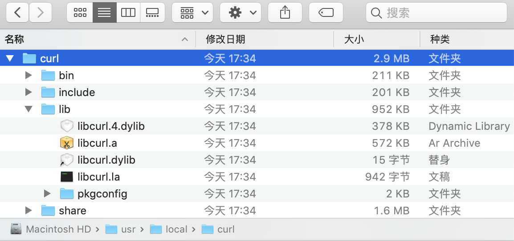

[TOC]

# libcurl的安装

## 1.mac下的安装步骤

* 1.先[下载](https://curl.haxx.se/download.html)最新的curl源码, 如当前版本：[curl-7.68.0.zip](https://curl.haxx.se/download/curl-7.68.0.zip)

* 2.终端：进入解压后的curl目录

* 3.终端：./configure --prefix=/usr/local/curl (设置安装路径)

* 4.终端：make (编译)

* 5.终端：make install (安装)

* 6.最后会在/usr/local目录生成一个curl目录，说明安装成功。如图：

  

【**注意**】：

* 1.如果执行安装操作之后在指定目录没有生成curl文件夹，请检查一下你设置的目录是不是有权限限制，然后加上sudo命令(sudo make install)重新安装一遍。

* 2.可在curl/include/curlver.h头文件中查看版本号

  

## 2.windows下的安装