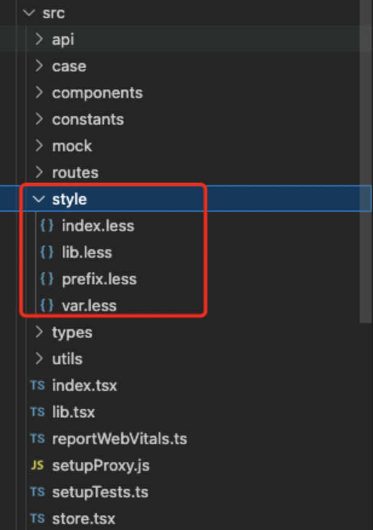

[TOC]

# 一、e10代码规范

## 1、命名规范

### 1.1 项目命名

全部采用小写方式， 以中划线分隔。

```react
// 正例：
mall-management-system

// 反例：
mall_management-system / mallManagementSystem
```

### 1.2 目录命名

全部采用小写方式， 以中划线分隔，有复数结构时，要采用复数命名法， 缩写不用复数

```react
// 正例： 
scripts / styles / components / images / utils / layouts / demo-styles / demo-scripts / img / doc

// 反例： 
script / style / demo_scripts / demoStyles / imgs / docs
```

### 1.3 JS、CSS、SCSS、HTML、PNG 文件命名

全部采用小写方式， 以中划线分隔

```react
// 正例： 
render-dom.js / signup.css / index.html / company-logo.png

// 反例： 
renderDom.js / UserManagement.html
```

### 1.4 命名严谨性

代码中的命名严禁使用拼音与英文混合的方式，更不允许直接使用中文的方式。 说明：正确的英文拼写和语法可以让阅读者易于理解，避免歧义。注意，即使纯拼音命名方式也要避免采用

```react
// 正例：
henan / luoyang / rmb 等国际通用的名称，可视同英文。

// 反例：
DaZhePromotion [打折] / getPingfenByName() [评分] / int 某变量 = 3
```

**杜绝完全不规范的缩写，避免望文不知义：**

反例：AbstractClass“缩写”命名成 AbsClass；condition“缩写”命名成 condi，此类随意缩写严重降低了代码的可阅读性。

## 2、HTML 规范 （Vue Template 同样适用）

### 2.1 HTML 类型

推荐使用 HTML5 的文档类型申明： 
（建议使用 text/html 格式的 HTML。避免使用 XHTML。XHTML 以及它的属性，比如 application/xhtml+xml 在浏览器中的应用支持与优化空间都十分有限）。

- •

  规定字符编码

- •

  IE 兼容模式

- •

  规定字符编码

- •

  doctype 大写

正例：

```react
<!DOCTYPE html>
<html>
  <head>
    <meta http-equiv="X-UA-Compatible" content="IE=Edge" />
    <meta charset="UTF-8" />
    <title>Page title</title>
  </head>
  <body>
    
  </body>
</html>
```

### 2.2 缩进

缩进使用 2 个空格（一个 tab）

嵌套的节点应该缩进。

##  3、 CSS 规范

### 3.1 命名  

- •

  类名使用小写字母，以中划线分隔 

- •

  id 采用驼峰式命名

- •

  less 中的变量、函数、混合、placeholder 采用驼峰式命名  ID 和 class 的名称总是使用可以反应元素目的和用途的名称，或其他通用的名称，代替表象和晦涩难懂的名称  

不推荐：

```css
.fw-800 {
	font-weight: 800;
}

.red {
	color: red;
}
```

推荐：

```css
.heavy {
	font-weight: 800;
}

.important {
	color: red;
}
```

### 3.2 选择器

\1) css 选择器中避免使用标签名

​	从结构、表现、行为分离的原则来看，应该尽量避免 css 中出现 HTML 标签，并且在 css 选择器中出现标签名会存在潜在的问题。

\2) 很多前端开发人员写选择器链的时候不使用 直接子选择器（注：直接子选择器和后代选择器的区别）。

​	有时，这可能会导致疼痛的设计问题并且有时候可能会很耗性能。然而，在任何情况下，这是一个非常不好的做法。如果你不写很通用的，需要匹配到 DOM 末端的选择器， 你应该总是考虑直接子选择器。

不推荐:

```css
.content .title {
	font-size: 2rem;
}
```

推荐：

```css
.content > .title {
	font-size: 2rem;
}
```

### 3.3 尽量使用缩写属性

不推荐：

```css
.demo {
	border-top-style: none;
	font-family: palatino, georgia, serif;
	font-size: 100%;
	line-height: 1.6;
	padding-bottom: 2em;
	padding-left: 1em;
	padding-right: 1em;
	padding-top: 0;
}
```

推荐

```css
.demo {
	border-top: 0;
	font: 100%/1.6 palatino, georgia, serif;
	padding: 0 1em 2em;
}
```

### 3.4 每个选择器及属性独占一行

不推荐：

```css
button{
	width:100px;height:50px;color:#fff;background:#00a0e9;
}
```

推荐：

```css
button{
	width:100px;
	height:50px;
	color:#fff;
	background:#00a0e9;
}
```

### 3.5 省略0后面的单位

不推荐：

```css
div	{
	
padding-bottom: 0px;
	
margin: 0em;

}
```

推荐：

```css
div{
	padding-bottom: 0;
	margin: 0;
}
```

### 3.6 避免使用ID选择器及全局标签选择器

⚠️ <font color="red">防止污染全局样式</font>

不推荐：

```css
header {
	padding-bottom: 0px;
	margin: 0em;
}
```

推荐：

```css
.header {
	padding-bottom: 0px;
	margin: 0em;
}
```

## 4、LESS 规范

### 4.1 代码组织

#### 1）将公共 less 文件放置在 src/style 文件夹



#### 2）按以下顺序组织

1. 1.

   @import;

2. 2.

   变量声明;

3. 3.

   样式声明;

```css
@import "mixins/size.less";

@default-text-color: #333;

.page {
	width: 960px;
	margin: 0 auto;
}
```

### 4.2 避免嵌套层级过多

将嵌套深度限制在3级。对于超过4级的嵌套，给予重新评估。这可以避免出现过于详实的CSS选择器。

避免大量的嵌套规则。当可读性受到影响时，将之打断。推荐避免出现多于20行的嵌套规则出现

不推荐：

```css
.main{
	.title{
		.name{
			color:#fff;
		}
	}
}
```

推荐：

```css
.main-title{
	.name{
		color:#fff;
	}
}
```

## 5、 Javascript 规范

### 5.1 命名

1) 采用小写驼峰命名 lowerCamelCase，代码中的命名均不能以下划线，也不能以下划线或美元符号结束

​		反例： `_name / name_ / name$`

 2.方法名、参数名、成员变量、局部变量都统一使用 lowerCamelCase 风格，必须遵从驼峰形式。

​		正例： `localValue / getHttpMessage() / inputUserId`

​	**其中 method 方法命名必须是 动词 或者 动词+名词 形式**

​		正例：`saveShopCarData /openShopCarInfoDialog`

​		反例：`save / open / show / go`

​	**特此说明，增删查改，详情统一使用如下 5 个单词，不得使用其他（目的是为了统一各个端）**

```react
add / update / delete / detail / get
```

**附： 函数方法常用的动词:**

```react
get 获取/set 设置,										add 增加/remove 删除
create 创建/destory 移除									start 启动/stop 停止
open 打开/close 关闭,									read 读取/write 写入
load 载入/save 保存,										create 创建/destroy 销毁
begin 开始/end 结束,										backup 备份/restore 恢复
import 导入/export 导出,									split 分割/merge 合并
inject 注入/extract 提取,								attach 附着/detach 脱离
bind 绑定/separate 分离,									view 查看/browse 浏览
edit 编辑/modify 修改,									select 选取/mark 标记
copy 复制/paste 粘贴,									undo 撤销/redo 重做
insert 插入/delete 移除,									add 加入/append 添加
clean 清理/clear 清除,									index 索引/sort 排序
find 查找/search 搜索,									increase 增加/decrease 减少
play 播放/pause 暂停,									launch 启动/run 运行
compile 编译/execute 执行,								debug 调试/trace 跟踪
observe 观察/listen 监听,								build 构建/publish 发布
input 输入/output 输出,									encode 编码/decode 解码
encrypt 加密/decrypt 解密,								compress 压缩/decompress 解压缩
pack 打包/unpack 解包,									parse 解析/emit 生成
connect 连接/disconnect 断开,							send 发送/receive 接收
download 下载/upload 上传,								refresh 刷新/synchronize 同步
update 更新/revert 复原,									lock 锁定/unlock 解锁
check out 签出/check in 签入,							submit 提交/commit 交付
push 推/pull 拉,											expand 展开/collapse 折叠
begin 起始/end 结束,										start 开始/finish 完成
enter 进入/exit 退出,									abort 放弃/quit 离开
obsolete 废弃/depreciate 废旧,							collect 收集/aggregate 聚集
```

3) 常量命名全部大写，单词间用下划线隔开，力求语义表达完整清楚，不要嫌名字长。

​	正例： `MAX_STOCK_COUNT`

​	反例： `MAX_COUNT`

### 5.2 代码格式

#### 1) 使用 2 个空格进行缩进

正例：

```react
if (x < y) {
  x += 10;
} else {
  x += 1;
}
```

#### 2) 不同逻辑、不同语义、不同业务的代码之间插入一个空行分隔开来以提升可读性。

> 说明：任何情形，没有必要插入多个空行进行隔开。

### 5.3 字符串

统一使用单引号(‘)，不使用双引号(“)。这在创建 HTML 字符串非常有好处：

反例：

```react
let str = 'foo';
let testDiv = "<div id='test'></div>";
```

正例:

```react
let str = 'foo';
let testDiv = '<div id="test"></div>';
```

### 5.4 对象声明

#### 1) 使用字面值创建对象

正例： `let user = {};`

反例： `let user = new Object();`

#### 2) 使用字面量来代替对象构造器

正例：

```react
var user = { age: 0, name: 1, city: 3 };
```

反例：

```react
var user = new Object();
user.age = 0;
user.name = 0;
user.city = 0;
```

### 5.5 使用 ES6,7

必须优先使用 [ES6,7](https://www.runoob.com/w3cnote/es6-tutorial.html) 中新增的语法糖和函数。这将简化你的程序，并让你的代码更加灵活和可复用。

> 必须强制使用 ES6, ES7 的新语法，比如箭头函数、await/async ， 解构， let ， for…of 等等

### 5.6 括号

下列关键字后必须有大括号（即使代码块的内容只有一行）：

if, else, for, while, do, switch, try, catch, finally, with。

正例：

```react
if (condition) {
	doSomething();
}
```

反例

```react
if (condition) doSomething();
```

### 5.7 undefined 判断

永远不要直接使用 undefined 进行变量判断；使用 typeof 和字符串’undefined’对变量进行判断。

正例：

```react
if (typeof person === 'undefined') {
	// ...
}
```

反例：

```react
if (person === undefined) {
	// ...
}
```

### 5.8 条件判断和循环最多三层

条件判断能使用三目运算符和逻辑运算符解决的，就不要使用条件判断，但是谨记不要写太长的三目运算符。如果超过 3 层请抽成函数，并写清楚注释。

### 5.9 this 的转换命名

对上下文 this 的引用只能使用’self’来命名

### 5.10 慎用 console.log

因 console.log 大量使用会有性能问题，所以在非 webpack 项目中谨慎使用 log 功能

### 5.11 正则表达式

使用正则表达式时禁止使用零度断言：?<= , ?<!

> 这是因为在 Safari 浏览器上不支持这两种格式，使用会导致报错：
>
> 


### 5.11 正则表达式


## 6、React和JSX 规范

### 6.1 基本规则

- •

  每个文件只包含一个React组件；

  - •

    但是[无状态, 或者 Pure 组件](https://link.zhihu.com/?target=https%3A//facebook.github.io/react/docs/reusable-components.html%23stateless-functions) 允许一个文件包含多个组件。eslint: [react/no-multi-comp](https://link.zhihu.com/?target=https%3A//github.com/yannickcr/eslint-plugin-react/blob/master/docs/rules/no-multi-comp.md%23ignorestateless).

- •

  始终使用 JSX 语法;

- •

  不要使用 React.createElement方法，除非初始化 app 的文件不是 JSX 格式。

### 6.2 命名规范

- •

  组件文件扩展名

如果使用 `TypeScript`，则文件扩展名为 `.tsx`；如果使用 JavaScript，则文件扩展名为 `.js`；

- •

  组件文件名

如果是组件文件，则使用 PascalCase，如 `MyComponent.js`

如果组件是一个目录，则组件主入口命名为 `index`，如 `index.js`

- •

  引用命名

React 组件使用 PascalCase，组件实例使用 CamelCase，eslint: [react/jsx-pascal-case](https://github.com/yannickcr/eslint-plugin-react/blob/master/docs/rules/jsx-pascal-case.md)

```react
// bad
import reservationCard from './ReservationCard';
// good
import ReservationCard from './ReservationCard';

// bad
const ReservationItem = <ReservationCard />
// good
const reservationItem = <ReservationCard />
```

- •

  组件属性名

ReactDOM 使用小驼峰式命名法来定义属性的名称，而不使用 HTML 属性名称的命名约定，例如

```react
<div onClick={this.handler} />
```

### 6.3 Class Component VS Functional Component

只允许使用 `Class Component` 和 `Functional Component` 两种形态来书写组件，对于可用ecode复写的组件建议尽量使用Class 组件开发，对于组件内部拆分的子组件建议使用函数式组件配合 Hooks 来进行开发

### 6.4 对齐

遵循以下JSX语法的对齐风格，eslint: [react/jsx-closing-bracket-location](https://github.com/yannickcr/eslint-plugin-react/blob/master/docs/rules/jsx-closing-bracket-location.md)

```react
// bad
<Foo superLongParam='bar'
     anotherSuperLongParam='baz' />

// good
<Foo
  superLongParam='bar'
  anotherSuperLongParam='baz'
/>

// if props fit in one line then keep it on the same line
<Foo bar='bar' />

// children get indented normally
<Foo
  superLongParam='bar'
  anotherSuperLongParam='baz'
>
  <Quux />
</Foo>

// bad
{showButton &&
  <Button />
}

// bad
{
  showButton &&
    <Button />
}

// good
{showButton && (
  <Button />
)}

// good
{showButton && <Button />}
```

### 6.5 空格

- •

  自闭合的标签前要加一个空格，eslint: [no-multi-spaces](https://eslint.org/docs/rules/no-multi-spaces), [react/jsx-tag-spacing](https://github.com/yannickcr/eslint-plugin-react/blob/master/docs/rules/jsx-tag-spacing.md)

```react
// bad
<Foo/>

// very bad
<Foo                 />

// bad
<Foo
 />

// good
<Foo />
```

- •

  不要在 JSX 的花括号里边加空格，eslint: [react/jsx-curly-spacing](https://github.com/yannickcr/eslint-plugin-react/blob/master/docs/rules/jsx-curly-spacing.md)

```react
// bad
<Foo bar={ baz } />

// good
<Foo bar={baz} />
```

### 6.6 引号

JSX 的属性都采用双引号，其他的 JS 都使用单引号。eslint: [jsx-quotes](https://link.zhihu.com/?target=http%3A//eslint.org/docs/rules/jsx-quotes)

> 为什么这样做？JSX 属性 [不能包含转义的引号](https://link.zhihu.com/?target=http%3A//eslint.org/docs/rules/jsx-quotes), 所以当输入"don't"这类的缩写的时候用双引号会更方便。
>
> 标准的 HTML 属性通常也会使用双引号，所以 JSX 属性也会遵守这样的约定。

```react
// bad
<Foo bar='bar' />

// good
<Foo bar="bar" />

// bad
<Foo style={{ left: "20px" }} />

// good
<Foo style={{ left: '20px' }} />
```

### 6.7 属性

- 属性名使用 CamelCase


```react
// bad
<Foo
  UserName='hello'
  phone_number={12345678}
/>

// good
<Foo
  userName='hello'
  phoneNumber={12345678}
/>
```

- 当属性值为true时可以省略， eslint: [react/jsx-boolean-value](https://github.com/yannickcr/eslint-plugin-react/blob/master/docs/rules/jsx-boolean-value.md)


```react
// bad
<Foo
  hidden={true}
/>

// good
<Foo
  hidden
/>

// good
<Foo hidden />
```

- 避免使用数组的索引作为 key 属性值, 建议使用稳定的ID，eslint: [react/no-array-index-key](https://github.com/yannickcr/eslint-plugin-react/blob/master/docs/rules/no-array-index-key.md)


> 为什么这样做？不使用稳定的 ID 会对性能产生副作用并且组件状态会出问题，是一种[反模式](https://medium.com/@robinpokorny/index-as-a-key-is-an-anti-pattern-e0349aece318)

```react
// bad
{todos.map((todo, index) =>
  <Todo
    {...todo}
    key={index}
  />
)}

// good
{todos.map(todo => (
  <Todo
    {...todo}
    key={todo.id}
  />
))}
```

### 6.8 Refs

避免使用字符串引用，请使用回调函数作为引用，eslint: [react/no-string-refs](https://github.com/yannickcr/eslint-plugin-react/blob/master/docs/rules/no-string-refs.md)

```react
// bad
<Foo
  ref='myRef'
/>

// good
<Foo
  ref={ref => { this.myRef = ref }}
/>

// good - Class Component
myRef = React.createRef();
<Foo
  ref={myRef}
/>

// good - Function Component
myRef = useRef();
<Foo
  ref={myRef}
/>
```

### 6.9 圆括号

当 JSX 标签超过一行时使用圆括号包裹， eslint: [react/wrap-multilines](https://github.com/yannickcr/eslint-plugin-react/blob/master/docs/rules/wrap-multilines.md)

```react
// bad
render () {
  return <MyComponent className='long body' foo='bar'>
           <MyChild />
         </MyComponent>
}

// good
render () {
  return (
    <MyComponent className='long body' foo='bar'>
      <MyChild />
    </MyComponent>
  )
}

// good, when single line
render () {
  const body = <div>hello</div>
  return <MyComponent>{body}</MyComponent>
}
```

### 6.10 标签

- 没有子元素的标签请自闭合，eslint: [react/self-closing-comp](https://github.com/yannickcr/eslint-plugin-react/blob/master/docs/rules/self-closing-comp.md)


```react
// bad
<Foo className='stuff'></Foo>

// good
<Foo className='stuff' />
```

- 如果组件包含多行属性，在新的一行闭合标签，eslint: [react/jsx-closing-bracket-location](https://github.com/yannickcr/eslint-plugin-react/blob/master/docs/rules/jsx-closing-bracket-location.md)


```react
// bad
<Foo
  bar='bar'
  baz='baz' />

// good
<Foo
  bar='bar'
  baz='baz'
/>
```

### 6.11 方法

- 在 render 方法中事件的回调函数，应该在构造函数中进行bind绑定。 eslint: [react/jsx-no-bind](https://link.zhihu.com/?target=https%3A//github.com/yannickcr/eslint-plugin-react/blob/master/docs/rules/jsx-no-bind.md)


> 为什么这样做? 在 render 方法中的 bind 调用每次调用 render 的时候都会创建一个全新的函数。

```react
// bad
class Demo extends React.Component {
  onClickDiv() {
    // do stuff
  }

  render() {
    return <div onClick={this.onClickDiv.bind(this)} />
  }
}

// good
class Demo extends React.Component {
  constructor(props) {
    super(props);

    this.onClickDiv = this.onClickDiv.bind(this);
  }

  onClickDiv() {
    // do stuff
  }

  render() {
    return <div onClick={this.onClickDiv} />
  }
}
```

> 除了bind，function定义函数或箭头函数也是相同的情况，具体处理方式可以查看文件

- 类组件的内部方法不要使用下划线前缀


```react
// bad
class extends React.Component {
  _onClickSubmit () {
    // do stuff
  }

  // other stuff
}

// good
class extends React.Component {
  onClickSubmit () {
    // do stuff
  }

  // other stuff
}
```

- 确保在 render 方法中存在返回值，eslint: [require-render-return](https://github.com/yannickcr/eslint-plugin-react/pull/502)


```react
// bad
render () {
  (<div />)
}

// good
render () {
  return (<div />)
}
```

### 6.12 排序

- class extends React.Component的顺序：

  ```react
  1. static静态方法
  2. constructor
  3. getChildContext
  4. ~~componentWillMount~~
  5. componentDidMount
  6. ~~componentWillReceiveProps~~
  7. shouldComponentUpdate
  8. componentWillUpdate
  9. componentDidUpdate
  10. componentWillUnmount
  11. *点击回调或者事件回调* 比如 onClickSubmit() 或者 onChangeDescription()
  12. *render函数中的 getter 方法* 比如 getSelectReason() 或者 getFooterContent()
  13. *可选的 render 方法* 比如 renderNavigation() 或者 renderProfilePicture()
  14. render
  ```

* 组件顺序：weId > 公共(必要)属性 > 独有属性 > 回调函数 

  ```react
     
  <TCom 
    weId={`${this.props.weId || ''}_3l9zbd`}
    className="XXX"
    id={index}
    style={{}}
    disabled={true}
    readonly={true}
    hidden={false}
    x1={}
    x2={}
    onClick={this.onClick}
  />
  ```
  
  

### 6.13 Hooks 书写规范

- Hooks 只能应用于函数式组件中

- 只在 React 函数最顶层使用 Hooks


> 不要在循环，条件或嵌套函数中调用 Hook， 确保总是在你的 React 函数的最顶层调用他们

```react
// bad
function a () {
  const [count, setCount] = useState(0)
  useEffect(function persistForm() {
    localStorage.setItem('formData', accountName)
  })
  const x = function () {}
  const [timer, setTimer] = useState(0)

  // main logic
}

// bad
function a () {
  const [count, setCount] = useState(0)
  useEffect(function persistForm() {
    localStorage.setItem('formData', accountName)
  })
  const [timer, setTimer] = useState(0)
  const x = function () {}
  // main logic
}
```


## 7、其他补充

### 1、if使用

* 尽可能保持代码的顺序阅读规则：少用if/else，代之为 if ( ) { return }

  ```react
  // bad
  if (condtion1) {
    // todo1
  } else if (condtion2) {
    // todo2
  } else {
    // todo3
  }
  
  // good
  if (condtion1) {
    // todo1
    return
  }
  if (condtion2) {
    // todo1
    return
  }
  // todo2
  ```

* If 里面的代码不要太多，多了要新建一个函数

* 追求代码优雅，消除if语句

​		参考：
​		[提升代码幸福度，五个技巧减少js开发中的if else语句](https://www.cnblogs.com/echolun/p/11246274.html)
​		[满屏的if-else，怎么消灭它们(c++)](https://blog.csdn.net/qq_29426201/article/details/115602862)

###  2、css实践

* 1.height: calc(100% - var(--weapp-em-send-button-height));		

* 2.优先使用flex 布局		

* 3.字体有大字体(16px)和小字体(12px) line-height 需要最好大于16px,并且使用偶数 

* 4.少用选择html标签的做法 .main{ span } ,建议最多用一层 .main{ >span },或者定义一个className

### 3、函数参数不宜太多

超过三个，应改为对象传参；或者将第四个定义为对象

```react
// bad
sendNext(messages: any[], isRedirect: boolean = false, sendAllSuccess: boolean = true, shareErrorMsg?: string, isCheckSensitive?: boolean, judgeAggregationGroup?: any[])

// good --- 改为对象传参
sendNext({
  messages: any[], 
  isRedirect: boolean = false, 
  sendAllSuccess: boolean = true, 
  shareErrorMsg?: string, 
  isCheckSensitive?: boolean, 
  judgeAggregationGroup?: any[]
})

// good --- 仅第四个起，改为对象传参
sendNext(messages: any[], isRedirect: boolean = false, sendAllSuccess: boolean = true, {
  shareErrorMsg?: string, 
  isCheckSensitive?: boolean, 
  judgeAggregationGroup?: any[]
})

```


# 二、im开发约定

## 1、分层架构

| 分层               | 详情                         | 备注 |
| ------------------ | ---------------------------- | ---- |
| 第一层：UI层       | UI渲染                       |      |
| 第二层：业务逻辑   | 网络数据、数据解析、消息处理 |      |
| 第三层：基础支撑层 | 网络库、缓存、工具、第三方库 |      |

【注意】UI和逻辑分离


## 2、模块化封装

​	“一切皆组件”

思想： 将任意功能看成**黑盒**（包括class、function），大部分开发人员只关心黑盒的**出参**和**入参**！将这些黑盒适当地结合起来，便能像搭积木一样完成一个复杂的软件的实现。


### 2.1 禁写重复代码

​	提高组件的可复用性


### 2.2 不直接使用系统方法

​	e.g：封装message、getLabel等第三方函数，封装后可以统一处理异常，保证安全稳定


### 2.3 拆解文件

​	一个文件，一个类，或者一个方法，代码不宜太长。一旦太长，要考虑拆解，拆解方法可以参考：

- 使用合适的设计模式重构

- 配置+UI的方式编码，

  ```react
  // bad
  <UIAbc option={data}/>
  <UIAbc option={data}/>
  <UIAbc option={data}/>
  <UIAbc option={data}/>
  <UIAbc option={data}/>
  
  // good
  datas.map((item: any, index: number) => {    	
    return <UIAbc id={index} option={item}/>
  }
  ```


### 2.4 风格统一

​	建议优先使用面向对象方法封装：

```react
// bad: 比较适用于导出少量的函数
const datas = {}
export func1() { /** todo */ }
export func2() { /** todo */ }
func3() { /** todo */ }

// good: 
class CXX {
  private datas = {}
  public func1() { /** todo */ }
  public func2() { /** todo */ }
  private func3() { /** todo */ }
}
new CXX()

// good
const datas = {}
class CYY {
  static func1() { /** todo */ }
  static func2() { /** todo */ }
  static func3() { /** todo */ }
}
```


## 3、代码审核 

​	控制好分支的提交。比如往**dev**分支合并前，必须经对方代码审核后才能通过。审核点参考： 

* 命名规范 
* 文件位置
* 设计思路
* 优化建议


> 参考文档：
> 	[E10 前端开发基础规范](https://weapp.eteams.cn/sp/techdoc/doc/ae0c532a-036e-43c6-ab5e-bae374bb729a/freepass)