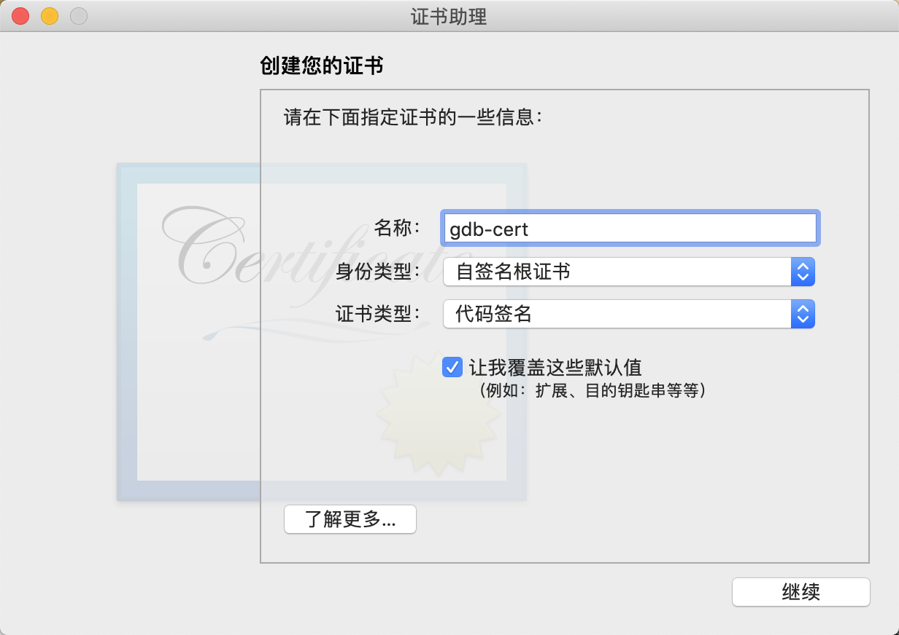
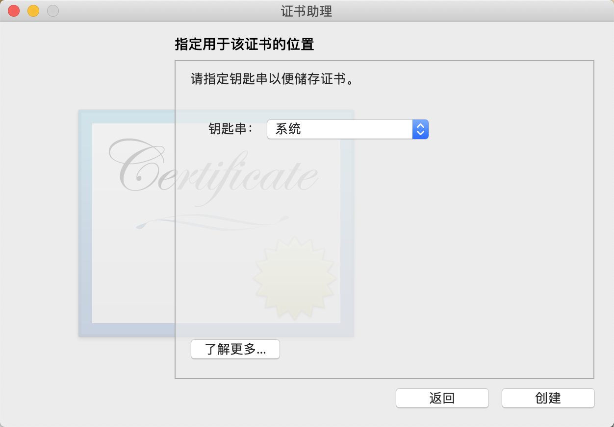
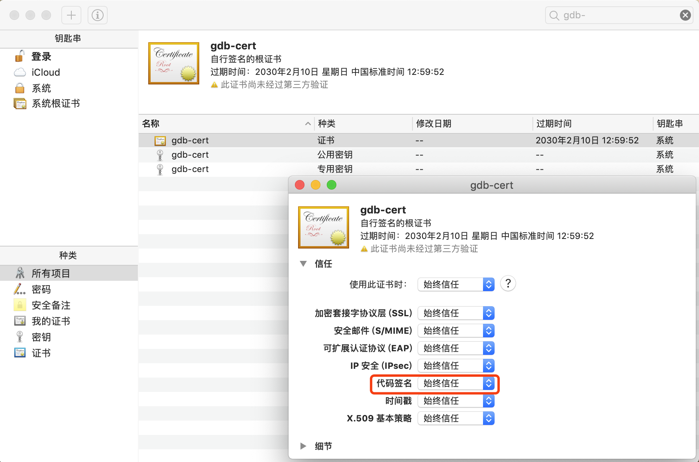
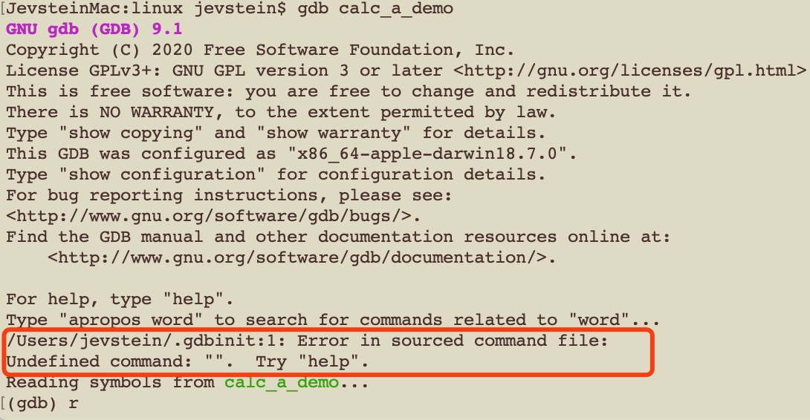
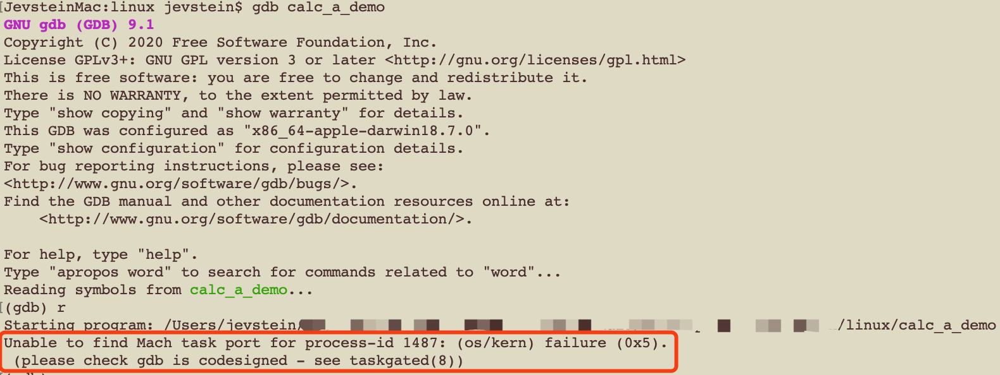

[TOC]

# GDB的安装和调试

​	GDB是GNU开源组织发布的一个强大的UNIX下的程序调试工具。或许，各位比较喜欢那种图形界面方式的，像VC、BCB等IDE的调试，但如果你是在UNIX平台下做软件，你会发现GDB这个调试工具有比VC、BCB的图形化调试器更强大的功能。所谓“寸有所长，尺有所短”就是这个道理。

​	一般来说，GDB主要帮忙你完成下面四个方面的功能：

    1、启动你的程序，可以按照你的自定义的要求随心所欲的运行程序。
    2、可让被调试的程序在你所指定的调置的断点处停住。（断点可以是条件表达式）
    3、当程序被停住时，可以检查此时你的程序中所发生的事。
    4、动态的改变你程序的执行环境。

​	从上面看来，GDB和一般的调试工具没有什么两样，基本上也是完成这些功能，不过在细节上，你会发现GDB这个调试工具的强大，大家可能比较习惯了图形化的调试工具，但有时候，命令行的调试工具却有着图形化工具所不能完成的功能。

## 1.gdb的安装使用

### 1.1.mac的下安装

​	最新版本的 Mac 系统默认只能使用 **lldb** 进行程序调试（**lldb一样强大，语法和gdb类似，mac推荐使用lldb**），但没有自带的gdb工具，如直接在终端上输入gdb，将报错：“-bash: gdb: command not found”。这对于癖好gdb调试的人来说是难以忍受的，下面就看看mac下自定义安装gdb的详细步骤：

#### 1.1.1.详细安装步骤

* 1.安装homebrew管理工具

  ```shell
  $ ruby -e"$(curl -fsSL https://raw.githubusercontent.com/Homebrew/install/master/install)"
  ```

  ​	更新homebrew可使用命令:

  ```shell
  $ brew update
  ```

* 2.查看`homebrew`中是否有gdb安装包：$ brew search gdb

  ```shell
  $ brew search gdb
  ==> Formulae
  cgdb	gdb  gdbm  i386-elf-gdb  pgdbf
  ```

* 3.安装gdb：$brew install gdb

  ```shell
  $ brew install gdb
  Updating Homebrew...
  ==> Downloading https://homebrew.bintray.com/bottles/gdb-9.1.mojave.bottle.tar.gz
  Already downloaded: /Users/yiwenqiang/Library/Caches/Homebrew/downloads/50ee9a20dc6ecc265237da9ac2f9757bbf63f7859cac7db11b8291d5b0e64db0--gdb-9.1.mojave.bottle.tar.gz
  ==> Caveats
  gdb requires special privileges to access Mach ports.
  You will need to codesign the binary. For instructions, see:
    https://sourceware.org/gdb/wiki/BuildingOnDarwin
  
  On 10.12 (Sierra) or later with SIP, you need to run this:
    echo "set startup-with-shell off" >> ~/.gdbinit
  ==> Summary
  🍺  /usr/local/Cellar/gdb/9.1: 55 files, 27.9MB
  ```

  ​	仔细看最后的日志打印，发现gdb安装在到了/usr/local/Cellar/gdb/9.1/bin/gdb。其实，同时它还产生了一个软连接："/usr/local/bin/gdb"（输入命令"ls -l /usr/local/bin"，可以看到"gdb -> ../Cellar/gdb/9.1/bin/gdb"） 。

  **【注意】**：

  ​	这里不要执行`sudo brew install gdb`, 如果执行此命令, 终端会向你抛出下面这些问题：

  ```shell
  Error: Running Homebrew as root is extremely dangerous and no longer supported. As Homebrew does not drop privileges on installation you would be giving all build scripts full access to your system.
  ```

* 4.安装证书

  ​	mac不允许没有给予许可的进程来调试其它进程，那解决办法自然就想到了root，来个根权限。但是，这样万一gdb调试了重要内核程序，后果是不堪设想的。于是，我们自己添加一个安全证书： 
  1）打开钥匙串访问:

   

  2）创建证书:

  

  3）填写证书信息: 注意信息必须一样

  

  ​	一路继续。。。。。。直到遇见证书位置，如下：

  4）指定证书位置: 选择“系统”

  

  ​	直至完成！

  5) 信任证书：

  ​	在钥匙串访问中找到gdb-cert证书，然后双击，点击信任，全部选择始终信任，至此证书就创建好了。

  

* 5.证书签名gdb

  ```shell
  $ sudo codesign -s gdb-cert /usr/local/bin/gdb
  ```

  ​	或者

  ```shell
  $ sudo codesign -fs gdb-cert /usr/local/bin/gdb
  /usr/local/bin/gdb: replacing existing signature
  ```

  ​	或者

  ```shell
  $ vim gdb-entitlement.xml
  <?xml version="1.0" encoding="UTF-8"?>
  <!DOCTYPE plist PUBLIC "-//Apple//DTD PLIST 1.0//EN" "http://www.apple.com/DTDs/PropertyList-1.0.dtd">
  <plist version="1.0">
  <dict>
      <key>com.apple.security.cs.debugger</key>
      <true/>
  </dict>
  </plist>
  </pre>
  
  $ sudo codesign --entitlements gdb-entitlement.xml -fs gdb-cert /usr/local/bin/gdb
  ```

* 6.创建~/.gdbinit 

  ​	在第3步的日志中，我们也看见了“On 10.12 (Sierra) or later with SIP, you need to run this: echo "set startup-with-shell off" >> ~/.gdbinit”，即在10.12 (Sierra) 或之后带SIP的操作系统版本，你还需要运行这个命令：

  ```shell
  $ echo "set startup-with-shell off" >> ~/.gdbinit
  ```

* 7. 生效 - (这一步可以插到第5步之前执行）

  设置完以后，kill taskgated进程，重启生效。
  ```shell 
$ ps -e | grep taskgated
  718 ??         0:00.44 /usr/libexec/taskgated
3752 ttys002   0:00.01 grep taskgated
  
  $ sudo killall taskgated
  ```
  
  若kill taskgated进程后，taskgated进程没有重启，则直接重启系统。
  
  **成功！**

#### 1.1.2.我遇到的问题

##### 1).".gdbinit:1: Error in sourced command file"

* 1.现象：



* 2.分析：

  ```shell
  $ vim ~/.gdbinit
  “set startup-with-shell off”
  set startup-with-shell off
  set startup-with-shell off
  ```

  ​	查看~/.gdbinit的文件内容，发现应该是重复设置了"set startup-with-shell off"，去掉前面两行即可。

##### 2)."please check gdb is codesigned - see taskgated(8)"

* 1.现象：

  

* 2.解决：

  ​	采用第5步的第三个方法：“$ sudo codesign --entitlements gdb-entitlement.xml -fs gdb-cert /usr/local/bin/gdb”，居然成功了。参考：[sourceware.org](https://sourceware.org/gdb/wiki/PermissionsDarwin)
  
  

### 1.2.Linux的下设置

```shell
$ sudo root

$ sudo chmod +s /usr/bin/gdb

$ ulimit -c unlimited
$ ulimit -c
```


## 2.gdb的调试方法

### 2.1.手写一个helloworld

```c
//helloworld.c 
#include <stdio.h>

void func()
{
  	int a, b;
  	a = 1;
  	b = 2;
  	printf("Hello world! a + b = %d + %d = %d\n", a, b, a + b);
}

int main()
{
  	func();
  	return 0;
}
```

​	mac下编译: 

```shell
$ gcc -g -O1 -o helloworld helloworld.c -lstdc++
```

说明：

* -g： 把调试信息加到可执行文件中。若没有-g，将看不见程序的函数名、变量名，所代替的全是运行时的内存地址
* -lstdc++： 在Mac上使用gcc编译程序时，一定要带 -lstdc++，否则linker会报错


### 2.2.gdb启动程序的方法

```shell
1、$ gdb <program>
   #program也就是你的执行文件，一般在当前目录下。

2、$ gdb <program> core
   #用gdb同时调试一个运行程序和core文件，core是程序非法执行后core dump后产生的文件。

3、$ gdb <program> <PID>
   #如果你的程序是一个服务程序，那么你可以指定这个服务程序运行时的进程ID。gdb会自动attach上去，并调试他。program应该在PATH环境变量中搜索得到
   
4、$ gdb <program>
	 (gdb) attach <PID>
	 #同3
```

​	GDB启动时，可以加上一些GDB的启动开关，详细的开关可以用gdb -help查看。常用的参数如下：

```shell
-symbols <file>
-s <file> #从指定文件中读取符号表。

-se file  #从指定文件中读取符号表信息，并把他用在可执行文件中。

-core <file>
-c <file> #调试时core dump的core文件。

-directory <directory>
-d <directory> #加入一个源文件的搜索路径。默认搜索路径是环境变量中PATH所定义的路径。
```


### 2.3.gdb的初级用法

​	掌握以下几个初级命令，其实就足够简单地调试程序和进行排错了。

```shell
#gdb启动helloworld程序
$ gdb helloworld

(gdb) l			#l: list的缩写，从第一行开始列出源码
(gdb) 			#回车: 重复上一次命令,翻页显示后面的代码

(gdb) b helloworld.c:5 			#b: break的缩写, 在源程序第5行处设置断点
(gdb) b func 								#b: break的缩写, 函数func()入口处设置断点
(gdb) b *address						#b: break的缩写, 在程序运行的内存地址处停住
(gdb) b  ... if <condition> #b: break的缩写, ...可以是上述的参数，condition表示条件，在条件成立时停住。比如在循环境体中，可以设置b if i=100，表示当i为100时停住程序
(gdb) info break [n]				#查看断点信息（n表示断点号）

(gdb) r			#r: run的缩写，运行程序。后面可以加入程序的启动参数，类似“gdb --args /your/binary arg1 arg2”

(gdb) c 		#c: continue的缩写，继续运行程序直到下一个断点（类似于VS里的F5）
(gdb) n			#n: next的缩写，逐过程步进，不会进入子函数（类似VS里的F10）
(gdb) s			#s: setp的缩写，逐语句步进，会进入子函数（类似VS里的F11）
(gdb) u			#u: until的缩写，运行至当前语句块结束
(gdb) f			#f: finish的缩写，运行至函数结束并跳出，并打印函数的返回值（类似VS的Shift+F11）
(gdb) p a		#p: print的缩写，打印变量a的值

(gdb) bt			#bt: backtrace的缩写，打印堆栈信息，也可以用where
(gdb) bt <n>	#bt: backtrace的缩写，打印堆栈信息，n是一个正整数，表示只打印栈顶上n层的栈信息
(gdb) bt <-n>	#bt: backtrace的缩写，打印堆栈信息，-n表一个负整数，表示只打印栈底下n层的栈信息

(gdb) q			#退出gdb
```


### 2.4.gdb的中级用法

​	gdb如果只是提供上述几个初级命令，当然是不足以说明其强大的。

```shell
#1.设置观察点（WatchPoint)
#  观察某个表达式（变量也是一种表达式）的值是否有变化了，若有变化，马上停住程序
(gdb) watch <expr> 			#为表达式（变量）expr设置一个观察点。一旦表达式值有变化时，马上停住程序。
(gdb) rwatch <expr> 		#当表达式（变量）expr被读时，停住程序。
(gdb) awatch <expr> 		#当表达式（变量）的值被读或被写时，停住程序。
(gdb) info watchpoints 	#列出当前所设置了的所有观察点。


#2.设置捕捉点（CatchPoint）
#	 设置捕捉点来补捉程序运行时的一些事件。如：载入共享库（动态链接库）或是C++的异常
(gdb) catch <event> 		#当event发生时，停住程序。event可以是下面的内容：
        #1、throw 一个C++抛出的异常。（throw为关键字）
        #2、catch 一个C++捕捉到的异常。（catch为关键字）
        #3、exec 调用系统调用exec时。（exec为关键字，目前此功能只在HP-UX下有用）
        #4、fork 调用系统调用fork时。（fork为关键字，目前此功能只在HP-UX下有用）
        #5、vfork 调用系统调用vfork时。（vfork为关键字，目前此功能只在HP-UX下有用）
        #6、load 或 load <libname> 载入共享库（动态链接库）时。（load为关键字，目前此功能只在HP-UX下有用）
        #7、unload 或 unload <libname> 卸载共享库（动态链接库）时。（unload为关键字，目前此功能只在HP-UX下有用）
(gdb) tcatch <event> 		#只设置一次捕捉点，当程序停住以后，捕捉点被自动删除。


#3.维护停止点
#	 GDB中的停止点也就是三类：BreakPoint、WatchPoint、CatchPoint。若已定义好的停止点没有用了，则可以使用delete、clear、disable、enable这几个命令来进行维护。
(gdb) clear											#清除所有的已定义的停止点。
(gdb) clear <function>
(gdb) clear <filename:function> #清除所有设置在函数上的停止点。
(gdb) clear <linenum>
(gdb) clear <filename:linenum>	#清除所有设置在指定行上的停止点。

(gdb) delete [breakpoints] [range...] #删除指定的断点，breakpoints为断点号。如果不指定断点号，则表示删除所有的断点。range 表示断点号的范围（如：3-7）。其简写命令为d。

#比删除更好的一种方法是disable停止点，disable了的停止点，GDB不会删除，当你还需要时，enable即可，就好像回收站一样。

(gdb) disable [breakpoints] [range...] #disable所指定的停止点，breakpoints为停止点号。如果什么都不指定，表示disable所有的停止点。简写命令是dis.
(gdb) enable [breakpoints] [range...]  #enable所指定的停止点，breakpoints为停止点号。
(gdb) enable [breakpoints] once range... #enable所指定的停止点一次，当程序停止后，该停止点马上被GDB自动disable。
(gdb) enable [breakpoints] delete range... #enable所指定的停止点一次，当程序停止后，该停止点马上被GDB自动删除。


#4.停止条件维护
#  如“(gdb) b if i=100”命令, 当条件成立时，程序自动停止，非常强大。这里，专门说说这个条件的相关维护命令。一般来说，为断点设置一个条件，我们使用if关键词，后面跟其断点条件。并且，条件设置好后，我们可以用condition命令来修改断点的条件。（只有break和watch命令支持if，catch目前暂不支持if）
(gdb) condition <bnum> <expression> #修改断点号为bnum的停止条件为expression。
(gdb) condition <bnum> 							#清除断点号为bnum的停止条件。
(gdb) ignore <bnum> <count> 				#表示忽略断点号为bnum的停止条件count次。


#5.为停止点设定运行命令
#  可以使用GDB提供的command命令来设置停止点的运行命令。也就是说，当运行的程序在被停止住时，我们可以让其自动运行一些别的命令，这很有利行自动化调试。对基于GDB的自动化调试是一个强大的支持。
#		commands [bnum]
#    ... command-list ...
#    end
#    为断点号bnum指写一个命令列表。当程序被该断点停住时，gdb会依次运行命令列表中的命令。
#例如：

(gdb) break foo if x>0
(gdb) commands
(gdb) printf "x is %d/n",x
(gdb) continue
(gdb) end
#断点设置在函数foo中，断点条件是x>0，如果程序被断住后，也就是，一旦x的值在foo函数中大于0，GDB会自动打印出x的值，并继续运行程序。
#如果你要清除断点上的命令序列，那么只要简单的执行一下commands命令，并直接在打个end就行了。
```


### 2.5.gdb的高级用法

​	待续。。。


### 2.6.后记

​		“GDB的自动调试的功能，这个功能真的很强大，试想，我在UNIX下写个脚本，让脚本自动编译我的程序，被自动调试，并把结果报告出来，调试成功，自动checkin源码库。一个命令，编译带着调试带着checkin，多爽啊” - 陈皓


> 参考：
>
> 1.[用GDB调试程序.haoel](https://blog.csdn.net/haoel/article/details/2879/)

