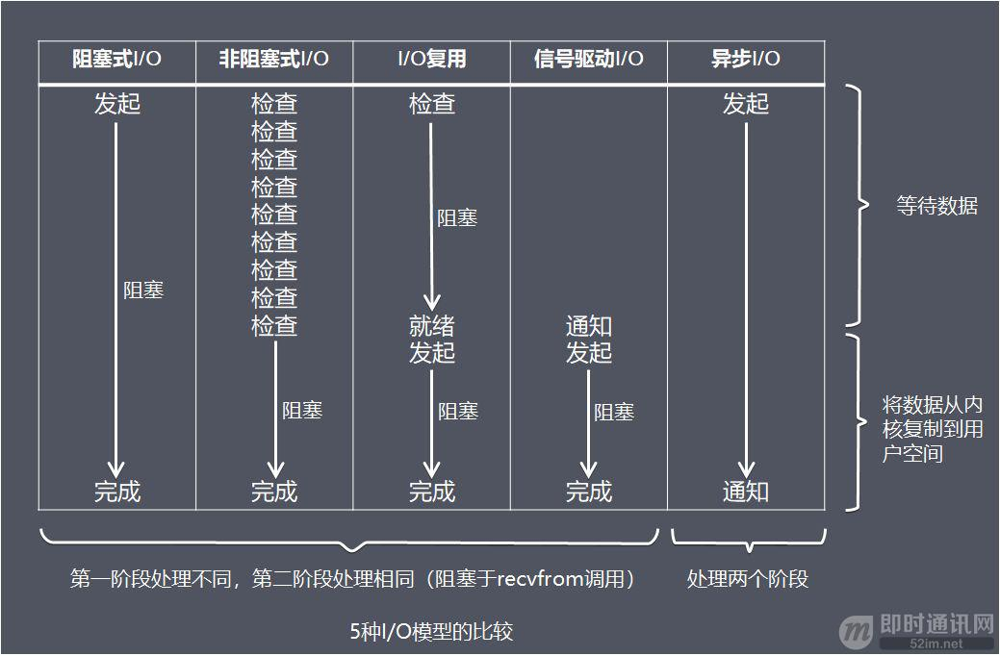
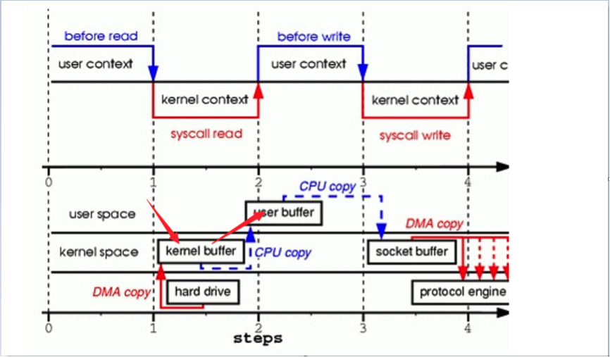
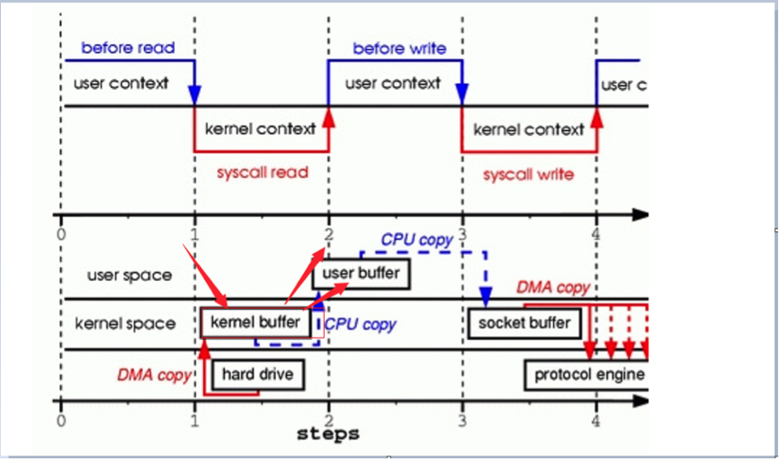
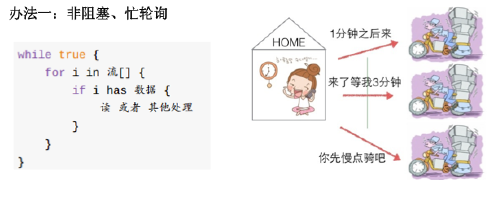
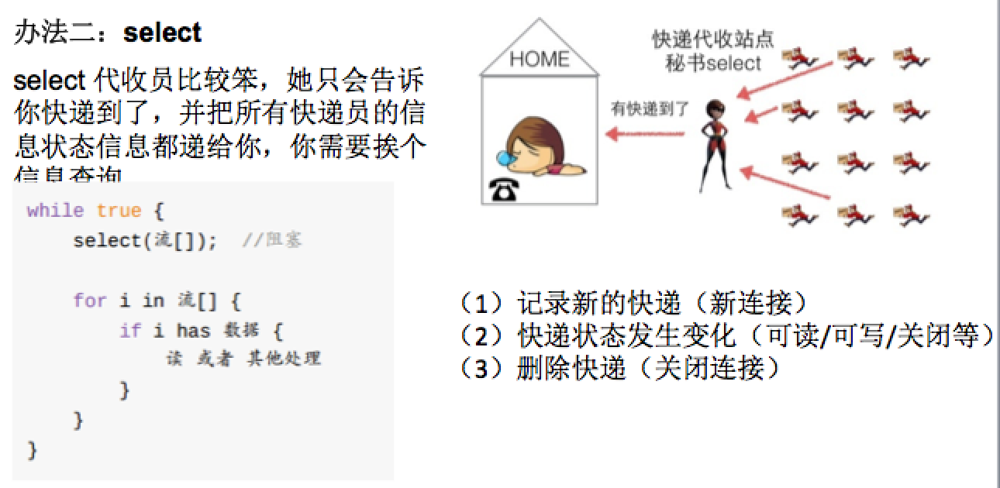
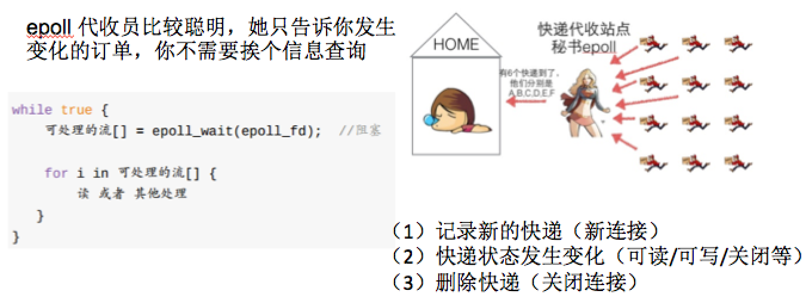

<!-- vscode-markdown-toc -->
* 1. [几个概念](#)
	* 1.1. [阻塞（默认）](#-1)
	* 1.2. [非阻塞](#-1)
	* 1.3. [同步](#-1)
	* 1.4. [异步](#-1)
	* 1.5. [同步阻塞](#-1)
	* 1.6. [同步非阻塞](#-1)
	* 1.7. [异步阻塞(不存在)](#-1)
	* 1.8. [异步非阻塞](#-1)
* 2. [大话阻塞与非阻塞](#-1)
	* 2.1. [阻塞死等待的缺点](#-1)
* 3. [解决阻塞死等待办法](#-1)
	* 3.1. [非阻塞忙轮训](#-1)
	* 3.2. [多路复用](#-1)
		* 3.2.1. [select](#select)
		* 3.2.2. [poll](#poll)
		* 3.2.3. [epoll](#epoll)
	* 3.3. [协程框架](#-1)

<!-- vscode-markdown-toc-config
	numbering=true
	autoSave=true
	/vscode-markdown-toc-config -->
<!-- /vscode-markdown-toc -->

# 网络IO模型
##  1. <a name=''></a>几个概念

###  1.1. <a name='-1'></a>阻塞（默认）
当应用程序使用read、send、write等系统调用API时，会把内核的缓存区里的数据拷贝到用户态的缓存区里，若此时内核缓存区里没有数据，则等待直到内核将数据准备好。此时，应用进程处于一种挂起状态。

###  1.2. <a name='-1'></a>非阻塞
当应用程序使用write、send、read（包括所有O接口）等系统调用API时，若内核缓存区里有数据则拷贝到用户态缓存区，并立刻返回；若内核缓存区里没有数据，也直接返回，用户进程无需等待。即无论如何应用程序都不会处于挂起状态。
	

**默认创建的socket是阻塞的，但可以调用下面这个函数设置为非阻塞**：
```
static int set_socket_no_block(int sockfd)
{
	int flags, res;

	flags = fcntl(sockfd, F_GETGL);
	if (flags == -1){
		perror("failed to get socket flags!\n");
		return -1;
	}

	flags |= O_NONBLOCK;
	res = fcntl(sockfd), F_SETFL, flags);
	if (res == -1){
		perror("failed to set socket flags!\n");
		return -1;
	} 

	return 0;
}
```
###  1.3. <a name='-1'></a>同步

###  1.4. <a name='-1'></a>异步
###  1.5. <a name='-1'></a>同步阻塞
	如: 一些回执信息服务器
###  1.6. <a name='-1'></a>同步非阻塞
	如： 设置set_socket_no_block的select／poll/epoll模型
###  1.7. <a name='-1'></a>异步阻塞(不存在)
###  1.8. <a name='-1'></a>异步非阻塞
	如: IOCP
##  2. <a name='-1'></a>大话阻塞与非阻塞

###  2.1. <a name='-1'></a>阻塞死等待的缺点

##  3. <a name='-1'></a>解决阻塞死等待办法
###  3.1. <a name='-1'></a>非阻塞忙轮训

###  3.2. <a name='-1'></a>多路复用
####  3.2.1. <a name='select'></a>select

核心函数:
* int select(int nfds,
	fd_set *readfds,fd_set *writefds, fd_set*exceptfds,
	struct timeval *timeout); 	
	* nfds: 监控的文件描述符集里最大文件描述符加1，因为此参数会告诉内核检测前多少个文件描述符的状态
	* readfds：监控有读数据到达文件描述符集合，传入传出参数
	* writefds：监控写数据到达文件描述符集合，传入传出参数
	* exceptfds：监控异常发生达文件描述符集合,如带外数据到达异常，传入传出参数
	* timeout：定时阻塞监控时间

* FD_SET(fd_set *fdset);

	用于在文件描述符集合中增加一个新的文件描述符。 
* FD_CLR(fd_set *fdset);	

	用于在文件描述符集合中删除一个文件描述符。
* FD_ISSET(int fd, fd_set *fdset);	

	用于测试指定的文件描述符是否在该集合中。

####  3.2.2. <a name='poll'></a>poll
与select类似。
* struct pollfd {
    int fd;
    short events;
    short revents;
};
* int poll(struct pollfd *fds, nfds_t nfds, int timeout); 
	* fds：是一个struct pollfd结构类型的数组，用于存放需要检测其状态的Socket描述符
	* nfds：nfds_t类型的参数，用于标记数组fds中的结构体元素的总数量；
	* timeout：是poll函数调用阻塞的时间；
	* 返回值大于0：表示数组fds中有socket描述符的状态发生变化，或可以读取、或可以写入、或出错

####  3.2.3. <a name='epoll'></a>epoll

与select，poll一样，使用IO多路复用的技术
只关心“活跃”的链接，无需遍历全部描述符集合
能够处理大量的链接请求(系统可以打开的文件数目) 
* int epoll_wait(int epfd, struct epoll_event *events, 
	int maxevents, int timeout) ;//等待epoll实例中注册的事件触发
	* events：用来从内核得到事件的集合
	* maxevents：返回的events的最大个数，如果最大个数大于实际触发的个数，则下次epoll_wait的时候仍然可以返回
	* timeout：是epoll_wait函数调用阻塞的时间
* int epoll_ctl(int epfd, int op, int fd, struct epoll_event *event);//添加，修改，或者删除 注册到epoll实例中的文件描述符上的监控事件
	* op:操作类型
		* EPOLL_CTL_ADD, 为相应fd添加事件 
		* EPOLL_CTL_MOD, 修改fd的事件 
		* EPOLL_CTL_DEL，删除fd上的某些事件 


###  3.3. <a name='-1'></a>协程框架
如: libco、ntyco、云风c/c++实现


> 参考:  
> 动脑学院.Lee老师／Darren老师