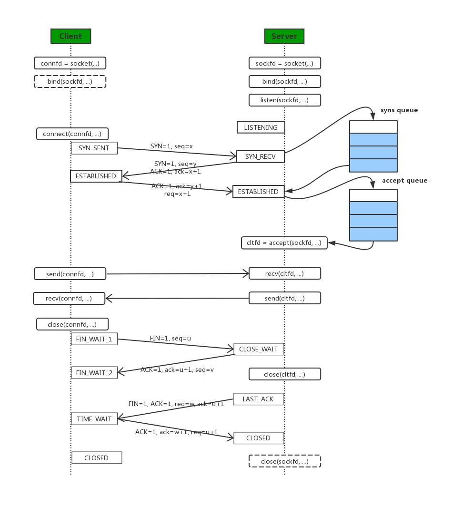
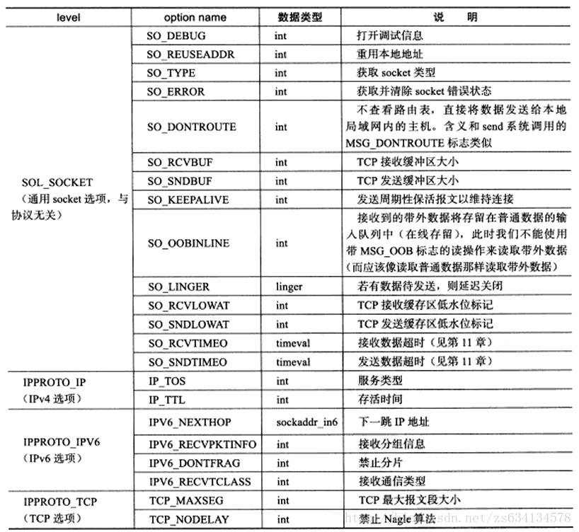

<!-- vscode-markdown-toc -->
* 1. [socket API与TCP握手挥手的结合](#socketAPITCP)
* 2. [socket API详解](#socketAPI)
	* 2.1. [socket()函数](#socket)
	* 2.2. [bind()函数](#bind)
	* 2.3. [listen()函数](#listen)
	* 2.4. [connect函数](#connect)
	* 2.5. [accept()函数](#accept)
	* 2.6. [send()和recv()函数](#sendrecv)
	* 2.7. [close()和shutdown()函数](#closeshutdown)
* 3. [socket选项函数](#socket-1)
	* 3.1. [SO_REUSEADDR选项](#SO_REUSEADDR)
	* 3.2. [SO_RCVBUF和SO_SNDBUF选项](#SO_RCVBUFSO_SNDBUF)
	* 3.3. [SO_RCVLOWAT和SO_SNDLOWAT选项](#SO_RCVLOWATSO_SNDLOWAT)
	* 3.4. [SO_LINGER选项](#SO_LINGER)

<!-- vscode-markdown-toc-config
	numbering=true
	autoSave=true
	/vscode-markdown-toc-config -->
<!-- /vscode-markdown-toc -->
# socket实现
##  1. <a name='socketAPITCP'></a>socket API与TCP握手挥手的结合
  
##  2. <a name='socketAPI'></a>socket API详解
###  2.1. <a name='socket'></a>socket()函数
这个函数建立一个协议族为domain、协议类型为type、协议编号为protocol的套接字文件描述符。若函数调用成功，则返回一个标识这个套接字的文件描述符，失败的时候返回-1。  
socket()函数的原型如下：
```
#include <sys/types.h>     /* See NOTES */
#include <sys/socket.h>

int socket(int domain, int type, int protocol);
```
* domain  
函数socket()的参数domain用于设置网络通信的域，函数socket()根据这个参数选择通信协议的族。通信协议族在文件sys/socket.h中定义。  

| 名称 |	含义	| 名称 | 含义 |
|--------|----------|--------|-----------|
|PF_UNIX PF_LOCAL |	本地通信 |	PF_X25	| ITU-T X25 / ISO-8208协议|
|AF_INET,PF_INET |		IPv4 Internet协议 |	PF_AX25 |	Amateur radio AX.25 |
|PF_INET6 |	IPv6 Internet协议 |	PF_ATMPVC |	原始ATM PVC访问 |
|PF_IPX	| IPX-Novell协议	| PF_APPLETALK |	Appletalk |
|PF_NETLINK|内核用户界面设备|PF_PACKET|	底层包访问|

* type
函数socket()的参数type用于设置套接字通信的类型，主要有SOCKET_STREAM（流式套接字）、SOCK——DGRAM（数据包套接字）等。

| 名称 |	含义 |
|--------|---------|
|SOCK_STREAM|	Tcp连接，提供序列化的、可靠的、双向连接的字节流。支持带外数据传输 |
|SOCK_DGRAM	|支持UDP连接（无连接状态的消息）|
|SOCK_SEQPACKET |	序列化包，提供一个序列化的、可靠的、双向的基本连接的数据传输通道，数据长度定常。每次调用读系统调用时数据需要将全部数据读出 |
|SOCK_RAW |	RAW类型，提供原始网络协议访问|
|SOCK_RDM |	提供可靠的数据报文，不过可能数据会有乱序 |

并不是所有的协议族都实现了这些协议类型，例如，AF_INET协议族就没有实现SOCK_SEQPACKET协议类型。

* protocol
函数socket()的第3个参数protocol用于制定某个协议的特定类型，即type类型中的某个类型。通常某协议中只有一种特定类型，这样protocol参数仅能设置为0；但是有些协议有多种特定的类型，就需要设置这个参数来选择特定的类型。

* errno
函数socket()并不总是执行成功，有可能会出现错误，错误的产生有多种原因，可以通过errno获得：

|值	|含义|
|-----|------|
|EACCES|	没有权限建立制定的domain的type的socket |
|EAFNOSUPPORT |	不支持所给的地址类型  |
|EINVAL |	不支持此协议或者协议不可用 |
|EMFILE |	进程文件表溢出 |
|ENFILE	|已经达到系统允许打开的文件数量，打开文件过多|
|ENOBUFS/ENOMEM|	内存不足。socket只有到资源足够或者有进程释放内存|
|EPROTONOSUPPORT|	制定的协议type在domain中不存在|

比如我们建立一个流式套接字可以这样：
```
int sock = socket(AF_INET, SOCK_STREAM, 0);
```

###  2.2. <a name='bind'></a>bind()函数
在套接口中，一个套接字只是用户程序与内核交互信息的枢纽，它自身没有太多的信息，也没有网络协议地址和 端口号等信息，在进行网络通信的时候，必须把一个套接字与一个地址相关联，这个过程就是地址绑定的过程。许多时候内核会我们自动绑定一个地址，然而有时用 户可能需要自己来完成这个绑定的过程，以满足实际应用的需要，最典型的情况是一个服务器进程需要绑定一个众所周知的地址或端口以等待客户来连接。这个事由 bind的函数完成。
```
int bind( int sockfd, struct sockaddr* addr, socklen_t addrlen)
```
* sockfd
就是我们调用socket函数后创建的socket 句柄或者称文件描述符号。
* addr
addr是指向一个结构为sockaddr参数的指针，sockaddr中包含了地址、端口和IP地址的信息。在进行地址绑定的时候，需要弦将地址结构中的IP地址、端口、类型等结构struct sockaddr中的域进行设置之后才能进行绑定，这样进行绑定后才能将套接字文件描述符与地址等接合在一起。  
由于历史原因，我们前后有两个地址结构：
**struct sockaddr**
该结构定义如下：
```
struct sockaddr { 
	uint8_t sa_len;　　 
	unsigned short sa_family; /* 地址家族, AF_xxx */ 　　 
	char sa_data[14]; /*14字节协议地址*/ 　　
};
```
其实这个结构逐渐被舍弃，但是也还是因为历史原因，在很多的函数，比如connect、bind等还是用这个作为声明，实际上现在用的是第二个结构，我们需要把第二个结构强转成sockaddr。
**struct sockaddr_in**
其定义如下：
```
struct sockaddr_in { 
　　 uint8_t sa_len; /* 结构体长度*/ 
    short int sin_family; /* 通信类型 */ 
　　 unsigned short int sin_port; /* 端口*/ 
　　 struct in_addr sin_addr; /* Internet 地址 */ 
　　 unsigned char sin_zero[8]; /*未使用的*/ 
　　 };

struct in_addr { //sin_addr的结构体类型in_addr 原型
　　 unsigned long s_addr; /*存4字节的IP地址(使用网络字节顺序)*/
　　 };
```
在使用的时候我们必须指定通信类型，也必须把端口号和地址转换成网络序的字节序（这是什么意思呢？）。

* addrlen
addr结构的长度，可以设置成sizeof(struct sockaddr)。使用sizeof(struct sockaddr)来设置套接字的类型和其对已ing的结构。 

bind()函数的返回值为0时表示绑定成功，-1表示绑定失败，errno的错误值如表1所示。

|值 |	含义|	备注 |
|----|---------|-------|
|EADDRINUSE |	给定地址已经使用	
|EBADF|	sockfd不合法	
|EINVAL|	sockfd已经绑定到其他地址	
|ENOTSOCK|	sockfd是一个文件描述符，不是socket描述符	
|EACCES	|地址被保护，用户的权限不足	
|EADDRNOTAVAIL|	接口不存在或者绑定地址不是本地|	UNIX协议族，AF_UNIX
|EFAULT	|my_addr指针超出用户空间	|UNIX协议族，AF_UNIX
|EINVAL	|地址长度错误，或者socket不是AF_UNIX族|	UNIX协议族，AF_UNIX
|ELOOP|	解析my_addr时符号链接过多|	UNIX协议族，AF_UNIX
|ENAMETOOLONG|	my_addr过长|	UNIX协议族，AF_UNIX
|ENOENT|	文件不存在|	UNIX协议族，AF_UNIX
|ENOMEN|	内存内核不足|	UNIX协议族，AF_UNIX
|ENOTDIR|	不是目录|	UNIX协议族，AF_UNIX

比如这样：
```
    struct sockaddr_in addr;
    memset(&addr, 0, sizeof(struct sockaddr_in));

    addr.sin_family = AF_INET;
    addr.sin_port = htons(port);
    addr.sin_addr.s_addr = INADDR_ANY;
    
    if (bind(sfd, (struct sockaddr*)&addr, sizeof(struct sockaddr_in)) < 0) 
    {
	    perror("bind");
	    exit(1);
    }
```

###  2.3. <a name='listen'></a>listen()函数

```
int listen(int sockfd, int backlog);
```
listen()函数将sockfd标记为被动打开的套接字，并作为accept的参数用来接收到达的连接请求。

* sockfd是一个套接字类型的文件描述符，具体类型为SOCK_STREAM或者SOCK_SEQPACKET。

* backlog参数用来描述sockfd的等待连接队列能够达到的最大值。当一个请求到达并且该队列为满时，客户端可能会收到一个表示连接失败的错误，或者如果底层协议支持重传(比如tcp协议),本次请求会被丢弃不作处理，在下次重试时期望能连接成功(下次重传的时候队列可能已经腾出空间)。 

说起这个backlog就有一点儿历史了，等下文描述。

* errno

|值 |  含义 |
|----|--------|
| EADDRINUSE |  另一个套接字已经绑定在相同的端口上。|
|EBADF  |    参数sockfd不是有效的文件描述符。|
|ENOTSOCK  |  参数sockfd不是套接字。|
|EOPNOTSUPP |  参数sockfd不是支持listen操作的套接字类型。|

###  2.4. <a name='connect'></a>connect函数

**声明如下**
```
int connect(int sockfd, const struct sockaddr *addr, socklen_t addrlen);
```
**参数说明如下**
* sockfd 是系统调用 socket() 返回的套接字文件描述符。
* serv_addr 是 保存着目的地端口和 IP 地址的数据结构 struct sockaddr_in。
* addrlen 设置 为 sizeof(struct sockaddr_in)

**errno**
connect函数在调用失败的时候返回值-1，并会设置全局错误变量 errno。
|值 | 含义|
|----|------|
|EBADF| 参数sockfd 非合法socket处理代码|
|EFAULT| 参数serv_addr指针指向无法存取的内存空间|
|ENOTSOCK| 参数sockfd为一文件描述词，非socket。|
|EISCONN |参数sockfd的socket已是连线状态|
|ECONNREFUSED |连线要求被server端拒绝。|
|ETIMEDOUT| 企图连线的操作超过限定时间仍未有响应。|
|ENETUNREACH |无法传送数据包至指定的主机。|
|EAFNOSUPPORT |sockaddr结构的sa_family不正确。|

###  2.5. <a name='accept'></a>accept()函数  
**函数声明**

```
int accept(int sockfd, struct sockaddr *addr, socklen_t *addrlen);
```
**参数说明**
sockfd是由socket函数返回的套接字描述符，参数addr和addrlen用来返回已连接的对端进程（客户端）的协议地址。如果我们对客户端的协议地址不感兴趣，可以把arrd和addrlen均置为空指针。

**返回值**

成功时，返回非负整数，该整数是接收到套接字的描述符；出错时，返回－1，相应地设定全局变量errno。

|值 | 含义 |
|----|--------|
|EBADF | 非法的socket|
|EFAULT | 参数addr指针指向无法存取的内存空间|
|ENOTSOCK | 参数s为一文件描述词，非socket|
|EOPNOTSUPP |指定的socket并非SOCK_STREAM|
|EPERM |防火墙拒绝此连线|
|ENOBUFS | 系统的缓冲内存不足|
|ENOMEM | 核心内存不足|

特别需要说明下的是，这个accept是一个阻塞式的函数，对于一个阻塞的套套接字，一直阻塞，或者返回一个错误值，对于非阻塞套接字。accept有可能返回-1，但是如果errno的值为，EAGAIN或者EWOULDBLOCK，此时需要重新调用一次accept函数。

###  2.6. <a name='sendrecv'></a>send()和recv()函数 

**函数声明如下**

```
ssize_t recv(int sockfd, void *buf, size_t len, int flags);
ssize_t send(int sockfd, const void *buf, size_t len, int flags);
```
* sockfd  ：套接字
* buf : 待发送或者接收的缓存
* len : 如果是recv指期望接收的长度，如果是send指要发送的长度。
* flags : 标志位，取值如下表：  

|flags |	说明	| recv	| send |
|-------|-----------|--------|---------|
| MSG_DONTROUTE |	绕过路由表查找  |	 	|  • |
| MSG_DONTWAIT	| 仅本操作非阻塞 	 | •    	|  •|
| MSG_OOB　　|　　	发送或接收带外数据 |	  •	 | •|
| MSG_PEEK　　|	窥看外来消息	|  •	 |  |
| MSG_WAITALL　|　	等待所有数据 |	  •	 |

**errno**
| 值 | 含义 |
|-----|-------|
|EAGAIN | 套接字已标记为非阻塞，而接收操作被阻塞或者接收超时 |
|EBADF | sock不是有效的描述词 |
|ECONNREFUSE | 远程主机阻绝网络连接 |
| EFAULT | 内存空间访问出错 |
|EINTR |操作被信号中断 |
|EINVAL |参数无效 |
|ENOMEM |内存不足 |
|ENOTCONN |与面向连接关联的套接字尚未被连接上 |
|ENOTSOCK|sock索引的不是套接字 当返回值是0时，为正常关闭连接；|

当返回值为-1时是不是一定就错误了，当返回值为0时该怎么做呢？
如何正确判断一个对端已经关闭了连接？

###  2.7. <a name='closeshutdown'></a>close()和shutdown()函数  

##  3. <a name='socket-1'></a>socket选项函数
功能：用来读取和设置socket文件描述符属性的方法
函数：
```
#include <sys/scoket.h>

int getsockopt ( int sockfd, int level, int option_name, void* option_value, socklen_t* restrict option_len );

int setsockopt ( int sockfd, int level, int option_name, const void* option_value, socklen_t option_len);
```
socket选项表如下，需要的时候请按下表进行搜索：  


`getsockopt()`和`setsockopt()` 这两个函数成功时返回0，失败时返回-1并设置errno。  
  对于服务器而言，有部分socket选项只能在调用listen系统调用前针对监听socket设置才有效。这是因为连接socket只能由accept调用返回，而accept从listen监听队列接受的连接至少已经完成了TCP三次握手的前两个步骤（因为listen监听队列中的连接至少已进入SYN_RCVD状态），这说明服务器已经往被接收连接上发送出了TCP同步报文段。但有的socket选项却应该在TCP同步报文段中设置，比如TCP最大报文段选项。对这种情况，linux给开发人员提供的解决方案是：对监听socket设置这些socket选项，那么accept返回的连接socket将自动继承这些选项。这些选项包括：SO_DEBUG、SO_DONTROUTE、SO_KEEPALIVE、SO_LINGER、SO_OOBINLINE、SO_RCVBUF、SO_RCVLOWAT、SO_SNDBUF、SO_SNDLOWAT、TCP_MAXSEG和TCP_NODELAY。  
  对于客户端而言，这些socket选项则应该在调用connect函数之前设置，因为connect调用成功返回之后，TCP三次握手已完成。

###  3.1. <a name='SO_REUSEADDR'></a>SO_REUSEADDR选项
前面讨论过TCP连接的TIME_WAIT状态，并提到服务器程序可以通过设置socket选项SO_REUSEADDR来强制使用被处于TIME_WAIT状态的连接占用的socket地址。  
```
#include <sys/socket.h>
#include <netinet/in.h>
#include <arpa/inet.h>
#include <assert.h>
#include <stdio.h>
#include <unistd.h>
#include <stdlib.h>
#include <errno.h>
#include <string.h>
 
int main( int argc, char* argv[] )
{
    if( argc <= 2 )
    {
        printf( "usage: %s ip_address port_number\n", basename( argv[0] ) );
        return 1;
    }
    const char* ip = argv[1];
    int port = atoi( argv[2] );
 
    int sock = socket( PF_INET, SOCK_STREAM, 0 );
    assert( sock >= 0 );
    int reuse = 1;
    setsockopt( sock, SOL_SOCKET, SO_REUSEADDR, &reuse, sizeof( reuse ) );
 
    struct sockaddr_in address;
    bzero( &address, sizeof( address ) );
    address.sin_family = AF_INET;
    inet_pton( AF_INET, ip, &address.sin_addr );
    address.sin_port = htons( port );
    int ret = bind( sock, ( struct sockaddr* )&address, sizeof( address ) );
    assert( ret != -1 );
 
    ret = listen( sock, 5 );
    assert( ret != -1 );
 
    struct sockaddr_in client;
    socklen_t client_addrlength = sizeof( client );
    int connfd = accept( sock, ( struct sockaddr* )&client, &client_addrlength );
    if ( connfd < 0 )
    {
        printf( "errno is: %d\n", errno );
    }
    else
    {
        char remote[INET_ADDRSTRLEN ];
        printf( "connected with ip: %s and port: %d\n", 
            inet_ntop( AF_INET, &client.sin_addr, remote, INET_ADDRSTRLEN ), ntohs( client.sin_port ) );
        close( connfd );
    }
 
    close( sock );
    return 0;
}

```
经过`setsocketopt`的设置之后，即使sock处于`TIME_WAIT`状态，与之绑定的socket地址也可以立即被重用。此外，我们也可以通过修改内核参数`/proc/sys/net/ipv4/tcp_tw_recycle` 来快速回收被关闭的socket，从而使得TCP连接根本就不进入TIME_WAIT状态，进而允许应用程序立即重用本地的socket地址。

###  3.2. <a name='SO_RCVBUFSO_SNDBUF'></a>SO_RCVBUF和SO_SNDBUF选项

`SO_RCVBUF`和`SO_SNDBUF`选项分别表示TCP接收缓冲区和发送缓冲区的大小。不过，当我们用`setsockopt`来设置TCP的接收缓冲区和发送缓冲区的大小时，系统都会将其值加倍，并且不得小于其个最小值。TCP接收缓冲区的最小值是256字节，而发送缓冲区的最小值是2048字节（不过，不同的系统可能有不同的默认最小值）。此外，我们可以直接修改内核参数`/proc/sys/net/ipv4/tcp_rmem`和`/proc/sys/net/ipv4/tcp_wmem`来强制TCP接收缓冲区和发送缓冲区的大小没有最小值限制。
```
#include <sys/socket.h>
#include <arpa/inet.h>
#include <assert.h>
#include <stdio.h>
#include <unistd.h>
#include <string.h>
#include <stdlib.h>
 
#define BUFFER_SIZE 512
 
int main( int argc, char* argv[] )
{
    if( argc <= 3 )
    {
        printf( "usage: %s ip_address port_number send_bufer_size\n", basename( argv[0] ) );
        return 1;
    }
    const char* ip = argv[1];
    int port = atoi( argv[2] );
 
    struct sockaddr_in server_address;
    bzero( &server_address, sizeof( server_address ) );
    server_address.sin_family = AF_INET;
    inet_pton( AF_INET, ip, &server_address.sin_addr );
    server_address.sin_port = htons( port );
 
    int sock = socket( PF_INET, SOCK_STREAM, 0 );
    assert( sock >= 0 );
 
    int sendbuf = atoi( argv[3] );
    int len = sizeof( sendbuf );
    setsockopt( sock, SOL_SOCKET, SO_SNDBUF, &sendbuf, sizeof( sendbuf ) );
    getsockopt( sock, SOL_SOCKET, SO_SNDBUF, &sendbuf, ( socklen_t* )&len );
    printf( "the tcp send buffer size after setting is %d\n", sendbuf );
 
    if ( connect( sock, ( struct sockaddr* )&server_address, sizeof( server_address ) ) != -1 )
    {
        char buffer[ BUFFER_SIZE ];
        memset( buffer, 'a', BUFFER_SIZE );
        send( sock, buffer, BUFFER_SIZE, 0 );
    }
 
    close( sock );
    return 0;
}
```
修改TCP接收缓冲区的服务器程序：  
```
#include <sys/socket.h>
#include <netinet/in.h>
#include <arpa/inet.h>
#include <assert.h>
#include <stdio.h>
#include <unistd.h>
#include <stdlib.h>
#include <errno.h>
#include <string.h>
 
#define BUFFER_SIZE 1024
 
int main( int argc, char* argv[] )
{
    if( argc <= 3 )
    {
        printf( "usage: %s ip_address port_number receive_buffer_size\n", basename( argv[0] ) );
        return 1;
    }
    const char* ip = argv[1];
    int port = atoi( argv[2] );
 
    struct sockaddr_in address;
    bzero( &address, sizeof( address ) );
    address.sin_family = AF_INET;
    inet_pton( AF_INET, ip, &address.sin_addr );
    address.sin_port = htons( port );
 
    int sock = socket( PF_INET, SOCK_STREAM, 0 );
    assert( sock >= 0 );
    int recvbuf = atoi( argv[3] );
    int len = sizeof( recvbuf );
    setsockopt( sock, SOL_SOCKET, SO_RCVBUF, &recvbuf, sizeof( recvbuf ) );
    getsockopt( sock, SOL_SOCKET, SO_RCVBUF, &recvbuf, ( socklen_t* )&len );
    printf( "the receive buffer size after settting is %d\n", recvbuf );
 
    int ret = bind( sock, ( struct sockaddr* )&address, sizeof( address ) );
    assert( ret != -1 );
 
    ret = listen( sock, 5 );
    assert( ret != -1 );
 
    struct sockaddr_in client;
    socklen_t client_addrlength = sizeof( client );
    int connfd = accept( sock, ( struct sockaddr* )&client, &client_addrlength );
    if ( connfd < 0 )
    {
        printf( "errno is: %d\n", errno );
    }
    else
    {
        char buffer[ BUFFER_SIZE ];
        memset( buffer, '\0', BUFFER_SIZE );
        while( recv( connfd, buffer, BUFFER_SIZE-1, 0 ) > 0 ){}
        close( connfd );
    }
 
    close( sock );
    return 0;
}
```
运行结果:  
```
[root@vm MOTO]# ./set_recv_buffer 10.8.56.201 12345 50
the tcp send buffer size after setting is 256
 
[root@vm MOTO]# ./set_send_buffer 10.8.56.201 12345 2000
the receive buffer size after settting is 4000
```

验证结果:  
| 接收缓冲区set | 发送缓冲区set | 接收缓冲区(实际) | 发送缓冲区(实际)  
| ---- | ------ | ------ | ------ | 
| 50 | 100 | 256 | 2048 |
| 129 | 1025 | 258 | 2050 | 
| 200 | 2000 | 400 | 4000 | 

如上说明：当我们用`setsockopt`来设置TCP的接收缓冲区和发送缓冲区的大小时，系统都会将其值加倍，并且不得小于其个最小值。

###  3.3. <a name='SO_RCVLOWATSO_SNDLOWAT'></a>SO_RCVLOWAT和SO_SNDLOWAT选项
`SO_RCVLOWAT`和`SO_SNDLOWAT`选项分别表示`TCP接收缓冲区`和`发送缓冲区`的`低水位标记`。它们一般被I/O复用系统调用，用来判断socket是否可读或可写。当TCP接收缓冲区中可读数据的总数大于其低水位标记时，I/O复用系统调用将通知应用程序可以从对应的socket上读取数据；当TCP发送缓冲区中的空闲空间（可以写入数据的空间）大于其低水位标记时，I/O复用系统调用将通知应用程序可以往对应的socket上写入数据。  
默认情况下，TCP接收缓冲区的低水位标记和TCP发送缓冲区的低水位标记均为1字节。

###  3.4. <a name='SO_LINGER'></a>SO_LINGER选项
  SO_LINGER选项用于控制close系统调用在关闭TCP连接时的行为。默认情况下，当我们使用close系统调用来关闭一个socket时，close将立即返回，TCP模块负责把该socket对应的TCP发送缓冲区中残留的数据发送给对方。
  设置SO_LINGER选项的值时，我们需要给`setsockopt（getsockopt）`系统调用传递一个linger类型的结构体，其定义如下：
```
#include <sys/socket.h>
struct linger
{
    int  l_onoff; //开启（非0）还是关闭（0）该选项
	int  l_linger; // 滞留时间
};
```
根据linger结构体中两个成员变量的不同值，close 系统调用可能产生如下3种行为之一：
* l_onoff 等于0。此时SO_LINGER选项不起作用，close用默认行为关闭socket。

* l_onoff 不为0，l_linger等于0. 此时close 系统调用立即返回，TCP模块将丢弃被关闭的socket对应的TCP发送缓冲区中残留的数据，同时给对方一个复位报文段。因此，这种情况给服务器提供了异常终止一个连接的方法。

* l_onoff不为0，l_linger大于0 。此时close的行为取决于两个条件：  
    * （1）被关闭的socket对应的TCP发送缓冲区中是否还有残留的数据；  
    * （2）该socket是阻塞的还是非阻塞的。   
    对于阻塞的socket，close将等待一段长为l_linger的时间，直到TCP模块发送完所有残留数据并得到对方的确认。如果这段之间内TCP模块没有发送完残留数据并得到对方的确认，那么close系统调用将返回-1并设置errno为EWOULDBLOCK。 如果socket是非阻塞的，close将立即返回，此时我们需要根据其返回值和errno来判断残留数据是否已经发送完毕。


> 来自:  
> 动脑学院.lee老师  
> [Linux 高性能服务器编程——socket选项](https://blog.csdn.net/ctthuangcheng/article/details/25595117)