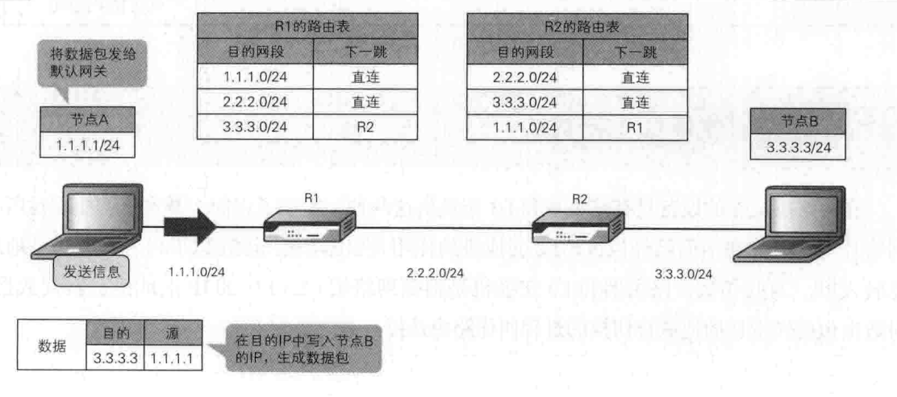

<!-- vscode-markdown-toc -->

* 1. [网络传输基本过程](#)
	* 1.1. [物理信号](#-1)
	* 1.2. [数据链路层](#-1)
		* 1.2.1. [ARP协议](#ARP)
	* 1.3. [网络协议](#-1)
		* 1.3.1. [路由表和交换机](#-1)
		* 1.3.2. [NAT (地址转换协议)](#NAT)
		* 1.3.3. [DHCP协议](#DHCP)
	* 1.4. [传输控制协议](#-1)
* 2. [网络协议模型](#-1)
	* 2.1. [OSI七层协议模型](#OSI)
	* 2.2. [TCP/IP概念层协议模型](#TCPIP)
	* 2.3. [OSI七层协议模型与TCP/IP概念层协议模型功能比较](#OSITCPIP)

<!-- vscode-markdown-toc-config
	numbering=true
	autoSave=true
	/vscode-markdown-toc-config -->
<!-- /vscode-markdown-toc -->
# 网络原理

##  1. 网络传输基本过程
###  1.1. 物理信号  
  同轴光缆传输光信号，光信号与我们0和1的编码如下所示：  
  

传输的任何内容都会转化成二进制的比特流，这个二进制流会经过类似我们电话系统中的`调制解调器`一样，转换成`光信号`，对端再反调解析就行了。  
  当然我们可以使用光缆（比如海底光缆）传输信号，也可以使用电缆传输信号（比如我们的网线），只不过后者有信号衰减，中间需要安装一个特殊的设备就是`中继器`，事实上，我们也不会用电缆传输很远，一般最长不超过100米。再者，我们的物理层有不同的设备，有不同的设备就会有不同的电气标准，比如我们的以太网的LAN标准`IEEE802.3`，又比如我们的`无线WLAN标准802.11`、`802.ac`等等，那我们就需要通过的协议和标准让不同的厂家按照同样的标准来生产，也需要按照相关标准和协议去进行物理层信号的转换，这就是我们物理层协议干的事情。他们解决信号如何在物理设备上传输和解析。

###  1.2. 数据链路层
  物理层仅仅负责将`比特流`转换成`信号`并传递给线缆（光缆、电缆、xxoo缆），而它：  
* 1.不知道信号要发送给谁  
* 2.不在意信号发送中比特信息是否会在某处丢失  
* 3.不知道应用层发送的一条消息的开始和结束（因为是流失传输）

而数据链路层恰好就是去解决这三个问题的。首先我看看数据链路层的协议内容：  

* 8个字节的前导码：告诉对端链路层这是一帧数据的开始，标志了消息的开始和结束。
* 6个字节目的地址（MAC地址）：告诉这一帧是发到哪里去的。
* 6个字节的源地址（MAC地址）：告诉这一帧数据是谁发送的。
* 2字节的类型：
    * 0x0800：ipv4协议
    * 0x0806：ARP协议
    * 0x86DD：ipv6协议  
* 4字节的FCS：Frame Check Sequence，帧校验序列，其实就是CRC校验，发送数据时计算数据部分FCS的值填充在FCS， 对端接收的时候也进行同样的计算，然后进行比较，如果一致则丢弃。

####  1.2.1. ARP协议  
**我们在发送数据的只知道一个目的IP地址，这个目的MAC地址从哪而来？这就需要`ARP`协议了**。  
  “靠吼”！其实就是要知道目的IP地址对应的MAC地址，也就是ARP协议是通过网络层的逻辑IP地址找到对应的物理层的物理MAC地址的协议。它的工作方式，就是主机收到广播（除网关外）发送ARP请求，如果其它端口认为匹配则回复IP和MAC地址，否则就丢弃不理会；如果都没有回复，则认为该IP与该网段不在同一个子网，此时就L2交换机向默认网关发送ARP请求，此时目的MAC地址就是默认网关的MAC地址。简单一句话，就是APR是询问IP地址对应的MAC地址。当然还有一种就是`GARP`协议。

###  1.3. 网络协议   
该协议为了解决'主机'与'主机'之间的通讯.  
  有了`源MAC地址`和`目的MAC地址`，我们只是知道了地址，但是我们并不知道从哪个网口发送出去，其实在每个通信的设备上必须建立一个MAC与网口的对应表，怎么建立的呢？  
  通过上面分析，知道数据链路层只是将同一网段中的节点连接起来而已，如果我们需要连接国外的WEB服务器，由于网段不同，在数据链路层这个层面是无法连接起来的。也就是说如果路途很远，用“大喊”一声的方式无法建立通信的。那网络层是如何把一个个不同的网段连接成一个大的“互联网”的呢？先来看看网络层对数据的封装：  
  
  在网络层加了IP地址信息，就是有了源IP地址和目的IP地址，IP地址是一个逻辑地址，IP地址是由4个字节32位组成（ipv4），当然开篇我们就介绍了有IPv6地址。比如IP地址有192.168.1.1，IP地址都是由两个部分组成，一个是网络部分，一个是主机部分，他们是使用子网掩码区分的，比如子网掩码是255.255.0.0的话，那么网络部分就是192.168，而主机部分就是1.1，网络部分说明的网段，主机部分标明了主机所在网段的那一台主机。当然，IP地址会有一些特殊的地址值存在，如：
* 广播地址：如192.168.255.255，用来发送广播数据。
* 环回地址：如127.0.0.1（实际上只要第一个字节是127就可以，后面是啥都无所谓）。**如果我们是发送一个环回IP地址的话，我们可以用`wirshark`去抓数据看看，实际上是抓不到数据的**。  

####  1.3.1. 路由表和交换机  
**有了IP地址，那如何从一个网段发送到另外一个网段呢**？  
  这里就不得不提路由表和L3交换机的了。在`L3交换机`中保存了一个路由表，比如下文要把1.1.1.1/24节点的数据发送给3.3.3.3/24节点，那么他们的发送是通过路由表找到下一跳的位置。如图：  
   

总结一下，**`L2交换机`利用`MAC地址表`解决了同一网段的交换，`L3交换机`利用了`ARP缓存信息表`和`路由表`解决了跨网段的数据交换**。在通信过程中，目的IP地址一直不变，但是`源IP地址`会不断修改为当前发送的节点（包含交换设备），MAC地址每跨一个网段就要去变化一次。那`L3交换机`上的`路由表`是如何建立的呢？ 

* 手动建立  
就是手工去交换机上建立路由表，但是这种方式对于大型网络并不好，因为如果下一跳的地址信息发生变化或者有新增网段，我们就必须去修改本端的路由表。
* 自动建立  
使用路由协议。如何使用路由协议去建立路由表跟上面提到的度量值有关，而且有多重路由协议，自行查阅。  

####  1.3.2. NAT (地址转换协议)
**有了`路由协议`和`ARP协议`是不是就是万事大吉了呢**？比如，有台主机的ip地址是`192.168.1.109`，现在想向阿里云服务`47.106.79.26`发送数据，而`47.106.79.26`是一个公网IP地址，这是能通的；但`47.106.79.26`的数据如果在网络层填写的目的IP为`192.168.1.109`，如此还能传输吗？  
  其实有一个路由跟踪命令`traceroute`，我现在本地`192.168.1.109`上敲入`traceroute 47.106.79.26`，结果显示如下：  
  

但是在阿里云上去`traceroute 192.168.1.109`显示却如下：  
 

**这里就必须谈到了一个协议--NAT(地址转换协议)，这个协议，其实也是节省了公网IP地址资源**。

####  1.3.3. DHCP协议
  在网络层还有一种很重要的协议就是`DHCP协议`，**DHCP协议是用来给尚未分配IP地址的机器分配IP地址的**，怎么做的呢？  
  简单理解下，A大吼一声："我没有IP地址，可以给我分配一个IP地址"？那么将收到的那一方DHCP服务器会A分配一个IP地址。特别要强调的是，**因为还没有一个IP地址，所以只能去广播一个分配IP地址的请求**。

###  1.4. 传输控制协议
  有了网络层，我们解决了`主机`与`主机`之间的通信，但是如果我们同一台主机有多个应用程序，那么返回的数据到底由那个应用程序接收呢？这是网络层解决不了的，如果网络上有`丢包`或者`乱序`，这也是网络层解决不了的，那如何解决呢？那便是靠`端口`。  
  首先在传输层定义了一个端口号，这个端口号与一个进程进行了绑定，也就是识别了进程从哪个端口发送数据出去，比如我们来看看传输层的`TCP协议`和`UDP协议`的报头： 
* TCP协议报头

* UDP协议报头  
  

##  2. 网络协议模型 
###  2.1. OSI七层协议模型

###  2.2. TCP/IP概念层协议模型  

###  2.3. OSI七层协议模型与TCP/IP概念层协议模型功能比较
  

> 来自：  
> 动脑学院.lee老师