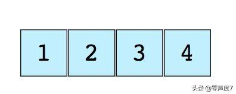
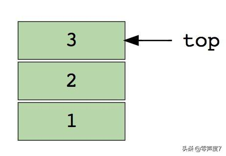
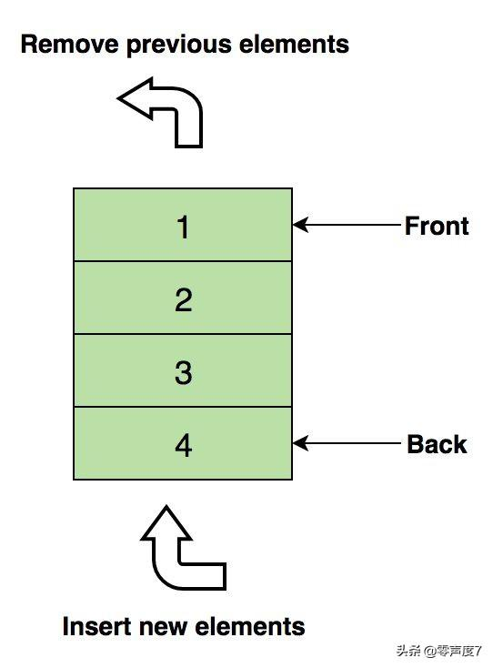
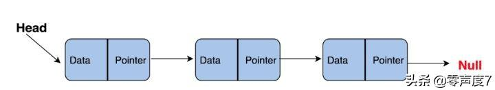
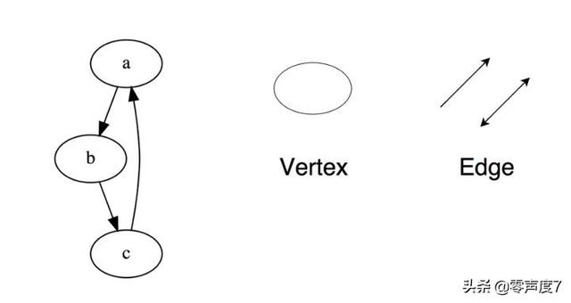
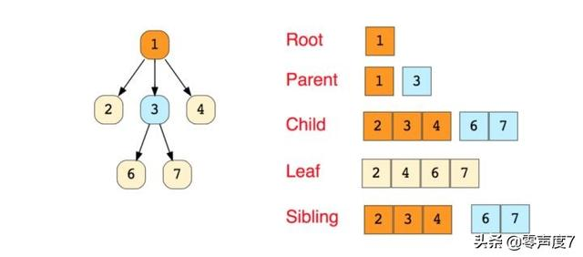
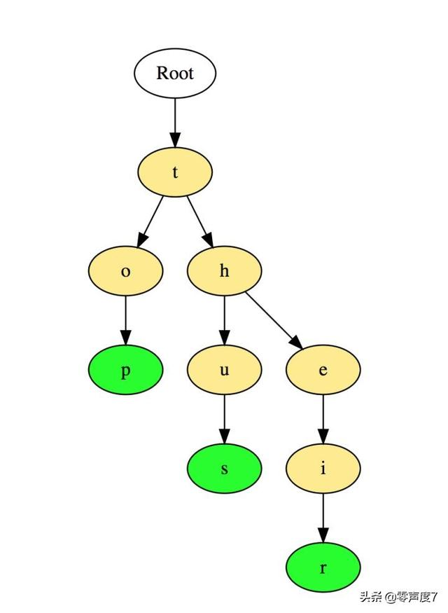
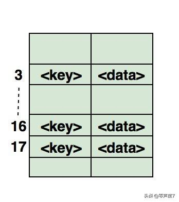

[TOC]

```c
《Algorithms + Data Structures = Programs》（算法+数据结构=程序） 
​                                          --- Niklaus Wirth
```
# 1.什么是数据结构？

​	**数据结构就是一个容器，以某种特定的布局存储数据**。这个“布局”使得数据结构在某些操作上非常高效，在另一些操作上则不那么高效。我们的基本目标就是理解数据结构，能为手头的问题选择最优的数据结构。

# 2.为什么需要数据结构？

​	由于数据结构用来以有组织的形式存储数据，且数据是计算机科学中最重要的实体，因此数据结构的真正价值显而易见。无论解决什么问题，都必须以这种或那种方式处理数据，如：员工的工资，股票价格，购物清单，甚至简单的电话簿等等。

​	根据不同的场景，数据需要以特定格式存储。目前有一些数据结构可以满足我们以不同格式存储数据的需求。

# 3.常用的数据结构

## 3.1. 数组



​	最简单、最广泛、最基础的数据结构，且“堆栈”和“队列”都源自数组。

### 1.基本操作

```c
void insert(int pos, data_t value); //在给定索引位置插入一个元素
data_t get(int pos); 								//返回给定索引位置的元素
void delete(int pos);								//删除给定索引位置的元素
int size();													//获取数组内所有元素的总数
```

### 2.面试提问

- 找到数组中第二小的元素

- 找到数组中第一个没有重复的整数

- 合并两个分类数组

- 重新排列数组中的正值和负值

  

## 3.2. 堆栈



​	按照最后的状态排列在先的顺序将工作的先前状态（限于特定数字）存储在内存中。把堆栈看作一堆垂直排列的书籍。为了获得位于中间位置的书，你需要拿掉放在它上面的所有书籍。这就是 **LIFO（后进先出）**方法的工作原理。如上图，3为栈顶，1为栈底。

​	建议**连续空间／数组**实现。

### 1. 基本操作

```c
typedef struct _stack {
      data_t *base;
      int top;
      int capacity;
} stack_t;

void push(stack_t *s, const data_t &data);	//在顶部插入元素
void pop(stack_t *s, data_t *data);				//从堆栈中删除后返回顶部元素
bool empty(stack_t *s);										//判断堆栈为空
bool top(stack_t *s, data_t *data);				//返回顶部元素，但不从堆栈中删除
```

### 2. 面试提问

- 使用堆栈计算后缀表达式
- 对堆栈中的值进行排序
- 检查表达式中的括号是否平衡

### 3. 应用场景

* 撤销（undo）

  

## 3.3. 队列



​	与堆栈类似，队列以顺序方式存储元素，但队列采用 FIFO 方法，即 **First in First Out（先入先出）**。比如生活中的例子：一列人在售票亭等候。如果有新人来，他们是从末尾加入队列，而不是在开头——站在前面的人将先买到票然后离开队列。

​	建议采用**链表**实现。

### 1. 基本操作

```c
typedef struct _queue_node {
       data_t data ;
       struct _queue_node* next;
} queue_node_t;

typedef struct _queue {
       queue_node_t *front;
       queue_node_t *tail;
       int size;
}queue_t;

void enqueue(queue_t *q, const data_t &data);	//向队列末尾插入元素
void dequeue(queue_t *q, data_t *data);				//从队列头部移除元素
bool empty(queue_t *q);												//如果队列为空，则返回 true
void top(queue_t *q, data_t *data);						//返回队列的第一个元素
int size();																		//返回队列的大小
```

### 2. 面试提问

- 使用队列来实现堆栈
- 颠倒队列中前 k 个元素的顺序
- 使用队列生成从 1 到 n 的二进制数

### 3. 应用场景

* 读写线程时共用队列

  

## 3.4. 链表



​	链表在内存分配、内部结构以及如何执行插入和删除的基本操作方面与数组有所不同。链表就像一个节点链，其中每个节点包含数据和指向链中后续节点的指针等信息。有一个头指针，指向链表的第一个元素，如果列表是空的，那么它只指向 null 或不指向任何内容。

​	常分为：**单链表（单向）**和 **双链表（双向）**

### 1. 基本操作

```c
typedef struct _link_node {
       data_t data ;
       struct _link_node* next;
} link_node_t;

void insert_at_end(link_node_t *l, const data_t &data);	//在链表末尾插入指定元素
void insert_at_begin(link_node_t *l, const data_t &data);//在链表头部插入指定元素
bool delete(link_node_t *l, const data_t &data);				//从链表中删除指定元素
void delete_at_head(link_node_t *l, data_t *data);		  //删除链表的第一个元素
int search(link_node_t *l, const data_t &data);					//返回链表中的指定元素
bool empty(link_node_t *l);															//如果链表为空，则返回 true
```

### 2. 面试提问

- 翻转链表
- 检测链表中的循环：快慢指针
- 返回链表中倒数第 n 个节点
- 移除链表中的重复值

### 3. 应用场景

* 文件系统

* 哈希表

* 邻接表

  

## 3.5. 图



​	图就是一组节点，以网络的形式互相连接。节点也被称为顶点（vertices）。一对（x,y）就叫做一个边，表示顶点 x 和顶点 y 相连。一个边可能包含权重/成本，显示从顶点 x 到 y 所需的成本。

### 1.图的分类

* 图的类型：**无向图**和**有向图**
* 在编程语言中，图的两种形式：**邻接矩阵**和**邻接列表**
* 图遍历算法：**广度优先搜索**和**深度优先搜索**

### 2.基本操作

```c
略
```

### 3.面试提问

- 实现广度优先搜索和深度优先搜索
- 检查一个图是否为树
- 计算一张图中的边的数量
- 找到两个顶点之间的最短路径


## 3.6. 树

​	树是一种层级数据结构，包含了连接它们的顶点（节点）和边。树和图很相似，但二者有个很大的不同点，即树中没有循环。树广泛应用在人工智能和复杂的算法中，为解决各种问题提供高效的存储机制。下图是一个简单的树，以及在树型数据结构中所用的基本术语：



### 1. 树的种类

- N 叉树
- 平衡树
- **二叉树**
- **二叉搜索树**
- 平衡二叉树
- 红黑树
- 2-3 树

### 2. 基本操作

```c
/*平衡二叉树*/
#define BSTREE_ENTRY(name, type)\
struct name { struct type* left; struct type* right; }

typedef struct _bstree_node {
    data_t data;
    BSTREE_ENTRY(, _bstree_node);
} bstree_node_t;

typedef struct _bstree {
    bstree_node_t *root;
} bstree_t;

void traversal(bstree_node_t *node);														 //遍历
void insert(bstree_t *T, const data_t& data);                    //增
void delete(bstree_t *T, const data_t& data);                    //删
void update(bstree_t *T, const data_t& src, const data_t& dest); //改
bstree_node_t* search(bstree_t *T, const data_t& data);          //查
```

### 3. 面试提问

- 找到一个二叉树的高度
- 找到一个二叉搜索树中第 k 个最大值
- 找到距离根部“k”个距离的节点
- 找到一个二叉树中给定节点的祖先（ancestors）


## 3.7. 字典树（Tries，这是一种高效的树，有必要单独列出来）

​	字典树，也叫“前缀树”，是一种树形结构，在解决字符串相关问题中非常高效。其提供非常快速的检索功能，常用于搜索字典中的单词，为搜索引擎提供自动搜索建议，甚至能用于IP路由选择。如“top”“thus”和“their”这三个词在字典树中的存储：



​	这些单词以从上到下的方式存储，其中绿色节点“p”，“s”和“r”分别表示“top”，“thus”和“their”的末尾。

### 1. 基本操作

```c
略
```

### 2. 面试提问

- 计算字典树中的总字数
- 打印存储在字典树中的所有单词
- 使用字典树对数组的元素进行排序
- 使用字典树从字典中形成单词
- 构建一个T9字典


## 3.8. 哈希表

​	散列是一个用于唯一标识对象并在一些预先计算的唯一索引（称为“密钥”）存储每个对象的过程。因此，对象以“键值”对的形式存储，这些项的集合被称为“字典”。可以使用该键值搜索每个对象。有多种不同的基于哈希的数据结构，但最常用的数据结构是哈希表。

​	哈希表通常使用数组实现。

​	下图展示了如何在数组中映射哈希。该数组的索引是通过哈希函数计算的。



### 1.哈希的三个因素

- 哈希函数
- 哈希表的大小
- 碰撞处理方法

### 2. 面试提问

- 找到数组中的对称对
- 追踪遍历的完整路径
- 查看一个数组是否为另一个数组的子集
- 检查给定数组是否不相交


> 参考：
>
> [零声度7.如何在最短的时间内搞定数据结构和算法，应付面试](https://www.toutiao.com/a6771658408144667150/?tt_from=copy_link&utm_campaign=client_share&timestamp=1576666913&app=news_article_lite&utm_source=copy_link&utm_medium=toutiao_ios&req_id=201912181901520101290340392903C054&group_id=6771658408144667150)