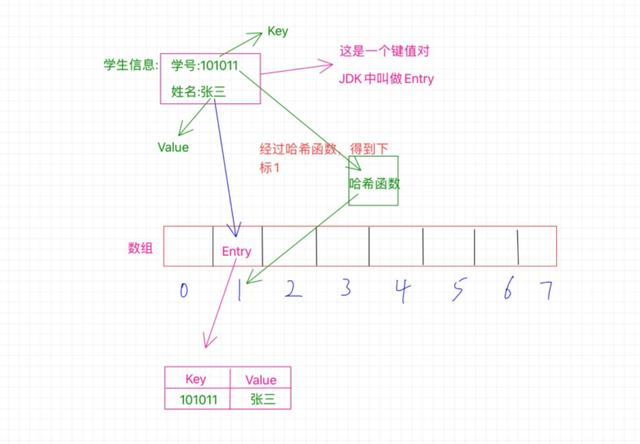
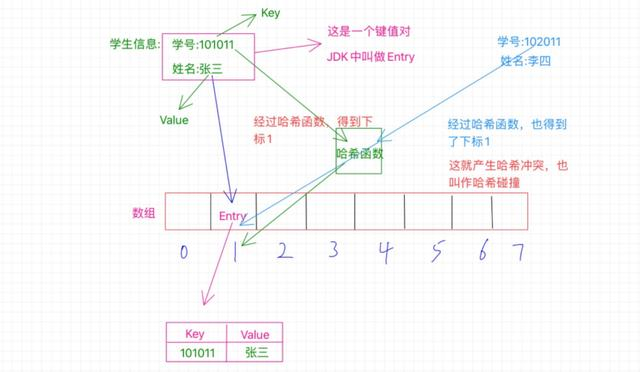
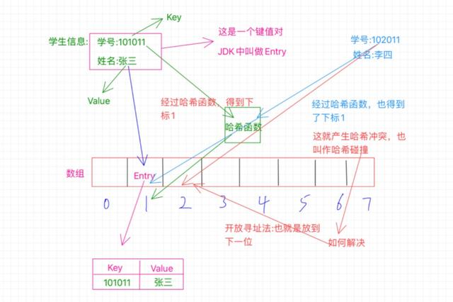
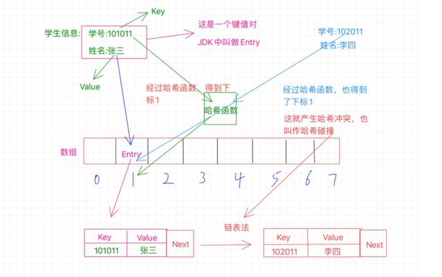

[TOC]

# 1.概念

## 1.1. 哈希算法的组成：散列表和散列函数（哈希表、哈希函数）

​	百度百科：**散列表**（**Hash table**，也叫**哈希表**），是根据键（Key）而直接访问在内存存储位置的数据结构。也就是说，它通过计算一个关于键值的函数，将所需查询的数据映射到表中一个位置来访问记录，这加快了查找速度。这个映射函数称做散列函数，存放记录的数组称做**散列表**。

​	一句话：**“哈希表是一种数据结构，哈希函数即根据一个key值来直接访问哈希表数据的方法”**，特点就是**查找速度快**。代价则是**以空间换时间**


## 1.2. 哈希表的本质：数组

​	哈希表的核心数据结构就是数组。它的底层实现一般是：

* 数组 + 链表： 	（拉链法-解决哈希冲突）

* 数组 + 二叉树

## 1.3. 哈希冲突

​	当对不同的key进行哈希函数运算时，得到了同一个哈希表的位置，则称**哈希冲突**

# 2.原理

​	例如：假设有一个数组array[100]，其中第95个位置存放了一个数据entry{key, value}，即array[95]=entry。一般地，为了找到这个entry，我们需要从头到尾循环遍历一遍数组array，最后在下标为95的位置停下。

​	有没有办法不需要循环遍历，即可迅速找到数组位于下标为96的数据呢？那就可以采用hash, 伪代码如下：

```c
//1.数据
struct Entry{key, value};
//2.hash表
Entry array[100] = {entry0, ..., entry95, ..., entry100};
//3.哈希函数: 代替了数组的循环遍历，根据key值直接映射到hash表的位置
int hash(key) {
  int idx;
  *** 过程略：idx = 95 ***
  return idx;
}

//查找：
entry = array[hash(key)];
```

如图：



## 2.1. 哈希表的建立

### 2.1.1. 哈希函数

​	有哪些哈希函数？

#### 2.1.1.1. [常用的字符串哈希函数](常用的字符串哈希函数.md)

#### 2.1.1.2. 取留余数法


### 2.1.2. 哈希冲突(哈希碰撞)



​	如上图所示：学号为101011的张三，经过对key为101011进行哈希函数计算后，得到哈希表的位置为1；而学号为102011的李四，经过对key为102011进行哈希函数计算后，也得到了哈希表的位置为1。可是这个位置之前已经被张三占了啊，这怎么办？这种情况就是**哈希冲突**或者也叫**哈希碰撞**。


#### 2.2.2.1. 开放寻址法：如ThreadLocal

​	既然位置被占了，那就看看该位置的后一个位置是否可用。也就是1的位置被占用了，那就看看2的位置是否可用，如果没有被占用，那就放到这里呗。当然，也有可能2的位置也被占用了，那咱就继续往下找，看看3的位置... 依次类推，直到找到空位置。如图：



* 举例：

​		Java中的**ThreadLocal**就是利用了开放寻址法。


#### 2.2.2.2. 拉链法: HashMap

​	拉链法不换位置。如果现在张三和李四都要放在1找个位置上，但是张三先来，已经占了这个位置，那李四怎么办呢？解决办法就是**链表**，此时这个1的位置存放的不单单是之前的那个Entry了，而是额外的保存了一个next指针，这个指针指向数组外的另外一个位置，将李四安排在这里，然后张三那个Entry中的next指针就指向李四的这个位置，也就是保存的这个位置的内存地址。如果还有冲突，那就把又冲突的那个Entry放在一个新位置上，然后李四的Entry中的next指向它，这样就形成了一个链表。如图：



* 举例：

  HashMap就是使用了这种方法

  

##### 问题1:  若冲突过多，链表会变得比较长，怎么处理呢？

  	拿java集合类中的HashMap举个例子，如果这里的链表长度大于等于8的话，链表就会转换成树结构，当然如果长度小于等于6的话，就会还原链表。以此来解决链表过长导致的性能问题。

​	为啥是小于等于6啊，咋不是7? 这样设计是因为中间有个7作为一个差值，来避免频繁的进行树和链表的转换，因为转换频繁也是影响性能的啊。


#### 2.2.2.3. 取表法

​	单独建立一张冲突表。当发生冲突时，将冲突的数据放置冲突表中。


### 2.2.3. 哈希表的扩容

​	一般会有一个增长因子的概念，也叫作负载因子，简单点说就是已经被占的位置与总位置的一个百分比，比如一共十个位置，现在已经占了七个位置，就触发了扩容机制，因为它的增长因子是0.7，也就是达到了总位置的百分之七十就需要扩容。

​	还拿HashMap来说，当它当前的容量占总容量的百分之七十五的时候就需要扩容了。而且这个扩容也不是简单的把数组扩大，而是新创建一个数组是原来的2倍，然后把原数组的所有Entry都重新Hash一遍放到新的数组。


## 2.2. 哈希表的读取


​	比如现在要通过学号102011来查找学生的姓名“李四”，怎么操作呢？以拉链法为例：

* 首先，通过学号利用哈希函数得出位置1；

* 然后，去位置1拿数据，拿到这个Entry之后看看这个Entry的key是不是我们的学号102011；

* 如果不是要找的key（比如找到了101011，什么鬼？），则根据这个Entry的next直到下一给位置，再比较key，则成功找到李四。

# 3.优缺点


> 参考
> [达升笑聊IT.一文彻底搞定哈希表](https://www.toutiao.com/a6769348065858945543/?tt_from=copy_link&utm_campaign=client_share&timestamp=1576730168&app=news_article_lite&utm_source=copy_link&utm_medium=toutiao_ios&req_id=20191219123608010129032201040AC0C3&group_id=6769348065858945543)