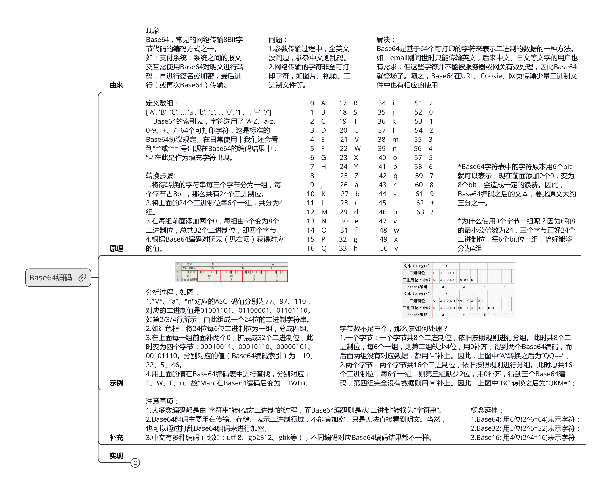

[TOC]

# 一张脑图帮你看懂base64编码(解码)的源代码

## 1.Base64原理剖析



## 2.Base64代码实现

### 2.1.Base64编码

```c++
inline std::string b64_encode(const std::string &s)
{
	typedef unsigned char u1;
	static const char lookup[] = "ABCDEFGHIJKLMNOPQRSTUVWXYZabcdefghijklmnopqrstuvwxyz0123456789+/";
	const u1 * data = (const u1 *) s.c_str();
	std::string r;
	r.reserve(s.size() * 4 / 3 + 3);
	for (size_t i = 0; i < s.size(); i += 3) {
		unsigned n = data[i] << 16;
		if (i + 1 < s.size()) n |= data[i + 1] << 8;
		if (i + 2 < s.size()) n |= data[i + 2];

		u1 n0 = (u1)(n >> 18) & 0x3f;
		u1 n1 = (u1)(n >> 12) & 0x3f;
		u1 n2 = (u1)(n >>  6) & 0x3f;
		u1 n3 = (u1)(n      ) & 0x3f;

		r.push_back(lookup[n0]);
		r.push_back(lookup[n1]);
		if (i + 1 < s.size()) r.push_back(lookup[n2]);
		if (i + 2 < s.size()) r.push_back(lookup[n3]);
	}
	for (int i = 0; i < (3 - s.size() % 3) % 3; i++)
		r.push_back('=');
	return r;
}
```

### 2.2.Base64解码

```c++
inline std::string b64_decode(const std::string &s)
{
	typedef unsigned char u1;
	static const char lookup[] = ""
		"\x80\x80\x80\x80\x80\x80\x80\x80\x80\x80\x80\x80\x80\x80\x80\x80" // 0x00
		"\x80\x80\x80\x80\x80\x80\x80\x80\x80\x80\x80\x80\x80\x80\x80\x80" // 0x10
		"\x80\x80\x80\x80\x80\x80\x80\x80\x80\x80\x80\x3e\x80\x80\x80\x3f" // 0x20
		"\x34\x35\x36\x37\x38\x39\x3a\x3b\x3c\x3d\x80\x80\x80\x00\x80\x80" // 0x30
		"\x80\x00\x01\x02\x03\x04\x05\x06\x07\x08\x09\x0a\x0b\x0c\x0d\x0e" // 0x40
		"\x0f\x10\x11\x12\x13\x14\x15\x16\x17\x18\x19\x80\x80\x80\x80\x80" // 0x50
		"\x80\x1a\x1b\x1c\x1d\x1e\x1f\x20\x21\x22\x23\x24\x25\x26\x27\x28" // 0x60
		"\x29\x2a\x2b\x2c\x2d\x2e\x2f\x30\x31\x32\x33\x80\x80\x80\x80\x80" // 0x70
		"\x80\x80\x80\x80\x80\x80\x80\x80\x80\x80\x80\x80\x80\x80\x80\x80" // 0x80
		"\x80\x80\x80\x80\x80\x80\x80\x80\x80\x80\x80\x80\x80\x80\x80\x80" // 0x90
		"\x80\x80\x80\x80\x80\x80\x80\x80\x80\x80\x80\x80\x80\x80\x80\x80" // 0xa0
		"\x80\x80\x80\x80\x80\x80\x80\x80\x80\x80\x80\x80\x80\x80\x80\x80" // 0xb0
		"\x80\x80\x80\x80\x80\x80\x80\x80\x80\x80\x80\x80\x80\x80\x80\x80" // 0xc0
		"\x80\x80\x80\x80\x80\x80\x80\x80\x80\x80\x80\x80\x80\x80\x80\x80" // 0xd0
		"\x80\x80\x80\x80\x80\x80\x80\x80\x80\x80\x80\x80\x80\x80\x80\x80" // 0xe0
		"\x80\x80\x80\x80\x80\x80\x80\x80\x80\x80\x80\x80\x80\x80\x80\x80" // 0xf0
		"";
	std::string r;
	if (!s.size()) return r;
	if (s.size() % 4)
		throw std::runtime_error("Invalid base64 data size");
	size_t pad = 0;
	if (s[s.size() - 1] == '=') pad++;
	if (s[s.size() - 2] == '=') pad++;

	r.reserve(s.size() * 3 / 4 + 3);
	for (size_t i = 0; i < s.size(); i += 4) {
		u1 n0 = lookup[(u1) s[i+0]];
		u1 n1 = lookup[(u1) s[i+1]];
		u1 n2 = lookup[(u1) s[i+2]];
		u1 n3 = lookup[(u1) s[i+3]];
		if (0x80 & (n0 | n1 | n2 | n3))
			throw std::runtime_error("Invalid hex data: " + s.substr(i, 4));
		unsigned n = (n0 << 18) | (n1 << 12) | (n2 << 6) | n3;
		r.push_back((n >> 16) & 0xff);
		if (s[i+2] != '=') r.push_back((n >> 8) & 0xff);
		if (s[i+3] != '=') r.push_back((n     ) & 0xff);
	}
	return r;
}
```

> 参考：[一篇文章彻底弄懂Base64编码原理](https://blog.csdn.net/wo541075754/article/details/81734770)