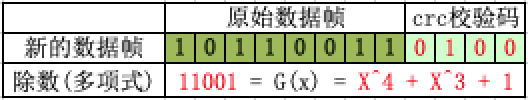
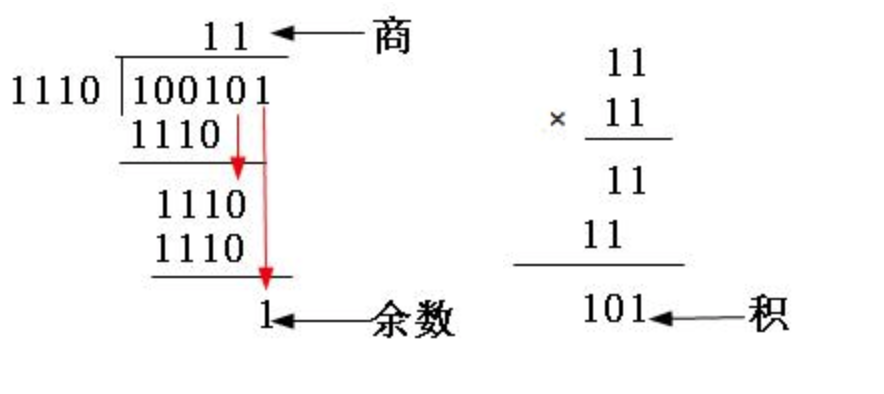
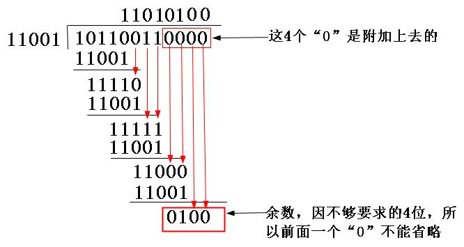
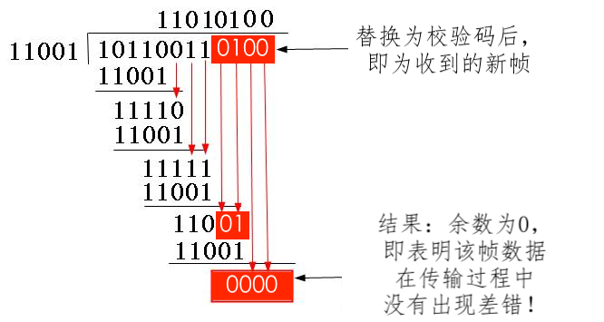

[TOC]

# 细品CRC校验原理

## 1.CRC校验的原理



​	**根本思想**：发送端欲发送一个**原始数据帧**到接收端，首先发送端和接收端要选定一个共同的**除数**；然后发送端通过这个除数计算出一个**校验码**，附加到原始数据帧的后面组成一个**新的数据帧**，再将新的数据帧发往接收端；到达接收端后，将收到新的数据帧采用“模2除法”除以选定的**除数**，若结果有余数不为0则表明该数据帧在传输过程中出现了差错！否则，成功，且右移“**除数**位数 - 1”位得到的结果即为**原始数据帧**。

​	【**说明**】：“模2除法”与“算术除法”类似，但它既不向上位借位，也不比较除数和被除数的相同位数值的大小，只要以相同位数进行相除即可。相当于二进制中的逻辑异或运算，即比较后，两者对应位相同则结果为“0”，不同则结果为“1”

```shell
#1.模2加法: (无进位，也无借位)
	1 + 1 = 0,
	0 + 1 = 1，
	0 + 0 = 0
	
#2.模2减法: (无进位，无借位)
  1 - 1 = 0，
  0 - 1 = 1，
  1 - 0 = 1，
  0 - 0 = 0
```

模2除法和模2乘法示例，如图：




 CRC校验原理的具体步骤如下：

* **1.选择除数**：

  ​	一个用于在接收端进行校验时，对接收的新帧进行除法运算的**除数**。注意这是二进制比较特串，通常是以多项方式表示，所以CRC又称**多项式编码方法**，这个多项式也称之为“**生成多项式**”。这个除数可以随机选择，也可按标准选择，具体在后面介绍。

* **2.计算校验码**：

  ​	看所选定的**除数**二进制位数（假设为k位），然后在要发送的**原始数据帧**（假设为m位）后面加上k-1位“0”，得到**新帧**（一共m+k-1位）；该新帧再以“模2除法”方式除以上面的**除数**，最后得到的**余数**（也是二进制的比特串）就是该帧的**CRC校验码**，也称之为**FCS**（**帧校验序列**）。

  ​	但要注意的是，<font color=red>余数的位数一定要是比除数位数只能少一位，哪怕前面位是0，甚至是全为0（附带好整除时）也都不能省略。</font>

* **3.带校验码的新帧**：

  ​	将上面的**校验码**附加在**原始数据帧**后面形成**新的数据帧**，发送端即发生这个“新的数据帧”到接收端。注意：此时“新的数据帧（m位）”和上一步的“新帧（m+k-1位）”不同。

* **4.校验结果**：

  ​	接收端收到“新的数据帧”后，再将其以“模2除法”方式除以前面选择的**除数**。如果余数为0，则表明该帧在传输过程中没出错，否则出现了差错！

总而言之，CRC校验中有两个关键点：一是要预先确定一个发送端和接收端都用来作为**除数**的二进制比特串（或多项式）；二是把原始帧与上面选定的除进行二进制除法运算，**计算出FCS**。前者可以随机选择，也可按国际上通行的标准选择，但最高位和最低位必须均为“1”，如在IBM的SDLC（同步数据链路控制）规程中使用的CRC-16（也就是这个除数一共是17位）生成多项式g（x）= x16 + x15 + x2 +1（对应二进制比特串为：11000000000000101）；而在ISO HDLC（高级数据链路控制）规程、ITU的SDLC、X.25、V.34、V.41、V.42等中使用CCITT-16生成多项式g（x）=x16 + x15 + x5 +1（对应二进制比特串为：11000000000100001）。


## 2.CRC的计算示例

​	由以上分析可知，既然除数是"随机"或者"按标准选定"的，所以CRC校验的关键是如何求出**余数**(即CRC校验码)。下面举例说明计算过程：
​	假设选择的CRC生成多项式为G(X) = X^4 + X^3 + 1，要求出二进制序列10110011的CRC校验码。

**计算过程**：

* 1.将生成多项式G(x) = X^4 + X^3 + 1 转换成二进制数：11001

  ```shell
  	由G(x) = X^4 + X^3 + 1可知：它一共是5位（总位数 = 最高位的幂次 + 1，即 4 + 1 = 5），再根据多项式各项的含义（多项式只列出二进制值为1的位，即该二进制数的第4位、第3位、第0位的二进制均为1，其它位均为0）得知，该二进制比特串为11001
  #详细解题步骤，如下:
  	G(x) = X^4 + X^3 + 1
  	     = 1 * X^4 + 1 * X^3 + 0 *X^2 + 0 * X^1 + 1
  	     = 11001
  ```

* 2.计算CRC校验码：0100

  ```shell
  	因为生成多项式的位数为5，根据前面的介绍，得知CRC校验码的位数为4（校验码的位数 = 生成多项式的位数 - 1 = 生成多项式的最高次数 = 4）；
  	又因原数据帧为10110011，则在它后面再加4个0，得到101100110000；
  	最后，把这个数以“模2除法”方式除以生成多项式，得到的余数，即为CRC校验码（0100）。
  ```

  如图：

  

* 3.构造新的数据帧：10110011 0100

  ```shell
  把上一步计算得到的CRC校验码0100，替换原始帧101100110000后面的四个“0”，得到新帧101100110100。再把这个新帧发送到接收端
  ```

* 4.校验结果：

  ```shell
  当以上新帧到达接收端后，接收端会把这个新帧再用上面选定的除数11001以“模2除法”方式去除，验证余数是否为0，如果为0，则证明该帧数据在传输过程中没有出现差错，否则出现了差错
  ```

  如图：

  


**总结计算过程**：

```shell
# 假设选择的CRC生成多项式为G(X) = X^4 + X^3 + 1，要求出二进制序列10110011的CRC校验码
# 解：
1. G(X) = X^4 + X^3 + 1
        = 1 * X^4 + 1 * X^3 + 0 *X^2 + 0 * X^1 + 1
	      = 11001
2.数据补充4个0（多项式G(x)的最高位为4），即：
		data = 10110011 0000
3.模2求余：
		crc = data % G(x) 
				= 101100110000 % 11001
				= 0100
4.构造带crc的数据： 
		data_crc = data & crc
						 = 10110011 0000 & 0100
						 = 10110011 0100
5.验证结果：
	ret = data_crc % G(X)
	    = 10110011 0100 % 11001
	    = 0
	if (ret) "验证成功！"
```


## 3.CRC的c代码实现

### 3.1.定义

```c
//CRC-CCITT (XModem), e.g:
//G(x) = X^16 + X^12 + X^5 + X^0
//     = 1*X^16 + 0*X^15 + ... + 0*^X13 + 1*X12 + ... + 1*X^5 + ... + X^0
//     = 0001 0001 0000 0010 0001
//     = 0x11021
#define GX 0x11021
typedef unsigned int UINT32;

UINT32 jvt_crc_code_16(const UINT32 data, UINT32 *crc);
UINT32 jvt_crc_decode_16(const UINT32 data);
```

### 3.2.CRC编码（对应发送端）

 ```c
UINT32 jvt_crc_code_16(const UINT32 data, UINT32 *crc)
{
    UINT32 temp = 0;
    UINT32 ax = 0;
    UINT32 bx = 0;
    UINT32 cx = 15;

    temp = data;        //eg: 0xAB12 = 0000 0000 0000 0000 1010 1011 0001 0010

    temp <<= 16;        //信息左移16位, eg: 0xAB120000 = 1010 1011 0001 0010 0000 0000 0000 0000
    ax = temp >> 15;    //将前17位存在ax中, 准备与多项式GX做异或操作, eg: 0x15624 = 0000 0000 0000 0001 0101 0110 0010 0100
    temp = 0;

    for (cx = 15; cx > 0; cx--)
    {
        if (((ax >> 16) & 0x1) == 0x1)
            ax ^= GX;

        ax <<= 1;        
        bx = temp >> 31;        
        ax += bx;        
        temp <<= 1;
    }

    if (((ax >> 16) & 0x1) == 0x1)//最后一位的异或操作
        ax ^= GX;

    *crc = ax; //crc 为根据信息内容data和CRC_CCITT的生成多项式GX求出的CRC码。
    
    //附加crc的新数据
    return (data << 16) + (*crc);
}
 ```

### 3.3.CRC解码（对应接收端）

```c
UINT32 jvt_crc_decode_16(const UINT32 data_crc)
{
    UINT32 data = 0;
    UINT32 ax = 0;
    UINT32 bx = 0;
    UINT32 cx = 0;

    data = data_crc;//data_crc为信息内容
    data <<= 16;
    ax = data >> 15;
    data <<= 17;
    for (cx = 15; cx > 0; cx--)
    {
        if (((ax >> 16) & 0x1) == 0x1)
            ax ^= GX;

        ax <<= 1;
        bx = data >> 31;
        ax += bx;
        data <<= 1;
    }
    if (((ax >> 16) & 0x1) == 0x1)
        ax ^= GX;

    return ax; //ax 加密信息data_crc模2除多项式GX的余数
}
```

### 3.4.测试验证

```c
int main ()
{
    UINT32 data = 0xAB12;
    UINT32 crc = 0;
    UINT32 data_crc = 0;
    UINT32 crc_ret = 0;
    const UINT32 N = 16;

    //1.发送端
    printf("--------- 1.对将发送的数据进行CRC编码 ---------\n");
    data_crc = jvt_crc_code_16(data, &crc);
    printf("原始数据:%x\n", data);
    printf("多项式信息:%x\n", GX);
    printf("生成CRC校验码:%x\n", crc);
    printf("带CRC的新数据:%x\n", data_crc);

    //2.接收端
    printf("\n--------- 2.对接收到到数据进行CRC校验 ---------\n");
    data = data_crc >> N;
    printf("带CRC的原始信息:%x，实际原始信息: %x\n", data_crc, data);
    crc_ret = jvt_crc_decode_16(data);
    // printf("CRC校验码:%x\n", crc_ret);
    printf("多项式信息:%x\n", GX);
    printf("最后模2除结果:%x\n", crc_ret);

    data_crc <<= N;
    data_crc >>= N;
    printf((data_crc ^ crc_ret) == 0 ? "\n传输成功！\n" : "\n传输错误！\n" );

    return 0;
}
```


> 巨人的肩膀：
> [CRC码计算及校验原理的最通俗诠释](https://blog.csdn.net/lycb_gz/article/details/8201987)
> [CRC校验 C语言代码实现](https://blog.csdn.net/Shayne_Lee/article/details/88087518?utm_medium=distribute.wap_relevant.none-task-blog-BlogCommendFromMachineLearnPai2-4.nonecase&depth_1-utm_source=distribute.wap_relevant.none-task-blog-BlogCommendFromMachineLearnPai2-4.nonecase)
>
> 在线验证工具：
> [On-line CRC calculation and free library](http://www.ip33.com/crc.html)
> [CRC(循环冗余校验)在线计算](https://www.lammertbies.nl/comm/info/crc-calculation)

