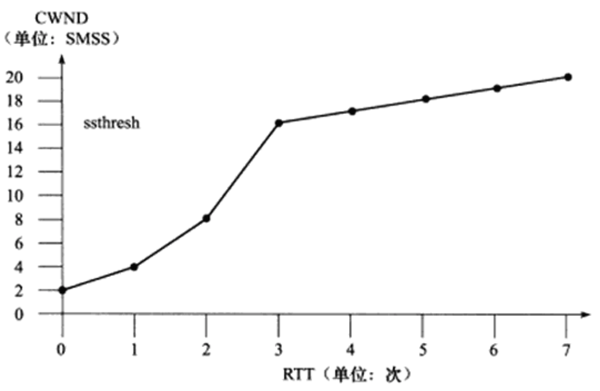

[TOC]

# 拥塞控制  
##  1. 原因和目的
我们在向对端发送数据时，并不是一股脑子任意发送。因为TCP建立连接后，就是建立了一根管道，而这根管道上有很多的工作设备，比如`路由器`和`交换机`等等，他们都会对接收到的TCP包进行缓存，以便实现排序，然后发送。但是这些设备并不是只为一个TCP连接中转数据包，**大量的网络包也许会耗尽存储空间**，从而导致TCP连接的吞吐量急剧下降。为了避免这种情况的发送，TCP的设计必须是一种`无私的协议`，它**必须去探测这种网络拥塞的问题**，否则，一旦出现拥塞（判断是否丢包或者是否发生重传），如果TCP只能做重传，那么重传数据包会使得网络上的包更多，网络的负担更重，于是导致更大的延迟以及丢更多的包，于是会进入一个恶性循环。如果网络上的所有TCP连接都是如此行事的话，那么马上就会形成`“网络风暴”`，会拖垮整个网络，这也是一个灾难。那么TCP就应该能够检测出来这种状况，当拥塞出现时，要做自我牺牲，就像交通阻塞一样，每一辆车都应该把路给让出来，而不是再去抢路了。这说的就是`拥塞控制`。那是如何控制的呢？  

##  2. 方法及步骤 - "慢启动算法"
首先，我们得看TCP是如何充分利用网络的? TCP实际上就是`逐步探测这个通道的传输的最大能力`，这个逐步探索就是`慢启动算法`：新建立的连接不能一开始就大量发送数据包，而是应该根据网络状况，逐步地增加每次发送数据包的量。 

如图:  

具体的工作步骤如下：
###  2.1. 开始“指数增长cwnd”
* 1.`发送方`维护一个`拥塞窗口`，刚开始时这个拥塞窗口（cwnd，congestion window）设置为1，这个1代表一个MSS个字节。  

* 2.如果每收到一个ACK，那么就`指数增长这个cwnd（2,4,8,16,32,64）`等；  

* 3.实际上不会这么一直指数级增长下去，TCP会设置一个`慢启动的阈值`(ssthresh，slow start threshold，65535个字节) ，当cwnd >= ssthresh时，进入`拥塞避免阶段`。

###  2.2. 进入“拥塞避免”阶段
进入该阶段后：
* 1.每收到一个ACK时，cwnd = cwnd + 1/cwnd；
* 2.每当每过一个RTT时，cwnd = cwnd + 1；

这样放缓了拥塞窗口的增长速率，避免增长过快导致网络拥塞，慢慢的增加调整到网络的最佳值。在这个过程中如果出现了拥塞，则进入`拥塞状态`。

###  2.3. 进入“拥塞状态”
那是如何判断出现拥塞状态呢？  
**只要出现`丢包`就认为进入了拥塞状态**。进入`拥塞状态`也分两种情况：
####  2.3.1.  等到RTO超时  
`等到RTO超时（重传超时）`: 重传数据包。TCP认为这种情况太糟糕，反应也很强烈：
* sshthresh = cwnd / 2
* cwnd 重置为1
* 进入慢启动过程

####  2.3.2.  快速重传
`连续收到3个duplicate ACK`时: 重传数据包，无须等待RTO。此情况即为下面的`快速重传`。

**【问题】什么情况下会出现3个duplicate ACK？**
TCP在收到一个`乱序`的报文段时，会立即发送一个重复的ACK，并且`此ACK不可被延迟`。

如果连续收到3个或3个以上重复的ACK，TCP会判定此`报文段丢失`，需要重新传递，而无需等待RTO。这就叫做`快速重传`。

`TCP Tahoe`的实现和`RTO超时`一样。`TCP Reno`的实现是：
* sshthresh = cwnd
*  cwnd = cwnd /2
* 进入快速恢复算法——Fast Recovery

上面看到RTO超时后，sshthresh会变成cwnd的一半，这意味着，如果`cwnd<=sshthresh`时出现的丢包，那么TCP的sshthresh就会减了一半，然后等cwnd又很快地以指数级增涨爬到这个地方时，就会成慢慢的线性增涨。我们可以看到，TCP是怎么通过这种强烈地震荡快速而小心得找到网站流量的平衡点的。

####  2.3.3. 快速恢复算法

* 1.TCP Reno  
这个算法定义在RFC5681。`快速重传`和`快速恢复`算法一般同时使用。`快速恢复算法`是认为，你还有3个`Duplicated Acks`说明网络也不那么糟糕，所以没有必要像`RTO超时`那么强烈。注意，正如前面所说，进入`Fast Recovery`之前，cwnd和sshthresh已被更新：  
    sshthresh = cwnd  
    cwnd = cwnd /2    
然后，真正的`Fast Recovery`算法如下： 
    * cwnd = sshthresh + 3 * MSS（3的意思是确认有3个数据包被收到了）；   
    * 重传`Duplicated ACKs`指定的`数据包`；  
    * 若再收到duplicated Acks，则：cwnd = cwnd + 1；
    * 若收到了新的Ack，则：cwnd = sshthresh，代表恢复过程结束，然后就进入了`拥塞避免`的算法了。  

    如果仔细思考一下上面的这个算法，就会知道这个算法也有问题：**它依赖于3个重复的Acks**。注意，3个重复的Acks并不代表只丢了一个数据包，很有可能是丢了好多包。但这个算法只会重传一个，而剩下的那些包只能等到RTO超时，于是，进入了恶梦模式——超时一个窗口就减半一下，多个超时会造成TCP的传输速度呈级数下降，且也不会触发`Fast Recovery`算法了。

* 2.TCP New Reno
于是，1995年，TCP New Reno（参见 RFC 6582 ）算法提出来：
    * 当`sender`收到了3个`Duplicated Acks`，进入`Fast Retransimit`模式: 开始重传重复Acks指示的那个包。如果只有这一个包丢了，那么重传这个包后回来的Ack会把整个已经被`sender`传输出去的数据ack回来。如果没有的话，说明有多个包丢了。我们叫这个ACK为`Partial ACK`。

    * 一旦`Sender`发现了`Partial ACK`出现，那么，`sender`就可以推理出来有多个包被丢了，于是乎继续重传`sliding window`里未被ack的第一个包。直到再也收不到了`Partial Ack`，才真正结束`Fast Recovery`这个过程。

    由此可见，`“Fast Recovery的变更”`是一个非常激进的玩法，它同时延长了`Fast Retransmit`和`Fast Recovery`的过程。

* 3.BBR算法（google）
> 见：[BBR算法](3.BBR算法.md)

> 来自：  
> 动脑学院.lee老师  
> 《Linux高性能服务器编程》 游双 著