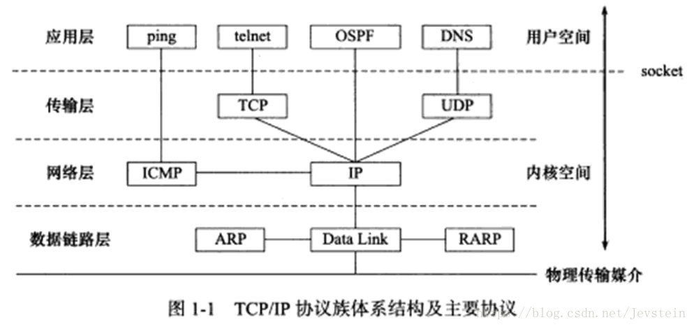
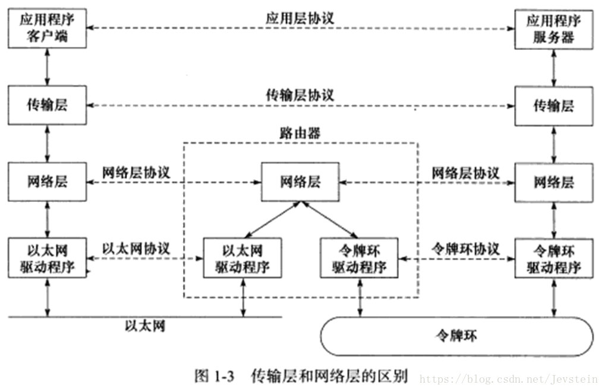
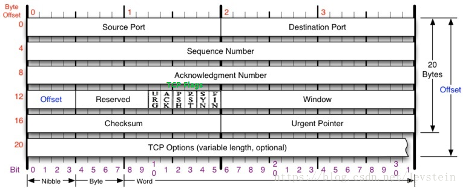
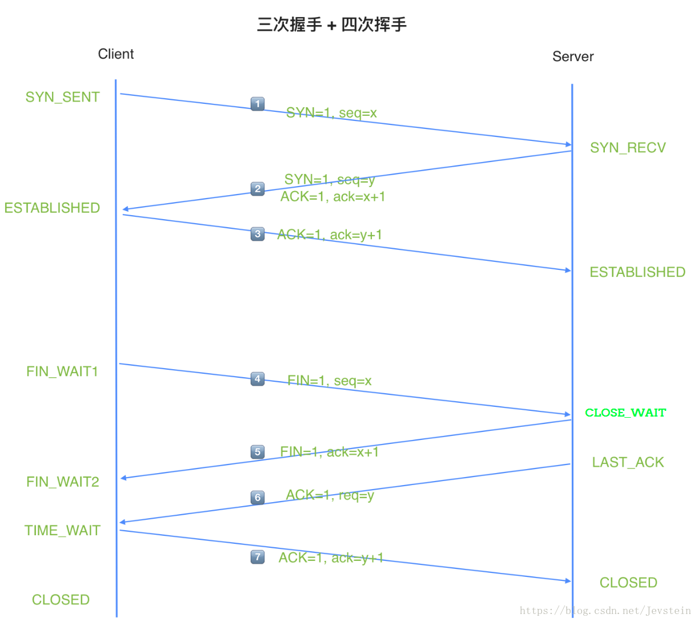
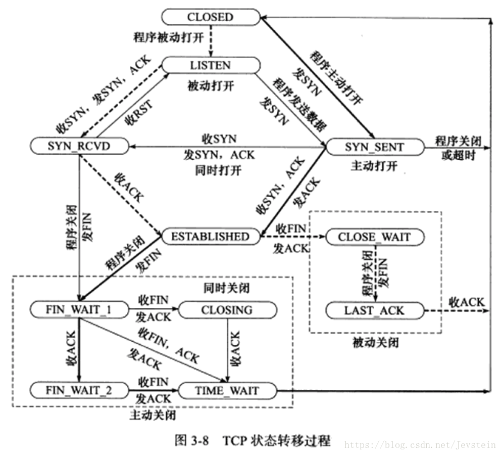
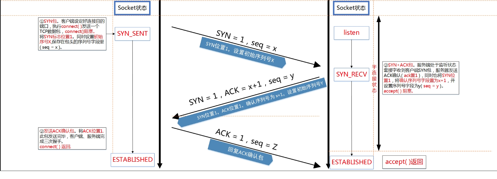
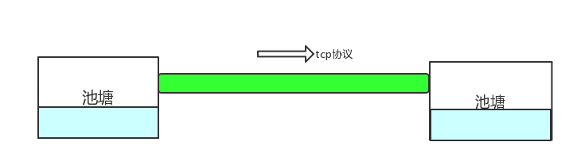
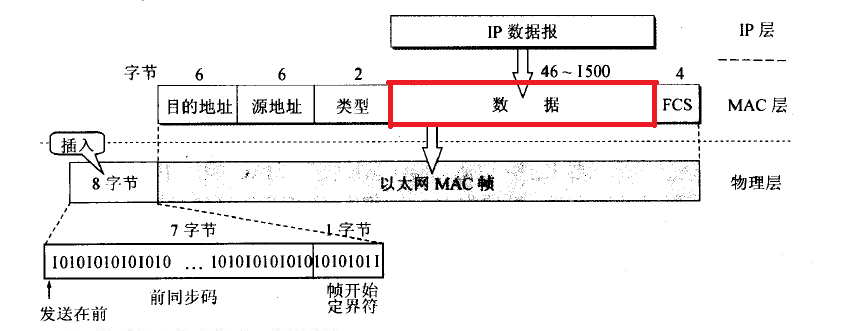

[TOC]

##  1. TCP定义    
　   TCP是Tranfer Control Protocol的简称，TCP协议是一种面向连接的、可靠的、基于字节流的运输层通信协议。通过TCP协议传输，得到的是一个顺序的无差错的数据流。发送方和接收方的成对的两个socket之间必须建立连接，以便在TCP协议的基础上进行通信，当一个socket（通常都是server socket）等待建立连接时，另一个socket可以要求进行连接，一旦这两个socket连接起来，它们就可以进行双向数据传输，双方都可以进行发送或接收操作。   
　  TCP/IP协议族体系结构是个四层协议系统，自底向上分别为数据链路层、网络层、传输层和应用层，如图： 
　　
　　
　　TCP协议处于传输层，为两台主机上的应用程序提供端到端（end to end）通信。与网络层使用逐跳通信方式不同，传输层指关心起始端和目的端，而不在乎数据包的中转过程。

##  2. TCP协议头分析
　　要深层次的剖析TCP，就得了解并熟记TCP协议的数据格式和每个字段的含义。请看结构体定义：    
```c
/*TCP头定义，共20个字节*/
typedef struct _TCP_HEADER
{
 short m_sSourPort;// 源端口号16bit
 short m_sDestPort;// 目的端口号16bit
 unsigned int m_uiSequNum;// 序列号32bit
 unsigned int m_uiAcknowledgeNum;// 确认号32bit
 short m_sHeaderLenAndFlag;// 前4位：TCP头长度；中6位：保留；后6位：标志位
 short m_sWindowSize;// 窗口大小16bit
 short m_sCheckSum;// 检验和16bit
 short m_surgentPointer;// 紧急数据偏移量16bit
}__attribute__((packed))TCP_HEADER, *PTCP_HEADER;
```
　　更直观的描述，如下图：
　　

 * 1. **16位端口号（Source Port和Destination Port)**  
　　表示源端口号和目的端口号；告知主机该报文段来自哪里（源端口）以及传给哪个上层协议或应用程序（目的端口）；源端口号和目的端口号配合上IP首部中的源IP地址和目的IP地址就能唯一的确定一个TCP连接。     
 　　进行TCP通信时，服务端使用知名服务或指定端口号（如80端口），而客户端通常使用系统自动选择的临时端口号。
 * 2. **32位序号（Sequence Number）**   
 　　用来标识从发送端向接收端发送的数据字节流，它表示在这个报文段中的的第一个数据字节在数据流中的序号。  
 　　主要`用来解决网络报乱序`的问题
 * 3. **32位确认号（Acknowledgment Number）**   
      　  用作对另一方发送来的TCP报文段的响应，其值是收到的TCP报文段的序号值加1。注意：只有当标志位中的ACK标志（下面介绍）为1时该确认序列号的字段才有效。   
  　　主要`用来解决不丢包`的问题
 * 4. **4位头部长度（Offset／header length）**  
   　　标识该TCP头部有多少个32bit字（4字节）。需要这个值是因为任选字段（options）的长度是可变的，而4位最大能表示15，所以TCP头部最长是60字节。若没有任选字段，长度即为20字节；
 * 5. **6位标志位（TCP Flags）**  
    　　TCP首部中有6个标志比特，它们中的多个可同时被设置为1，主要是`用于操控TCP的状态机`的，依次为URG，ACK，PSH，RST，SYN，FIN。每个标志位的意思如下：  
    - **URG标志**   
   　　表示紧急指针（Urgent Pointer）是否有效。
    - **ACK标志**   
   　　表示确认号是否有效。该位有两个取值：0和1，为1的时候表示应答域有效，反之无效。    
   　　我们称携带ACK标志的TCP报文段位**确认报文段**。
    - **PSH标志**   
   　　提示接收端应用程序应该立即从TCP接收缓冲区中取走数据，为接收后续数据腾出空间。若应用程序不将接收到的数据取走，他们会一直停留在TCP接收缓冲区中。
    - **RST标志**   
   　　表示要求对方重新建立连接。   
   　　用来复位那些产生错误的连接，也被用来拒绝错误和非法的数据包；我们称携带RST标志的TCP报文段位**复位报文段**。
    - **SYN标志**   
      　　表示请求一个连接。  
      　　SYN标志位和ACK标志位搭配使用，当连接请求的时候，SYN=1，ACK=0；连接被响应的时候，SYN=1，ACK=1；这个标志的数据包经常被`用来进行端口扫描`。扫描者发送一个只有SYN的数据包，如果对方主机响应了一个数据包回来 ，就表明这台主机存在这个端口；但是由于这种扫描方式只是进行TCP三次握手的第一次握手，因此这种扫描的成功表示被扫描的机器不很安全，一台安全的主机将会强制要求一个连接严格的进行TCP的三次握手；  
      　　我们称携带SYN标志的TCP报文段位**同步报文段**。
    - **FIN标志**   
      　　表示通知对方本端要关闭连接来。  
      　　若发送端已经达到数据末尾，也就是说双方的数据传送完成，没有数据可以传送了，发送FIN标志位的TCP数据包后，连接将被断开。这个标志的数据包也经常被`用于进行端口扫描`。    
      　　我们称携带FIN标志的TCP报文段位**结束报文段**
 * 6. **16位窗口大小（Window Size）**   
    　TCP流量控制的一个手段。这里的窗口，指的是接收通告窗口（Receiver Windows，RWND）。它告诉对方本端的TCP接收缓冲区还能容纳多少字节的数据，这样对方就可以控制发送数据的速度。
 * 7. **16位校验和（Checksum）**    
    　由发送端填充，接收端对TCP报文段执行CRC算法以检验TCP报文段在传输过程中是否损坏。这个校验不仅包括TCP头部，也包括数据部分。这也是`TCP可靠传输的一个重要保障`。
 * 8. **16位紧急指针（Urgent Pointer）**    
       　这是一个正的偏移量。它与序号字段相加表示最后一个紧急指针数据的下一个字节的序号。因此，确切地说，这个字段是紧急指针相对于当前序号的偏移，不妨称之为紧急偏移。TCP的紧急指针是发送端向接收端发送紧急数据的方法。
##  3. * TCP的连接与关闭 * 
　　TCP的连接与关闭过程，就是大名鼎鼎的“三次握手“与“四次挥手“的过程。Linux系统下，可用tcpdump抓包监控整个过程。先看过程图，如下所示：
　　
###  3.1. 三次握手
　　TCP是面向连接的，无论哪一方向另一方发送数据之前，都必须先在双方之间建立一条连接。在TCP/IP协议中，TCP协议提供可靠的连接服务，连接是通过三次握手进行初始化的。    
 * 1.**第一次握手**  
 　　1⃣️：Client将标志位SYN置为1，随机产生一个值seq=x，并将该数据包发送给Server... Client进入SYN_SENT状态，等待Server确认。 
 * 2.**第二次握手**   
 　　2⃣️Server收到数据包后由标志位SYN=1知道Client请求建立连接，Server将标志位SYN和ACK都置为1，ack (number )=x+1，随机产生一个值seq=y，并将该数据包发送给Client以确认连接请求... Server进入SYN_RCVD状态。 
  * 3.**第三次握手**      
 　　4⃣️Client收到确认后，检查ACK是否为Client发送的seq+1，即x+1；如果正确则将标志位ACK置为1，ack=y+1，并将该数据包发送给Server... Server检查ack是否为Server发送的seq+1，即y+1，如果正确则连接建立成功，Client和Server进入ESTABLISHED状态，完成三次握手。    
 　　我在Linux开启一个服务端ServerA（ubuntu），监听8101端口，手机APP作为客户端ClientB（180.167.180.146）。Linux上打开tcpdump，输入：sudo tcpdump -iany tcp port 8101, 监控ClientA连接ServerA的过程，如下： 
 　　
 　　其实，“三次握手“的作用主要有如下几个:  
    * 1).建立连接  
    * 2).确认对方的当前的初始化序列号(linux用哈希算法)，确保当前连接安全
    * 3).互相决定MSL（最大生存时间）的大小
###  3.2. 四次挥手
  * 1.**第一次挥手**     
 　　5⃣️客户端设置seq=x，向服务端发送一个FIN报文段；此时，主机1进入FIN_WAIT_1状态；这表示客户端没有数据要发送给服务端了； 
  * 2.**第二次挥手**    
　　6⃣️服务端收到了客户端发送的FIN=1，向客户端回复ACK=1，ack=收到的seq+1=x+1，然后客户端进入FIN_WAIT_2状态；服务端告诉客户端，在等待自己去关闭连接； 
  * 3.**第三次挥手**    
　　7⃣️服务端向客户端发送FIN=1，设置seq=y，请求关闭连接，同时服务端进入LAST_ACK状态； 
  * 4.**第四次挥手**    
　　8⃣️客户端收到服务端发送的FIN，向服务端发送ACK=1，ack=收到的seq+1=y+1，然后主机1进入TIME_WAIT状态；服务端收到客户端的ACK报文段以后，就关闭连接；此时，客户端等待2MSL后依然没有收到回复，则证明Server端已正常关闭，客户端也关闭连接。 
　　Linux上监控到挥手过程，如下：
　　
###  3.3. 状态转移
　　TCP任意一端在任意时刻都处于某种状态，可用netstat查看。从建立到关闭的整个过程中，TCP通信两端状态的变化如下图所示：
　　
　　图中粗虚线表示服务器端连接的状态转移；粗实线表示客户端连接的状态转移。CLOSED是一个假想的起始点，并不是一个实际的状态。对这几个状态的详细解释如下：  
* **LISTENING**： 侦听来自远方的TCP端口的连接请求.   
　　最主要的是看本机开了哪些端口，这些端口都是哪个程序开的，关闭不必要的端口是保证安全的一个非常重要的方面，服务端口都对应一个服务（应用程序），停止该服务就关闭了该端口；  
* **SYN-SENT**：客户端SYN_SENT状态  
　　正常情况下SYN_SENT状态非常短暂，连接成功了ESTABLISHED.有很多SYN_SENT出现，一般几种情况，一是你要访问的网站不存在或线路不好，二是用扫描软件扫描一个网段的机器，也会出出现很多SYN_SENT，三可能中了病毒了，例如中了"冲击波"，病毒发作时会扫描其它机器，这样会有很多SYN_SENT出现。 
* **SYN-RECEIVED**：服务器端状态SYN_RCVD    
　　当标志位ACK和SYN置1发送给客户端，此时服务器端处于SYN_RCVD状态，如果连接成功了就变为ESTABLISHED，正常情况下SYN_RCVD状态非常短暂，很多SYN_RCVD状态，机器有可能被SYN Flood的DoS(拒绝服务攻击)攻击了   
* **ESTABLISHED：代表一个打开的连接。**   
　　netstat -nat |grep 端口或者使用lsof  -i:端口可以检测到。
* **FIN-WAIT-1**：等待远程TCP连接中断请求，或先前的连接中断请求的确认   
* **FIN-WAIT-2**：从远程TCP等待连接中断请求
　　半关闭的状态了，这是在关闭连接时，客户端和服务器两次握手之后的状态
* **CLOSE-WAIT**：等待从本地用户发来的连接中断请求
* **CLOSING**：等待远程TCP对连接中断的确认
* **LAST-ACK**：等待原来的发向远程TCP的连接中断请求的确认
* **TIME-WAIT**：等待足够的时间（2MSL）以确保远程TCP接收到连接中断请求的确认    
　　发送了最后一个ACK数据报以后，要进入TIME_WAIT状态，这个状态是防止最后一次挥手的数据报没有传送到对方那里而准备的（注意这不是四次挥手，这是第四次挥手的保险状态）。这个状态在很大程度上保证了双方都可以正常结束，服务器给出了一个平静时间的概念，这是说在2MSL时间内，虽然可以重新启动服务器，但是这个服务器还是要平静的等待2MSL时间的过去才能进行下一次连接。
* **CLOSED**：没有任何连接状态

###  3.4. 思考几个经典问题
####  3.4.1. 为什么采用“三次握手“
　　“三次握手“的主要目的是：`为了防止已失效的连接请求报文段突然又传送到了服务端，因而产生错误`。    
　　例如：client发出的第一个连接请求报文段并没有丢失，而是在某个网络结点长时间的滞留了，以致延误到连接释放以后的某个时间才到达server。本来这是一个早已失效的报文段。但server收到此失效的连接请求报文段后，就误认为是client再次发出的一个新的连接请求。于是就向client发出确认报文段，同意建立连接。假设不采用“三次握手”，那么只要server发出确认，新的连接就建立了。由于现在client并没有发出建立连接的请求，因此不会理睬server的确认，也不会向server发送ack包。
####  3.4.2. 为什么采用“四次挥手“
　　“四次挥手“的主要目的是：`为了确保数据能够完成传输`。    
　　因为TCP连接是全双工的(即数据可在两个方向上同时传递)，关闭连接时，当收到对方的FIN报文通知时，它仅仅表示对方没有数据发送给你了；但未必你所有的数据都全部发送给对方了，所以你可以未必会马上会关闭SOCKET,也即你可能还需要发送一些数据给对方之后，再发送FIN报文给对方来表示你同意现在可以关闭连接了，所以它这里的ACK报文和FIN报文多数情况下都是分开发送的。
####  3.4.3. TIME_WAIT状态的产生、危害、如何避免    
　　TCP协议在关闭连接的四次挥手中，为了应对最后一个 ACK 丢失的情况，Client（即主动关闭连接的一方）需要维持 time_wait 状态并停留 2 个MSL的时间
* **原因**:     
　　　1.保证A发送的最后一个ACK报文段能达到B (注: ack不会重发，只有B等超时后重发FIN)     
2.防止失效的报文段出现在连接中  
**详细解释**：  
　　　1).主动关闭方需要进入TIME_WAIT以便能够重发丢掉的被动关闭方FIN包的ACK。如果主动关闭方不进入TIME_WAIT，那么在主动关闭方对被动关闭方FIN包的ACK丢失了的时候，被动关闭方由于没收到自己FIN的ACK，会进行重传FIN包，这个FIN包到主动关闭方后，由于这个连接已经不存在于主动关闭方了，这个时候主动关闭方无法识别这个FIN包，协议栈会认为对方疯了，都还没建立连接你给我来个FIN包？，于是回复一个RST包给被动关闭方，被动关闭方就会收到一个错误(常见：connect reset by peer，顺便说下,在收到RST包的时候，还往这个连接写数据，就会收到Broken pipe错误了)，原本应该正常关闭的连接，给我来个错误，很难让人接受；  
　　　2）防止已经断开的连接A中在链路中残留的FIN包终止掉新的连接B(重用了连接A的所有的5元组(源IP，目的IP，TCP，源端口，目的端口)），这个概率比较低，因为涉及到一个匹配问题，迟到的FIN分段的序列号必须落在连接B的一方的期望序列号范围之内，虽然概率低，但是确实可能发生，因为初始序列号都是随机产生的，并且这个序列号是32位的，会回绕；  
　　　3）防止链路上已经关闭的连接的残余数据包(a lost duplicate packet or a wandering duplicate packet) 干扰正常的数据包，造成数据流的不正常。这个问题和2）类似。  
　　　注意: MSL与IP头中的TTL(time to live)的区别,中文译为“生存时间”，这个生存时间是由源主机设置初始值但不是存的具体时间，而是存储了一个ip数据报可以经过的最大路由数，每经过一个处理他的路由器此值就减1，当此值为0则数据报将被丢弃，同时发送ICMP报文通知源主机。RFC 793中规定MSL为2分钟，实际应用中常用的是30秒，1分钟和2分钟等

* **危害**：    
　　　Linux分配给一个用户的文件句柄是有限的，如果系统中存在大量的 time_wait 状态，一旦达到句柄数上限，新的请求就无法被处理了，而且大量 time_wait 连接占用资源影响性能
* **避免**：    
    * 1.在/etc/sysctl.conf文件中开启 net.ipv4.tcp_tw_reuse重用和net.ipv4.tcp_tw_recycle快速回收[未亲自实践]
    * 2.int on=1; ::setsockopt(sock, SOL_SOCKET, SO_REUSEADDR, (char *)&on, sizeof(int));//若此端口正在使用的话，bind会把端口“抢”过来

###  3.5. listen时指定的backlog含义
我们先来看下listen的声明：
```c
int listen(int sockfd, int backlog);
```
有关于第二个参数含义的问题网上有好几种说法，我总结了下主要有这么3种：

* Kernel会为LISTEN状态的socket维护一个队列，其中存放SYN RECEIVED和ESTABLISHED状态的套接字，backlog就是这个队列的大小。  
* Kernel会为LISTEN状态的socket维护两个队列，一个是SYN RECEIVED状态，另一个是ESTABLISHED状态，而backlog就是这两个队列的大小之和。  
* 第三种和第二种模型一样，但是backlog是队列ESTABLISHED的长度。  

有关上面说的两个状态SYN RECEIVED状态和ESTABLISHED状态，是TCP三次握手过程中的状态转化，具体可以参考下面的图（在新窗口打开图片）：
  

当一个应用使用listen系统调用让socket进入LISTEN状态时，它需要为该套接字指定一个backlog。backlog通常被描述为连接队列的限制。  

由于TCP使用的3次握手，连接在到达`ESTABLISHED`状态之前经历中间状态`SYN RECEIVED`，并且可以由`accept`系统调用返回到应用程序。这意味着TCP/IP堆栈有两个选择来为`LISTEN`状态的套接字实现backlog队列：  
* 1.使用单个队列实现，其大小由listen syscall的backlog参数确定。 当收到SYN数据包时，它发送回SYN/ACK数据包，并将连接添加到队列。 当接收到相应的ACK时，连接将其状态改变为已建立。 这意味着队列可以包含两种不同状态的连接：SYN RECEIVED和ESTABLISHED。 只有处于后一状态的连接才能通过accept syscall返回给应用程序。  

* 2.使用两个队列实现，一个SYN队列（或半连接队列）和一个accept队列（或完整的连接队列）。 处于SYN RECEIVED状态的连接被添加到SYN队列，并且当它们的状态改变为ESTABLISHED时，即当接收到3次握手中的ACK分组时，将它们移动到accept队列。 显而易见，accept系统调用只是简单地从完成队列中取出连接。 在这种情况下，listen syscall的backlog参数表示完成队列的大小。

历史上，BSD 派生系统实现的TCP使用第一种方法。 该选择意味着当达到最大backlog时，系统将不再响应于SYN分组发送回SYN/ACK分组。 通常，TCP的实现将简单地丢弃SYN分组，使得客户端重试。

在Linux上，是和上面不同的。如在listen系统调用的手册中所提到的：   
在Linux内核2.2之后，socket backlog参数的形为改变了，现在它指等待accept的完全建立的套接字的队列长度，而不是不完全连接请求的数量。 不完全连接的长度可以使用/proc/sys/net/ipv4/tcp_max_syn_backlog设置。这意味着当前Linux版本使用上面第二种说法，有两个队列：具有由系统范围设置指定的大小的SYN队列 和 应用程序（也就是backlog参数）指定的accept队列。  

这个著名的设计，给我们带来了很大的麻烦，这个麻烦就是[DDOS攻击](http://www.cnblogs.com/0day5/p/7765901.html)。

##  4. TCP的长连接和短连接
###  4.1. 短连接
短连接：客户端与服务器建立连接 --> 客户端发送数据 --> 服务器回应数据  --> 客户端与服务器关闭连接 --> ··········  建立连接 -->发送数据 --> 回应数据 --> 关闭连接。用个生活中的例子就是，我寂寞难耐时，就去谈谈上约一次，如果约不着就去大保健，爽完付费走人，要想爽随时都可以来。  

* 短连接的优点：  
  * 不长期占用服务器的内存，那么服务器能处理的连接数量是比较多的。

* 短连接的缺点：
  * 因为等到要发送数据或者获取资源时，才去请求建立连接发送数据，否则就是端开连接的，那么如果服务器要想往客户端发送数据时怎么办？凉伴，没有任何办法，或者要等到下一次要请求数据时，才发送，比如我们采用轮询（30秒或者更长）拉取消息，那么服务器与客户端通信的实时性就丧失了。

  * 客户端采用轮询来实时获取信息，或者说大量的客户端使用短连接的方式通信，那么就浪费了大量的CPU和带宽资源用于建立连接和释放连接，存在资源浪费。比如经典的http长轮询（微信网页客户端端）。

###  4.2. 长连接
长连接：客户端与服务器一直保持这种连接，客户端和服务端一直不关闭这个连接，这种连接方式叫做TCP长连接。那如何正确地能保持一个连接不关闭呢？下一个小节会讲到，我们先来讨论这种设计的优缺点吧。  

* 长连接优点：  
  * 传输数据快  
  * 服务器能够主动第一时间传输数据到客户端

* 长连接缺点：
  * 因为客户端与服务器一直保持这种连接，那么在高并发分布式集群系统中客户端数量会越来越多，占用很多的系统资源。

  * TCP本身是一种有状态的数据，在高并发分布式系统会导致后台设计比较难做。

###  4.3. 长短连接的适用情况

##  5. keepalive机制
先来一个问题，TCP连接一旦建立后，是不是这个连接可以一直保持？
答案是否定的，操作系统在实现TCP协议的时候都做了一个限制，这个限制可以参考配置：
```c
cat /proc/sys/net/ipv4/tcp_keepalive_time
cat /proc/sys/net/ipv4/tcp_keepalive_intvl
cat /proc/sys/net/ipv4/tcp_keepalive_probes
```
我们看到默认这个`tcp_keepalive_time`的值为7200s，也就是2个小时。这个值代表如果TCP连接发送完最后一个ACK包后，如果超过2个小时，没有数据往来，那么这个连接会断掉。那么如何才能保持住这个连接呢？实际上，这就是TCP的`keepalive`机制。哦，说法不严谨，TCP协议并没有规定如此，但是很多的操作系统内核实现TCP协议时，都加上了这个keepalive机制，那么这个功能默认是关闭的，那这个keepalive机制到底是如何的呢？也就是，如果TCP之间没有任何数据来往了在tcp_keepalive_time（7200s，2h）后，服务器给客户端发送一个探测包，如果对方有回应，说明这个连接还存活，否则继续每隔tcp_keepalive_intvl（默认为75s）给对方发送探测包，如果连续tcp_keepalive_probes（默认为9）次后，依然没有收到对端的回复，那么则认为这个连接已经关闭。

tcp keepalive默认不是开启的，如果想使用KeepAlive，需要在你的应用中设置SO_KEEPALIVE才可以生效。当然事先我们可以修改这些默认值，方法如下：

* 1.在Linux中我们可以通过修改`/etc/sysctl.conf`的全局配置：  
  ```
  net.ipv4.tcp_keepalive_time=7200
  net.ipv4.tcp_keepalive_intvl=75
  net.ipv4.tcp_keepalive_probes=9
  ```
  添加上面的配置后输入`sysctl -p`使其生效，你可以使用 `sysctl -a | grep keepalive`命令来查看当前的默认配置
tcp keepalive。  

* 2.也可以通过设置TCP选项设置，设置方法如下：
  ```c
  #include <sys/socket.h>

  int setsockopt(int socket, int level, int option_name, const void *option_value, socklen_t option_len);
  ```
  我们在需要使能Keepalive的socket上面调用setsockopt函数便可以打开该socket上面的keepalive。
  * 第一个参数是要设置的套接字  
  * 第二个参数是SOL_SOCKET  
  * 第三个参数必须是SO_KEEPALIVE  
  * 第四个参数必须是一个布尔整型值，0表示关闭，1表示打开  
  * 最后一个参数是第四个参数值的大小。  

  示例：
  ```c
  int keepalive = 1;
  setsockopt(incomingsock,SOL_SOCKET,SO_KEEPALIVE,(void*)(&keepalive),(socklen_t)sizeof(keepalive));
                          
  int keepalive_time = 30;
  setsockopt(incomingsock, IPPROTO_TCP, TCP_KEEPIDLE,(void*)(&keepalive_time),(socklen_t)sizeof(keepalive_time));

  int keepalive_intvl = 3;
  setsockopt(incomingsock, IPPROTO_TCP, TCP_KEEPINTVL,(void*)(&keepalive_intvl),(socklen_t)sizeof(keepalive_intvl));

  int keepalive_probes= 3;
  setsockopt(incomingsock, IPPROTO_TCP, TCP_KEEPCNT,(void*)(&keepalive_probes),(socklen_t)sizeof(keepalive_probes));

  /*设置SO_KEEPALIVE选项来开启KEEPALIVE，然后通过TCP_KEEPIDLE、TCP_KEEPINTVL和TCP_KEEPCNT设置keepalive的保活时间、间隔、次数等参数。*/
  ```

##  6. TCP特性
当要做一个软件升级，或者是一些音视频传输，或者是后台各个服务模块之间传输数据，如何尽可能提高整个系统的处理能力和处理的效率呢？这就必须要了解TCP的各个特性了（如：`滑动窗口`、`拥塞控制算法`、`MTU`、`BBR算法`），才能更好地解决系统的性能瓶颈。

###  6.1. 形象化理解滑动窗口和拥塞控制
**保证TCP的可靠**：  
* 对乱序包进行排序  
* 对丢失的包进行重发  
* 使用ACE确认收到的包  
* 还有很多更加复杂的算法  

**将TCP做个类比**，如下：  


TCP协议就像一根管道，连接着两个池塘，保证从一个池塘往另一个池塘输送水。那么在这个过程中就要保证两件事情：  
* **滑动窗口**：保证接收水的池塘的水不能溢出池塘，这个手段在TCP中使用的是`滑动窗口`，它要控制发送和接收端处理速率达到一个平衡；  

* **拥塞控制算法**：保证尽可能快的把送水池塘的水输送到接收水的池塘。因为TCP这根管道里如果水没有塞满，那输送水肯定很慢；如果输送水过快，那管子就会爆裂，后果就是谁都输送不了水。这个手段在TCP中便是使用`拥塞控制算法`。

###  6.2. 滑动窗口
>见: [滑动窗口](1.滑动窗口.md)

###  6.3. 拥塞控制
>见: [拥塞控制](2.拥塞控制.md)  

###  6.4. 经典概念
####  6.4.1. MTU
MTU（Maximum Transmission Unit）是什么？再来看看数据链路层的结构:  

`MTU`就是上图红色框部分的大小，这一部分规定了网络层数据的大小最大为1500个字节，网络层必须确保不超过1500个字节，否则数据链路层会把这个包给舍弃掉。于此，对于TCP协议，因为IP头为20个字节，TCP头为20个字节，所以，TCP协议能传输的数据最大为1460（1500 - 20 - 20），这个值称为`MSS（Maxitum Segment Size）`。  

另外，RFC 791规定**任何一个IP设备都得最少接收`576B(MTU)`大小**.其实`576B`是拨号的网络`MTU`，而`MSS为536B` = 576B - 20B(IP头)。

[滑动窗口](1.滑动窗口.md)/Silly Window Syndrome亦有论述

####  6.4.2. Nagle算法
>见: [滑动窗口](1.滑动窗口.md)/Silly Window Syndrome

####  6.4.3. BBR算法
> 见：[拥塞控制](2.拥塞控制.md)/../快速恢复算法/BBR算法  
> 见：[BBR算法](3.BBR算法.md)

###  6.5. 系统调优

##  7. socket实现
> 见：[socket实现](3.socket实现.md)


>参考：  
> 动脑学院.lee老师  
>《Linux高性能服务器编程》 游双著    
> [网络编程之深入理解网络编程](https://blog.csdn.net/chenliguan/article/details/79146124)  
> [什么是2MSL以及TIME_WAIT的作用](https://www.cnblogs.com/ytys/p/9993535.html)