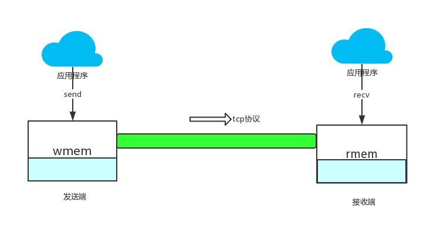
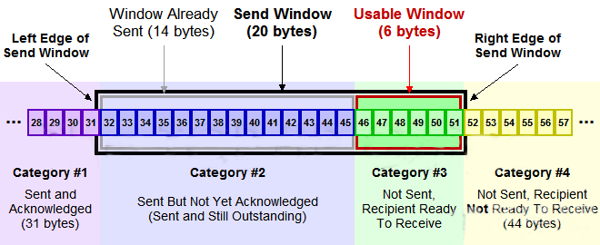

[TOC]

# 滑动窗口  
##  1. 形象化类比-池塘
​     先看看“池塘”比喻：


​      网络仅仅是保证了整个网络的连通性，而基于整个网络去传输，是不是想发送多少数据就发送多少数据呢？如果是这样的话，是不是就会像从一个池塘抽水去灌到另外一个池塘一样，想抽多少水就抽多少水？这是肯定不行的，因为不能让接收水的池塘`溢出水`了。那在TCP协议中是如何控制的？

##  2. TCP协议-16位窗口大小
​     对于每一个socket，都有一个`接收缓存`和`发送缓存`，对于接收端来讲，我们必须确保这个接收缓存不能溢出，为了做到如此，那么接收端在回复ACK时，必须通告这个`接收缓存的可用空间`有多大。先看看TCP协议:    
  
​     TCP头里定义了这个`窗口大小的值`。是由接收端回复ACK时填充的。于是发送端就可以根据这个接收端的窗口大小来发送数据，而不会导致接收端处理不过来。  

##  3. 数据结构控制
为了说明整个滑动窗口，再来看看整个tcp协议控制的数据结构：  
  
如上图可知：  
* 1.接收端:  
    * `LastByteRead`指向了TCP缓冲区中`读到的位置`;  
    * `NextByteExpected`指向的地方是`收到连续包`的最后一个位置;  
    * `LastByteRcved`指向的是`收到包`的最后一个位置。  
    由此看到中间有些数据还没有到达，所以有`数据空白区`。  

* 2.发送端:  
    * `LastByteAcked`指向了被接收端`Ack过的位置`, 即表示成功发送确认;  
    * `LastByteSent`表示发出去了，但`还未收到成功确认的Ack`;  
    * `LastByteWritten`指向的是上层应用`正在写的地方`。  

* 3.`接收端`在给发送端回ACK中时，会汇报自己的`广告窗口`AdvertisedWindow，公式如下：  
`AdvertisedWindow = MaxRcvBuffer – LastByteRcvd – 1`;
* 4.`发送端`根据这个窗口来控制发送数据的大小，以保证接收方可以处理。  

##  4. 数据结构控制详情
​     接收端到底是如何控制发送端的发送呢？  

###  4.1. 滑动窗口控制流程
####  4.1.1. 发送端如何控制
​     首先，看看这个`AdvertisedWindow`在`发送端`是如何控制的，如下布局：
  

上图分成四个部分：（其中那个`黑模型`就是滑动窗口[32,...,51]）  

* 已收到ack确认的数据: [..,28,..31]。
* 已发送但还未收到ack的数据: [32,..,45]。
* 在窗口中还没有发出的数据(接收方还有空间）: [46,..,51]。
* 窗口以外的数据（接收方没空间）: [52,..,57,..]

####  4.1.2. 滑动窗口如何调整
既然是滑动窗口，那这个窗口是如何调整的呢？且看下图：


再来看一下整个控制流程：  


###  4.2. Zero Window Probe（ZWP）
上图能看到一个处理缓慢的Server（接收端）是怎么把Client（发送端）的TCP Sliding Window给降成0的。此时:  
* 你一定会问：如果Window变成0了，TCP会怎么样？是不是发送端就不发数据了？  
是的，发送端就不发数据了，你可以想像成`“Window Closed”`。  

* 那你一定还会问: 如果发送端不发数据了，接收方一会儿Window size可用了，怎么通知发送端呢？

解决这个问题，TCP使用了`Zero Window Probe`技术，缩写为`ZWP`。也就是说，发送端在窗口变成0后，会发ZWP的包给接收方，让接收方来ack他的Window大小。一般这个值会设置成3次，第次大约30-60秒（不同的实现可能会不一样）。如果3次过后还是0的话，有的TCP实现就会发`RST`把链接断了。

**注意**：  
* **DDOS攻击**  
只要有等待的地方都可能出现`DDoS`攻击，Zero Window也不例外，一些攻击者会在和HTTP建好链发完GET请求后，就把Window设置为0，然后服务端就只能等待进行ZWP，于是攻击者会并发大量的这样的请求，把服务器端的资源耗尽。

* Wireshark抓包  
另外，Wireshark中，你可以使用`tcp.analysis.zero_window`来过滤包，然后使用右键菜单里的`follow TCP stream`，你可以看到`ZeroWindowProbe`及`ZeroWindowProbeAck`的包。

###  4.3. Silly Window Syndrome

`Silly Window Syndrome`翻译成中文就是“糊涂窗口综合症”。正如上面看到的一样，如果`接收方`太忙了，来不及取走Receive Windows里的数据，那么，就会导致发送方越来越小。到最后，如果接收方腾出几个字节并告诉发送方现在有几个字节的window，而我们的发送方会义无反顾地发送这几个字节。

**要知道，TCP+IP头有40个字节，为了几个字节，要达上这么大的开销，这太不经济了**。

另外，我们知道网络上有个MTU，对于以太网来说，`MTU`是1500字节，除去TCP+IP头的40个字节，真正的数据传输可以有1460，这就是所谓的`MSS（Max Segment Size）`注意，TCP的RFC定义这个MSS的默认值是536，这是因为 RFC 791规定任何一个IP设备都得最少接收576尺寸的大小（实际上来说576是拨号的网络的MTU，而576减去IP头的20个字节就是536）。

如果你的网络包可以塞满MTU，那么你可以用满整个带宽，如果不能，那么你就会浪费带宽（大于MTU的包有两种结局，一种是直接被丢了，另一种是会被重新分块打包发送）。可以想像成一个MTU就相当于一个飞机的最多可以装的人，如果这飞机里满载的话，带宽最高，如果一个飞机只运一个人的话，无疑成本增加了，也而相当二。

所以，`Silly Windows Syndrome`这个现像就像是你本来可以坐200人的飞机里只做了一两个人。 要解决这个问题也不难，就是避免对小的window size做出响应，直到有足够大的window size再响应，这个思路可以同时实现在sender和receiver两端：

* 如果这个问题是由`Receiver`端引起的，那么就会使用**David D Clark’s方案**。在receiver端，如果收到的数据导致window size小于某个值，可以直接ack(0)回sender。这样就把window给关闭了，也阻止了sender再发数据过来，等到receiver端处理了一些数据后windows size 大于等于了MSS，或者receiver buffer有一半为空，就可以把window打开让send 发送数据过来。

* 如果这个问题是由`Sender`端引起的，那么就会使用著名的 **`Nagle’s algorithm`**。这个算法的思路也是延时处理，他有两个主要的条件：  
	* 1）要等到 Window Size>=MSS 或是 Data Size >=MSS;  

	* 2）收到之前发送数据的ack回包，他才会发数据，否则就是在攒数据。

另外，`Nagle算法`默认是打开的，所以，对于一些需要小包场景的程序,如回显程序、telnet、ssh、zeromq这样的交互性比较强的程序，你需要关闭这个算法。你可以在Socket设置TCP_NODELAY选项来关闭这个算法（关闭Nagle算法没有全局参数，需要根据每个应用自己的特点来关闭）
```	c
setsockopt(sock_fd, IPPROTO_TCP, TCP_NODELAY, (char *)&value, sizeof(int));
```
另外，网上有些文章说TCP_CORK的socket option也是关闭Nagle算法，这不对。`TCP_CORK`其实是更新激进的Nagle算法，完全禁止小包发送，而Nagle算法没有禁止小包发送，只是禁止了大量的小包发送。最好不要两个选项都设置。


> 来自：  
> 动脑学院.lee老师