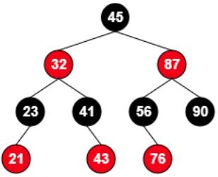
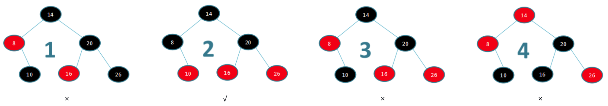

[TOC]

# 二叉树与红黑树

## 1. 思考案例

 案例一. 服务器端高并发IO的keep alive方案，满足以下几个需求:
1.每个IO都是自己的时间戳
2.每个IO收到自己的beat后，重置自己的定时器
3.若IO定时未收到beat,则执行IO的回调函数，并重置定时器
4.若再次未收到beat,销毁IO,注销定时器

案例二. 设计一个线程或进程的运行体R与运行体调度器S的结构体
1.运行体R：包含运行状态{新建、准备、挂起{IO等待读、IO等待写、睡眠、延时}、退出}、运行体回调函数，回调参数
2.调度器S：包含栈指针、栈大小、当前运行体
3.调度器S：包含执行集合{就绪、延时、睡眠、等待等}


## 2. 搜索二叉树

### 2.1. 性质

### 2.2. 复杂度：t = {O(log(n)),  O(n)}，最坏时退化成链表（有序插入）

### 2.3. 手写二叉树

* key与左右子树分离, 宏定义

```c
#define BSTREE_ENTRY(name, type)\
struct name { struct type* left; struct type* right; }

typedef struct _bstree_node {
    KEY_TYPE data;
    BSTREE_ENTRY(, _bstree_node);
} bstree_node_t;

typedef struct _bstree {
    bstree_node_t *root;
} bstree_t;
```

* 函数声明
```c
bstree_node_t* bstree_create_node(KEY_TYPE data);
void bstree_destroy_node(bstree_node_t* node);
int bstree_traversal(bstree_node_t *node);
int bstree_insert(bstree_t *T, KEY_TYPE data);                           //增
int bstree_delete(bstree_t *T, KEY_TYPE data);                           //删
int bstree_update(bstree_t *T, const KEY_TYPE src, const KEY_TYPE dest); //改
bstree_node_t* bstree_search(bstree_t *T, KEY_TYPE data);                //查
```


## 3. 红黑树

### 3.1. 性质

* #### 基本性质
```c
1.每个结点是红的或者黑的
2.根结点是黑的
3.每个叶子结点(nil)是黑的
4. 若一个节点是红色的，则它的子节点必须是黑色的
 【注：一个节点是黑色，但它的子节点不一定是红色】
5. 对每个结点，从该结点到其子孙结点的所有路径上的包含相同数目的黑结点
```

*  #### 性质延伸
```c
1.根节点的左子树和右子树的高度差不超过2倍
   [其实就是采用黑节点来保证的]
2.插入时最坏的情况下要旋转3次
3.红黑树的一条边最多被访问两次
```

* #### 示例图

  

### 3.2. 鉴定



### 3.3. 复杂度: t = O(logn)

### 3.4. 参考

* 左倾红黑树: llrb - github

* [石杉笔记](https://mp.weixin.qq.com/s/oNmUW-rUbTPPgUbFn9oddQ)

### 3.5. 手写红黑树

* 动画指导

* 平衡性的修正
  1.变色:           改变节点颜色；
  2.左旋右旋：修改3个节点方向，共6个指针变量

* 注意：
  插入黑节点会改变黑色高度，违背性质性质5；
  插入红节点有一般的机会违背性质4

* 定义结构
```c
#define RBTREE_ENTRY(name, type)    \
    struct name {                   \
        unsigned char color;        \
        struct type *parent;        \
        struct type *left;          \
        struct type *right;  }

typedef struct _rbtree_node {
    data_t data;
    RBTREE_ENTRY(, _jvt_rbtree_node);
} rbtree_node_t;

typedef struct _rbtree {
    rbtree_node_t *root;
    rbtree_node_t *nil;
} rbtree_t;
```

* 函数声明

```c
int rbtree_init(rbtree_t* T);
void rbtree_destroy(rbtree_t* T);
rbtree_node_t* rbtree_create_node(const KEY_TYPE key, VALUE_TYPE value, int size);//private
rbtree_node_t* rbtree_create_node_data(const KEY_TYPE key, DATA_TYPE data);       //private
void rbtree_destroy_node(rbtree_node_t *node);            //private
int rbtree_rotate_left(rbtree_t *T, rbtree_node_t *node); //private
int rbtree_rotate_right(rbtree_t *T, rbtree_node_t *node);//private
int rbtree_fixup_node(rbtree_t *T, rbtree_node_t *node);  //private
int rbtree_insert(rbtree_t *T, const KEY_TYPE key, const DATA_TYPE data);//增
int rbtree_delete(rbtree_t *T, const KEY_TYPE key);                      //删
int rbtree_update(rbtree_t *T, const KEY_TYPE key, const DATA_TYPE data);//改
rbtree_node_t* rbtree_search(rbtree_t *T, const KEY_TYPE key);           //查
int rbtree_traversal(rbtree_node_t *node);
```

  

