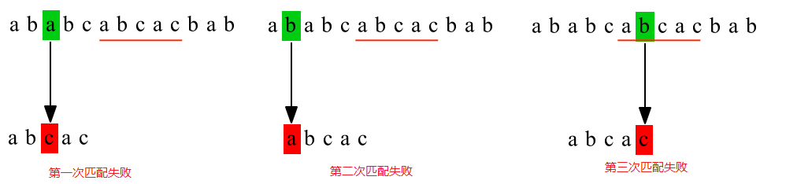
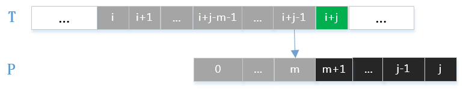
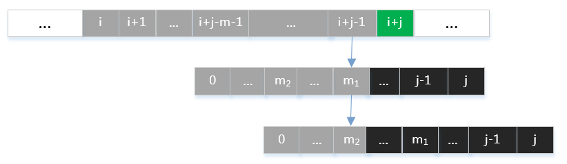
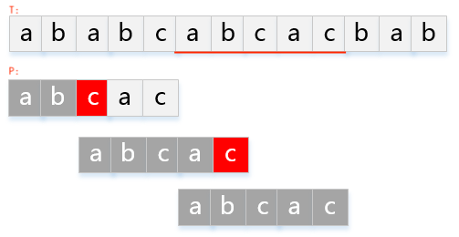

[TOC]

# 1.思考: 10多G日志如何查找？


# 2.暴力匹配

​	“假传万卷书，真传一案例”。所谓字符串匹配，即是判断主串T中是否出现该模式串P，即P为T的子串。特别地，定义主串为T[0…n−1]，模式串为P[0…p−1]，则主串与模式串的长度各为n与p。

## 2.1.思想

* 1. 依次从主串的首字符开始，与模式串逐一进行匹配；
* 2. 遇到失配时，则移到主串的第二个字符，将其与模式串首字符比较，逐一进行匹配；
* 3. 重复上述步骤，直至能匹配上，或剩下主串的长度不足以进行匹配。

## 2.2.举例

​	若主串`T="ababcabcacbab"`，模式串`P="abcac"`，则：



## 2.3.实现

```c
int brute_force_match(char *t, char *p) {
    int i, j, tem;
    int tlen = strlen(t), plen = strlen(p);
    for (i = 0, j = 0; i <= tlen - plen; i++, j = 0) {
        tem = i;
        while(t[tem] == p[j] & j < plen) {
            tem++;
            j++;
        }
        // matched
        if(j == plen) {
            return i;
        }
    }
    // [p] is not a substring of [t]
    return -1;
}
```

## 2.4.分析

### 2.4.1. 复杂度：t = O(n∗p)

​	`i`在主串移动次数（外层的for循环）有n−p次，在失配时`j`移动次数最多有p−1次（最坏情况下）；因此，时间复杂度为O(n∗p)。

### 2.4.2. 缺点

​	仔细观察暴力匹配方法，发现：失配后下一次匹配，

- 主串的起始位置 = 上一轮匹配的起始位置 + 1；
- 模式串的起始位置 = 首字符`P[0]`。

如此未能利用已经匹配上的字符的信息，造成了**重复匹配**。比如：第一次匹配失败时，主串、模式串失配位置的字符分别为 `a` 与 `c`，也就是下一次匹配时主串、模式串的起始位置分别为`T[1]`与`P[0]`；而在模式串中`c`之前是`ab`，未有**重复字符结构**，因此`T[1]`与`P[0]`肯定不能匹配上，这样造成了重复匹配。直观上，下一次的匹配应从`T[2]`与`P[0]`开始。


# 3.kmp算法

## 3.1.来源

### 3.1.1. 引言


​	一般化匹配失败，在**暴力匹配方法**中，下一次匹配开始时，主串指针会回溯到`i+1`，模式串指针会回退到`0`。那么，**如果不让主串指针发生回溯，模式串的指针应回退到哪个位置才能保证正确匹配呢？**如上图中可以得到已匹配上的字符：

```c
	T[i…i+j−1] = P[0…j−1]。
```

### 3.1.2. 思想

​	于是三位大牛：D.E.Knuth(《计算机程序设计艺术》的作者)、J.H.Morris和V.R.Pratt同时发现更高效的匹配算法,命名为KMP算法。

​	**KMP算法思想**便是利用已经匹配上的字符信息，使得模式串的指针回退的字符位置能将主串与模式串已经匹配上的字符结构**重新对齐**。当有重复字符结构时，下一次匹配如下图所示：



​	从图中可以看出，下一次匹配开始时，主串指针在失配位置`i+j`，模式串指针回退到`m+1`；模式串的重复字符结构：
```c
	//式子(1):
		T[i+j−m−1…i+j−1] = P[j−m−1…j−1] = P[0…m]
且有
	//式子(2):
		T[i+j] ≠ P[j] ≠ P[m+1]
```
​	那么应如何选取m值呢？假定有满足式子(1)的两个值m1 > m2，如下图所示：



​	如果选取m=m2，则会丢失m=m1的这一种字符匹配情况。由数学归纳法容易知道，应取所有满足式子(1)中最大的m值。KMP算法中每一次的匹配：

* 主串的起始位置 = 上一轮匹配的失配位置；

* 模式串的起始位置 = 重复字符结构的下一位字符（无重复字符结构，则模式串的首字符）

### 3.1.3. 过程

​	假设模式串：`P="abcac"`，匹配主串：`T="ababcabcacbab"`，则其KMP过程如下：



### 3.1.4. 部分匹配函数

​	如何计算部分匹配函数呢？如模式串`P="ababababca"`的部分匹配函数与next函数如下：

|    j    |  0   |  1   |  2   |  3   |  4   |  5   |  6   |  7   |  8   |  9   |      |
| :-----: | :--: | :--: | :--: | :--: | :--: | :--: | :--: | :--: | :--: | :--: | :--: |
|  P[j]   |  a   |  b   |  a   |  b   |  a   |  b   |  a   |  b   |  c   |  a   |      |
|  f(j)   |  -1  |  -1  |  0   |  1   |  2   |  3   |  4   |  5   |  -1  |  0   |      |
| next[j] |  0   |  0   |  1   |  2   |  3   |  4   |  5   |  6   |  0   |  1   |      |


## 3.2.实现

### 3.2.1. 概念

1. text(主串)、pattern(模式串)、next数组

2. 前缀、后缀、部分匹配值

* "前           缀":  除最后一个字符外, 一个字符串的全部头部组合；
*   "后           缀":  除第一个字符外，一个字符串的全部尾部组合；
* "部分匹配值":  "前缀"和"后缀"的最长的共有元素的长度；
如：

```c
   字符串: "bread"
   前  缀: b,br,bre,brea
   后  缀: read,ead,ad,d
```

3. 部分匹配值

```c
  index:     | 0 | 1 | 2 | 3 | 4 | 5 | 6 | 7 |
  pattern:   | a | b | a | b | a | b | c | a | 
  next[]:    | 0 | 0 | 1 | 2 | 3 | 4 | 0 | 1 |
```

### 3.2.2. 核心

**"移动位数  =  (模式串)已匹配字符数  -  对应的部分匹配值"** 如图：


​	已知"空格"与"D"不匹配时(T[i] != P[j])，前面6个字符"ABCDAB"是匹配的。查表可知，最后一个匹配字符"B"*P[j-1]*对应的**部分匹配值**为2，因此按照公式算出P向后移动的位数: 6-2=4。下一步继续匹配：

```c
	T[i] = P[j-4] = P[2],   //实际P直接取“部分匹配值”的下标2即可，4无需计算
```

### 3.2.3. 代码

```c
//定义
void make_next(const char *pattern, int *next) ;
int kmp_matcher(const char *text, const char *pattern, int *next) ;//返回第一个匹配子串的索引位置
int kmp_matcher_all(const char *text, const char *pattern, int *next, int *idxs) ;//查找出所有匹配子串的索引位置，返回总数

//1.构造出next数组：部分匹配值
void jvt_kmp_make_next(const char *pattern, int *next) {
    int i;//下标
    int k;//相同的个数
    int l = strlen(pattern);

    for (i = 1, k = 0; i < l; i++) {
        //发现当前P[i]与前缀最后一个字母N[k]不同，后退再比较，循环直到k退为0
        while ((k > 0) && (pattern[i] != pattern[k])) {
            k = next[k-1];//前缀后退
        }

        //P[i]与前缀N[k]相同，前移继续比较
        if (pattern[i] == pattern[k])
            k++;

        next[i] = k;
    }
}

//2.匹配查找
int jvt_kmp_matcher(const char *text, const char *pattern, int *next) {
    int m = strlen(text);
    int n = strlen(pattern);

    jvt_kmp_make_next(pattern, next);
    for (int i = 0, k=0; i < m; i++) {
        while ((k > 0) && (text[i] != pattern[k])) 
            k = next[k-1];

        if (text[i] == pattern[k]) k++;

        if (k == n) {
						//printf("Pattern occurs with shift: %d\n", (i-n+1));
            return i-k+1;
        }
    }
    return -1;
}
```


## 3.3.分析

### 3.3.1. 复杂度：t = O(m+n)


# 4.Boyer–Moore算法

略


> 参考：
> [Treant.KMP算法的来龙去脉](https://www.cnblogs.com/en-heng/p/5091365.html)
> [阮一峰.字符串匹配的KMP算法](http://www.ruanyifeng.com/blog/2013/05/Knuth–Morris–Pratt_algorithm.html)
> [李舜阳.不能更通俗了！KMP算法实现解析](https://www.cnblogs.com/boring09/p/4080294.html)
> [孤影.详解KMP算法](https://www.cnblogs.com/yjiyjige/p/3263858.html)