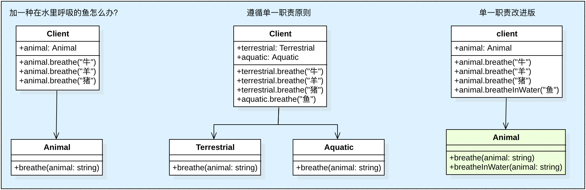
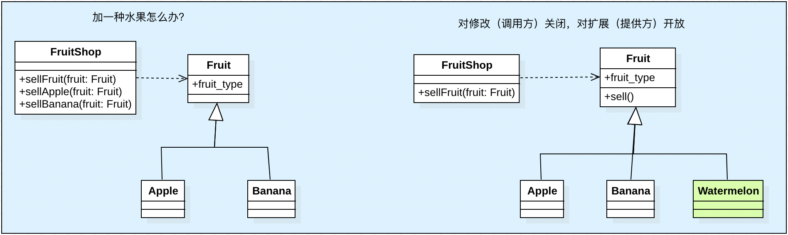
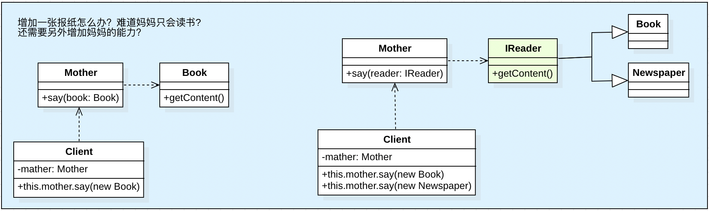
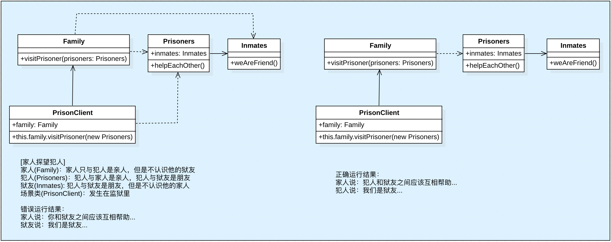
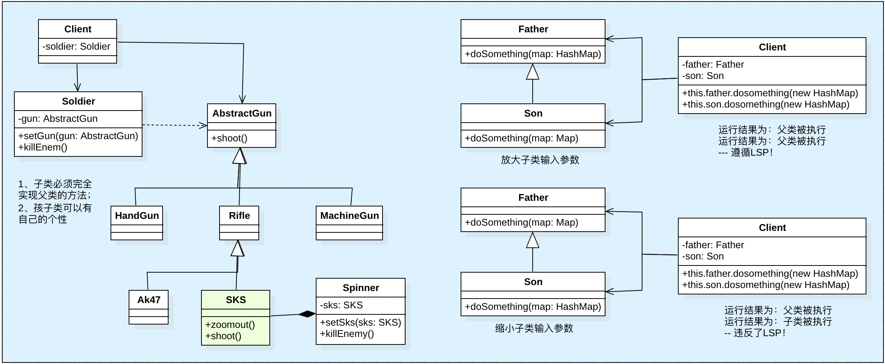
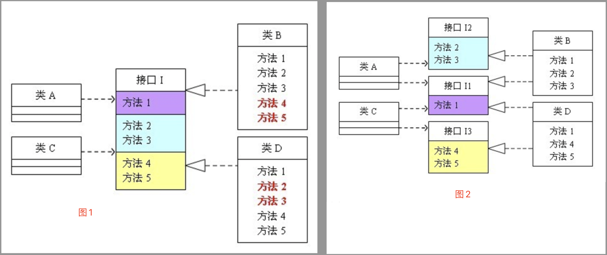

[TOC]

# 设计原则
##  1. 单一职责原则（SRP: Single Responsibitity Principle ）

​	<font color=red>--- 职责越多，复用性越差</font>

**1.1 概念**

​	单一职责原则表示一个模块的组成元素之间的功能相关性。从软件变化的角度来看，就一个类而言，应该仅有一个让它变化的原因；通俗地说，即一个类只负责一项职责。

​	假设某个类 P 负责两个不同的职责，职责 P1 和 职责 P2，那么当职责 P1 需求发生改变而需要修改类 P，有可能会导致原来运行正常的职责 P2 功能发生故障。

**1.2 示例**



​	我们假设一个场景：有一个动物类，它会呼吸空气，用一个类描述动物呼吸这个场景

```java
class Animal {  
    public void breathe(String animal) {  
        System.out.println(animal + "呼吸空气");  
    }  
}

public class Client {  
    public static void main(String[] args) {  
        Animal animal = new Animal();  
        animal.breathe("牛");  
        animal.breathe("羊");  
        animal.breathe("猪");  
    }  
}
```

​	在后来发现新问题，并不是所有的动物都需要呼吸空气，比如鱼需要呼吸水，于是很自然想到要增加对鱼的判断，代码如下：

```java
/**违背单一职责: 开销小，但有隐患*/
class Animal {  
    public void breathe(String animal) {  
        if ("鱼".equals(animal)) {  
            System.out.println(animal + "呼吸水");  
        } else {  
            System.out.println(animal + "呼吸空气");
        }  
    }
}

public class Client {  
    public static void main(String[] args) {  
        Animal animal = new Animal();  
        animal.breathe("牛");  
        animal.breathe("羊");  
        animal.breathe("猪");  
        animal.breathe("鱼");  
    }  
}
```

​	可以看得出，这样的修改确实简便，但是却存在着隐患。如果有一天有需要加入某类动物不需要呼吸，那么就要修改 Animal 类的 breathe 方法，而对原有代码的修改可能会对其他相关功能带来风险，也许有一天你会发现输出结果变成了："牛呼吸水" 了。

​	采用单一职责原则改造，我们进一步将 Animal 类拆分为陆生类和水生动物类，代码如下：

```java
/**遵循单一职责: 简单功能的开销很大*/
class Terrestrial {  
    public void breathe(String animal) {  
        System.out.println(animal + "呼吸空气");  
    }  
}

class Aquatic {  
    public void breathe(String animal) {  
        System.out.println(animal + "呼吸水");  
    }
}
  
public class Client {
    public static void main(String[] args) {  
        Terrestrial terrestrial = new Terrestrial();  
        terrestrial.breathe("牛");  
        terrestrial.breathe("羊");  
        terrestrial.breathe("猪");  
          
        Aquatic aquatic = new Aquatic();  
        aquatic.breathe("鱼");  
    }  
}  
```

​	在实际工作中，如果这样修改，开销是很大的！除了将原来的 Animal 类分解为 Terrestrial 类和 Aquatic 类以外，还需要修改客户端。请看另外一种修改方式:

```java
/**违背单一职责（改造版）: 开销小，无隐患*/
class Animal {  
    public void breathe(String animal) {
        System.out.println(animal + "呼吸空气");  
    }
    public void breatheInWater(String animal) {
        System.out.println(animal + "呼吸水");
    }
}
  
public class Client {
    public static void main(String[] args) {
        Animal animal = new Animal();
        animal.breathe("牛");
        animal.breathe("羊");
        animal.breathe("猪");
        animal.breatheInWater("鱼");
    }
}
```

​	可以看出，这种修改方式没有改动原来的代码，而是在类中新加了一个方法，这样虽然违背了单一职责原则，但是它并没有修改原来已存在的代码，不会对原本已存在的功能造成影响。

​	那么在实际编程中，需要根据实际情况来确定使用哪种方式，**只有逻辑足够简单，才可以在代码级别上违背单一职责原则**。

 **1.3 总结**

* 1、SRP 是一个简单又直观的原则，但是在实际编码的过程中很难将它恰当地运用，需要结合实际情况进行运用
* 2、SRP可以降低类的复杂度，一个类仅负责一项职责，其逻辑肯定要比负责多项职责简单
* 3、提高了代码的可读性，提高系统的可维护性


##  2. 开闭原则（OCP: Open Close Principle）

​	<font color=red>--- 对修改（使用方）关闭，对扩展（提供方）开放</font>

**2.1 概念**

​	类、模块和函数（方法）等软件实体，应该对扩展开放，对修改关闭(Open for extension, close for modification)。

​	其实，开放和关闭是分两个角色来讲的：

* **1、对扩展开放**：

  ​	指的是我们系统中的模块、类、方法对它们的提供者（开发者）应该是开放的，提供者可以对系统进行扩展（新增）新的功能。

* **对修改关闭**：

  ​	指的是系统中的模块、类、方法对它们的使用者（调用者）应该是关闭的。使用者使用这些功能时，不会因为提供方新增了功能而导致使用者也进行相应修改。

**2.2 示例**



​	假设有一个水果店，该水果店现在出售：“苹果、香蕉。”。代码如下：

```java
// 水果店
public class FruitShop {
  // 卖水果
  public void sellFruit(Fruit fruit) {
    if (fruit.fruit_type == 1) {
      sellApple(fruit);
    } else if (fruit.fruit_type == 2) {
      sellBanana(fruit)
    }
  }
  // 卖苹果
  public void sellApple(Fruit fruit) { 
    System.out.printIn("卖出一斤苹果!");
  }
  // 卖香蕉
  public void sellBanana(Fruit fruit) { 
    System.out.printIn("卖出一斤香蕉!");
  }
}

// 水果
public class Fruit {
	int fruit_type;
}

// 1.苹果
public class Apple extends Fruit {
	Apple() { super.fruit_type = 1; }
}

// 2.香蕉
public class Banana extends Fruit {
	Banana() { super.fruit_type = 2; }
}
```

​	现在水果店扩张，添加了一种新水果：“西瓜”。新增代码如下：

```java
// 1、新增西瓜类
public class Watermelon extends Fruit {
	Watermelon() { super.fruit_type = 3; }
}
  
// 2、在FruitShop类中添加“卖西瓜”的方法，且修改sellFruit方法
public class FruitShop {
  public void sellFruit(Fruit fruit) {
    if (fruit.fruit_type == 1) {
      sellApple(fruit);
    } else if (fruit.fruit_type == 2) {
      fsellBanana(fruit);
    } else if(fruit.fruit_type == 3) { // 新增2
      sellWatermelon(fruit);
    }
  }
  ***
  // 卖西瓜
  public void sellWatermelon(Fruit fruit) {// 新增1
    System.out.printIn("卖出一斤西瓜!");
  }
}
```

​	通过以上三步就实现了增加一种水果的需求。但是这种方式虽然容易理解，可当功能发生变动时，代码的修改量会特别大。并且这种方式也不符合“开闭原则”！

​	各种各样的水果类就是“**提供者**”，FruitShop类就是使用这些水果类的“**使用者**”。开闭原则中，提到对修改关闭，但是现在当提供者新增功能后，使用者（FruitShop类）也需要修改，这就违背了该原则。改造如下：

```java
/** 遵循开闭原则*/

// 水果店
public class FruitShop {
  // 卖水果的方法
  public void sellFruit (Fruit fruit) {
  	fruit.sell();
  }
}

// 水果-基类
public abstract class Fruit {
  // 水果类型
	int fruit_type;
	// 出售的方法
	public abstract void sell();
}

// 1、苹果
public class Apple extends Fruit {
  Apple() {
    super.fruit_type = 1;
  }
  @Override 
  public void sell() {
    System.out.printin(“卖出一斤苹果！“)；
  }
}
  
// 2.香蕉
public class Banana extends Fruit {
	Banana()	{
		super.fruit_type = 2;
	}
	@Override 
  public void sell() {
		System.out.println("卖出一斤香蕉!");
  }
}
  
```

此时当我们需要新增一种水果时，只需要提供者新增一个继承自Fruit类的子类就可以了。代码如下：

```java
// 3.西瓜
public class Watermelon extends Fruit {
	Watermelon() {
		super.fruit type = 3;
  }
	@Override
	public void sell) {
		System.out.print1n("卖出一斤西瓜！)；
	}
}
```

​	这样优化后的代码就遵守了“**开闭原则**”。提供方可以对系统进行扩展（对扩展开放），当系统扩展了新的功能后不会影响到使用方，使用方不需要进行修改（对修改关闭）。

​	所以，“开闭原则”给我们传递的思想就是：**尽量通过扩展软件的模块、类、方法，来实现功能的变化，而不是通过修改已有的代码来完成**。这样做就可以大大降低因为修改代码而给程序带来的出错率。

**2.3 总结**

* 1、OCP 可以具有良好的可扩展性，可维护性。
* 2、不可能让一个系统的所有模块都满足 OCP 原则，我们能做到的是尽可能地不要修改已经写好的代码，已有的功能，而是去扩展它。


##  3. 依赖倒置原则（DIP: Dependence Inversion Principle ）

​	<font color="red">---面向接口编程</font>

* 依赖注入
    * 接口：回调函数
    * 抽象类
      

**3.1 概念**

​	**高层模块不应该依赖低层模块，二者都应该于抽象**。进一步说，抽象不应该依赖于细节，细节应该依赖于抽象。

​	举个例子：某天产品经理需要添加新的功能，该功能需要操作数据库，一般负责封装数据库操作的和处理业务逻辑分别由不同的程序员编写。封装数据库操作可认为低层模块，而处理业务逻辑可认为高层模块。
​	那么如果处理业务逻辑需要等到封装数据库操作的代码写完的话才能添加的话，将会严重拖垮项目的进度。
​	正确的做法应该，处理业务逻辑的程序员提供一个封装好数据库操作的抽象接口，交给低层模块的程序员去编写，这样双方可以单独编写而互不影响。

​	**依赖倒转原则的核心思想就是面向接口编程。**

**3.2 示例**



​	思考下面这样一个场景：母亲给孩子讲故事，只要给她一本书，她就可照着书给孩子讲故事了。代码如下：

```java
class Book {  
    public String getContent() { return "这是一个有趣的故事"; }  
}  
  
class Mother {  
    public void say(Book book) {  
        System.out.println("妈妈开始讲故事");  
        System.out.println(book.getContent());  
    }  
}  

public class Client {  
    Mother mother = new Mother(); 
    public static void main(String[] args){   
        this.mother.say(new Book());  
    }
}  
```

​	假如有一天，给的是一份报纸，而不是一本书，让这个母亲讲下报纸上的故事，报纸的代码如下：

```java
class Newspaper {  
    public String getContent() { return "这个一则重要的新闻"; }  
} 
```

​	然而这个母亲却办不到，应该她只会读书，这太不可思议，只是将书换成报纸，居然需要修改 Mother 类才能读，假如以后需要换成了杂志呢？原因是 Mother 和 Book 之间的耦合度太高了，必须降低他们的耦合度才行。

我们可以引入一个抽象接口 IReader 读物，让书和报纸去实现这个接口，那么无论提供什么样的读物，该母亲都能读。代码如下：

```java
interface IReader {  
    public String getContent();  
}  

class Newspaper implements IReader {  
    public String getContent(){  
        return "这个一则重要的新闻";  
    }  
}  
class Book implements IReader{  
    public String getContent(){  
        return "这是一个有趣的故事";  
    }  
}  
  
class Mother {  
    public void say(IReader reader){  
        System.out.println("妈妈开始讲故事");  
        System.out.println(reader.getContent());  
    }  
}  
  
public class Client {  
    Mother mother = new Mother();  
    public static void main(String[] args){  
        this.mother.say(new Book());  
        this.mother.say(new Newspaper());  
    }
}
```


##  4. 迪米特法则（LOF: Law Of Demter)）

<font color="red">---最少知道原则</font>

**4.1 概念**

​	它表示一个对象应该对其它对象保持最少的了解。通俗来说就是，只与直接的朋友通信。

​	首先来解释一下什么是直接的朋友：每个对象都会与其他对象有耦合关系，只要两个对象之间有耦合关系，我们就说这两个对象之间是朋友关系。耦合的方式很多，依赖、关联、组合、聚合等。其中，我们称出现成员变量、方法参数、方法返回值中的类为直接的朋友，而出现在局部变量中的类则不是直接的朋友。也就是说，陌生的类最好不要作为局部变量的形式出现在类的内部。

​	对于被依赖的类来说，无论逻辑多么复杂，都尽量的将逻辑封装在类的内部，对外提供 public 方法，不对泄漏任何信息。

**4.2 示例**



​	家人探望犯人

```java
// 家人：家人只与犯人是亲人，但是不认识他的狱友
public class Family {
    public void visitPrisoner(Prisoners prisoners) {
        Inmates inmates = prisoners.helpEachOther();
        imates.weAreFriend();
    }
}

// 犯人：犯人与家人是亲人，犯人与狱友是朋友
public class Prisoners {
    private Inmates inmates = new Inmates();
    public Inmates helpEachOther() {
        System.out.println("家人说：你和狱友之间应该互相帮助...");
        return inmates;
    }
}

// 狱友: 犯人与狱友是朋友，但是不认识他的家人
public class Inmates {
    public void weAreFriend() {
        System.out.println("狱友说：我们是狱友...");
    }
}

// 场景类：发生在监狱里
public class PrisonClient {
    Family family = new Family();
    public static void main(String args[]) {
        this.family.visitPrisoner(new Prisoners());
    }
}
```

运行结果会发现:

```shell
家人说：你和狱友之间应该互相帮助...
狱友说：我们是狱友...
```

​	家人和狱友显然是不认识的，且监狱只允许家人探望犯人，而不是随便谁都可以见面的，这里家人和狱友有了沟通显然是违背了迪米特法则，因为在 Inmates 这个类作为局部变量出现在了 Family 类中的方法里，而他们不认识，不能够跟直接通信，迪米特法则告诉我们只与直接的朋友通信。所以上述的代码可以改为：

```java
public class Family {
    //家人探望犯人
    public void visitPrisoner(Prisoners prisoners) {
        System.out.print("家人说：");
        prisoners.helpEachOther();
    }
}

public class Prisoners {
    private Inmates inmates = new Inmates();
    public Inmates helpEachOther() {
        System.out.println("犯人和狱友之间应该互相帮助...");
        System.out.print("犯人说：");
        inmates.weAreFriend();
        return inmates;
    }
     
}

public class Inmates {
    public void weAreFriend() {
        System.out.println("我们是狱友...");
    }
}

public class PrisonClient {
    Family family = new Family();
    public static void main(String args[]) {
        this.family.visitPrisoner(new Prisoners());
    }
}
```

​	运行结果

```shell
家人说：犯人和狱友之间应该互相帮助...
犯人说：我们是狱友...
```

这样家人和狱友就分开了，但是也表达了家人希望狱友能跟犯人互相帮助的意愿。也就是两个类通过第三个类实现信息传递, 而家人和狱友却没有直接通信。

​	这样家人和狱友就分开了，但是也表达了家人希望狱友能跟犯人互相帮助的意愿。也就是两个类通过第三个类实现信息传递, 而家人和狱友却没有直接通信。


##  5. 里氏替换原则（LSP: Liskov Substitution Principle）

​	<font color="red">---子类完全替换父类 (is-A), 父类没有被破坏</font>

​	**里氏替换原则的重点在不影响原功能，而不是不覆盖原方法。**通俗的来讲就是：子类可以扩展父类的功能，但不能改变父类原有的功能

**5.1 概念**

​	如果对每一个类型为S的对象o1，都有类型为T的对象o2，使得以T定义的所有程序P在所有的对象o1都代替o2时，程序P的行为没有发生变化，那么类型S是类型T的子类型。

​	通俗地讲，就是只要父类能出现的地方，子类就可以出现，而且替换为子类也不会产生任何错误或异常

​	为什么引入里氏替换原则？其实是因为解决“**继承**”的问题，我们知道继承的特点如下：

```shell
## 继承的优点：
#1、代码共享，减少创建类的工作量，每个子类都拥有父类的属性和方法；
#2、提高代码的重用性；
#3、子类可以形似父类，但又异于父类；
#4、提高代码的可扩展性；
#5、提高产品或项目的开放性

## 继承的缺点：
#1、继承是侵入性的。只要继承，就必须拥有父类的属性和方法。
#2、降低代码的灵活性。子类会多一些父类的约束。
#3、增强了耦合性。当父类的常量、变量、方法被修改时，需要考虑子类的修改。
```

里氏替换原则就是为了让“利”的因素发挥最大的作用，同时减少“弊”带来的麻烦。

里氏替换原则有四层含义：

*	1、子类必须完全实现父类的方法
*	2、孩子类可以有自己的个性
*	3、 覆盖或实现父类的方法时，输入参数可以被放大
*	4、覆盖或实现父类的方法时，输出结果可以被缩小

**5.2 示例**



​	以打CS举例，来描述一下里面用到的枪。枪的主要职责是射击，如何射击在各个具体的子类中实现，在士兵类Soldier中定义了一个方法 killEnemy，使用枪来kill敌人，具体用什么枪，调用的时候才知道。注意，士兵类的killEnemy方法中使用的gun是抽象的，具体时间什么枪需要由客户端（Client）调用Soldier的构造方法传参确定。具体代码如下：

1、子类必须完全实现父类的方法

```java
// 枪
public abstract class AbstractGun {
	// 射击方法
	public abstract void shoot()
}

// 手枪类
public class HandGun extends AbstractGun {
  @override
  public void shoot () { svstem.out.println("手枪射击"); }
}

// 步枪类
public class Rifle extends AbstractGun {
  @override
  public void shoot () { svstem.out.println("步枪射击"); }
}

// 机枪类
public class MachineGun extends AbstractGun {
  @override
  public void shoot () { svstem.out.println("机枪射击"); }
}

// 士兵类
public class Soldier {
	private AbstractGun gun;
	public setGun(AbstractGun gun) { this.gun = gun; }
	public void killEnem() { 
    System.out.printin("开始ki11敌人");
    this.gun.shoot();
  }
}

// 客户端
public class Client {
  public static void main(string[] args)
    // 定义一个士兵，并给他一把手枪
    Soldier soldier = new Soldier(new Handgun()) :
    // 士兵开始xi11敌人
    soldier.killEnemy()
  }
}
```

**注意：**在类中调用其他类时务必要使用父类或接口，如果不能使用父类或接口，则说明类的设计已经违背了LSP原则

2、孩子类可以有自己的个性

​	孩子类当然可以有自己的属性和方法了，也正因如此，在子类出现的地方，父类未必就可以代替。还是以上面的关于枪支的例子为例，步枪有 AK47、SKS狙击步枪等型号，把这两个型号的枪引入后的Rifle的子类图如下:

```java
// Ak47
public class Ak47 extends Rifle {
}

// SKs狙击步枪
public class SKS extends Rifle {
  // 配带个倍镜
  public void zoomout() { System.out.println("通过高倍镜观察敌人"); }
  @override
  public void shoot() { System.out.printin ("SKS射击"); }
}

// 狙击手
public class Spinner {
  private SKS sks;
  public void setsks (SKS sks) { this.sks = sks; }
  public void killEnemy() {
    sks.zoomout();// 先瞄准
    sks.shoot();// 再开枪
  }
}
```

​	SKS狙击步枪可以配一个8倍镜进行远程瞄准，相对于父类步枪，这就是SKS的个性。狙击手因为只能使用狙击枪，所以，狙击手类中持有的枪只能是狙击类型的，如果换成父类步枪Rifle，则传递进来的可能就不是狙击枪，而是AK47了，而AK47是没有zoomOut方法的，所以肯定是不行的。这也验证了里氏替换原则的那一句话：有子类出现的地方，父类未必就可以代替。

3. 覆盖或实现父类的方法时，输入参数可以被放大

```java
/** 函数重载: 函数同名，但参数不同 */
public class Father {
	public Colleciton doSomething (HashMap map) {
		system.out.println("父类被执行")；
		return map.values () ;
  }
}

public class Son extends Father {
  // 放大子类输入参数
  public Colleciton doSomething (Map map) {
  	system.out.println("子类被执行")；
		return map.values () ;
  }
}

public class Client {
  // 父类存在的地方，子类就能存在
  private Father father = new Father();
  private Son son = new Son();
  public static void main (String[] args) {
  	this.father.dosomething(new HashMap());//运行结果为：父类被执行
  	this.son.dosomething(new HashMap());	 //运行结果为：父类被执行
  }
}
```

​	子类方法与父类方法同名，但又不是覆写父类的方法。你加个@Override看看，会报错的。像这种方法名相同，方法参数不同，叫做方法的重载。你可能会有疑问：重载不是只能在当前类内部重载吗？因为Son继承了Father，Son就有了Father的所有属性和方法，自然就有了Father的doSomething这个方法，所以，这里就构成了重载

​	于是，我们发现上述示例的运行结果是一样的。为什么呢？因为子类Son继承了Father，就拥有了doSomething(HashMap map)这个方法，不过由于Son没有重写这个方法，当调用Son的这个方法的时候，就会自动调用其父类的这个方法。所以两次的结果是一致的。

​	举个反例，如果父类的输入参数类型大于子类的输入参数类型，会出现什么问题呢？我们直接看代码执行结果即可轻松看出问题：

```java
public class Father {
  public Colleciton doSomething (Map map) {
    System.out.println("父类被执行")；
    return map.values();
  }
}

public class Son extends Father {
  // 缩小子类方法入参
  public Colleciton doSomething (HashMap map) {
  	system.out.println("子类被执行")；
		return map.values () ;
  }
}

public class Client {
  // 父类存在的地方，子类就能存在
  private Father father = new Father();
  private Son son = new Son();
  public static void main (String[] args) {
  	this.father.dosomething(new HashMap());//运行结果为：父类被执行
  	this.son.dosomething(new HashMap());	 //运行结果为：子类被执行
  }
}
```

​	两次运行结果不一致，违反了里氏替换原则，所以**子类中方法的入参类型必须与父类中被覆写的方法的入参类型相同或更宽松。**

4. 覆盖或实现父类的方法时，输出结果可以被缩小

​	这句话的意思就是，父类的一个方法的返回值是类型T，子类的相同方法（重载或重写）的返回值为类型S，那么里氏替换原则就要求S必须小于等于T。为什么呢？因为重写父类方法，父类和子类的同名方法的输入参数是相同的，两个方法的范围值S小于等于T，这时重写父类方法的要求。


##  6. 接口隔离原则（ISP：Interface Segregation Principle）

​	<font color="red">---不依赖用不到的接口</font>

**6.1 概念**

​	接口隔离原则，其 "隔离" 并不是准备的翻译，真正的意图是 “分离” 接口(的功能)

​	接口隔离原则强调：**客户端不应该依赖它不需要的接口；一个类对另一个类的依赖应该建立在最小的接口上。**

**6.2 示例**



从图1中可以看出，类 A 依赖于 接口 I 中的方法 1，2，3 ，类 B 是对类 A 的具体实现。类 C 依赖接口 I 中的方法 1，4，5，类 D 是对类 C 的具体实现。对于类B和类D来说，**虽然他们都存在着用不到的方法（也就是图中红色字体标记的方法），但由于实现了接口I，所以也必须要实现这些用不到的方法。**

用代码表示:

```java
interface I {  
    public void method1();  
    public void method2();  
    public void method3();  
    public void method4();  
    public void method5();  
}  
  
class A {  
    public void depend1(I i) { i.method1(); }  
    public void depend2(I i) { i.method2(); }  
    public void depend3(I i) { i.method3(); }  
}  
  
class B implements I {  
	 // 类 B 只需要实现方法 1，2, 3，而其它方法它并不需要，但是也需要实现
    public void method1() { System.out.println("类 B 实现接口 I 的方法 1");  }  
    public void method2() { System.out.println("类 B 实现接口 I 的方法 2");  }  
    public void method3() { System.out.println("类 B 实现接口 I 的方法 3");  }  
    public void method4() {}  
    public void method5() {}  
}  
  
class C {  
    public void depend1(I i) { i.method1(); }  
    public void depend2(I i) { i.method4(); }  
    public void depend3(I i) { i.method5(); }  
}  

class D implements I {  
	// 类 D 只需要实现方法 1，4，5，而其它方法它并不需要，但是也需要实现
    public void method1() { System.out.println("类 D 实现接口 I 的方法 1"); }  
    public void method2() {}  
    public void method3() {}  
    public void method4() { System.out.println("类 D 实现接口 I 的方法 4"); }  
    public void method5() { System.out.println("类 D 实现接口 I 的方法 5"); }  
}  
  
public class Client{  
    public static void main(String[] args){  
        A a = new A();  
        a.depend1(new B());  
        a.depend2(new B());  
        a.depend3(new B());  
          
        C c = new C();  
        c.depend1(new D());  
        c.depend2(new D());  
        c.depend3(new D());  
    }  
}  
```

​	可以看出，如果接口定义的过于臃肿，只要接口中出现的方法，不管依赖于它的类是否需要该方法，实现类都必须去实现这些方法，这就不符合接口隔离原则，如果想符合接口隔离原则，就必须对接口 I 如图2中进行拆分。代码如下：

```java
interface I1 {  
    public void method1();  
}  
  
interface I2 {  
    public void method2();  
    public void method3();  
}  
  
interface I3 {  
    public void method4();  
    public void method5();  
}  
  
class A {  
    public void depend1(I1 i) { i.method1(); }  
    public void depend2(I2 i) { i.method2(); }  
    public void depend3(I2 i) { i.method3(); }  
}  
  
class B implements I1, I2 {  
    public void method1() { System.out.println("类 B 实现接口 I1 的方法 1"); }  
    public void method2() { System.out.println("类 B 实现接口 I2 的方法 2"); }  
    public void method3() { System.out.println("类 B 实现接口 I2 的方法 3"); }  
}  
  
class C {  
    public void depend1(I1 i) { i.method1(); }  
    public void depend2(I3 i) { i.method4(); }  
    public void depend3(I3 i) { i.method5(); }  
}  
  
class D implements I1, I3 {  
    public void method1() { System.out.println("类 D 实现接口 I1 的方法 1"); }  
    public void method4() { System.out.println("类 D 实现接口 I3 的方法 4"); }  
    public void method5() { System.out.println("类 D 实现接口 I3 的方法 5"); }  
}

public class Client{  
    public static void main(String[] args){  
        A a = new A();  
        a.depend1(new B());  
        a.depend2(new B());  
        a.depend3(new B());  
          
        C c = new C();  
        c.depend1(new D());  
        c.depend2(new D());  
        c.depend3(new D());  
    }  
}  
```


**6.3 总结**

* 1、接口隔离原则的思想在于建立单一接口，尽可能地去细化接口，接口中的方法尽可能少

* 2、但是凡事都要有个度，如果接口设计过小，则会造成接口数量过多，使设计复杂化。所以一定要适度

  

##  7. KISS原则


> 巨人的肩膀：
> [设计模式之七大基本原则](https://zhuanlan.zhihu.com/p/24614363)
> [六大设计原则超详细介绍（再不理解你打我）](https://baijiahao.baidu.com/s?id=1659949956289085621&wfr=spider&for=pc)