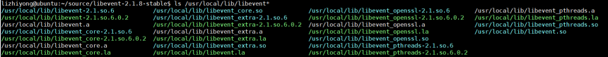
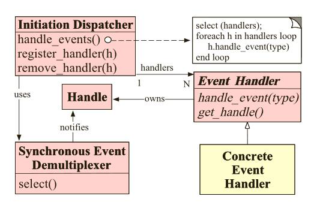
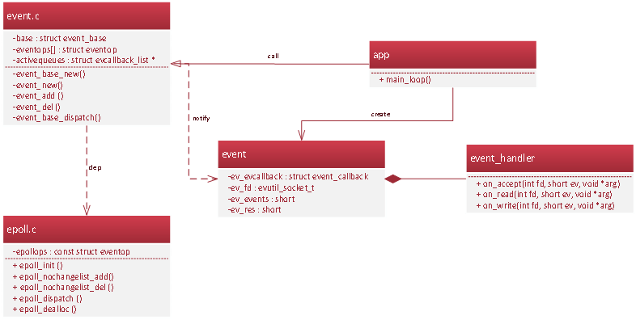
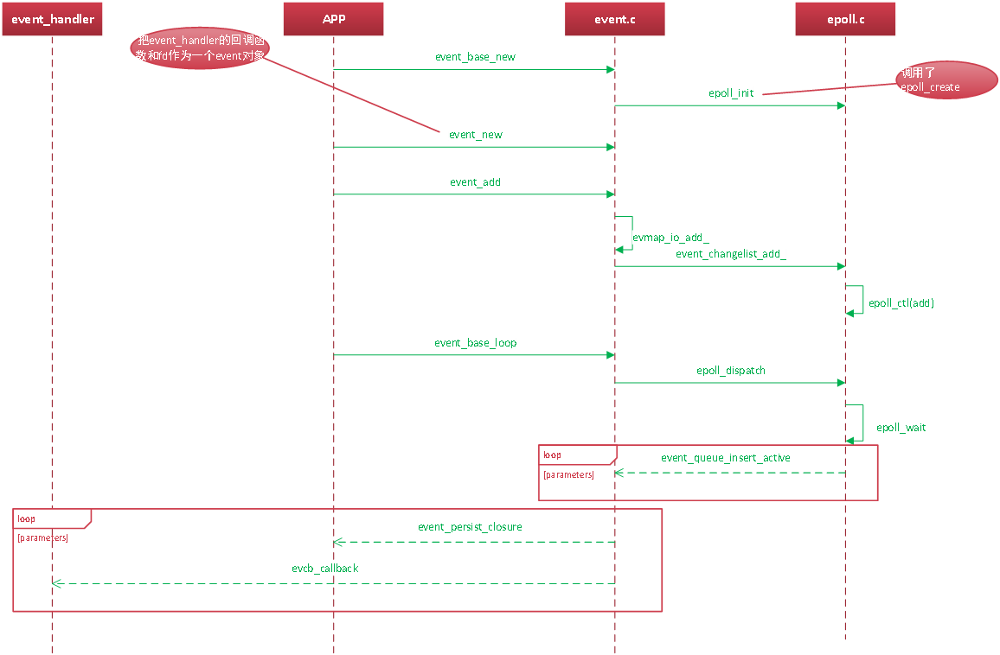
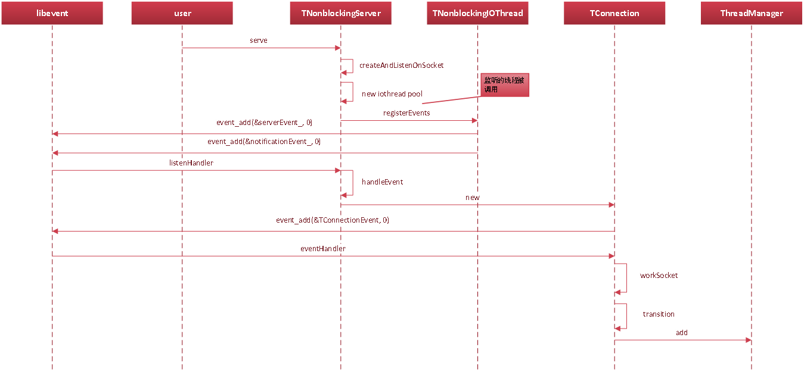

[TOC]


# libevent

##  1. libevent是什么
Libevent的官网：http://libevent.org/    
github：https://github.com/libevent/libevent

libevent是一个轻量级的开源的高性能的事件触发的网络库，适用于windows、linux、bsd等多种平台，内部使用select、epoll、kqueue等系统调用管理事件机制。它被众多的开源项目使用，例如大名鼎鼎的memcached和thrift等。
特点：  
* 事件驱动，高性能;
* 轻量级，专注于网络(相对于ACE);
* 开放源码，代码相当精炼、易读;
* 跨平台，支持Windows、Linux、BSD和Mac OS;
* 支持多种I/O多路复用技术（epoll、poll、dev/poll、select和kqueue等），在不同的操作系统下，做了多路复用模型的抽象，可以选择使用不同的模型，通过事件函数提供服务;
* 支持I/O，定时器和信号等事件;
* 此外封装了http和https等；

##  2. libevent的安装
 $ ./configure  
 $ make     
 $ make verify # (optional)         
 $ sudo make install    
make install后在/usr/local/lib目录下有以下文件：


##  3. libevent的主要API
* 创建事件集
    ```c
     struct event_base *event_base_new(void);
    ```
* 创建事件
    ```c
     struct event event_new(struct event_base ,evutil_socket_t ,short , event_callback_fn,void*)
    ```
* 添加事件
    ```c
     int event_add(struct event * ev,const struct timeval* timeout)
    ```
* 删除事件
    ```c
     int event_del(struct event *)
    ```
* 事件循环
    ```c
     int event_base_loop(struct event_base *base, int flags)
     int event_base_dispatch(struct event_base *event_base)
    ```
* 其它  
    如：buffer io event（bufferevent），即带缓冲的event

##  4. libevent的简单使用
​	[参考sample](https://github.com/Jevstein/dnpractice/tree/master/course/libevent_helloword)
###  4.1. server
```c
void accept_cb(int fd, short events, void* arg);
void socket_read_cb(int fd, short events, void* arg);

int main(int argc, char const *argv[])
{
    // 1.socket, listen, bind, ...
    evutil_socket_t listener_fd = tcp_server_init(port, 10);

    // 2.init & set events & bind callback: accept_cb
    struct event_base* base = event_base_new();
    struct event* ev_listen = event_new(base, listener_fd, EV_READ | EV_PERSIST, accept_cb, base);
    event_add(ev_listen, NULL);

    // 3.event dispatch
    event_base_dispatch(base);

    return 0;
}

void accept_cb(int fd, short events, void* arg)
{
    // 1.accept
    evutil_socket_t  sockfd = accept(fd, (struct sockaddr*)&client, &len);

    // 2.set no_block
    evutil_make_socket_nonblocking(sockfd);

    // 3.set events(EV_READ | EV_PERSIST)  & bind callback: socket_read_cb
    struct event_base* base = (struct event_base*)arg;
    struct event* ev = event_new(NULL, -1, 0, NULL, NULL);
    event_assign(ev, base, sockfd, EV_READ | EV_PERSIST, socket_read_cb, (void*)ev);

    event_add(ev, NULL);
}

void socket_read_cb(int fd, short events, void* arg)
{
    struct event* ev = (struct event*)arg;

    // 1.read
    int len = read(fd, msg, sizeof(msg) - 1);

    // 2.send
    send(fd, msg, strlen(msg));
}

```


###  4.2. client
```c
void cmd_msg_cb(int fd, short events, void* arg); 
void socket_read_cb(int fd, short events, void *arg); 

int main(int argc, char** argv)  
{  
    // 1.socket, connect
    evutil_socket_t connect_fd = tcp_connect_server(argv[1], atoi(argv[2]));  
   
    // 2.init & set events & bind callback: socket_read_cb
    struct event_base* base = event_base_new();   
    struct event *ev_fd = event_new(base, connect_fd, EV_READ | EV_PERSIST,  socket_read_cb, NULL);  
    event_add(ev_fd, NULL);  
    
    // 3.监听终端输入事件 & bind callback: cmd_msg_cb
    struct event* ev_cmd = event_new(base, STDIN_FILENO,  EV_READ | EV_PERSIST, cmd_msg_cb,  (void*)&connect_fd);
    event_add(ev_cmd, NULL);  
  
    event_base_dispatch(base);  
  
    return 0;  
}  

void cmd_msg_cb(int fd, short events, void* arg)  
{
    // 1.read from STDIN_FILENO
    int ret = read(fd, msg, sizeof(msg));  
  
    // 2.send
    int sockfd = *((int*)arg);  
    write(sockfd, msg, ret);  
}  

void socket_read_cb(int fd, short events, void *arg)  
{ 
    // read from sock_fd
    int len = read(fd, msg, sizeof(msg)-1);  
}  

```

##  5. libevent的实现解析
###  5.1. 反应堆


###  5.2. 实现


###  5.3. 时序


##  6. libevent的源码剖析

###  6.1. eventop
```c
/** Structure to define the backend of a given event_base. */
struct eventop {
	const char *name;
	void *(*init)(struct event_base *);
	int (*add)(struct event_base *, evutil_socket_t fd, short old, short events, void *fdinfo);
	int (*del)(struct event_base *, evutil_socket_t fd, short old, short events, void *fdinfo);
	int (*dispatch)(struct event_base *, struct timeval *);
	void (*dealloc)(struct event_base *);
	int need_reinit;
	enum event_method_feature features;
	size_t fdinfo_len;
};
```

###  6.2. event_base
```c
struct event_base {
	const struct eventop *evsel;
	void *evbase;
	struct event_changelist changelist;

	const struct eventop *evsigsel;
	struct evsig_info sig;

	int virtual_event_count;
	int event_count;
	int event_count_active;

	int event_gotterm;
	int event_break;
	int event_continue;
	int event_running_priority;
	int running_loop;

	struct event_list *activequeues;
	int nactivequeues;

	struct common_timeout_list **common_timeout_queues;
	int n_common_timeouts;
	int n_common_timeouts_allocated;

	struct deferred_cb_queue defer_queue;
	struct event_io_map io;
	struct event_signal_map sigmap;
	struct event_list eventqueue;
	struct timeval event_tv;
	struct min_heap timeheap;
	struct timeval tv_cache;

#ifdef WIN32
	struct event_iocp_port *iocp;
#endif

	enum event_base_config_flag flags;

	int is_notify_pending;
	evutil_socket_t th_notify_fd[2];
	struct event th_notify;
	int (*th_notify_fn)(struct event_base *base);
};
```
###  6.3. event
```c
struct event {
	struct event_callback ev_evcallback;

	/* for managing timeouts */
	union {
		TAILQ_ENTRY(event) ev_next_with_common_timeout;
		int min_heap_idx;
	} ev_timeout_pos;
	evutil_socket_t ev_fd;

	short ev_events;
	short ev_res;		/* result passed to event callback */

	struct event_base *ev_base;

              …

	struct timeval ev_timeout;
};

```

##  7. libevent的疑问解答
###  7.1. 如何选择不同的反应堆,如：select、epoll?

```c
   event_base_new() 
-> event_base_new_with_config(cfg) 
-> base->evsel = eventops[i];
```

```c
/* Array of backends in order of preference. */
static const struct eventop *eventops[] = {
#ifdef _EVENT_HAVE_EVENT_PORTS
	&evportops,
#endif
#ifdef _EVENT_HAVE_WORKING_KQUEUE
	&kqops,
#endif
#ifdef _EVENT_HAVE_EPOLL
	&epollops,            // <---epoll
#endif
#ifdef _EVENT_HAVE_DEVPOLL
	&devpollops,
#endif
#ifdef _EVENT_HAVE_POLL
	&pollops,
#endif
#ifdef _EVENT_HAVE_SELECT
	&selectops,
#endif
#ifdef WIN32
	&win32ops,
#endif
	NULL
};
```

```c
const struct eventop epollops = {
	"epoll",
	epoll_init,          // <---epoll
	epoll_nochangelist_add,
	epoll_nochangelist_del,
	epoll_dispatch,
	epoll_dealloc,
	1, /* need reinit */
	EV_FEATURE_ET|EV_FEATURE_O1,
	0
};
```
###  7.2. libevent只能单线程吗？
​	不是。参考thrift
##  8. libevent的应用
###  8.1. thrift


> 参考: 动脑学院.lee老师