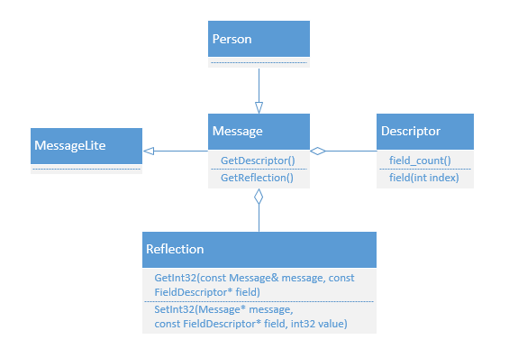

[TOC]

# protobuf与json的互转

​	在项目工程化实现中，经常会遇到以下问题：

* 1.用json格式写功能测试用例，转成内部protobuf进行序列化；
* 2.多语言模块调用时，原本采用了json格式作为协议交互，需要将内部实现的protobuf自动转换成json；
* 3.特殊情况下，将protobuf转成json格式保存，便于阅读等。。。

​	假如有protobuf如下：

```protobuf
//addressbook.proto
syntax = "proto2";//指定版本：第一行非空白非注释行。若不指定，默认为proto2

package tutorial;
 
message Person {
    required string name = 1;  //注意：Required fields are not allowed in proto3
    optional int32 age = 2;    //注意：Explicit 'optional' labels are disallowed in the Proto3 syntax.
}
 
message AddressBook {
    repeated Person persons = 1;
}
```

​	分别生成不同语言的源码，步骤略。详见《[protobuf的跨平台安装和多语言调用](../基础/protobuf的安装和使用.md)》

## 1.python版

​	导入protobuf模块，如：

```shell
$ pip3 install protobuf
$ python
>>> import google.protobuf
```

### 1.1.第三方pbjson支持json互转

#### 1.1.1.pbjson.py

 * 1.首先，引入simplejson模块

   ```shell
   $ pip3 install simplejson
   $ python
   >>> import simplejson
   ```

 * 2.其次，引入第三方源码pbjson.py文件。该文件来自[GitHub.NextTuesday.py-pb-converters](https://github.com/NextTuesday/py-pb-converters)，如下：

   ```python
   import simplejson
   from google.protobuf.descriptor import FieldDescriptor as FD
   
   class ConvertException(Exception):
       pass
   
   def dict2pb(cls, adict, strict=False):
       """
       Takes a class representing the ProtoBuf Message and fills it with data from
       the dict.
       """
       obj = cls()
       for field in obj.DESCRIPTOR.fields:
           if not field.label == field.LABEL_REQUIRED:
               continue
           if not field.has_default_value:
               continue
           if not field.name in adict:
               raise ConvertException('Field "%s" missing from descriptor dictionary.'
                                      % field.name)
       field_names = set([field.name for field in obj.DESCRIPTOR.fields])
       if strict:
           for key in adict.keys():
               if key not in field_names:
                   raise ConvertException(
                       'Key "%s" can not be mapped to field in %s class.'
                       % (key, type(obj)))
       for field in obj.DESCRIPTOR.fields:
           if not field.name in adict:
               continue
           msg_type = field.message_type
           if field.label == FD.LABEL_REPEATED:
               if field.type == FD.TYPE_MESSAGE:
                   for sub_dict in adict[field.name]:
                       item = getattr(obj, field.name).add()
                       item.CopyFrom(dict2pb(msg_type._concrete_class, sub_dict))
               else:
                   map(getattr(obj, field.name).append, adict[field.name])
           else:
               if field.type == FD.TYPE_MESSAGE:
                   value = dict2pb(msg_type._concrete_class, adict[field.name])
                   getattr(obj, field.name).CopyFrom(value)
               else:
                   setattr(obj, field.name, adict[field.name])
       return obj
   
   
   def pb2dict(obj):
       """
       Takes a ProtoBuf Message obj and convertes it to a dict.
       """
       adict = {}
       if not obj.IsInitialized():
           return None
       for field in obj.DESCRIPTOR.fields:
           if not getattr(obj, field.name):
               continue
           if not field.label == FD.LABEL_REPEATED:
               if not field.type == FD.TYPE_MESSAGE:
                   adict[field.name] = getattr(obj, field.name)
               else:
                   value = pb2dict(getattr(obj, field.name))
                   if value:
                       adict[field.name] = value
           else:
               if field.type == FD.TYPE_MESSAGE:
                   adict[field.name] = \
                       [pb2dict(v) for v in getattr(obj, field.name)]
               else:
                   adict[field.name] = [v for v in getattr(obj, field.name)]
       return adict
   
   
   def json2pb(cls, json, strict=False):
       """
       Takes a class representing the Protobuf Message and fills it with data from
       the json string.
       """
       return dict2pb(cls, simplejson.loads(json), strict)
   
   
   def pb2json(obj):
       """
       Takes a ProtoBuf Message obj and convertes it to a json string.
       """
       return simplejson.dumps(pb2dict(obj), sort_keys=True, indent=4)
   ```

   ​	当然，你也可以不用pbjson.py文件，自己造轮子。

#### 1.1.2.示例

```python
#!/usr/bin/env python
# coding=utf-8
# file: main.py

# from addressbook_pb2 import AddressBook
import addressbook_pb2
# from google.protobuf.json_format import MessageToJson

#import sys
#sys.path.append("../..")
#from src.python import addressbook_pb2
import pbjson
import simplejson

def write_to_jsonfile(filename):
    address_book = addressbook_pb2.AddressBook()
    person = address_book.persons.add()
    person.age = 120
    person.name = "Safly"
    print("  1).person -> \n", person, type(person))

    #Convert Protobuf to json
    json_data = pbjson.pb2json(address_book)
    print("  2).convert protobuf to json -> \n", json_data)

    print("  3).input to file ...")
    with open(filename, 'w') as file_obj:
        file_obj.write(str(json_data))

def read_from_jsonfile(filename):
    with open(filename, "r") as file_obj:
        # json_data = file_obj.read() #这句并不是json数据
        json_data = simplejson.load(file_obj)

    # 或者 
    # file_obj = open(filename)
    # json_data = simplejson.load(file_obj)
    # file_obj.close

    print("  1).json_data from file ->\n", json_data, type(json_data))

    address_book = pbjson.dict2pb(addressbook_pb2.AddressBook, json_data)
    print("  2).parse address_book from json_data ->\n", address_book, type(address_book))

    print("  3).use address_book ->")
    for person in address_book.persons:
        print("name: {}, age: {}".format(person.name,person.age))

def main():
    addrbook2 = "addressbook.json"

    print("\r\n========= 演示protobuf的json数据的文件读写 =========")
    print("1.将protobuf的json数据写入文件 ...")
    write_to_jsonfile(addrbook2)

    print("\r\n2.读出文件中保存protobuf的json数据 ...")
    read_from_jsonfile(addrbook2)

if __name__ == "__main__":
    main()
```


### 1.2.protobuf自身语法支持互转

#### 1.2.1.pb2json & pb2dict

```python
#!/usr/bin/env python
# coding=utf-8
# file: main.py
from google.protobuf.json_format import MessageToJson
from google.protobuf.json_format import MessageToDict

def pb2json_pb2dict():
    address_book = addressbook_pb2.AddressBook()
    person = address_book.persons.add()
    person.age = 120
    person.name = "Bob"

    json_obj = MessageToJson(address_book)
    print("  1).json_obj from protobuf ->\n", json_obj, type(json_obj))

    dict_obj = MessageToDict(address_book)
    print("  2).dict_obj from protobuf ->\n", dict_obj, type(dict_obj))

def main():
    print("\r\n========= 演示语言自带protobuf到json/dict的转换 =========")
    pb2json_pb2dict()
```


#### 1.2.2.json2obj：将json转换成python对象

```python
#!/usr/bin/env python
# coding=utf-8
# file: main.py
import json
import time

class JsonClass(object):
    def to_json_string(self):
        return json.dumps(self, default=lambda obj: obj.__dict__)

    def from_json_string(self, json_string):
        data = json.loads(json_string)
        for key in self.__dict__.keys():
            setattr(self, key, data[key])

class Task(JsonClass):
    def __init__(self, id=None, name=None, timestamp=None):
        self.id = id
        self.name = name
        self.timestamp = timestamp

def json2obj():
    # 序列化
    task = Task(1, "a", time.time())
    print("  1).序列化: ", task.to_json_string())

    # 反序列化
    json_string = '{"timestamp": 1560948789.5293133, "name": "a", "id": 1}'
    task = Task()
    task.from_json_string(json_string)
    print("  2).反序列化：", task.id, task.name, task.timestamp, type(task))

def main():
    print("\r\n========= 演示json转object =========")
    json2obj()
```


### 1.3.将proto文档转成json文档

​	详见：[python实现proto转json文档](python实现proto转json文档.md)


## 2.c++版

### 2.1.protobuf数据与json的转换

#### 2.1.1.protobuf自带的json转换功能

```c++
//1.proto转json
bool Protobuf2Json(const ProMessage& pro_message, std::string& js_out)
{
    js_out.clear();
    if (!pro_message.IsInitialized())
      return false;

    google::protobuf::util::JsonPrintOptions tran_opt;
    tran_opt.add_whitespace = false;
    tran_opt.always_print_primitive_fields = true;
    tran_opt.always_print_enums_as_ints = true;
    tran_opt.preserve_proto_field_names = true;
	tran_opt.bytes_to_encode_base64 = false;//不进行base64编码，即：bytes当string使用

    auto tran_ret = google::protobuf::util::MessageToJsonString(pro_message, &js_out, tran_opt, false);
    return tran_ret.ok();
}

//2.json转proto
bool Json2Protobuf(const std::string& jstr, ProMessage &pro_out)
{
	google::protobuf::util::JsonParseOptions opt;
	opt.ignore_unknown_fields = true;
	opt.bytes_from_encode_base64 = false;//不进行base64编码，即：bytes当string使用
	auto ret = google::protobuf::util::JsonStringToMessage(jstr, &pro_out, opt);
	return ret.ok();
}
```

#### 2.1.2.利用反射机制，配合rapidjson进行转换



### 2.2.protobuf的bytes魔改

【**注意**】: protobuf中的bytes类似数据，当转换为字符串时，内部会将二进制数据进行base64编码（同样，字符串转protobuf时，再进行相应的base64解码操作）。有时，将bytes直接作为字符串（string）使用，单希望取消protobuf的自动编解码操作。则可以对protobuf进行魔改，如下：

```shell
#如上述bytes_to_encode_base64变量，就是自定义变量，用于控制是否进行base64编解码
```

* 1）Protobuf2Json

  ```c++
  //1.protobuf/src/google/protobuf/util/json_util.h
  struct JsonPrintOptions {
     //-- snip --
      
    // bytes类型的值是否进行base64编码
    bool bytes_to_encode_base64;
  
    JsonPrintOptions()
        : add_whitespace(false),
      
          //-- snip --
      
  		bytes_to_encode_base64(true){}
  };
  
  //2.protobuf/src/google/protobuf/util/json_util.c
  util::Status BinaryToJsonStream(TypeResolver* resolver,
                                    const string& type_url,
                                    io::ZeroCopyInputStream* binary_input,
                                    io::ZeroCopyOutputStream* json_output,
                                    const JsonPrintOptions& options) {
    //-- snip --
      
    proto_source.set_bytes_to_encode_base64(options.bytes_to_encode_base64);
      
    //-- snip --
  }
  
  //3.protobuf/src/google/protobuf/util/internal/protostream_objectsource.h
  class LIBPROTOBUF_EXPORT ProtoStreamObjectSource : public ObjectSource {
    //-- snip --
  
    //bytes类型的值是否进行base64编码
    void set_bytes_to_encode_base64(bool bteb) {
        bytes_to_encode_base64_ = bteb;
    }
      
    //-- snip --
      
    //bytes类型的值是否进行base64编码
    bool bytes_to_encode_base64_;
  
    GOOGLE_DISALLOW_IMPLICIT_CONSTRUCTORS(ProtoStreamObjectSource);
  };
  
  
  //4.protobuf/src/google/protobuf/util/internal/protostream_objectsource.c
  ProtoStreamObjectSource::ProtoStreamObjectSource(
      google::protobuf::io::CodedInputStream* stream, TypeResolver* type_resolver,
      const google::protobuf::Type& type)
      : stream_(stream),
        //-- snip --
        bytes_to_encode_base64_(true) {
    GOOGLE_LOG_IF(DFATAL, stream == nullptr) << "Input stream is nullptr.";
  }
  
  ProtoStreamObjectSource::ProtoStreamObjectSource(
      google::protobuf::io::CodedInputStream* stream, const TypeInfo* typeinfo,
      const google::protobuf::Type& type)
      : stream_(stream),
        //-- snip --
        bytes_to_encode_base64_(true) {
    GOOGLE_LOG_IF(DFATAL, stream == nullptr) << "Input stream is nullptr.";
  }
  
  
  Status ProtoStreamObjectSource::RenderNonMessageField(
      const google::protobuf::Field* field, StringPiece field_name,
      ObjectWriter* ow) const {
    // Temporary buffers of different types.
    uint32 buffer32;
    uint64 buffer64;
    string strbuffer;
    switch (field->kind()) {
    //-- snip --        
      case google::protobuf::Field_Kind_TYPE_BYTES: {
        stream_->ReadVarint32(&buffer32);  // bytes size.
        stream_->ReadString(&strbuffer, buffer32);
        bytes_to_encode_base64_ ?  ow->RenderBytes(field_name, strbuffer)
          					 : ow->RenderString(field_name, strbuffer);
        break;
      }
      default:
        break;
    }
    return util::Status();
  }
  ```

  

* 2）Json2Protobuf

  ```c++
  //1.protobuf/src/google/protobuf/util/json_util.h
  struct JsonParseOptions {
    //-- snip --
      
    // bytes类型的值是否进行base64编码
    bool bytes_from_encode_base64;
  
    JsonParseOptions() : ignore_unknown_fields(false), bytes_from_encode_base64(true){}
  };
  
  //2.protobuf/src/google/protobuf/util/json_util.c
  util::Status JsonToBinaryStream(TypeResolver* resolver,
                                    const string& type_url,
                                    io::ZeroCopyInputStream* json_input,
                                    io::ZeroCopyOutputStream* binary_output,
                                    const JsonParseOptions& options) {
    //-- snip --
      
    proto_writer.set_bytes_from_encode_base64(options.bytes_from_encode_base64);
      
    //-- snip --
  }
  
  //3.protobuf/src/google/protobuf/util/internal/proto_writer.h
  class LIBPROTOBUF_EXPORT ProtoWriter : public StructuredObjectWriter {
     //-- snip --
      
    //bytes类型的值是否进行base64编码
    void set_bytes_from_encode_base64(bool bteb) {
  	  bytes_from_encode_base64_ = bteb;
    }
      
    //-- snip --
      
    //bytes类型的值是否进行base64编码
    bool bytes_from_encode_base64_;
  
    GOOGLE_DISALLOW_IMPLICIT_CONSTRUCTORS(ProtoWriter);
  }
  
  //4.protobuf/src/google/protobuf/util/internal/proto_writer.c
  ProtoWriter::ProtoWriter(TypeResolver* type_resolver,
                           const google::protobuf::Type& type,
                           strings::ByteSink* output, ErrorListener* listener)
      : master_type_(type),
        //-- snip --
  	  bytes_from_encode_base64_(true){}
  
  ProtoWriter::ProtoWriter(const TypeInfo* typeinfo,
                           const google::protobuf::Type& type,
                           strings::ByteSink* output, ErrorListener* listener)
      : master_type_(type),
        //-- snip --
  	  bytes_from_encode_base64_(true) {}
  
  ProtoWriter* ProtoWriter::RenderPrimitiveField(
      const google::protobuf::Field& field, const google::protobuf::Type& type,
      const DataPiece& data) {
      //-- snip --
      
    switch (field.kind()) {
      //-- snip --
            
      case google::protobuf::Field_Kind_TYPE_BYTES: {
  	  status = bytes_from_encode_base64_ ? WriteBytes(field.number(), data, stream_.get()) 
              							: WriteString(field.number(), data, stream_.get());
        break;
          
      //-- snip --
      }
   }
  ```

  

