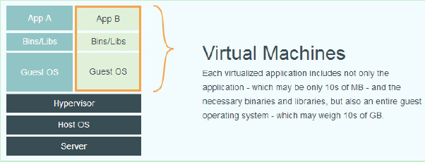
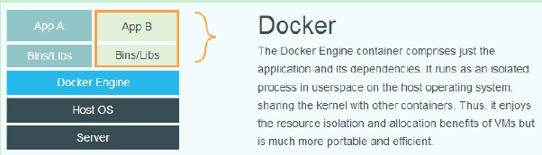

[TOC]

# docker实践

##  1. docker原理
###  1.1. 什么是docker


###  1.2. 为何使用docker

###  1.3. docker的优劣
####  1.3.1. docker的优势
* 隔离性强
* 安全性高
* 可移植性
* 轻量和高效
* 持续部署与测试
####  1.3.2. docker的劣势
* 产品使用的复杂性
* Docker公司之后的方向
* 网络管理相对简单，主要是基于namespace隔离
* container随着用户进程的停止而销毁，container中的log等用户数据不便收集
* Docker对disk的管理比较有限

###  1.4. 三大组件
####  1.4.1. 镜像(Image)
​	镜像命名，如：ubuntu:16.04
####  1.4.2. 容器(Container)
####  1.4.3. 仓库(Repository)

##  2. docker安装
###  2.1. Ubuntu安装
####  2.1.1. 系统要求
Docker CE 支持以下版本的 Ubuntu 操作系统：
* Bionic 18.04 (LTS)
* Artful 17.10 (Docker CE 17.11 Edge +)
* Xenial 16.04 (LTS)
* Trusty 14.04 (LTS)

Docker CE 可以安装在 64 位的 x86 平台或 ARM 平台上。Ubuntu 发行版中，LTS（Long-
Term-Support）长期支持版本，会获得 5 年的升级维护支持，这样的版本会更稳定，因此在
生产环境中推荐使用 LTS 版本,当前最新的 LTS 版本为 Ubuntu 18.04。

####  2.1.2. 卸载旧版本
旧版本的 Docker 称为 docker 或者 docker-engine ，使用以下命令卸载旧版本：
```shell
$ sudo apt-get remove docker docker-engine docker.io
```

####  2.1.3. 更新apt-get
```shell
$ sudo apt-get update
```

####  2.1.4. 安装可选内核模块

```shell
$ sudo apt-get install \
    linux-image-extra-$(uname -r) \
    linux-image-extra-virtual
```
**注: Ubuntu 16.04+ 上的 Docker CE默认使用`overlay2`存储层驱动, `无需手动配置`。**

####  2.1.5. 安装基本软件
* 由于apt源使用HTTPS以确保软件下载过程中不被篡改。因此，我们首先需要添加使用HTTPS传输的软件包以及CA证书：
```shell
$ sudo apt-get install apt-transport-https ca-certificates curl software-properties-common lrzsz -y
```
* 为了确认所下载软件包的合法性，需要添加软件源的GPG密钥。并向source.list中添加Docker软件源。
    * 使用官方推荐源 {`不推荐`}
    ```shell
    $ curl -fsSL https://download.docker.com/linux/ubuntu/gpg | sudo apt-key add -

    $ sudo add-apt-repository "deb [arch=amd64] https://download.docker.com/linux/ubuntu $(lsb_release -cs) stable"
```
    * **使用阿里云的源 {推荐}**
    
    ```shell
    $ curl -fsSL https://mirrors.aliyun.com/docker-ce/linux/ubuntu/gpg | sudo apt-key add -
    
$ sudo add-apt-repository "deb [arch=amd64] https://mirrors.aliyun.com/docker-ce/linux/ubuntu $(lsb_release -cs) stable"
    ```
    
* **使用国内其它源 {推荐}**
    ```shell
    $ curl -fsSL https://mirrors.ustc.edu.cn/docker-ce/linux/ubuntu/gpg | sudo apt-key add -
    
$ sudo add-apt-repository "deb [arch=amd64] https://mirrors.ustc.edu.cn/docker-ce/linux/ubuntu $(lsb_release -cs) stable"
    ```
* 注意：如果遇到"curl: (1) Protocol "https" not supported or disabled in libcurl"错误，根据错误提示需要解决curl对https协议的支持.
```shell
$ curl --version
// 若是curl版本过低则升级重装

$ curl-config --protocols
// 查看可支持的协议

$ cd /home/**/curl-7.61.1/
$ ./configure
// 发现：“SSL support: no (--with-ssl / --with-gnutls)”
// 即：不支持SSL/https

$ vim /etc/ld.so.conf
// 在这里面将openssl生成的库文件所在目录加入，并使用命令ldconfig刷新缓存

$ ./configure --prefix=/usr/local/curl --with-ssl=/usr/local/ssl

// 重装curl
$ make
$ sudo make install
```

####  2.1.6. <a name='DockerCE'></a>安装 Docker CE
更新apt软件包缓存，并安装docker-ce
```shell
// 软件源升级
$ sudo apt-get update

$ sudo apt-get install docker-ce -y
```

**[附注]**: 
* 可指定查看版本和指定版本安装docker
```shell
//查看支持的docker版本
$ sudo apt-cache madison docker-ce

//指定版本安装docker：
$ sudo apt-get install docker-ce=<VERSION> -y
```
* 也可用脚本安装
```shell
$ curl -fsSL get.docker.com -o get-docker.sh
$ sudo sh get-docker.sh --mirror Aliyun
```

####  2.1.7. 测试docker
```shell
$ sudo docker version
```

####  2.1.8. 启动docker
```shell
$ sudo systemctl enable docker
$ sudo systemctl start docker
```

Ubuntu 14.04 请使用以下命令启动：
```shell
$ sudo service docker start
```

####  2.1.9. 建立docker用户组
默认情况下， docker命令会使用Unix socket与Docker引擎通讯。而只有root用户和docker组的用户才可以访问Docker引擎的Unix socket。出于安全考虑，一般Linux系统上不会直接使用root用户。因此，更好地做法是将需要使用docker的用户加入docker
用户组。
* 建立docker组：
```shell
$ sudo groupadd docker
```
* 将当前用户加入 docker 组：
```shell
$ sudo usermod -aG docker $USER
```

####  2.1.10. 测试 Docker 是否安装正确
```shell
$ docker run hello-world
```
正常将输出：
```shell
Unable to find image 'hello-world:latest' locally
latest: Pulling from library/hello-world
ca4f61b1923c: Pull complete
Digest: sha256:be0cd392e45be79ffeffa6b05338b98ebb16c87b255f48e297ec7f98e123905c
Status: Downloaded newer image for hello-world:latest
Hello from Docker!
This message shows that your installation appears to be working correctly.
To generate this message, Docker took the following steps:
1. The Docker client contacted the Docker daemon.
2. The Docker daemon pulled the "hello-world" image from the Docker Hub.
(amd64)
3. The Docker daemon created a new container from that image which runs the
executable that produces the output you are currently reading.
4. The Docker daemon streamed that output to the Docker client, which sent it
to your terminal.
To try something more ambitious, you can run an Ubuntu container with:
$ docker run -it ubuntu bash
Share images, automate workflows, and more with a free Docker ID:
https://cloud.docker.com/
For more examples and ideas, visit:
https://docs.docker.com/engine/userguide/
```

###  2.2. 镜像加速
鉴于国内网络问题，后续拉取Docker镜像十分缓慢，强烈建议安装Docker之后配置国内镜像加速。。Docker官方和国内很多云服务商都提供了国内加速器服务，例如：
* Docker官方提供的中国registry mirror      
https://registry.docker-cn.com

* 七牛云加速器  
https://reg-mirror.qiniu.com/

* daocloud      
http://guide.daocloud.io/dcs/daocloud-9153151.html

当配置某一个加速器地址之后，若发现拉取不到镜像，请切换到另一个加速器地址。国内各大云服务商均提供了Docker镜像加速服务，建议根据运行Docker的云平台选择对应的镜像加速服务。    
下面介绍daocloud的使用:

1.访问https://dashboard.daocloud.io 网站，登录daocloud账户;   
2.选择“项目”，并点击右上角的“加速器”;    
3.选择linux，拷贝新窗口处显示的一条命令，如："curl -sSL https://get.daocloud.io/daotools/set_mirror.sh | sh -s http://e5d212cc.m.daocloud.io";   
4.执行命令
```shell
// 执行命令
$ curl -sSL https://get.daocloud.io/daotools/set_mirror.sh | sh -s http://e5d212cc.m.daocloud.io

 
// 修改daemon.json文件，增加"insecure-registries"内容
$ cat /etc/docker/daemon.json
{"registry-mirrors": ["http://e5d212cc.m.daocloud.io"], "insecure-registries": []}
 
//注意：
//docker cloud加速器的默认内容是少了一条配置，所以我们要编辑文件在后面加上绿色背景的内容，然后再重启docker

//重启docker
$ systemctl restart docker
```
##  3. docker的使用命令
###  3.1. 镜像管理
####  3.1.1. 搜索镜像
```shell
$ docker search ubuntu

命令格式：
    docker search [image_name]
#注释：
    #NAME：名称
    #DESCRIPTION：基本功能描述
    #STARS：下载次数
    #OFFICIAL：官方
    #AUTOMATED：自动的运行
```

####  3.1.2. 获取镜像
```shell
$ docker pull ubuntu
$ docker pull nginx

#命令格式：
    docker pull [image_name]

#注释：
#镜像目录（sudo 查看）：
#/var/lib/docker

#操作下面的文件可以查看相关的镜像信息
$ sudo vim /var/lib/docker/image/overlay2/repositories.json 
```

####  3.1.3. 查看镜像
```shell
$ docker images
$ docker image ls
$ docker image ls --digests
$ docker images -a #列出所有的本地的images(包括已删除的镜像记录)

#命令格式：
    docker images <image_name>

#注释：
    #镜像的ID唯一标识了镜像，如果ID相同,说明是同一镜像。TAG信息来区分不同发行版本，如果不指定具体标记,默认使用latest标记信息。
    #REPOSITORY：镜像的名称 
    #TAG ：镜像的版本标签
    #IMAGE ID：镜像id
    #CREATED：镜像是什么时候创建的
    #SIZE：大小
```

####  3.1.4. 重命名镜像
```shell
$ docker tag nginx:latest sswang-nginx:v1.0

#命令格式：
    docker tag [old_image]:[old_version] [new_image]:[new_version]
```

####  3.1.5. 删除镜像
```shell
$ docker rmi 3fa822599e10
$ docker image rm 501
$ docker image rm centos
$ docker image rm node@sha256:b4f0e0bdeb578043c1ea6862f0d40cc4afe32a4a582f3be235a3b164
422be228

#命令格式：
    docker rmi [image_id]
    docker image rm [选项] <镜像1> [<镜像2> ...]

#注意：
    如果一个image_id存在多个名称，那么应该使用name:tag的格式删除镜像
```

####  3.1.6. 导出镜像
将已经下载好的镜像，导出到本地，以备后用。
```shell
$ docker save -o nginx.tar nginx

#命令格式：
    docker save -o [导出镜像名称] [本地镜像名称]
```

####  3.1.7. 导入镜像
```shell
$ docker load < nginx.tar

#命令格式：
    docker load < [image.tar_name]
    docker load --input [image.tar_name]

#注意：
    如果发现导入的时候没有权限需要使用chmod命令修改镜像文件的权限
```

####  3.1.8. 查看镜像历史
我们获取到一个镜像，想知道他默认启动了哪些命令或者都封装了哪些系统层，那么我们可以使用docker history这条命令来获取我们想要的信息
```shell
$ docker history sswang-nginx:v1.0

#命令格式：
    docker history [image_name]
  
#注释：
    #IMAGE：编号           
    #CREATED：创建的  
    #CREATED BY ：基于谁创建的        
    #SIZE：大小
    #COMMENT：评论
```

####  3.1.9. 创建镜像
根据模板镜像
* 登录系统模板镜像网站：
https://download.openvz.org/template/precreated/

* 找到一个镜像模板进行下载，如：ubuntu-16.04-x86_64.tar.gz，
地址：
https://download.openvz.org/template/precreated/ubuntu-16.04-x86_64.tar.gz

* 命令
```shell
$ cat ubuntu-16.04-x86_64.tar.gz | docker import - ubuntu-mini

#命令格式：
    cat 模板文件名.tar | docker import - [自定义镜像名]
```

###  3.2. 容器管理
####  3.2.1. 查看容器
```shell
$ docker ps
$ docker ps -a

#命令格式：
    docker ps

#注释:
    #CONTAINER ID 容器ID        
    #IMAGE 基于那个镜像              
    #COMMAND  运行镜像使用了哪些命令？           
    #CREATED多久前创建时间             
    #STATUS   开启还是关闭           
    #PORTS端口号               
    #NAMES容器名称默认是随机的
#注意：
    管理docker容器可以通过名称，也可以通过ID
    ps是显示正在运行的容器， -a是显示所有运行过的容器，包括已经不运行的容器
```

####  3.2.2. 启动容器
启动容器有三种方式
* 1、基于镜像新建一个容器并启动
```shell
$ docker run nginx /bin/echo "hello docker"

#命令格式：
    docker run <参数，可选> [docker_image] [执行的命令]
    启动一个镜像，输入信息后关闭容器

#注意：
    docker run 其实 是两个命令的集合体 docker create + docker start
```

* 2、将关闭的容器重新启动
在生产过程中，常常会出现运行和不运行的容器，我们使用 start 命令开起一个已关闭的容器
```shell
#命令格式：
docker start [container_id]
```

* 3、守护进程方式启动docker
更多的时候，需要让Docker容器在后台以守护形式运行。此时可以通过添加-d参数来实现
```shell
$ docker run -d nginx

#命令格式：
    docker run -d [image_name] command ...
```

####  3.2.3. 关闭容器
在生产中，我们会以为临时情况，要关闭某些容器，我们使用 stop 命令来关闭某个容器
```shell
$ docker stop 8005c40a1d16

#命令格式：
    docker stop [container_id]
```

####  3.2.4. 删除容器
删除容器有三种方法：
* 正常删除 
删除已关闭的容器
```shell
$ docker rm 1a5f6a0c9443

#命令格式：
    :~$ docker rm [container_id] 
```

* 强制删除
删除正在运行的容器
```shell
$ docker rm -f 8005c40a1d16

#命令格式：
    docker rm -f [container_id]
```

* 强制批量删除
 删除全部的容器
 ```shell
#命令格式：
    :~$ docker rm -f $(docker ps -a -q)
#按照执行顺序$（）， 获取到现在容器的id然后进行删除
 ```

####  3.2.5. 进入容器
进入容器有三种方法：
* 1、创建容器的同时进入容器
```shell
$  docker run -it --name panda-nginx nginx /bin/bash

#命令格式：
    docker run --name [container_name] -it [docker_image] /bin/bash
    #docker 容器启动命令参数详解：
    #--name:给容器定义一个名称
    #-i:则让容器的标准输入保持打开。
    #-t:让docker分配一个伪终端,并绑定到容器的标准输入上
    #/bin/bash:执行一个命令
```

* 2、手工方式进入容器
```shell
$ docker exec -it d74fff341687 /bin/bash

#命令格式：
    docker exec -it  容器id  /bin/bash
```
* 3、生产方式进入容器  
我们生产中常用的进入容器方法是使用脚本，脚本内容如下:
```shell
#!/bin/bash
# 定义进入仓库函数
docker_in(){
  NAME_ID=$1
  PID=$(docker inspect --format {{.State.Pid}} $NAME_ID)
  nsenter --target $PID --mount --uts --ipc --net --pid
}
docker_in $1
```
注意：
当拷贝到linux下的时候会出现
-bash: ./docker_in.sh: /bin/bash^M: 解释器错误: 没有那个文件或目录
这个问题大多数是因为你的脚本文件在windows下编辑过。windows下，每一行的结尾是\n\r，而在linux下文件的结尾是\n，那么你在windows下编辑过的文件在linux下打开看的时候每一行的结尾就会多出来一个字符\r,用cat -A docker_in.sh时你可以看到这个\r字符被显示为^M，这时候只需要删除这个字符就可以了。
可以使用命令sed -i 's/\r$//' docker_in.sh

```shell
#赋权执行
:~$  chmod +x docker_in.sh 
#进入指定的容器，并测试
:~$  ./docker_in.sh b3fbcba852fd
```

####  3.2.6. 退出容器
```shell
#方法一：
    $ exit

#方法二：
    Ctrl + D
```

####  3.2.7. 基于容器创建镜像
* 方式一
```shell
# 1.进入一个容器，创建文件后并退出:
$ ./docker_in.sh d74fff341687
$ mkdir /hello
$ mkdir /world
$ ls
$ exit

# 2.创建一个镜像并查看:
$ docker commit -m 'mkdir /hello /world ' -a "panda"  d74fff341687  nginx:v0.2
$ docker images
$ docker run -itd  nginx:v0.2 /bin/bash
$ ./docker_in.sh ae63ab299a84
$ ls

#命令格式：
    docker commit -m '改动信息' -a "作者信息" [container_id] [new_image:tag]
```

* 方式二
```shell
$ docker export ae63ab299a84 > gaoji.tar      #创建镜像
$ cat gaoji.tar | docker import - sswang-test #导入镜像

#命令格式：
    docker export [容器id] > 模板文件名.tar
```

导出（export）导入（import）与保存（save）加载（load）的恩怨情仇

* import与load的区别：    
import可以重新指定镜像的名字，docker load不可以 

* export与save的区别：     
1、export导出的镜像文件大小，小于save保存的镜像。  
2、export导出（import导入）是根据容器拿到的镜像，再导入时会丢失镜像所有的历史。

####  3.2.8. 查看容器运行日志
```shell
$ docker logs 7c5a24a68f96

#命令格式：
    docker logs [容器id]
    #只能查看关闭的容器信息
```

####  3.2.9. 查看容器详细信息
```shell
# 查看容器全部信息:
$ docker inspect 930f29ccdf8a

# 查看容器网络信息:
$ docker inspect --format='{{range .NetworkSettings.Networks}}{{.IPAddress}}{{end}}' 930f29ccdf8a

#命令格式：
    docker inspect [容器id]
```

####  3.2.10. 查看容器端口信息
```shell
$ docker port 930f29ccdf8a

#命令格式：
    docker port [容器id]
#没有效果: 没有和宿主机关联
```

###  3.3. 数据管理

###  3.4. 网络管理

##  4. C/C++程序部署
###  4.1. C/C++程序源码
```shell
// docker_demo.c

#include <stdio.h>
#include <stdlib.h>
#include <string.h>
#include <unistd.h>

int main()
{
    FILE* file = fopen("t.txt","w+");
    if (file == NULL)
    {
        return 0;
    }

    char buf[20]="hello world!!!\n";
    int len = strlen(buf);

    while(1)
    {
        fputs(buf,file);
        fflush(file);
    //  printf("%s",buf);
        sleep(1);
    }

    fclose(file);

    return 0;
}
```
保存到文件docker_demo.c
###  4.2. 镜像选择
c/c++程序直接运行在linux系统上，所以可直接选择centos或ubuntu镜像。若要将.c文件编译成一个可执行程序，docker还有一个gcc或者g++的镜像，且使用gcc或g++镜像的话，我们就不需要在ubuntu或centos镜像中再安装gcc 、g++了。   
故可供选三种镜像： 
* gcc或者g++ [`当前选择`]

* ubuntu

* centos

###  4.3. 下载镜像

```shell
// 查看版本
$ docker search gcc

// 下载镜像
$ docker pull gcc

// 查看本地已经下载的镜像
$ docker images
```

###  4.4. 制作应用程序镜像： g++镜像

####  4.4.1. 编写dockerfile
```shell
# dockerfile

FROM gcc:latest
RUN  mkdir /usr/src/docker_demo_app
COPY docker_demo.c /usr/src/docker_demo_app
WORKDIR /usr/src/docker_demo_app
RUN  gcc docker_demo.c 
CMD ["./a.out"]
```
保存为dockerfile

####  4.4.2. 生成镜像
```shell
$ docker build -t docker_demo:v1 .

$ docker images
```
此时我们可以看到在本地镜像中多了一个叫做docker_demo的镜像，TAG为v1

####  4.4.3. 使用镜像
* 启动容器
    ```shell
    $ docker run -d docker_demo:v1

    $ docker ps //查看容器的运行情况
    ```

* 进入容器：查看程序后台执行情况
    ```shell
    $ docker exec -it f79160db2d14 /bin/bash

    $ top

    $ ls

    # 当前目录可发现已经t.txt文件，表明a.tou程序执行正常
    $ tail -f /usr/src/docker_demo_app/t.txt
    ```

* 停止容器
    ```shell
    $ docker stop f79160db2d14
    ```

* 删除容器
    ```shell
    $ docker ps -a

    $ docker rm [id]
    ```
    
####  4.4.4. 删除镜像
```shell
$ docker images -a

$ docker image rm [id]
```

###  4.5. 制作应用程序镜像： 可执行镜像{推荐}

####  4.5.1. 编写dockerfile
本地调用命令：gcc docker_demo.c 编译成可执行文件a.out，然后编写dockerfile。

```shell
# dockerfile

FROM gcc:latest
RUN  mkdir /usr/src/docker_demo_app
COPY a.out /usr/src/docker_demo_app
WORKDIR /usr/src/docker_demo_app
# RUN  gcc docker_demo.c
CMD ["./a.out"]
```
保存为dockerfile

####  4.5.2. 生成镜像
```shell
$ docker build -t docker_demo:v2 .

$ docker images
```
此时我们可以看到在本地镜像中多了一个叫做docker_demo的镜像，TAG为v2

####  4.5.3. 使用镜像
详情参考上一节“制作应用程序镜像： 源码镜像”
```shell
$ docker run -d docker_demo:v2

$ docker ps

$ docker exec -it f79160db2d14 /bin/bash
$ top
$ ls
$ tail -f t.txt

$ docker stop f79160db2d14
```

####  4.5.4.  删除镜像
```shell
$ docker images -a

$ docker image rm [id]
```

###  4.6. 制作带环境变量的镜像 {生产}


> 参考:     
> 《docker-ce入门》     
> 《docker_practice/docker 从入门到实践》   
> [微服务为什么一定要用docker](https://www.toutiao.com/a6632774157874496004/?tt_from=weixin&utm_campaign=client_share&wxshare_count=1&timestamp=1544372464&app=news_article&utm_source=weixin&iid=52335320468&utm_medium=toutiao_ios&group_id=6632774157874496004)  
> [如何使用docker部署c/c++程序](https://blog.csdn.net/len_yue_mo_fu/article/details/80189035)
