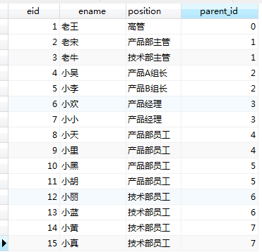

[TOC]

# 树形结构的db存储方案

> <font color=red>如何在数据库中存储树形结构呢？</font>

​	诸如mysql这样的关系型数据库，比较适合存储一些类似表格的扁平化数据。但是，遇到像树形结构这样有深度的人，就很难驾驭了。

　　举个栗子：现在有一个要存储一下公司的人员结构，大致层次结构如下：


那么怎么存储这个结构？并且要获取以下信息：

* 1.查询小天的直接上司。
* 2.查询老宋管理下的直属员工。
* 3.查询小天的所有上司。
* 4.查询老王管理的所有员工。

## 1.Adjacency List - 只存储当前节点的父节点信息

### 1.1.设计思路

只存储**当前节点的父节点**信息，建表如下：

```sql
CREATE TABLE Employees(
　　eid int,
　　ename VARCHAR(100),
   position VARCHAR(100),
　　parent_id int
)
```

记录信息简单粗暴，结构信息存储如下：



### 1.2.功能实现

> <font color=red>如何解决开头提出的4个问题?</font>

#### 1.2.1.查询上级

如：查询小天的直接上司

```sql
SELECT e2.eid, e2.ename 
  FROM employees e1, employees e2
 WHERE e1.parent_id=e2.eid AND e1.ename='小天';
```


#### 1.2.2.查询下级

如：查询老宋管理下的直属员工 　

```sql
SELECT e1.eid, e1.ename
  FROM employees e1, employees e2
 WHERE e1.parent_id=e2.eid AND e2.ename='老宋';
```


#### 1.2.3.查询所有上级

如：查询小天的所有上司

此时肯定没法直接查，只能用循环进行循环查询：

* 1.先查直接上司

* 2.再查直接上司的直接上司

* 3.依次循环

这样麻烦的事情，还是得先建立一个存储过程，如下骚操作：

```sql
CREATE DEFINER=`root`@`localhost` FUNCTION `getSuperiors`(`uid` int) RETURNS varchar(1000) CHARSET gb2312
BEGIN
    DECLARE superiors VARCHAR(1000) DEFAULT '';
    DECLARE sTemp INTEGER DEFAULT uid;
    DECLARE tmpName VARCHAR(20);

    WHILE (sTemp>0) DO
        SELECT parent_id into sTemp FROM employees where eid = sTemp;
        SELECT ename into tmpName FROM employees where eid = sTemp;
        IF(sTemp>0)THEN
            SET superiors = concat(tmpName,',',superiors);
        END IF;
    END WHILE;
        SET superiors = LEFT(superiors,CHARACTER_LENGTH(superiors)-1);
    RETURN superiors;
END
```

这一段存储过程可以查询子节点的所有父节点，来试验一下:


显然，**获取子节点的全部父节点的时候很麻烦!**


#### 1.2.4.查找所有下级

如：查询老王管理的所有员工。

思路如下：

* 1.首先，获取所有父节点为老王id的员工id

* 2.然后，将员工姓名加入结果列表里

* 3.再调用一个神奇的查找函数

```sql
CREATE DEFINER=`root`@`localhost` FUNCTION `getSubordinate`(`uid` int) RETURNS varchar(2000) CHARSET gb2312
BEGIN   
    DECLARE str varchar(1000);  
    DECLARE cid varchar(100);
    DECLARE result VARCHAR(1000);
    DECLARE tmpName VARCHAR(100);
    SET str = '$';   
    SET cid = CAST(uid as char(10));   
    WHILE cid is not null DO   
      SET str = concat(str, ',', cid); 
      SELECT group_concat(eid) INTO cid FROM employees where FIND_IN_SET(parent_id,cid);         
    END WHILE;
    SELECT GROUP_CONCAT(ename) INTO result FROM employees WHERE FIND_IN_SET(parent_id,str);
    RETURN result;   
END
```

  看操作结果：


虽然搞出来了，但说实话，真是不容易。。。


### 1.3.方案分析

| 分析 | 说明                                                         |
| :--: | :----------------------------------------------------------- |
| 优点 | 存储的信息少                                                 |
|      | 查直接上级和直接下属时很方便                                 |
| 缺点 | 多级查询很费劲                                               |
|      | 需用到存储结构，某些数据库(sqlite)不支持存储结构             |
| 总结 | 当只需要用到**直接上下级关系查询**时，用这种简单，且可节省很多空间 |


## 2.Path Enumeration - 路径枚举法

### 2.1.设计思路

​	**记录下根节点到每个子节点的路径**，建表如下：

```sql
CREATE TABLE employees2(
    eid INT,
    ename VARCHAR(100),
    position VARCHAR(100),
    path VARCHAR(200)
)
```


### 2.2.功能实现

#### 2.2.1.查询上级

如：查询小天的直接上司

​	在上一个解决方案中能轻而易举做到的事情，在这个方案中却有些麻烦了，因为需要对path字段进行字符串处理，去掉**“/”+自身id**才是直接上司的path值

```sql
SELECT e1.eid,e1.ename
  FROM employees2 e1,employees2 e2
 WHERE e2.ename = '小天' AND e1.path = REPLACE(e2.path,CONCAT('/',e2.eid),'');
```

操作结果如下：


#### 2.2.2.查询下级

如：查询老宋管理下的直属员工

这得用到**模糊查询**：

```sql
SELECT e2.eid,e2.ename
  FROM employees2 e1,employees2 e2
 WHERE e1.ename = '老宋' AND e2.path REGEXP CONCAT(e1.path,'/[0-9]{1,}$');
```

这里用了**正则匹配**，匹配所有path符合规则的记录，结果如下


#### 2.2.3.查询所有上级

如：查询小天的所有上司

```sql
SELECT e1.eid,e1.ename
  FROM employees2 e1,employees2 e2
 WHERE e2.ename='小天' AND e2.path like concat(e1.path,'/%');
```

这里就能体现这种存储结构的优势了。**不看效率的话**，很方便:


#### 2.2.4.查询所有下级

如：查询老王管理的所有员工

```sql
SELECT e2.eid, e2.ename
  FROM employees2 e1, employees2 e2
 WHERE e1.ename='老王' AND e2.path like concat(e1.path,'/%');
```

操作结果如下：


### 2.3.方案分析

| 分析 | 说明                                                         |
| :--: | :----------------------------------------------------------- |
| 优点 | 存储的信息少                                                 |
| 缺点 | 上下级查询很费劲                                             |
|      | 模糊查找，效率低下                                           |
|      | path的大小是指定的，理论上不能进行无限层级存储；且path值设置的越大，浪费的空间越多 |
| 总结 | 当用到**多级查询**时可考虑                                   |


## 3.Closure Table - 关系表法

### 3.1.设计思路

​	**保存每个节点与其各个子节点的关系**，也就是**记录以其为根节点的全部子节点信息**。建表如下：

```sql
-- 表1: 用来存储信息
CREATE TABLE employees3(
    eid INT,
    ename VARCHAR(100),
    position VARCHAR(100)
)

-- 表2: 用来存储关系
CREATE TABLE emp_relations(
    root_id INT,
    depth INT,
    is_leaf TINYINT(1),
    node_id INT
)
```

其中：

* root_id用来存放以其为根节点的路径
* node_id表示节点处的eid
* depth表示根节点到该节点的深度
* is_leaf表示该节点是否为叶子节点。

插入数据如下：


由此可见，这个**关系表有点大**，先来看看查询效果。

### 3.2.功能实现

#### 3.2.1.查询上级

如：查询小天的直接上司。

这里只需要在关系表中找到node_id为小天id，depth为1的根节点id即可。

```sql
SELECT e2.ename BOSS
  FROM employees3 e1,employees3 e2,emp_relations rel 
 WHERE e1.ename='小天' AND rel.node_id=e1.eid AND rel.depth=1 AND e2.eid=rel.root_id
```


#### 3.2.2.查询下级

如：查询老宋管理下的直属员工。

　　思路差不多，只要查询root_id为老宋eid且深度为1的node_id即为其直接下属员工id

```sql
SELECT e1.eid,e1.ename 直接下属
  FROM employees3 e1,employees3 e2,emp_relations rel
 WHERE e2.ename='老宋' AND rel.root_id=e2.eid AND rel.depth=1 AND e1.eid=rel.node_id
```


#### 3.2.3.查询所有上级

如：查询小天的所有上司

只要在关系表中找到node_id为小天eid且depth大于0的root_id即可：

```sql
SELECT e2.eid,e2.ename 上司
  FROM employees3 e1,employees3 e2,emp_relations rel 
 WHERE e1.ename='小天' AND rel.node_id=e1.eid AND rel.depth>0 AND e2.eid=rel.root_id
```


#### 3.2.4.查询所有下级

如：查询老王管理的所有员工。

　　只要在关系表中查找root_id为老王eid，depth大于0的node_id即可

```sql
SELECT e1.eid,e1.ename 下属 FROM employees3 e1,employees3 e2,emp_relations rel 
WHERE e2.ename='老王' AND rel.root_id=e2.eid AND rel.depth>0 AND e1.eid=rel.node_id
```


### 2.4.方案分析

| 分析 | 说明                                                         |
| :--: | :----------------------------------------------------------- |
| 优点 | 四个查询的复杂程度是一样的                                   |
|      | 可以让另一张表只存储跟节点紧密相关的信息，看起来更简洁       |
| 缺点 | 关系表会很庞大: 当层次很深，结构很庞大时，关系表数据的增长会越来越快，<br />相当于用空间效率来换取了查找上的时间效率 |
| 总结 | 追求**查找效率**时可考虑                                     |


## 4.二叉树法

### 4.1.设计思路

​	利用一般树结构可以转换二叉树的这一做法，用二叉树进行存储，在数据量大的情况下，存储读效率比上述方案更优些。如下图所示：


​	如图所示，在每个节点上，保存left、right两个字段。我们看到，图上从根节点顺着子节点开始画一条线：

* 每深入一层left则加一

* 到底后，right = left + 1

* 然后，顺着节点回溯，right逐级加一

* 一直回到根节点。

  

### 4.2.功能实现

#### 4.3.1.查询上级

如：

```sql

```


#### 4.3.2.查询下级

```sql

```


#### 4.3.3.查询所有上级

如：要查询某个节点的full path  ，比如 banana

```sql
SELECT * FROM tb_xxx WHERE left<8 AND right >9;
```


#### 4.3.4.查询所有下级

如：要查询某个节点及其子节点（比如 fruit 节点） 

```sql
SELECT * FROM tb_xxx WHERE left BETWEEN 2 AND 11;
```


#### 4.3.5.插入节点

如： 要插入某个节点，比如red yellow直接插入一个节点

```sql
UPDATE tb_xxx SET left=left+2 WHERE left>=7
UPDATE tb_xxx SET right=right+2 WHERE right>7
INSERT(*, name, left, right) tb_xxx VALUES (*, 'blue', 7, 8)
```


#### 4.3.6.删除节点

```sql
-- 与插入类似
```


#### 4.3.7.还原树状结构

​	在内存中，如果要还原树状结构，即在每个节点上增加pid属性和children属性，则稍微麻烦些，可以如下操作：

* 1.按left between x and y  order by left 取数据
* 2 顺序遍历数据: 如果left = 上一个Left + 1, 则是上一个节点的子节点，设置两个对象的父子关系，(【抱歉，这里错误的，感谢“看风景的人”指出。】 如果发生跳号，则是上一个节点的兄弟节点。） 【这样才是正确的】 如果发生跳号，说明这个节点不是上节点的子节点，向上回溯，找到right编号为当前节点left-1的，这个新找到的节点就是当前节点的兄弟。 比如 cherry(4,5)的下一个节点Yellow(7,10)，向上找到red(3,6)为兄弟，meat(12,17)则向上找到 fruit（2,11）为兄弟。
* 3.如果要按水平查找兄弟节点，比如第二层，第一个节点为 fruit(2,11),然后向下查找，right=11，查找left=12的即为下一个兄弟节点。

顺便说一下，**jqgrid**的**treegrid**支持这种数据结构。

  

## 5.方案对比

| 方案  | 优点                                                     | 缺点                                                         | 总结                                   |
| ----- | :------------------------------------------------------- | ------------------------------------------------------------ | -------------------------------------- |
| 优点  | 只存储上级ID，存储的信息少                               | 多级查询很费劲                                               | 当只需要用到**直接上下级关系查询**     |
|       | 结构类似于单链表，<br />查询直接上级或下级时很方便       | 某些数据库(sqlite)<br />不支持存储结构                       | 对多级查询需求不大的场景<br />比较适用 |
|       | 添加、删除简单                                           |                                                              |                                        |
| 方案2 | 存储的信息少                                             | 上下级查询很费劲                                             | **多级查询**方便                       |
|       | 添加、删除简单                                           | 模糊查找，效率低下                                           |                                        |
|       |                                                          | 致命：<br />path的大小是指定的，<br />理论上不能进行无限<br />层级存储；<br />且path值设置的越大，<br />浪费的空间越多 |                                        |
| 方案3 | 四个查询的复杂度一样                                     | 当层次很深时，关系表会很庞大                                 | 追求**查找效率**                       |
|       | 可让另一张表只存储跟节点<br />紧密相关的信息，表结构简洁 | 添加、删除麻烦                                               | 纵向结构不是很深                       |
| 方案4 | 查询效率高                                               |                                                              |                                        |
|       | 统计子节点个数简单                                       |                                                              |                                        |


> 摘自：
> [弗兰克的猫.【MySQL疑难杂症】如何将树形结构存储在数据库中](https://www.cnblogs.com/mfrank/category/1126824.html)
> [聊聊树状结构如何在数据库中存储](https://www.cnblogs.com/honghuamin/archive/2011/07/24/2115635.html)
> [Storing Hierarchical Data in a Database Article](http://www.sitepoint.com/hierarchical-data-database-2/)

