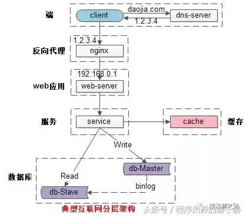
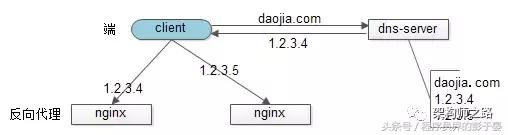
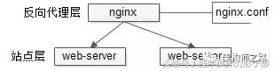
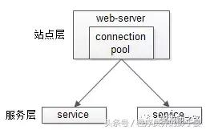
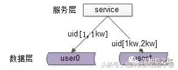
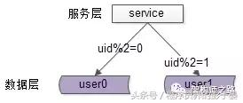

[TOC]

# 如何实现高并发
##  1. 原因
​	如: 鹿晗与关晓彤发布恋情，冯绍峰与赵丽颖官宣结婚等热点新闻，一度导致新浪微博服务器宕机。通过技术改进，新浪技术负责人随后提出了服务器能支撑同时8个明星出轨了...那有什么办法支撑大规模高并发服务呢？
##  2. 概念
###  2.1. 定义
​	通过设计保证系统能够同时并行处理很多请求
###  2.2. 指标
####  2.2.1. 响应时间（Response Time）
​	系统对请求做出响应的时间。例如系统处理一个HTTP请求需要200ms，这个200ms就是系统的响应时间
####  2.2.2. 吞吐量（Throughput）
​	单位时间内处理的请求数量
####  2.2.3. 每秒查询率QPS（Query Per Second）

####  2.2.4. TPS（** Per Second）

####  2.2.5. 并发用户数
​	同时承载正常使用系统功能的用户数量。如一个即时通讯系统，同时在线量一定程度上代表了系统的并发用户数

###  2.3. 常见分层架构

* 1）客户端层：典型调用方是浏览器browser或者手机应用APP
* 2）反向代理层：系统入口，反向代理
* 3）站点应用层：实现核心应用逻辑，返回html或者json
* 4）服务层：如果实现了服务化，就有这一层
* 5）数据-缓存层：缓存加速访问存储
* 6）数据-数据库层：数据库固化数据存储
##  3. 方案
###  3.1. 垂直扩展（Scale Up）
####  3.1.1. 增强单机硬件性能
* 1.增加CPU核数如32核
* 2.升级更好的网卡如万兆
* 3.升级更好的硬盘如SSD
* 4.扩充硬盘容量如2T
* 5.扩充系统内存如128G  
`
适用于在发展非常迅猛的早期，此时公司的战略往往是发展业务抢时间，此法往往是最快的方法
`
####  3.1.2. 提升单机架构性能
* 1.使用Cache来减少IO次数
* 2.使用异步来增加单服务吞吐量
* 3.使用无锁数据结构来减少响应时间
###  3.2. 水平扩展（Scale Out）
####  3.2.1. 只要增加服务器数量，就能线性扩充系统性能
####  3.2.2. 反向代理层

* 通过“DNS轮询”实现：dns-server对于一个域名配置了多个解析ip，每次DNS解析请求来访问dns-server，会轮询返回这些ip。
* 当nginx成为瓶颈时，只要增加服务器数量，新增nginx服务的部署，增加一个外网ip，就能扩展反向代理层的性能，做到理论上的无限高并发
####  3.2.3. 站点层

* 通过修改nginx.conf，可以设置多个web后端。
* 当web后端成为瓶颈的时候，只要增加服务器数量，新增web服务的部署，在nginx配置中配置上新的web后端，就能扩展站点层的性能，做到理论上的无限高并发
####  3.2.4. 服务层

* 服务层的水平扩展通过“服务连接池”实现。
* 站点层通过RPC-client调用下游的服务层RPC-server时，RPC-client中的连接池会建立与下游服务多个连接，当服务成为瓶颈的时候，只要增加服务器数量，新增服务部署，在RPC-client处建立新的下游服务连接，就能扩展服务层性能，做到理论上的无限高并发。如果需要优雅的进行服务层自动扩容，这里可能需要配置中心里服务自动发现功能的支持
####  3.2.5. 数据层
在数据量很大的情况下，数据层（缓存，数据库）涉及数据的水平扩展，将原本存储在一台服务器上的数据（缓存，数据库）水平拆分到不同服务器上去，以达到扩充系统性能的目的
* 按照范围水平拆分

* 按照哈希水平拆分

* 一致性哈希水平拆分    

>参考: [究竟啥才是互联网架构“高并发”](https://www.toutiao.com/a6611092501761622532/?tt_from=weixin&utm_campaign=client_share&wxshare_count=1&timestamp=1539398061&app=news_article&utm_source=weixin&iid=44839458783&utm_medium=toutiao_ios&group_id=6611092501761622532)