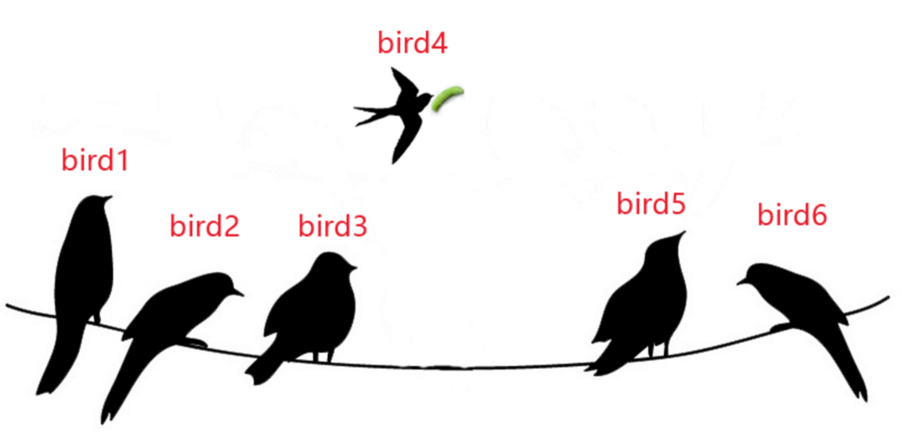

[TOC]

# 线程性能
##  1. 各种锁导致`并发变同步`
###  1.1. 锁效率
​	`互斥锁 < 读写锁 < 自旋锁 < 读写自旋锁 < 锁无关`
###  1.2. 伪共享（false sharing）

##  2. 惊群问题
###  2.1. 生活场景

###  2.2. 概念描述
​	多个线程（或者进程）同时等待一个事件的到来并准备处理事件，当事件到达时，把所有等待该事件的线程（或进程）均唤醒，但是只能有一个线程最终可以获得事件的处理权，其他所有线程又重新陷入睡眠等待下次事件到来。这种线程被频繁唤醒却又没有真正处理事件导致CPU无谓浪费
###  2.3. 场景案例
####  2.3.1. accept调用(Linux2.6前)
​	当多个线程中的accept函数同时监听同一个listenfd的时候，若此listenfd变成可读，则系统会唤醒所有使用accept函数等待listenfd的所有线程（或进程），但是最终只有一个线程可以accept调用返回成功，其他线程的accept函数调用返回EAGAIN错误，线程回到等待状态。后续版本已解决。
####  2.3.2. epoll函数
​	若使用多线程epoll对同一个fd进行监控的时候，当fd事件到来时，内核会把所有epoll线程唤醒，因此产生惊群问题。为何内核不能像解决accept问题那样解决呢？对于accept，是因为内核清楚的知道accept调用只可能一个线程调用成功，其他线程必然失败。而对于epoll调用而言，内核不清楚到底有几个线程需要对该事件进行处理，所以只能将所有线程全部唤醒.
* 解决办法  
参考Nginx的解决办法，多个进程将listenfd加入到epoll之前，首先尝试获取一个全局的accept_mutex互斥锁，只有获得该锁的进程才可以把listenfd加入到epoll中，当网络连接事件到来时，只有epoll中含有listenfd的线程才会被唤醒并处理网络连接事件
####  2.3.3. 线程池
​	线程池最经典的模型就是生产者-消费者模型，包含一个任务队列，当队列不为空的时候，线程池中的线程从任务队列中取出任务进行处理。一般使用条件变量进行处理，当我们往任务队列中放入任务时，需要唤醒等待的线程来处理任务，如果我们使用C++标准库中的函数notify_all()来唤醒线程，则会将所有的线程都唤醒，然后最终只有一个线程可以获得任务的处理权，其他线程在此陷入睡眠.
* 解决办法  
分情况看待，有时候业务需求就是需要唤醒所有线程，那么这时候使用notify_all()唤醒所有线程就不能称为”惊群问题“，因为CPU并没有无谓消耗。而对于只需要唤醒一个线程的情况，我们需要使用notify_one()函数代替notify_all()只唤醒一个线程，从而避免惊群问题