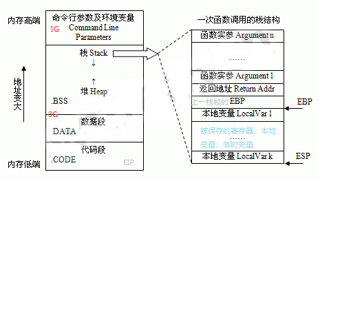
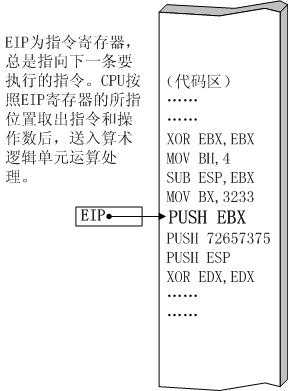

<!-- vscode-markdown-toc -->
* 1. [内存与寄存器](#)
	* 1.1. [ 内存](#-1)
	* 1.2. [寄存器](#-1)
* 2. [函数调用](#-1)

<!-- vscode-markdown-toc-config
	numbering=true
	autoSave=true
	/vscode-markdown-toc-config -->
<!-- /vscode-markdown-toc -->

# 函数调用及帧栈原理
##  1. 内存与寄存器

###  1.1.  内存
* 代码段    
    保存程序文本，指令指针EIP就是指向代码段`[可读可执行不可写]`
* 数据段    
    保存初始化的全局变量和静态变量`[可读可写不可执行]`
* BSS段（bss segment）  
    通常是指用来存放程序中未初始化的全局变量的一块内存区域。
* 堆(Heap)  
    动态分配内存，向地址增大的方向增长`[可读可写可执行]`
* 栈(Stack)
    存放局部变量，函数参数，当前状态，函数调用信息等，向地址减小的方向增长`[可读可写可执行]`
###  1.2. 寄存器
* ESP：栈指针寄存器(extended stack pointer)     
    其内存放着一个指针，该指针永远指向系统栈最上面一个栈帧的栈顶。
* EBP：基址指针寄存器(extended base pointer)    
    其内存放着一个指针，该指针永远指向系统栈最上面一个栈帧的底部
* 函数栈帧  
    ESP和EBP之间的内存空间为当前栈帧，EBP标识了当前栈帧的底部，ESP标识了当前栈帧的顶部。
* EIP：指令寄存器(extended instruction pointer)
    其内存放着一个指针，该指针永远指向下一条待执行的指令地址    
    

##  2. 函数调用

>参考:
>
> [x86-64 下函数调用及栈帧原理](https://blog.csdn.net/lqt641/article/details/73002566)
