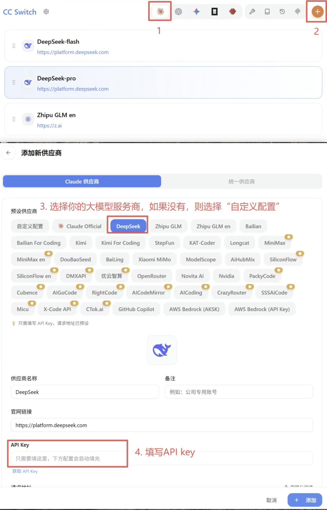
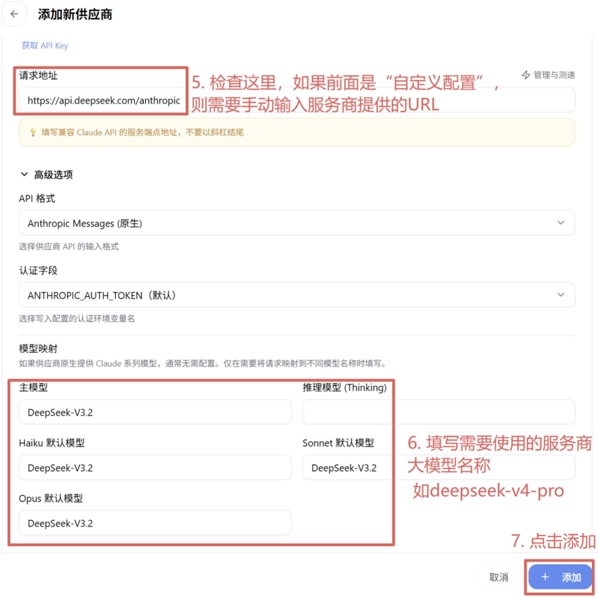
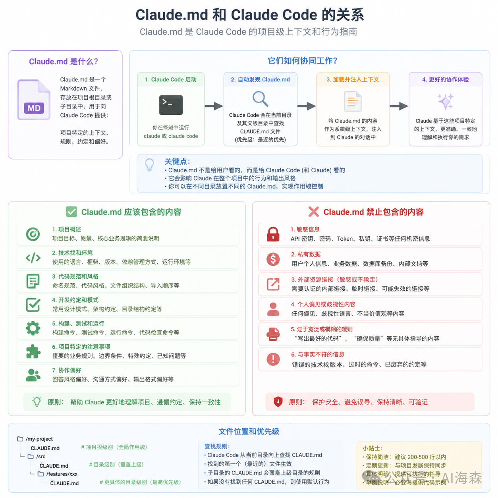

[TOC]

# claude-code

**学习资料**
1、[Claude Code官网](https://claude.com/download)
2、[Claude Code Docs简体中文](https://code.claude.com/docs/zh-CN/quickstart#native-install-recommended)
3、[技术小白学Claude Code教程](https://mp.weixin.qq.com/mp/appmsgalbum?action=getalbum&__biz=MzYzNjk0MDQwNw==&scene=1&album_id=4545884723398590474&count=3#wechat_redirect)

# 一、简介

Claude Code 是一个代理编码工具，可以读取你的代码库、编辑文件、运行命令，并与你的开发工具集成。可在终端、IDE、桌面应用和浏览器中使用。

Claude Code 是一个由 AI 驱动的编码助手，可帮助你构建功能、修复错误和自动化开发任务。它理解你的整个代码库，可以跨多个文件和工具工作以完成任务。

# 二、安装部署

## 1.安装claude code

预先安装安装node，版本为20.x 或 22.x LTS（不要 25.x+），然后通过npm安装 Claude Code CLI：

```bash
$ npm install -g @anthropic-ai/claude-code

$ claude --version
```

[小白安装视频](https://www.bilibili.com/video/BV1ZjACz3EXj/?vd_source=044dea918d053156410ff58f7f09f372)


## 2.接入大模型

国内不使用魔法上网，不使用 Anthropic 官方账号，如何将模型后端换成国内兼容接口（如DeepSeek / 智谱 / 灵芽中转）？

首先准备好DeepSeek API Key：

* [打开deepseek](https://platform.deepseek.com)
* 注册 / 登录 → 进入「API 密钥」→ 创建密钥（sk- 开头）,
* 充值 **10 元**即可用很久

然后选个方案接入大模型（推荐cc-switch）

### 2.1 方案 A：一键脚本（最简单，推荐新手）

​	用别人写好的脚本，自动装依赖、配国内模型（DeepSeek）。

* 1、一键安装命令

  ```bash
  # macOS / Linux
  $ curl -fsSL https://www.qiaoqiaoyun.com/claude/install-claude-code.sh | bash
  
  # Windows（PowerShell 管理员）
  $ irm https://www.qiaoqiaoyun.com/claude/boot.ps1 | iex
  ```

* 、测试使用

  ```bash
  $ cd 你的项目文件夹
  $ claude
  ...正常进入对话即成功
  ```

  

### 2.2 方案 B：手动配环境变量（最稳、可控）

* 1、选一个国内兼容模型（三选一）

  | 模型名称                             | BaseURL                                | 模型                               | 官网                  |
  | ------------------------------------ | -------------------------------------- | ---------------------------------- | --------------------- |
  | DeepSeek（推荐，代码强）             | https://api.deepseek.com/anthropic     | deepseek-chat` 或 `deepseek-v4-pro | platform.deepseek.com |
  | 智谱 GLM-4/5（中文好）               | https://open.bigmodel.cn/api/anthropic | glm-4` / `glm-5                    | open.bigmodel.cn      |
  | 灵芽中转（直连 Claude 官方，需付费） | https://api.lingyaai.cn/anthropic      | claude-3-sonnet-20240229           | api.lingyaai.cn       |

* 设置环境变量（永久生效）

  ```shell
  # mac
  echo 'export ANTHROPIC_BASE_URL=https://api.deepseek.com/anthropic' >> ~/.zshrc
  echo 'export ANTHROPIC_AUTH_TOKEN=sk-你的DeepSeek密钥' >> ~/.zshrc
  echo 'export ANTHROPIC_MODEL=deepseek-chat' >> ~/.zshrc
  source ~/.zshrc
  
  # Windows（PowerShell 管理员）
  [Environment]::SetEnvironmentVariable("ANTHROPIC_BASE_URL", "https://api.deepseek.com/anthropic", "User")
  [Environment]::SetEnvironmentVariable("ANTHROPIC_AUTH_TOKEN", "sk-你的DeepSeek密钥", "User")
  [Environment]::SetEnvironmentVariable("ANTHROPIC_MODEL", "deepseek-chat", "User")
  ```

* 3、测试使用

  ```bash
  $ cd 你的项目文件夹
  $ claude
  ...正常进入对话即成功
  ```

  

### 2.3 方案 C：通过CC Switch接入(推荐)

​	为什么要用CC Switch？如果没有它，我们需要手动去编辑~/.claude/settings.json文件（Windows中是“C:\Users\用户名.claude\settings.json”）设置API key，base url，model name等等信息。而且更麻烦的是，当你需要切换不同的大模型、拥有OpenClaw、OpenAI等不同应用时，每一个都要记住和手动编辑吗？

​	**CC Switch** 是一款专为 AI 编程开发者设计的开源桌面应用与配置管理工具它可以帮助开发者在一个集中的界面中，统一管理并一键切换多个 AI 编码助手（如 Claude Code, Codex CLI, Gemini CLI 等）的底层大模型 API 配置。 ***\*它可以进行多模型无缝切换\******：开发者可以在不同任务间自由切换大模型（如 Claude、DeepSeek、Kimi 等），避免在终端中频繁手动修改复杂配置文件**

* 1、下载安装 CC-Switch

  [github 下载CC Switch](https://github.com/farion1231/cc-switch/releases)
  [ccswitch中文文档](https://ccswitch.io/zh/)

* 2、修改配置

  添加 DeepSeek 供应商

  ```shell
  - Name：随便写（如 DeepSeek）
  - Base URL：`https://api.deepseek.com/anthropic`
  - API Key：你的 sk-xxx
  - Model：`deepseek-v4-pro`
  ```

  

  

  

* 3、测试使用

  ```bash
  $ cd 你的项目文件夹
  $ claude
  ...正常进入对话即成功
  ```

  


# 三、应用实操

## 1、CLAUDE.md

### 2.1 作用

​	**CLAUDE.md 是 Claude Code 的 “持久指令文件 / 项目记忆”**，放在项目根目录，**每次启动会话自动读取**，无需你每次重复说明项目规则。核心作用如下：

- **一次编写，永久生效**：记录技术栈、目录结构、编码规范、常用命令、禁止修改的文件等。
- **减少重复沟通**：不用每次新会话都解释 “用 pnpm 不用 npm”“缩进 2 空格”“先写测试” 等。
- **统一团队行为**：提交到 Git 后，团队所有人的 Claude Code 都遵守同一套规则。
- **降低出错风险**：明确告知高风险区域、禁用写法，避免 AI 误改关键代码。

​	它相当于给 AI 的**入职手册**：新员工（新会话）一来，先看手册，立刻知道项目怎么干活，不用反复培训。

​	有一点需要了解：CLAUDE.md 的内容并不是以"系统提示"的方式注入的，而是以用户消息的形式附加在系统提示之后。这意味着 Claude 会读取并尽量遵守，但没有强制保证——指令越具体，遵守率越高。



### 2.2 创建

按优先级从低到高，CLAUDE.md的存放位置如下：

1. **全局**：~/.claude/CLAUDE.md（所有项目生效，个人偏好）
2. **项目**：./CLAUDE.md（当前项目，最常用）
3. **子目录**：子目录 / CLAUDE.md（仅该目录生效）

​	

### 2.3 编写


使用技巧：claude-code-best-practice

https://claude.com/app-unavailable-in-region


