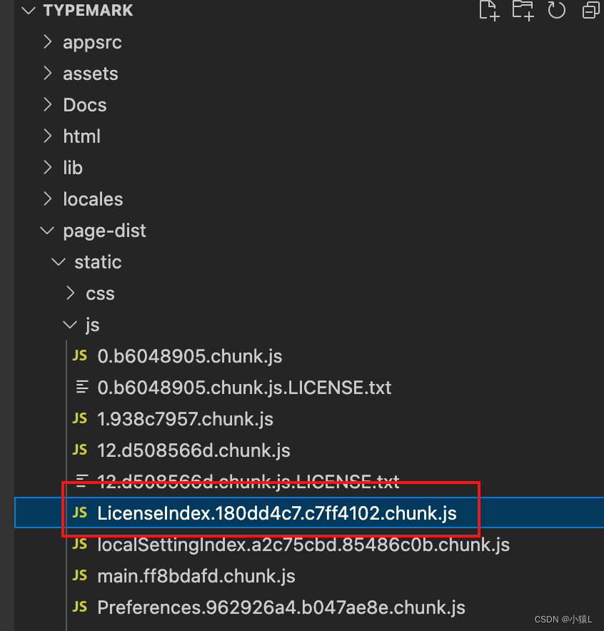

[TOC]

# Typora

Typora作为一款简单易用的Markdown编辑器，非常适合开发者

## 1、下载安装
https://www.typoraio.cn/#

## 2.破解
### 2.1 mac破解
1. 打开typora包内容找到文件夹：
     /Applications/Typora.app/Contents/Resources/TypeMark/ 

2. 找到文件：page-dist/static/js/LicenseIndex.*，如图：

	

3. 修改

​		搜索 hasActivated="true"==e.hasActivated ，
​		将它改为 hasActivated="true"=="true"

4. 成功激活！！！

### 2.1 windows破解