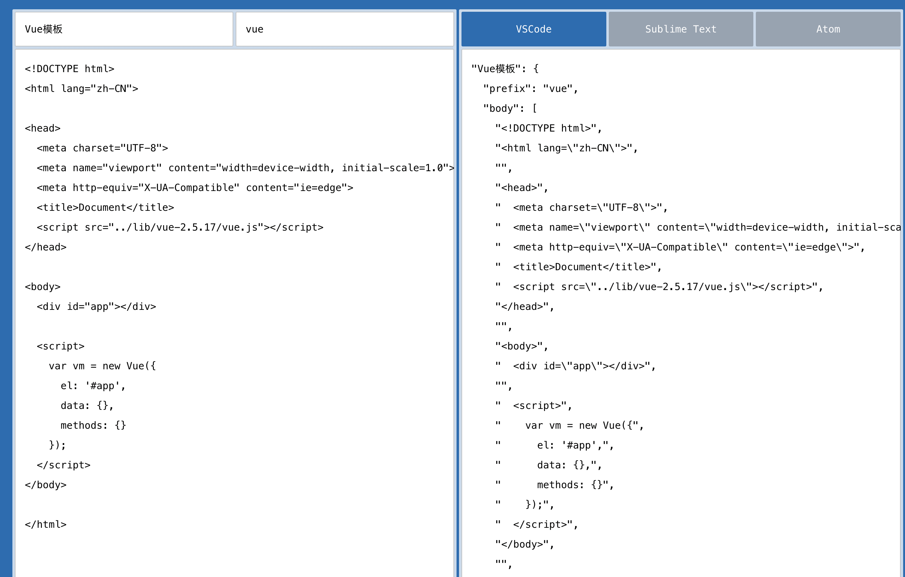

[TOC]

# Virtual Studio Code

## 1、下载安装

略

## 2、基本用法

### 2.1 自定义代码模板

1、mac下, 打开code/preferences/configure user snippets/New Global Snippets file...

或使用快捷键打开搜索面板

```js
win: Ctrl + Shift + P
mac: command + Shift + P
```

搜索：Snippets，选择Snippets：New Global Snippets file...

2、根据如下说明操作

```js
{
	// Place your global snippets here. Each snippet is defined under a snippet name and has a scope, prefix, body and 
	// description. Add comma separated ids of the languages where the snippet is applicable in the scope field. If scope 
	// is left empty or omitted, the snippet gets applied to all languages. The prefix is what is 
	// used to trigger the snippet and the body will be expanded and inserted. Possible variables are: 
	// $1, $2 for tab stops, $0 for the final cursor position, and ${1:label}, ${2:another} for placeholders. 
	// Placeholders with the same ids are connected.
	// Example:
	// "Print to console": {
	// 	"scope": "javascript,typescript",
	// 	"prefix": "log",
	// 	"body": [
	// 		"console.log('$1');",
	// 		"$2"
	// 	],
	// 	"description": "Log output to console"
	// }
}
```

打开[配置生成地址](https://snippet-generator.app/)，把模板复制到左侧 your snippet 里面，右侧就会生成配置模版，同时可以设置模板名称和快捷命令。如图：



3、新建文件，编辑时输入vue命令，即可 。


### 2.2 自动格式化

```
win: Shift + Alt + F
mac: Shift + Option + F
```


