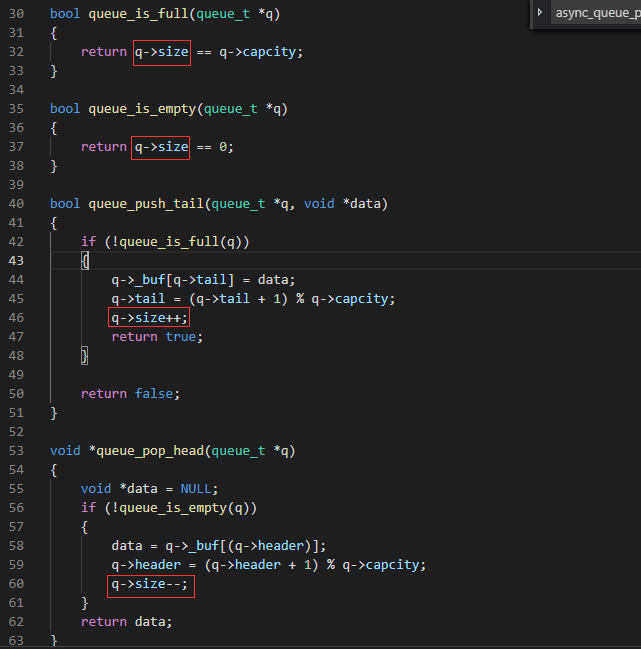

# 无锁编程


## 问题
### 生产者和消费者线程都用到size变量，为什么不需要对它加锁或原子操作？ 
如图:

答案:
```
1.“单生产单消费者”是不需要原子操作的,因为：
生产者负责size<capcity && size++， 消费者负责size--.也就是说：
即使原本size==1，消费者将它--变为0了，丝毫不影响生产者size<capcity

另外：
消费者负责size>0 && size--, 生产者负责size++。也就是说：
即使原本size==1，生产者将它++变为2了，也影响不了消费者size > 0

2.“单生产多消费者”就不一样了,因为：
消费者1：size--
消费者2：size--,  此时size > 0的判断就不确定了。
除非消费者1和消费者2是顺序执行的。可如果消费者1和消费者2顺序执行，那不就需要同步（原子操作）了吗？
```

> 参考:
> 
> 经典:     
> [透过Linux内核看无锁编程](https://www.ibm.com/developerworks/cn/linux/l-cn-lockfree/index.html)