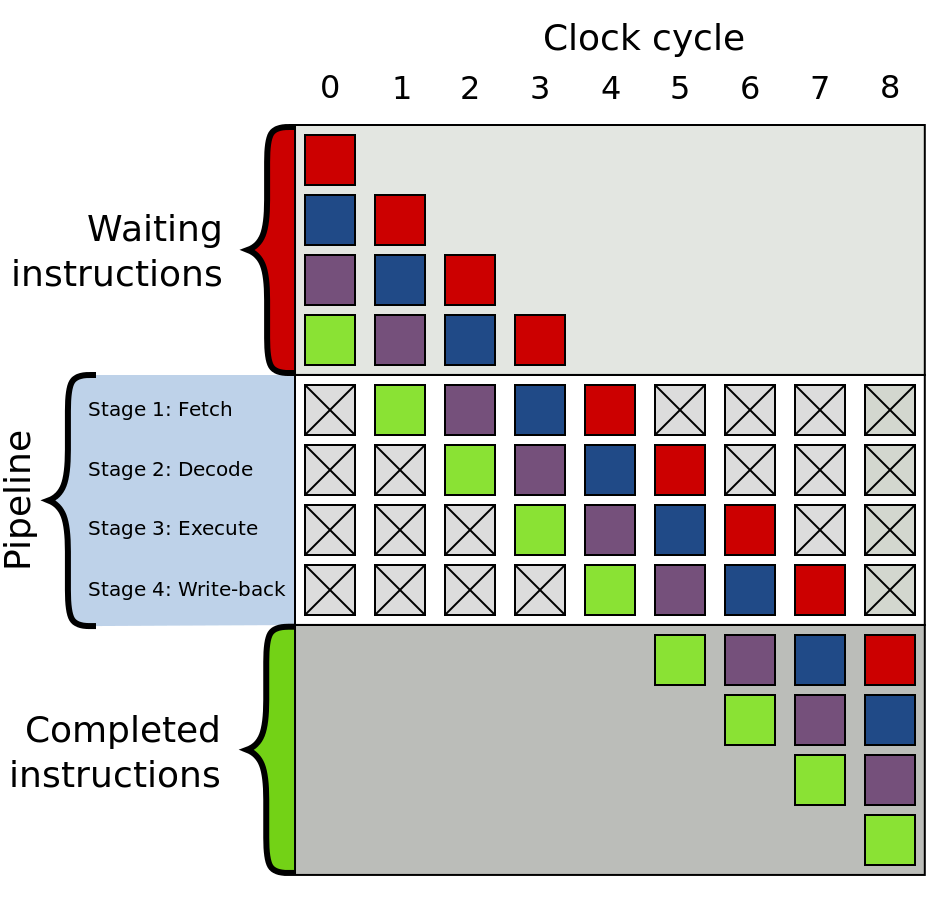
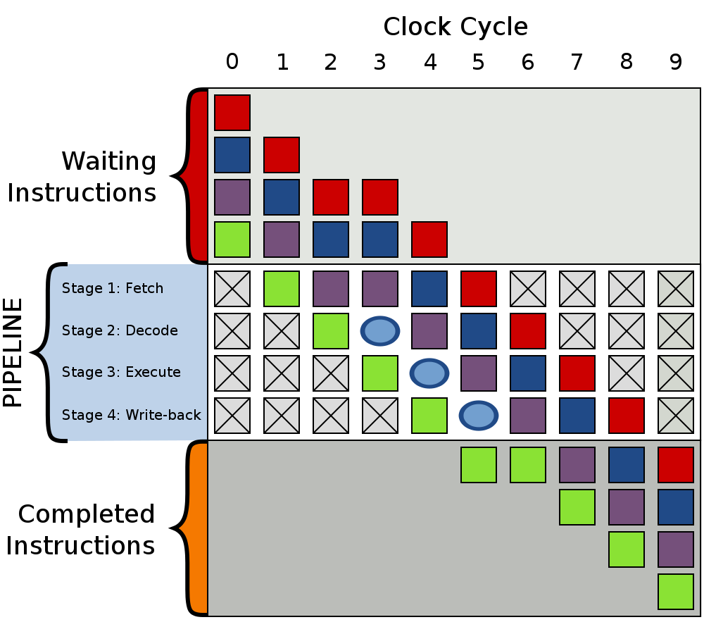
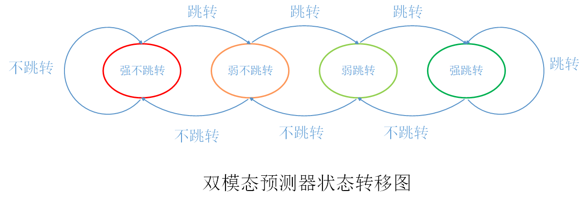
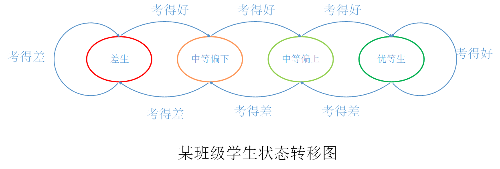

<!-- vscode-markdown-toc -->
* 1. [虚函数](#)
* 2. [if/else -> switch/case](#ifelse-switchcase)
* 3. [《CSAPP》.局部性原理](#CSAPP.)
* 4. [循环展开](#-1)
* 5. [分支预测器](#-1)
	* 5.1. [定义](#-1)
	* 5.2. [原理](#-1)
		* 5.2.1. [CPU流水线](#CPU)
		* 5.2.2. [流水线问题](#-1)
		* 5.2.3. [分支预测器诞生](#-1)
	* 5.3. [分类](#-1)
		* 5.3.1. [静态分支预测器](#-1)
		* 5.3.2. [动态分支预测器](#-1)
	* 5.4. [分析](#-1)
	* 5.5. [避免](#-1)
		* 5.5.1. [用条件传送替代条件控制转移](#-1)
		* 5.5.2. [如何写条件传送代码？](#-1)
		* 5.5.3. [注意问题](#-1)

<!-- vscode-markdown-toc-config
	numbering=true
	autoSave=true
	/vscode-markdown-toc-config -->
<!-- /vscode-markdown-toc -->

# C++性能
##  1. <a name=''></a>虚函数
* 空间开销、时间开销
* 汇编发现的奥秘
    http://irootlee.com/juicer_vtable/
    * 普通函数  
     采用直接调用，直接调用的跳转地址是编译器确定的
    * 虚函数    
     采用间接调用，间接调用是运行到该指令时从寄存器中取出地址然后跳转。
     影响到虚函数调用性能的背后原因是流水线和分支预测，由于虚函数调用需要间接跳转，所以会导致虚函数调用比普通函数调用多了分支预测的过程，产生性能差距的原因主要是分支预测失败导致的流水线冲刷性能开销
##  2. <a name='ifelse-switchcase'></a>if/else -> switch/case
编译器优化switch/case
* 1.逐条件判断（与if/else相同）
    若case的值是乱序的，则会采用if/else的逐条件判断
* 2.跳转表
* 3.二分查找法  
##  3. <a name='CSAPP.'></a>《CSAPP》.局部性原理
* cash  
在一个良好空间局部性的程序中，如果一个存储器位置被引用了一次，那么程序很可能在不远的将来引用附近的一个存储器位置。
* 遍历vector<vector<int>> data的效率;    
    * 行优先求和效率：(0.004661ms/1024*1024) 
    * 列优先求和效率：(0.007287ms/1024*1024)    
    显然：`行`优先求和效率 > `列`优先求和效率
* 思考  
<font color=#A52A2A> 为何快排[平均=O(NlogN)，最差=O(N*N)]比堆排序[平均=最差=O(NlogN)]使用更广泛?
</font>

##  4. <a name='-1'></a>循环展开
* 牺牲程序尺寸来加快程序执行速度。可由程序员完成，也可由编译器自动优化完成
* 示例(不开编译器优化)
```
//10000次循环求和。耗时: 0.0000279s
for(int i = 0;i < 10000;i++) {  
     sum += i;
}
```
```
//循环展开，5000次求和。耗时: 0.0000159s
for(int i = 0;i < 100000;i += 2) {
    sum += i;
    sum += i+1;
}
```
```
//最大利用流水线。耗时: 0.0000073s
int sum1=0,sum2=0;
for(int i=0;i<count/2;i+=2){
    sum1 += i;
    sum2 += i+1;
}
sum = sum1 + sum2;
```
##  5. <a name='-1'></a>分支预测器
###  5.1. <a name='-1'></a>定义
* Branch predictor  
一种数字电路，在分支指令执行结束之前猜测哪一路分支将会被运行，以提高处理器的指令流水线的性能使用分支预测器的目的，在于改善指令管线化的流程。现代使用指令管线化处理器的性能能够提高，分支预测器对于现今的指令流水线微处理器获得高性能是非常关键的技术
* 预测错误出现太频繁，势必会影响到流水线的吞吐量，导致性能下降
###  5.2. <a name='-1'></a>原理
####  5.2.1. <a name='CPU'></a>CPU流水线
* 1.取指（Fetch）   
取指阶段从存储器读取指令字节，地址为程序计数器（PC）的值
* 2.译码（Decode）  
译码阶段完成指令的翻译，从寄存器文件读入最多两个操作数
* 3.执行（Execute）   
执行指令，若执行的是一条跳转指令，此阶段会检查条件码和分支条件，决定是否选择分支
* 4.写回（Write Back）  
将指令执行结果保存到内存中
####  5.2.2. <a name='-1'></a>流水线问题 
对于顺序执行的命令，效果提高显著，但是遇到跳转命令时效率便会急剧下降，对于分支跳转指令，我们在执行完该指令之前是不知道是否发生跳转的(即：我们在分支指令执行完之前，无法确定分支指令的下一条指令地址，所以没法把分支指令的下一条命令放入流水线中，只能等待分支指令执行完毕才能开始下一条命令的取指步骤）。所以流水线中就会出现气泡（Bubble），这会大大降低流水线的吞吐能力。


####  5.2.3. <a name='-1'></a>分支预测器诞生
* 当指令执行到分支跳转指令时，CPU不再空等分支跳转指令执行完毕给出下一条命令的地址，而根据模型预测分支是否发生跳转以及跳转到哪里，CPU将预测到的指令直接放入流水线，去执行指令的取指、译码等工作。  
* 当分支跳转指令完成执行阶段后，给出是否跳转的结果，CPU即可判断分支跳转预测是否正确，若指令执行后的跳转结果与分支预测器预测结果相一致，则流水线继续往下执行；若发现分支预测结果出现错误，则需要清空流水线，将前面不该进入流水线的指令清空，然后将正确的指令放入流水线重新执行
* 在分支预测器预测准确时可以提高CPU流水线的吞吐量，但若预测错误导致清空流水线指令，则会导致CPU效率降低。故分支预测的准确性对CPU执行效率影响很大，提高分支预测器的预测准确度是几十年来学术界及工业界研究的目标
###  5.3. <a name='-1'></a>分类
####  5.3.1. <a name='-1'></a>静态分支预测器
* 一般实现比较简单，在类似于嵌入式处理器这种资源较少的处理器中应用比较多，但是因为静态预测器实现逻辑比较简单，所以预测准确率相应一半也不高
* 主要实现算法
    * 1.所有的分支指令都不跳转，每次CPU都顺序取出下一条命令放入流水线。
    * 2.所有的分支指令都跳转，每次CPU遇到分支判断指令都默认会发生跳转，并从跳转地址取指。
    * 3.某些指令一律跳转，某些指令一律不跳转，此方法是方法1和方法2的结合。
    * 4.与上次跳转结果保持一致，如上次该指令发生了跳转，则本次依旧跳转；若上次该指令没有跳转，则本次也不跳转。
    * 5.向前的分支会跳转，向后的分支不跳转。该方法主要针对程序中的循环进行的优化。
* 虽然看似在概率上，这些静态方法的预测正确率只有50%，但是由于一般程序中都有大量循环存在，针对循环优化的静态方法一般都有高于70%的正确率。对于哪些对于预测准确率要求不算太高，且本身资源有限制或者对功耗要求高的场景，静态分支预测器是一个很好的选择。
####  5.3.2. <a name='-1'></a>动态分支预测器
##### 双模态预测器（bimodal predictor）
该预测器采用4个状态的状态机对分支跳转进行预测，分支指令执行完毕后根据实际跳转结果更新状态机，用于下次预测

##### 生活化理解
* 按学习成绩区分学生优分类差
    * 1.优等生（强跳转）
    * 2.中等偏上（弱跳转）
    * 3.中等偏下（弱不跳转）
    * 4.差生（强不跳转）
* 若考试成绩分为两类：考得好（跳转）、考得差（不跳转），等级按如下规则变化：
    * 1.优等生考的好还是优等生，考的差变为中等偏上。
    * 2.中等偏上考得好变成优等生，考得差变为中等偏下。
    * 3.中等偏下考得好变为中等偏上，考得差变为差生。    
    差生考得差还是差生，考得好变为中等偏下。

###  5.4. <a name='-1'></a>分析
```
//生成0-255范围的随机数并存入数组data
for(unsigned c = 0;c< 32768;++c){
        data[c] = std::rand() % 256;
    }
std::sort(data,data +  32768);//排序

//统计大于128的所有数之和，并计算时间:
for(unsigned i = 0;i<100000;++i){
     for(unsigned c = 0; c <  32768; ++c){
            if(data[c] >= 128)
                sum += data[c];
     }
}
// 1.g++默认优化等级编译耗时: 6.95695s
// 2.去掉排序耗时：20.277s
```
有序的原始数据被称为对分支预测器友好的数据，而乱序的原始数据便是对分支预测器不友好的数据。对于有序的数据，前n次循环，分支都是不跳转，后m次循环，分支都是跳转，这对于分支预测器来说很好预测，只有在循环开始结束及跳转不跳转分界点容易产生预测错误，所以分支预测的准确度非常高，流水线效率也就更高；而对于无序的数据，每一次数据都有可能大于或者小于128，也就是每次跳转的概率是50%，而且跳转不跳转完全随机，所以分支预测器对于这样的分支跳转的预测准确率很低，无法做出有效的分支预测，导致流水线被频繁冲刷，严重影响了流水线的吞吐量
###  5.5. <a name='-1'></a>避免
####  5.5.1. <a name='-1'></a>用条件传送替代条件控制转移
分支预测对有规律的分支跳转可以实现非常高的预测正确率，比如在循环判断中，在循环终止之前，分支预测都可以基本保证完全的预测正确，预测错误只会出现在最后跳出循环的条件满足时。但是，对于每次跳转结果都不确定的分支判断，分支预测率的预测正确率就很低了，可能只有50%左右，基本相当于每次都随机猜测，这样的情况下，流水线会经常被打断，影响程序性能。对于这种严重依赖于数据的分支跳转命令，最好的替代方法就是条件传送指令
####  5.5.2. <a name='-1'></a>如何写条件传送代码？
```
//低效，耗时：7.42568s
for(unsigned c = 0; c < arraySize; ++c){
     if(data[c] >= 128){
         sum += data[c];
     }
}
//当数据随机的时候，此命令的整体效率会极大降低
```
```
//优化，耗时：7.4234s
for(unsigned c = 0; c < arraySize; ++c{
       int t = (data[c] - 128) >> 31;
       sum += ~t & data[c];
}
```
* 使用一个减法和移位获取data[c]与128比较的结果，如果data[c] >= 128，则t的所有位均为0，否则t的所有位均为1，然后将t取非操作并于data[c]做与操作，以决定累加到sum上的数据是0还是data[c]
* 如此没有产生分支控制跳转命令，我们通过一些hack技巧实现了条件传送命令替代条件控制跳转命令，这样的代码对于任何数据表现都是一样的，即程序的性能不会因为输入数据的随机与否而变化。
####  5.5.3. <a name='-1'></a>注意问题
* 将条件控制转移指令转换成了条件传送代码，效率有提升但不明显，可悲的是代码的可读性急剧下降，这种代码会对整个项目的维护带来巨大麻烦。
* 所以，在现代处理器和现代编译器的帮助下，千万不要过度关心分支预测带来的影响，对于程序中大部分分支命令，分支预测器都可以有很高的预测正确率，而对于那些分支预测器很难预测的分支，现代编译器可以对其进行自动优化，比如gcc中开启-O3优化的时候，编译器会自动把条件跳转转为条件传送以提高程序运行效率。
* 大部分情况下，请相信处理器、相信编译器！有在完全确定了程序的性能瓶颈所在的时候再去针对这部分代码做特殊优化，避免提前优化和过度优化。

<font color=gray size=1>
参考:  http://irootlee.com/all-categories
</font>