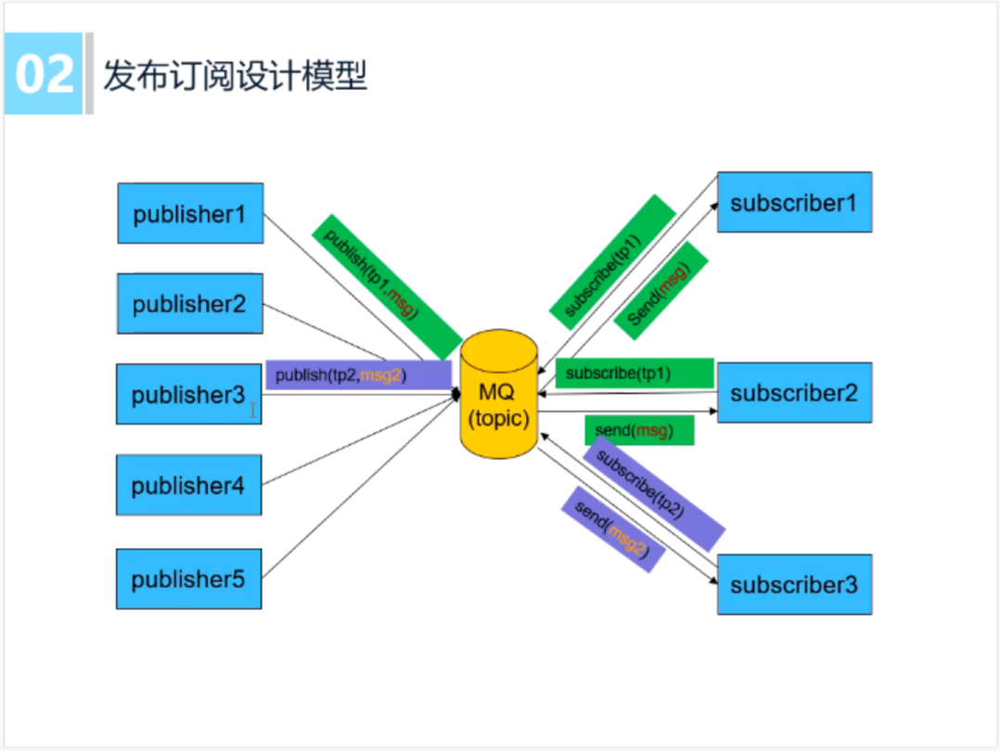

<!-- vscode-markdown-toc -->
* 1. [消息队列是什么](#)
* 2. [为什么要使用消息队列](#-1)
* 3. [如何设计消息队列](#-1)
* 4. [消息队列具体实现](#-1)
* 5. [发布者订阅者与观察者模式的区别](#-1)

<!-- vscode-markdown-toc-config
	numbering=true
	autoSave=true
	/vscode-markdown-toc-config -->
<!-- /vscode-markdown-toc -->

# MQ发布者订阅者架构模式

##  1. 消息队列是什么
 
##  2. 为什么要使用消息队列  
  
 
 
##  3. 如何设计消息队列
 
 
 
 
##  4. 消息队列具体实现
轻量级消息队列： https://github.com/Jevstein/lightMQ
##  5. 发布者订阅者与观察者模式的区别
发布（Publish）/订阅（Subscribe）模式与gof23种设计模式中的观察者（Observer）模式十分相似，但也有差异，本质上的区别是调度的地方不同。
* 观察者模式    
`具体观察者[相当于订阅者]`把自己注册到`具体目标[相当于发布者]`里，在`具体目标[发布者]`发生变化时候，调度观察者的更新方法。
* 发布订阅模式  
`订阅者`把自己想订阅的事件注册到`调度中心`，当该事件触发时候，`发布者`发布该事件到`调度中心`（顺带上下文），由`调度中心`统一调度订阅者注册到调度中心的处理代码。    
由此可见：  
1）观察者模式是由具体目标[相当于发布者]直接调度的，而发布/订阅模式是统一由`调度中心`调用的；  
2）观察者模式的订阅者与发布者之间是`存在依赖`的，而发布/订阅模式则不会。如图：

参考:
1.动脑学院.lee老师
2.https://www.cnblogs.com/lovesong/p/5272752.html
