# Electron34鸿蒙平台调用ets
**！！注意：所有示例中的路径需要修改成实际路径！！**
**！！请结合使用《Electron框架HarmonyOS开发指导》！！**

### 将Electron编译工具链配置环境变量
```sh
export CC="~/electron_release/chromium-electron-release/src/ohos_sdk/openharmony/native/llvm/bin/clang --target=aarch64-linux-ohos"
export CXX="~/electron_release/chromium-electron-release/src/ohos_sdk/openharmony/native/llvm/bin/clang++ --target=aarch64-linux-ohos"
export LD="~/electron_release/chromium-electron-release/src/ohos_sdk/openharmony/native/llvm/bin/lld --target=aarch64-linux-ohos"
export STRIP="~/electron_release/chromium-electron-release/src/ohos_sdk/openharmony/native/llvm/bin/llvm-strip"
export RANLIB="~/electron_release/chromium-electron-release/src/ohos_sdk/openharmony/native/llvm/bin/llvm-ranlib"
export OBJDUMP="~/electron_release/chromium-electron-release/src/ohos_sdk/openharmony/native/llvm/bin/llvm-objdump"
export OBJCOPY="~/electron_release/chromium-electron-release/src/ohos_sdk/openharmony/native/llvm/bin/llvm-objcopy"
export NM="~/electron_release/chromium-electron-release/src/ohos_sdk/openharmony/native/llvm/bin/llvm-nm"
export AR="~/electron_release/chromium-electron-release/src/ohos_sdk/openharmony/native/llvm/bin/llvm-ar"
export CFLAGS="-fPIC -D__MUSL__=1"
export CXXFLAGS="-fPIC -D__MUSL__=1"
```
### 目录结构示意
本指导文档共使用到三个文件夹，分别为aki、addapter、addon，它们处于同级目录下，目录结构如下图所示：
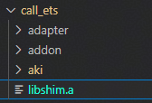

### 一、aki的下载以及编译
1. 使用Git拉取aki代码
```sh
git clone https://gitee.com/openharmony-sig/aki.git
```

2. 配置aki的cmakelist文件，添加如下内容（请注意替换路径）
```
## 在ets-demo/aki/CMakeLists.txt中添加以下配置
# set electron path
set(ELE_PATH ~/electron/34_release/chromium-electron-release)
set(CMAKE_C_COMPILER ${ELE_PATH}/src/ohos_sdk/openharmony/native/llvm/bin/clang)
set(CMAKE_CXX_COMPILER ${ELE_PATH}/src/ohos_sdk/openharmony/native/llvm/bin/clang++)
set(CMAKE_CXX_FLAGS "--target=aarch64-linux-ohos")

# 下列配置如果是electron25的话无需添加
add_compile_options(
  -Wno-vla-cxx-extension        # 不显示关于 C++ 中使用变长数组的警告
  -Wno-error=vla-cxx-extension  # 不把这个警告当作错误处理
)
```
如下图所示：
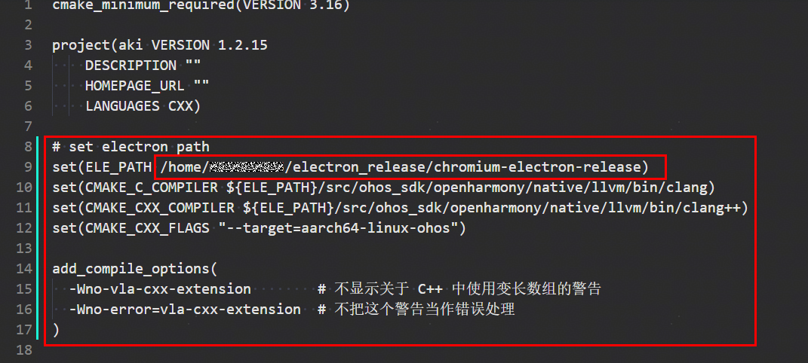

3. 编译aki

```sh
cd aki

mkdir build && cd build

cmake .. -DCMAKE_BUILD_TYPE=Release

make
```
**编译完成后可在 build/src 目录下生成编译产物：libaki_jsbind.so**

### 二、编译adapter

1. Demo文件已提供，请仿照示例文件中的**demo.cc**代码进行方法注册

**注意**：demo.cc的头文件引用顺序，正确顺序如下，在提供的demo中已修改。

```cpp
#include "openharmony/native/sysroot/usr/include/napi/native_api.h"
#include "openharmony/native/sysroot/usr/include/js_native_api_types.h"
#include "third_party/electron_node/src/node.h"
```
2. 仿照示例文件中的**getPath.cc**进行**方法绑定**
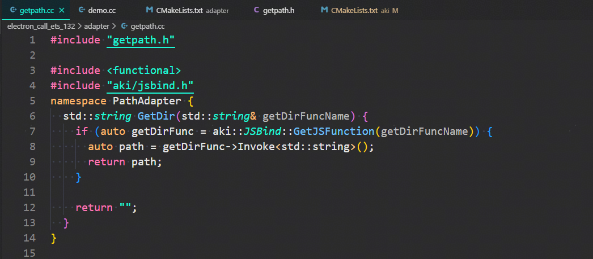
3. 根据本地路径情况修改CMakeLists的编译环境路径
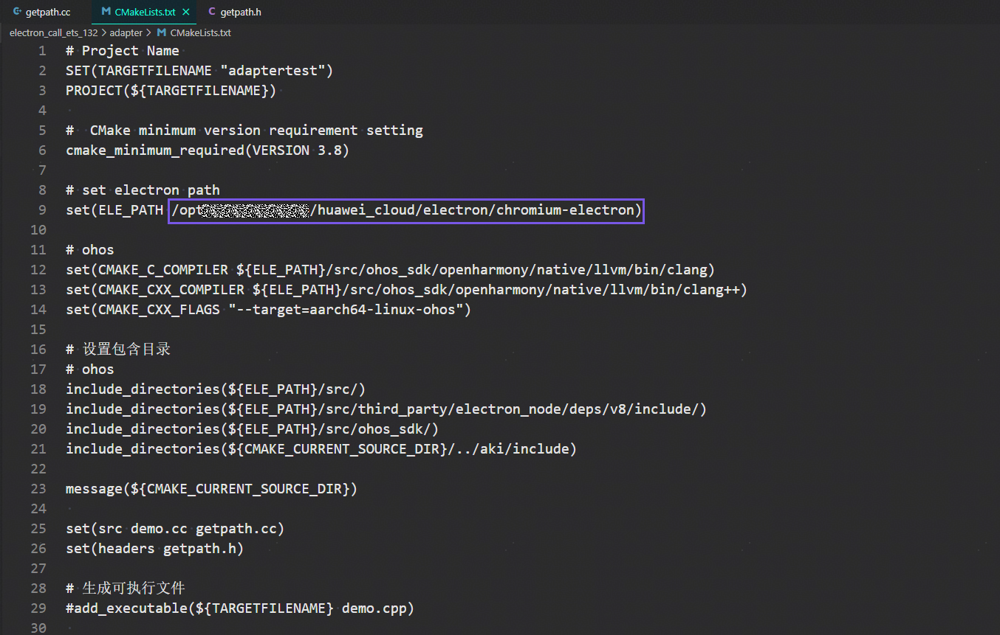
4. 编译adapter

```sh
mkdir build && cd build

cmake ../

make
```
**编译完成后可在 build 目录下生成编译产物：libadaptertest.so**

### 三、编译addon
1. 在CMakeLists.txt文件中修改头文件路径
    将cmake文件中的文件路径修改为自己本地的路径，并注意需要链接上`libshim.a`文件（已附件）
    如下图所示：
    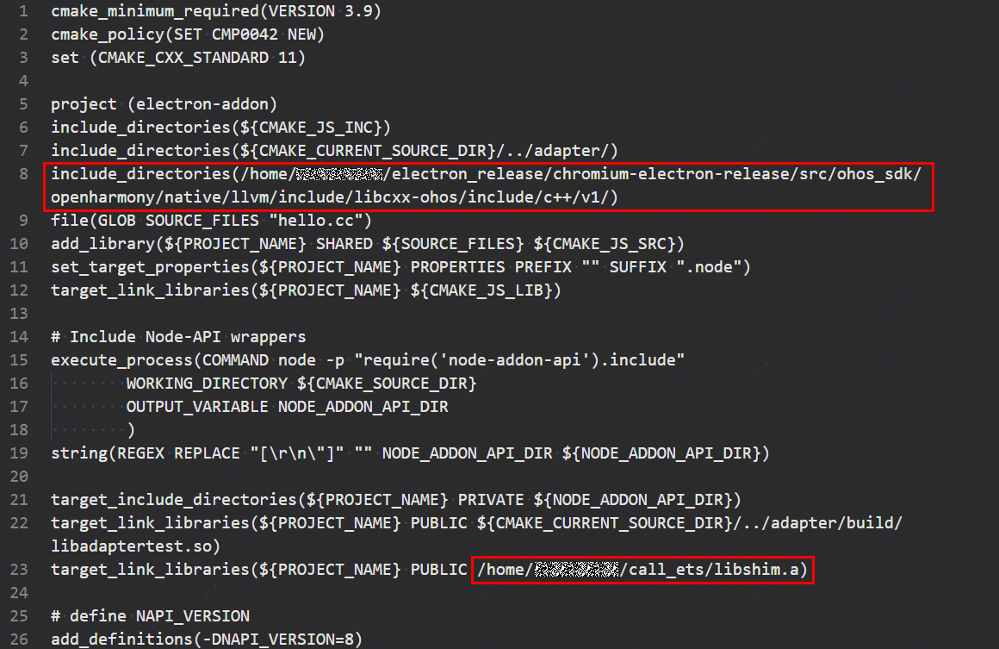
2. Electron34需要使用`cmake-js`编译，工程在`addon`文件夹下，编译出来的库名字是`electron-addon.node`（可自行在配置文件中修改），位于`build/Release`目录下。cmake-js需要在`addon`目录下使用`npm install`命令编译。

```sh
cd addon

# npm install 命令的作用为安装npm依赖
# 在package.json文件中，已为scripts字段配置参数："install": "cmake-js compile"
# 使在使用npm install 安装环境依赖的同时执行'cmake-js compile'编译
npm install --verbose
```
**编译完成后可在 build/Release 目录下生成编译产物：electron-addon.node**

注：在执行`“npm install”`命令可以分解为两个步骤，分别为：
    `“npm install”`：npm安装依赖的标准命令，执行此命令时将按照npm项目中的`package.json`文件中的配置来安装环境依赖
    `“cmake-js compile”`：首先会检测并在本地安装cmake-js的依赖项，当执行到该命令时你可以看到编译机在家目录下生成了一个.cmake-js/文件夹，文件夹下会存放对应node版本的相关依赖。当依赖满足时则会按照CMakeLists.txt文件的编译指令开始编译。
###### 报错处理
**报错一、**
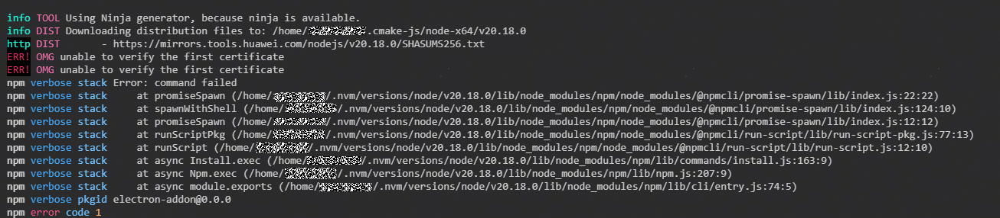
证书问题，可以通过在`~/.npmrc`配置`cafile`来解决，如果配置`cafile`后仍然报错，可以在编译命令前添加`NODE_TLS_REJECT_UNAUTHORIZED=0`可临时跳过证书校验，如下图：
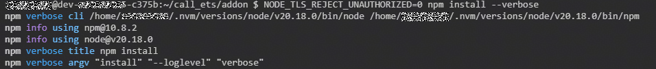
**报错二、**
如果报如下图所示或类似的错误，请检查您的编译工具链环境变量是否已配置，并执行`source ~/.bashrc`命令刷新环境变量。
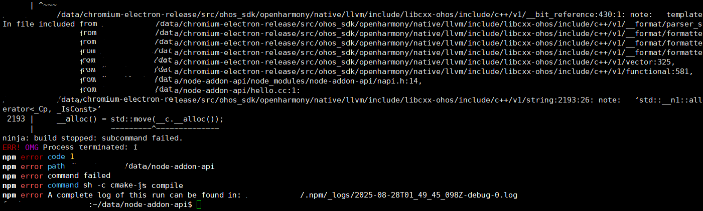
如果可以正常编译，最终结果如下图：
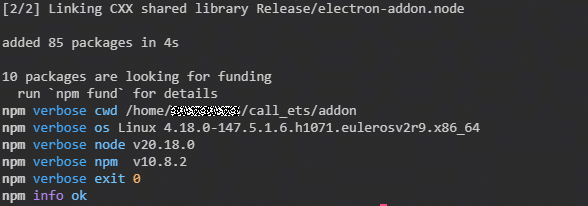

### 四、构建har包
**注：该步骤缺少的文件及文件夹请自行创建**
1. 创建工程
文档中提到的示例，已经在附件中附带了，但不能直接全部拷贝进去使用，可以复制对应文件内容，`library`需要自己新建，如下图所示：
deveco中点击`File` ==> `New` ==> `Moudle` ==> `Static Library`，创建一个`Library`
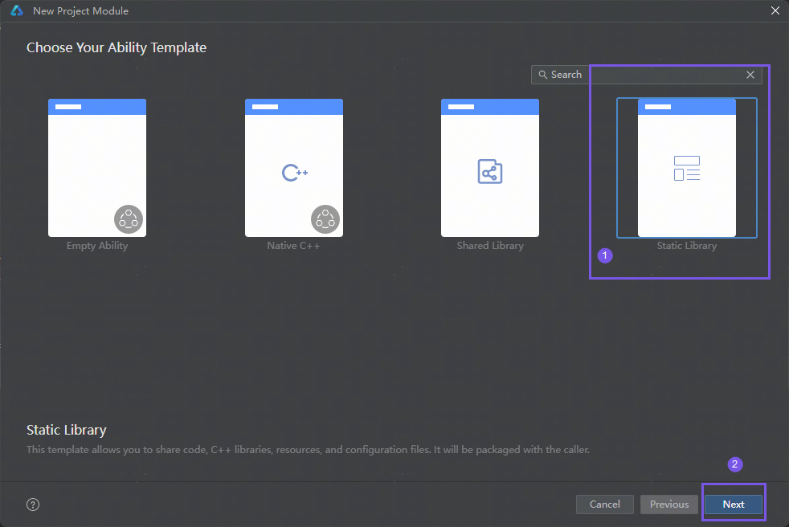
------
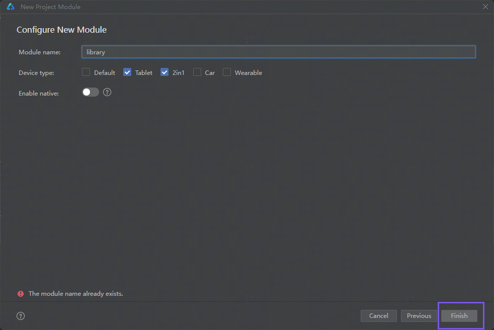
------
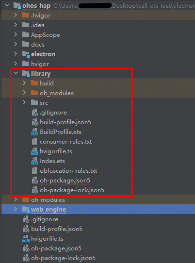
2. 将adapter中的注册进行声明和初始化
```typescript
// 新建文件：ohos_hap\library\src\main\ets\interface\interface.ts
export class JSBind {
  bindFunction: (name: string, func: Function) => number;
}

export interface NativeContext {
  JSBind: JSBind;
}
```
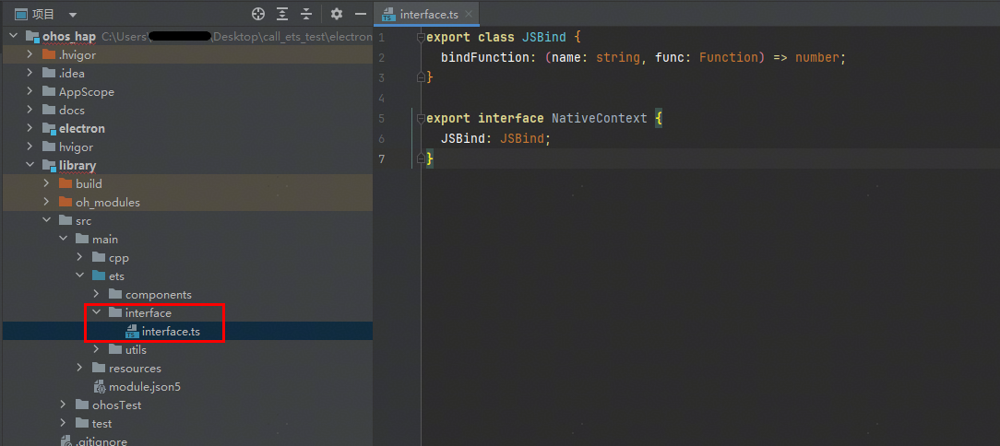
3. 定义初始化和bind函数
```ts
// 新建文件：ohos_hap\library\src\main\ets\utils\NativeTest.ets
import adaptertest from 'libadaptertest.so';
import { NativeContext } from '../interface/interface';
import environment from '@ohos.file.environment'
import { hilog } from '@kit.PerformanceAnalysisKit';

export class JsBindingTest {
  private static currentContext: NativeContext;

  static getUserDesktopDir(): string {
    let  userDir : string = '';
    try {
      userDir = environment.getUserDesktopDir();
      hilog.info(0x0000, 'testing', `getUserDesktopDir:${JSON.stringify(userDir)}`);
    } catch (error){
      hilog.info(0x0000, 'testing', `getUserDesktopDir failed caused by: :${JSON.stringify(error)}`);
    }
    return "zhangao： "+userDir;
  }

  static init() {
    JsBindingTest.currentContext = adaptertest.getNativeContext();
  }

  static bind() {
    if (JsBindingTest.currentContext === undefined) {
      JsBindingTest.currentContext = adaptertest.getNativeContext();
    }
    JsBindingTest.currentContext.JSBind.bindFunction("getDir", JsBindingTest.getUserDesktopDir);
  }

  static getNativeContext(): NativeContext {
    if (JsBindingTest.currentContext !== undefined) {
      return JsBindingTest.currentContext;
    }
    return adaptertest.getNativeContext();
  }
}
```
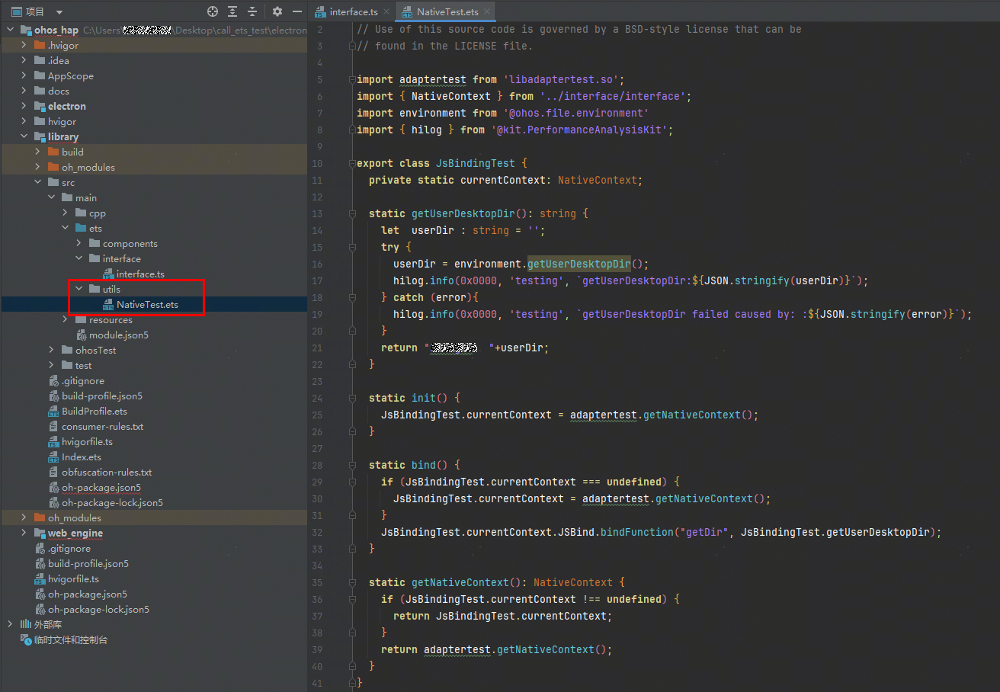

4. 增加共享包导出声明入口
在src/main目录下创建 cpp -> types ->libadaptertest(根据实际修改)

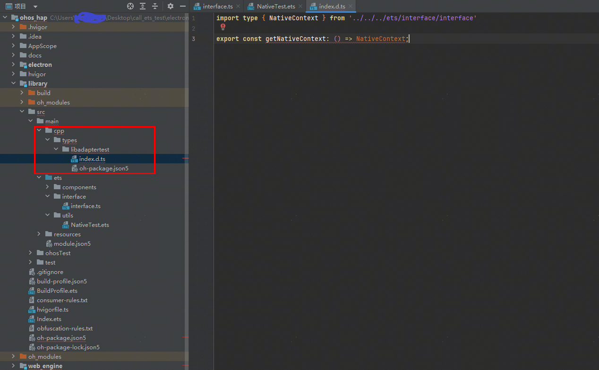
```typescript
// 增加文件：ohos_hap/library/src/main/cpp/types/libadaptertest/index.d.ts
import type { NativeContext } from '../../../ets/interface/interface'

export const getNativeContext: () => NativeContext;
```
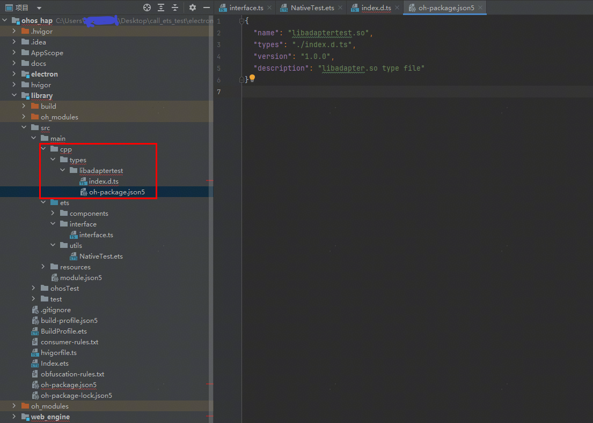

```json
// 增加文件：ohos_hap/library/src/main/cpp/types/libadaptertest/oh-package.json5
{
  "name": "libadaptertest.so",
  "types": "./index.d.ts",
  "version": "1.0.0",
  "description": "libadapter.so type file"
}
```
5. 修改library根目录下的`oh-packages.json5`配置文件，增加引用依赖
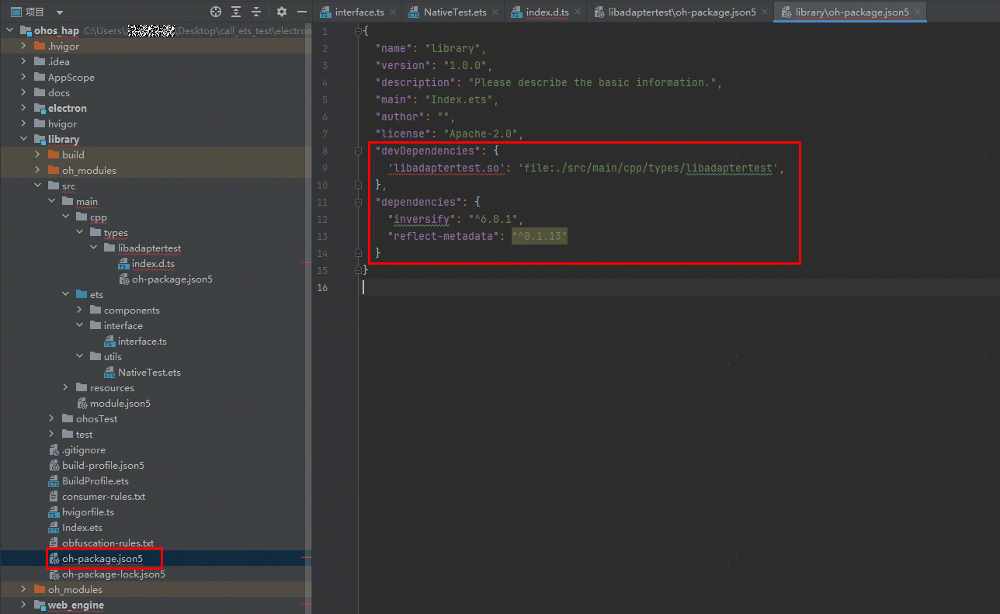
```json
// 修改文件：ohos_hap\library\oh-package.json5
{
  "name": "library",
  "version": "1.0.0",
  "description": "Please describe the basic information.",
  "main": "Index.ets",
  "author": "",
  "license": "Apache-2.0",
  "devDependencies": {
    'libadaptertest.so': 'file:./src/main/cpp/types/libadaptertest',
  },
  "dependencies": {
    "inversify": "^6.0.1",
    "reflect-metadata": "^0.1.13"
  }
}

```
6. 修改library根目录下的Index.ets配置文件，增加导出方法
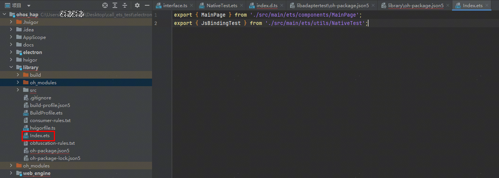
```typescript
// 修改文件：ohos_hap\library\Index.ets
export { MainPage } from './src/main/ets/components/MainPage';
export { JsBindingTest } from './src/main/ets/utils/NativeTest';
```
7. 构建har包
参考文档：[引用共享包](https://developer.huawei.com/consumer/cn/doc/harmonyos-guides/ide-har-import)
在web_engine模块中引用此HAR包 webgine/oh-packages.json5 中增加引用配置
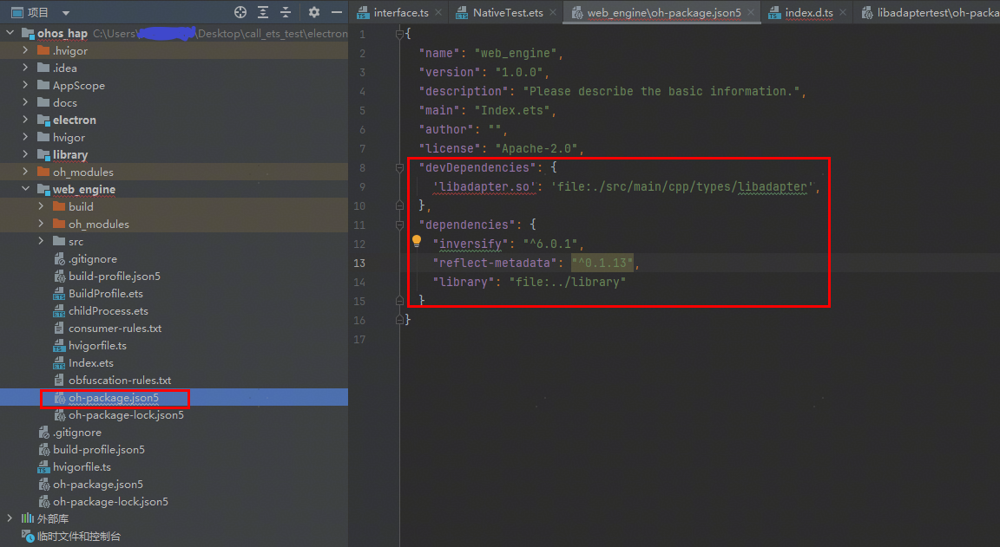
```json
// 修改文件：ohos_hap\web_engine\oh-package.json5
{
  "name": "web_engine",
  "version": "1.0.0",
  "description": "Please describe the basic information.",
  "main": "Index.ets",
  "author": "",
  "license": "Apache-2.0",
  "devDependencies": {
    'libadapter.so': 'file:./src/main/cpp/types/libadapter',
  },
  "dependencies": {
    "inversify": "^6.0.1",
    "reflect-metadata": "^0.1.13",
    "library": "file:../library"
  }
}
```
在WebAbilityStage.ets文件中初始化、绑定
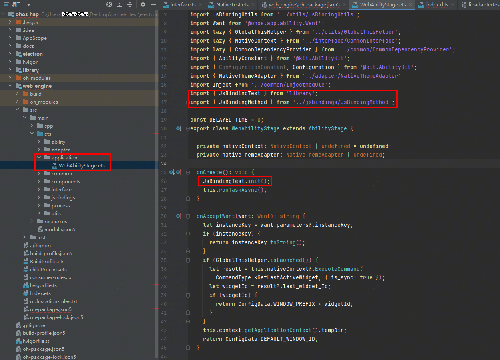
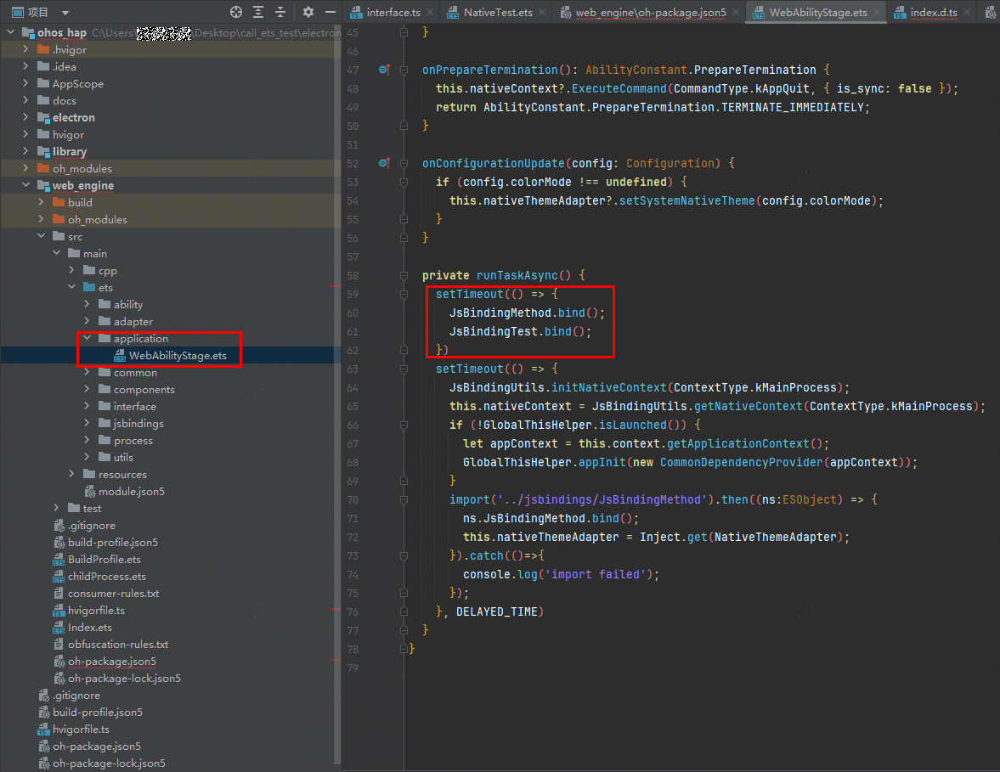
```typescript
// 修改文件：ohos_hap\web_engine\src\main\ets\application\WebAbilityStage.ets（需要修改的文件已在下方代码中使用“++”符号标注）
import AbilityStage from '@ohos.app.ability.AbilityStage';
import { CommandType, ConfigData, ContextType } from '../common/Constants';
import JsBindingUtils from '../utils/JsBindingUtils';
import Want from '@ohos.app.ability.Want';
import lazy { GlobalThisHelper } from '../utils/GlobalThisHelper';
import lazy { NativeContext } from '../interface/CommonInterface';
import lazy { CommonDependencyProvider } from '../common/CommonDependencyProvider';
import { AbilityConstant } from '@kit.AbilityKit';
import { ConfigurationConstant, Configuration } from '@kit.AbilityKit';
import { NativeThemeAdapter } from '../adapter/NativeThemeAdapter'
import Inject from '../common/InjectModule';
++ import { JsBindingTest } from 'library';
++ import { JsBindingMethod } from '../jsbindings/JsBindingMethod';

const DELAYED_TIME = 0;
export class WebAbilityStage extends AbilityStage {

  private nativeContext: NativeContext | undefined = undefined;
  private nativeThemeAdapter: NativeThemeAdapter | undefined;

  onCreate(): void {
++     JsBindingTest.init();
    this.runTaskAsync();
  }

  onAcceptWant(want: Want): string {
    let instanceKey = want.parameters?.instanceKey;
    if (instanceKey) {
      return instanceKey.toString();
    }
    if (GlobalThisHelper.isLaunched()) {
      let result = this.nativeContext?.ExecuteCommand(
        CommandType.kGetLastActiveWidget, { is_sync: true });
      let widgetId = result?.last_widget_Id;
      if (widgetId) {
        return ConfigData.WINDOW_PREFIX + widgetId;
      }
    }
    this.context.getApplicationContext().tempDir;
    return ConfigData.DEFAULT_WINDOW_ID;
  }

  onPrepareTermination(): AbilityConstant.PrepareTermination {
    this.nativeContext?.ExecuteCommand(CommandType.kAppQuit, { is_sync: false });
    return AbilityConstant.PrepareTermination.TERMINATE_IMMEDIATELY;
  }

  onConfigurationUpdate(config: Configuration) {
    if (config.colorMode !== undefined) {
      this.nativeThemeAdapter?.setSystemNativeTheme(config.colorMode);
    }
  }

  private runTaskAsync() {
++    setTimeout(() => {
++      JsBindingMethod.bind();
++      JsBindingTest.bind();
++    })
    setTimeout(() => {
      JsBindingUtils.initNativeContext(ContextType.kMainProcess);
      this.nativeContext = JsBindingUtils.getNativeContext(ContextType.kMainProcess);
      if (!GlobalThisHelper.isLaunched()) {
        let appContext = this.context.getApplicationContext();
        GlobalThisHelper.appInit(new CommonDependencyProvider(appContext));
      }
      import('../jsbindings/JsBindingMethod').then((ns:ESObject) => {
        ns.JsBindingMethod.bind();
        this.nativeThemeAdapter = Inject.get(NativeThemeAdapter);
      }).catch(()=>{
        console.log('import failed');
      });
    }, DELAYED_TIME)
  }
}
```
**附加内容**：部分目录结构介绍
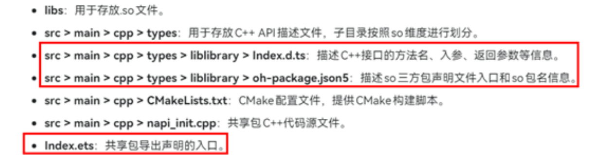

### 五、调用
1. HAP包目录结构
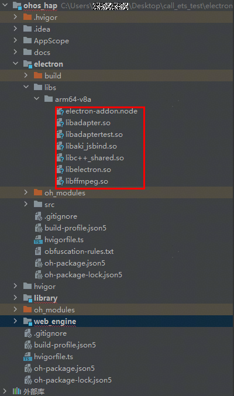
2. JS代码调用
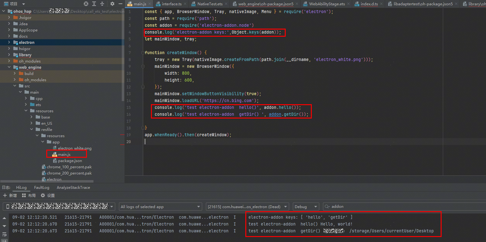
```javascript
// 修改文件：ohos_hap\web_engine\src\main\resources\resfile\resources\app\main.js
const { app, BrowserWindow, Tray, nativeImage, Menu } = require('electron');
const path = require('path');
const addon = require('electron-addon.node')
console.log('electron-addon keys:',Object.keys(addon));
let mainWindow, tray;

function createWindow() {
    tray = new Tray(nativeImage.createFromPath(path.join(__dirname, 'electron_white.png')));
    mainWindow = new BrowserWindow({
        width: 800,
        height: 600,
    });
    mainWindow.setWindowButtonVisibility(true);
    mainWindow.loadURL('https://cn.bing.com');
    console.log('test electron-addon  hello()', addon.hello());
    console.log('test electron-addon  getDir() ', addon.getDir());

}
app.whenReady().then(createWindow);

```
