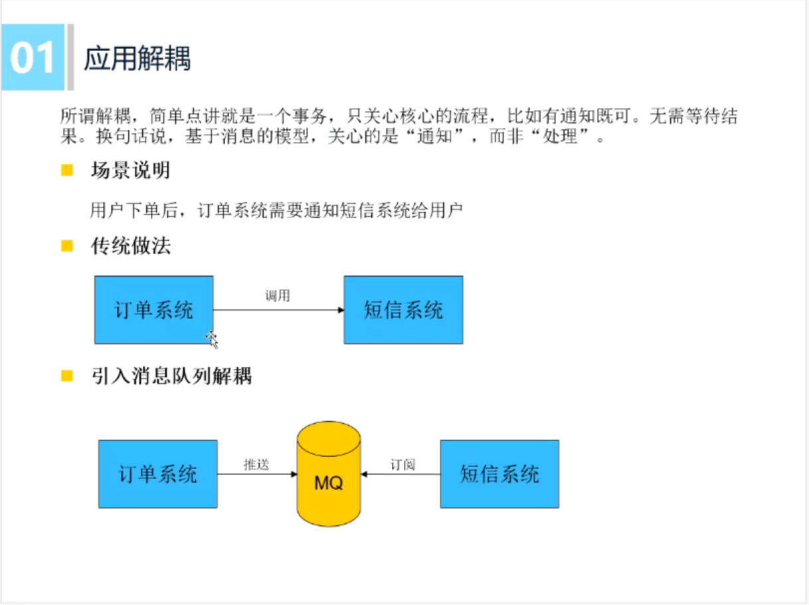

<!-- vscode-markdown-toc -->
* 1. [消息队列是什么](#)
* 2. [为什么要使用消息队列](#-1)
* 3. [如何设计消息队列](#-1)
* 4. [消息队列应用实现](#-1)
* 5. [发布者订阅者与观察者模式的区别](#-1)
* 6. [常见开源消息队列](#-1)
	* 6.1. [LightMQ](#LightMQ)
	* 6.2. [RabbitMQ](#RabbitMQ)
	* 6.3. [ActiveMQ](#ActiveMQ)
	* 6.4. [RocketMQ](#RocketMQ)
	* 6.5. [Kafka](#Kafka)
	* 6.6. [ZeroMQ:](#ZeroMQ:)

<!-- vscode-markdown-toc-config
	numbering=true
	autoSave=true
	/vscode-markdown-toc-config -->
<!-- /vscode-markdown-toc -->

# MQ发布者订阅者架构模式

##  1. 消息队列是什么
 
##  2. 为什么要使用消息队列  
 	

 
##  3. 如何设计消息队列
 

 

 

 

##  4. 消息队列应用实现
见：[轻量级消息队列-lightMQ](https://github.com/Jevstein/lightMQ)  

##  5. 发布者订阅者与观察者模式的区别
发布（Publish）/订阅（Subscribe）模式与gof23种设计模式中的观察者（Observer）模式十分相似，但也有差异，本质上的区别是`调度的地方不同`。
* 观察者模式    
`具体观察者[相当于订阅者]`把自己注册到`具体目标[相当于发布者]`里，在`具体目标[发布者]`发生变化时候，调用观察者的更新方法。
* 发布订阅模式  
`订阅者`把自己想订阅的事件注册到`调度中心`，当该事件触发时，`发布者`发布该事件到`调度中心`（顺带上下文），由`调度中心`统一调用订阅者注册到调度中心的处理代码。    
由此可见：  
1）观察者模式是由具体目标[相当于发布者]直接调度的，而发布/订阅模式是统一由`调度中心`调用的；  
2）观察者模式的订阅者与发布者之间是`存在依赖`的，而发布/订阅模式则不会。

如图：

##  6. 常见开源消息队列
###  6.1. LightMQ  
动脑学院.lee老师手写 [轻量级消息队列-lightMQ](https://github.com/Jevstein/lightMQ) 

###  6.2. RabbitMQ  
可支撑高并发、高吞吐、性能很高，且有完善便捷的后台管理界面。另外，还支持集群化、高可用部署架构、消息高可靠支持，功能较为完善 。缺陷在于自身是基于Erlang语言开发的，故导致较为难以分析里面的源码，也较难进行深层次的源码定制和改造；  

###  6.3. ActiveMQ  
老牌MQ，国内很多公司过去运用非常广泛，功能强大。但没法确认ActiveMQ可以支撑互联网公司的高并发、高负载以及高吞吐的复杂场景，故在国内互联网公司落地较少，使用较多的是一些传统企业，用于异步调用和系统解耦；  

###  6.4. RocketMQ  
阿里开源，经过阿里生产环境的超高并发、高吞吐的考验，性能卓越，同时还支持分布式事务等特殊场景。且RocketMQ基于 Java开发，适合深入阅读源码；  

###  6.5. Kafka  
提供的功能相对上述几款MQ要少很多。但Kafka的优势在于专为超高吞吐量的实时日志采集、实时数据同步、实时数据计算等场景来设计；  

###  6.6. ZeroMQ:

>参考:
>
>1.动脑学院.lee老师
>
>2.[观察者模式与发布/订阅模式区别](https://www.cnblogs.com/lovesong/p/5272752.html)